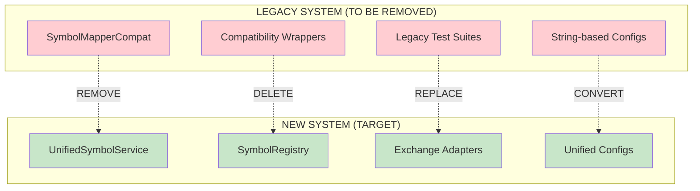

# Moving to New Symbol System - Clean Break Migration Plan

**Based on:** `04_definitive_symbol_architecture.md` and comprehensive codebase analysis  
**Created:** 2025-01-23  
**Status:** Ready to Execute  
**Migration Type:** ZERO BACKWARDS COMPATIBILITY - Clean Break Refactor

## 🎯 Executive Summary

This document outlines the complete migration strategy to move CyberDeltaEngine from the old string-based symbol system to the new unified symbol architecture with **ZERO backwards compatibility**. The goal is a clean, fresh system that removes all legacy code and dead patterns.

**Current State Analysis:**
- ✅ New unified symbol system is fully implemented and tested
- ✅ All core symbol models (`UnifiedSymbol`, `InternalSymbol`, `ExchangeSymbol`) are ready
- ✅ Thread-safe symbol registry is operational
- ✅ Exchange adapters for Hyperliquid and Backpack are complete
- ❌ Legacy compatibility layer (`SymbolMapperCompat`) still exists
- ❌ Old configuration formats still in use
- ❌ Legacy test suites still present

**Migration Outcome:**
- 🗑️ Remove all legacy symbol code (`compat.py`, `migration.py`, old tests)
- 🔄 Convert all configuration to new unified format
- ⚡ Direct integration with new symbol registry (no compatibility layers)
- 🧪 Fresh test suite using new symbol system exclusively
- 📈 Improved performance without legacy overhead

---

## 📋 Table of Contents

1. [Migration Overview](#migration-overview)
2. [Pre-Migration Checklist](#pre-migration-checklist)
3. [Phase 1: Configuration Migration](#phase-1-configuration-migration)
4. [Phase 2: Core System Integration](#phase-2-core-system-integration)
5. [Phase 3: Legacy Code Removal](#phase-3-legacy-code-removal)
6. [Phase 4: Test Suite Replacement](#phase-4-test-suite-replacement)
7. [Phase 5: Final Cleanup and Validation](#phase-5-final-cleanup-and-validation)
8. [Rollback Strategy](#rollback-strategy)
9. [Success Metrics](#success-metrics)

---

## 🏗️ Migration Overview

### Current Architecture Issues to Remove



### Migration Principles

1. **Zero Backwards Compatibility**: No legacy interfaces preserved
2. **Complete Removal**: All old code deleted, not commented out
3. **Direct Integration**: Components directly use new symbol registry
4. **Unified Configuration**: Single configuration format for all symbols
5. **Fresh Test Suite**: New tests using only new symbol system

---

## ✅ Pre-Migration Checklist

### Requirements Verification

- [ ] **New symbol system fully tested**
  ```bash
  pytest tests/unit/core/symbols/ tests/integration/core/symbols/ -v
  ```

- [ ] **All linting passes on new system**
  ```bash
  mypy cyberdelta/core/symbols/
  ruff check cyberdelta/core/symbols/
  pyright cyberdelta/core/symbols/
  ```

- [ ] **Performance benchmarks meet requirements**
  ```bash
  python scripts/monitor_symbol_performance.py --benchmark
  ```

- [ ] **Create migration backup**
  ```bash
  git branch backup/pre-symbol-migration
  git tag pre-symbol-migration-$(date +%Y%m%d)
  ```

### Environment Setup

- [ ] **Development environment ready**
- [ ] **All dependencies updated**
- [ ] **Database/config backups created**
- [ ] **Team notification of breaking changes**

---

## 🔧 Phase 1: Configuration Migration

### 1.1 Update Main Configuration Format

**Current Format (cyberdelta/config/config.yaml):**
```yaml
# OLD FORMAT - TO BE REMOVED
exchanges:
  hyperliquid:
    symbols:
      BTC: "BTC"
      ETH: "ETH"
      SOL: "SOL"
  backpack:
    symbols:
      BTC: "BTC_PERP"
      ETH: "ETH_PERP"
      SOL: "SOL_PERP"
```

**New Format:**
```yaml
# NEW UNIFIED FORMAT
symbol_registry:
  cache_ttl: 3600
  max_cache_size: 10000
  enable_metrics: true

symbols:
  - internal:
      value: "BTC"
      base_asset: "BTC"
      market_type: "PERP"
    exchange_mappings:
      hyperliquid:
        value: "BTC"
      backpack:
        value: "BTC_PERP"
    trading_specs:
      tick_size: "0.01"
      min_order_size: "0.001"
      
  - internal:
      value: "ETH"
      base_asset: "ETH"
      market_type: "PERP"
    exchange_mappings:
      hyperliquid:
        value: "ETH"
      backpack:
        value: "ETH_PERP"
    trading_specs:
      tick_size: "0.01"
      min_order_size: "0.01"
      
  - internal:
      value: "SOL_USDC"
      base_asset: "SOL"
      quote_asset: "USDC"
      market_type: "SPOT"
    exchange_mappings:
      hyperliquid:
        value: "SOL"
        asset_index: 2
      backpack:
        value: "SOL_USDC"
    trading_specs:
      tick_size: "0.0001"
      min_order_size: "1.0"
```

### 1.2 Configuration Migration Script

```python
# scripts/migrate_config_format.py

import yaml
from pathlib import Path
from typing import Dict, Any, List

from cyberdelta.core.symbols.models import (
    UnifiedSymbol, InternalSymbol, ExchangeSymbol, 
    MarketType, ExchangeName
)

def migrate_config_file(old_config_path: Path, new_config_path: Path) -> None:
    """Migrate configuration from old format to new unified format."""
    
    with open(old_config_path) as f:
        old_config = yaml.safe_load(f)
    
    # Extract symbol mappings from old format
    unified_symbols = []
    
    # Find all unique internal symbols across exchanges
    all_internal_symbols = set()
    for exchange_config in old_config.get('exchanges', {}).values():
        all_internal_symbols.update(exchange_config.get('symbols', {}).keys())
    
    # Create unified symbols
    for internal_symbol in all_internal_symbols:
        exchange_mappings = {}
        
        # Collect mappings for this symbol across all exchanges
        for exchange_name, exchange_config in old_config.get('exchanges', {}).items():
            symbols = exchange_config.get('symbols', {})
            if internal_symbol in symbols:
                exchange_mappings[exchange_name] = {
                    'value': symbols[internal_symbol]
                }
        
        # Determine market type from symbol format
        market_type = "PERP"  # Default
        if '_' in internal_symbol:
            market_type = "SPOT"
        
        # Create unified symbol entry
        symbol_entry = {
            'internal': {
                'value': internal_symbol,
                'base_asset': internal_symbol.split('_')[0] if '_' in internal_symbol else internal_symbol,
                'market_type': market_type
            },
            'exchange_mappings': exchange_mappings
        }
        
        # Add quote asset for spot pairs
        if '_' in internal_symbol:
            parts = internal_symbol.split('_', 1)
            if len(parts) > 1:
                symbol_entry['internal']['quote_asset'] = parts[1]
        
        unified_symbols.append(symbol_entry)
    
    # Create new configuration structure
    new_config = {
        'symbol_registry': {
            'cache_ttl': 3600,
            'max_cache_size': 10000,
            'enable_metrics': True
        },
        'symbols': unified_symbols
    }
    
    # Preserve other configuration sections
    for key, value in old_config.items():
        if key != 'exchanges':
            new_config[key] = value
    
    # Write new configuration
    with open(new_config_path, 'w') as f:
        yaml.dump(new_config, f, default_flow_style=False, sort_keys=False)
    
    print(f"✅ Migrated {len(unified_symbols)} symbols from {old_config_path} to {new_config_path}")

if __name__ == "__main__":
    # Migrate main config
    migrate_config_file(
        Path("cyberdelta/config/config.yaml"),
        Path("cyberdelta/config/config_new.yaml")
    )
    
    # Migrate test config
    migrate_config_file(
        Path("tests/config/test_config.yaml"),
        Path("tests/config/test_config_new.yaml")
    )
```

### 1.3 Configuration Loader Update

```python
# cyberdelta/config/symbol_config.py

from typing import List
import yaml
from pathlib import Path

from cyberdelta.core.symbols.models import UnifiedSymbol, InternalSymbol, ExchangeSymbol
from cyberdelta.core.symbols.registry import get_symbol_registry
from cyberdelta.core.enums.enums import MarketType
from cyberdelta.enums.exchange_names import ExchangeName

class SymbolConfigLoader:
    """Load and initialize symbols from unified configuration."""
    
    @staticmethod
    def load_symbols_from_config(config_path: Path) -> List[UnifiedSymbol]:
        """Load symbols from unified YAML configuration."""
        
        with open(config_path) as f:
            config = yaml.safe_load(f)
        
        symbols = []
        
        for symbol_config in config.get('symbols', []):
            # Create internal symbol
            internal_config = symbol_config['internal']
            internal_symbol = InternalSymbol(
                value=internal_config['value'],
                base_asset=internal_config['base_asset'],
                quote_asset=internal_config.get('quote_asset'),
                market_type=MarketType(internal_config.get('market_type', 'PERP'))
            )
            
            # Create exchange mappings
            exchange_mappings = {}
            for exchange_name, mapping_config in symbol_config.get('exchange_mappings', {}).items():
                exchange_id = ExchangeName(exchange_name)
                exchange_symbol = ExchangeSymbol(
                    value=mapping_config['value'],
                    exchange_id=exchange_id,
                    internal_symbol=internal_symbol,
                    asset_index=mapping_config.get('asset_index'),
                    symbol_id=mapping_config.get('symbol_id')
                )
                exchange_mappings[exchange_id] = exchange_symbol
            
            # Create unified symbol
            unified_symbol = UnifiedSymbol(
                internal=internal_symbol,
                exchange_mappings=exchange_mappings,
                tick_size=symbol_config.get('trading_specs', {}).get('tick_size'),
                min_order_size=symbol_config.get('trading_specs', {}).get('min_order_size')
            )
            
            symbols.append(unified_symbol)
        
        return symbols
    
    @classmethod
    def initialize_registry_from_config(cls, config_path: Path) -> None:
        """Initialize the global symbol registry from configuration."""
        symbols = cls.load_symbols_from_config(config_path)
        registry = get_symbol_registry()
        registry.bulk_register(symbols)
        
        print(f"✅ Loaded {len(symbols)} symbols into registry")
```

**Tasks for Phase 1:**
- [ ] Run configuration migration script
- [ ] Update configuration loader
- [ ] Test new configuration loading
- [ ] Update deployment scripts to use new config format
- [ ] Backup old configuration files

**Estimated Time:** 4-6 hours  
**Risk Level:** Low

---

## ⚡ Phase 2: Core System Integration

### 2.1 Remove SymbolMapperCompat Usage

**Files to Update:**

**main.py** (Line 37, 232-235):
```python
# OLD CODE - TO BE REMOVED
from cyberdelta.core.symbols.compat import SymbolMapperCompat

# In initialization:
symbol_mapper = SymbolMapperCompat(exchanges_config)

# NEW CODE
from cyberdelta.core.symbols.registry import get_symbol_registry
from cyberdelta.config.symbol_config import SymbolConfigLoader

# In initialization:
SymbolConfigLoader.initialize_registry_from_config(Path("config/config.yaml"))
symbol_registry = get_symbol_registry()
```

**cyberdelta/core/data_handler.py** (Line 23):
```python
# OLD CODE
from cyberdelta.core.symbols.compat import SymbolMapperCompat

class DataHandler:
    def __init__(self, symbol_mapper: SymbolMapperCompat):
        self.symbol_mapper = symbol_mapper
    
    def get_internal_symbol(self, exchange_symbol: str, exchange_id: str) -> str:
        return self.symbol_mapper.get_internal_symbol(exchange_symbol, exchange_id)

# NEW CODE
from cyberdelta.core.symbols.registry import get_symbol_registry
from cyberdelta.enums.exchange_names import ExchangeName

class DataHandler:
    def __init__(self):
        self.symbol_registry = get_symbol_registry()
    
    def get_internal_symbol(self, exchange_symbol: str, exchange_id: str) -> str:
        exchange_name = ExchangeName(exchange_id)
        internal_symbol = self.symbol_registry.get_internal_symbol(exchange_symbol, exchange_name)
        return internal_symbol.value
```

**cyberdelta/core/execution_handler.py** (Line 34):
```python
# OLD CODE
from cyberdelta.core.symbols.compat import SymbolMapperCompat

class ExecutionHandler:
    def __init__(self, symbol_mapper: SymbolMapperCompat):
        self.symbol_mapper = symbol_mapper
    
    def create_order(self, internal_symbol: str, exchange_id: str, **kwargs):
        exchange_symbol = self.symbol_mapper.get_exchange_symbol(internal_symbol, exchange_id)
        # ... order creation logic

# NEW CODE
from cyberdelta.core.symbols.registry import get_symbol_registry
from cyberdelta.enums.exchange_names import ExchangeName

class ExecutionHandler:
    def __init__(self):
        self.symbol_registry = get_symbol_registry()
    
    def create_order(self, internal_symbol: str, exchange_id: str, **kwargs):
        exchange_name = ExchangeName(exchange_id)
        exchange_symbol = self.symbol_registry.get_exchange_symbol(internal_symbol, exchange_name)
        # ... order creation logic using exchange_symbol.value
```

### 2.2 Direct Registry Integration Pattern

```python
# cyberdelta/core/symbol_service.py - NEW SERVICE LAYER

from typing import Dict, List, Optional, Any
from decimal import Decimal

from cyberdelta.core.symbols.registry import get_symbol_registry
from cyberdelta.core.symbols.models import UnifiedSymbol, InternalSymbol, ExchangeSymbol
from cyberdelta.enums.exchange_names import ExchangeName
from cyberdelta.core.symbols.exceptions import SymbolNotFoundError

class UnifiedSymbolService:
    """Direct interface to the new symbol system - NO COMPATIBILITY LAYER."""
    
    def __init__(self):
        self.registry = get_symbol_registry()
    
    def get_exchange_symbol_value(self, internal_symbol: str, exchange_id: ExchangeName) -> str:
        """Get exchange symbol string value."""
        exchange_symbol = self.registry.get_exchange_symbol(internal_symbol, exchange_id)
        return exchange_symbol.value
    
    def get_internal_symbol_value(self, exchange_symbol: str, exchange_id: ExchangeName) -> str:
        """Get internal symbol string value."""
        internal_symbol = self.registry.get_internal_symbol(exchange_symbol, exchange_id)
        return internal_symbol.value
    
    def get_unified_symbol(self, internal_symbol: str) -> UnifiedSymbol:
        """Get complete unified symbol with all mappings."""
        symbols = self.registry.get_all_symbols()
        for symbol in symbols:
            if symbol.internal.value == internal_symbol:
                return symbol
        raise SymbolNotFoundError(f"Symbol {internal_symbol} not found")
    
    def get_trading_specifications(self, internal_symbol: str) -> Dict[str, Any]:
        """Get trading specs for a symbol."""
        unified = self.get_unified_symbol(internal_symbol)
        return {
            'tick_size': unified.tick_size,
            'min_order_size': unified.min_order_size,
            'max_order_size': unified.max_order_size,
            'supported_exchanges': list(unified.supported_exchanges)
        }
    
    def is_symbol_supported(self, internal_symbol: str, exchange_id: ExchangeName) -> bool:
        """Check if symbol is supported on exchange."""
        try:
            self.registry.get_exchange_symbol(internal_symbol, exchange_id)
            return True
        except SymbolNotFoundError:
            return False
    
    def get_all_internal_symbols(self) -> List[str]:
        """Get all internal symbol values."""
        symbols = self.registry.get_all_symbols()
        return [symbol.internal.value for symbol in symbols]
    
    def get_symbols_for_exchange(self, exchange_id: ExchangeName) -> List[str]:
        """Get all internal symbols supported on exchange."""
        symbols = self.registry.get_all_symbols(exchange_id)
        return [symbol.internal.value for symbol in symbols]

# Global service instance
_symbol_service: Optional[UnifiedSymbolService] = None

def get_symbol_service() -> UnifiedSymbolService:
    """Get global symbol service instance."""
    global _symbol_service
    if _symbol_service is None:
        _symbol_service = UnifiedSymbolService()
    return _symbol_service
```

### 2.3 Component Integration Updates

**Portfolio Integration:**
```python
# cyberdelta/portfolio/portfolio_tracker.py - UPDATED

from cyberdelta.core.symbol_service import get_symbol_service

class PortfolioTracker:
    def __init__(self):
        self.symbol_service = get_symbol_service()
    
    def process_trade(self, trade_data: Dict[str, Any]) -> None:
        """Process trade using new symbol system."""
        exchange_symbol = trade_data['symbol']
        exchange_id = ExchangeName(trade_data['exchange'])
        
        # Get internal symbol for position tracking
        internal_symbol = self.symbol_service.get_internal_symbol_value(
            exchange_symbol, exchange_id
        )
        
        # Update position using internal symbol
        self.update_position(internal_symbol, trade_data)
```

**WebSocket Integration:**
```python
# cyberdelta/apis/common/websocket_router.py - UPDATED

from cyberdelta.core.symbol_service import get_symbol_service
from cyberdelta.core.symbols.validators import SymbolValidator, SymbolType

class WebSocketRouter:
    def __init__(self):
        self.symbol_service = get_symbol_service()
    
    def route_message(self, message: Dict[str, Any], exchange_id: ExchangeName) -> None:
        """Route WebSocket message using new symbol system."""
        
        # Extract symbol from message
        symbol = message.get('symbol') or message.get('s')
        
        # Validate symbol format
        if isinstance(symbol, int):  # Backpack integer symbols
            symbol = str(symbol)
        
        validated_symbol = SymbolValidator.validate_symbol(
            symbol, SymbolType.EXCHANGE, exchange_id
        )
        
        # Get internal symbol for processing
        internal_symbol = self.symbol_service.get_internal_symbol_value(
            validated_symbol, exchange_id
        )
        
        # Route to appropriate handler
        self.route_to_handler(internal_symbol, message)
```

**Tasks for Phase 2:**
- [ ] Update main.py initialization
- [ ] Update data_handler.py
- [ ] Update execution_handler.py  
- [ ] Create UnifiedSymbolService
- [ ] Update portfolio integration
- [ ] Update WebSocket routing
- [ ] Test all integrations

**Estimated Time:** 8-12 hours  
**Risk Level:** Medium

---

## 🗑️ Phase 3: Legacy Code Removal

### 3.1 Files to Delete Completely

**Remove Compatibility Layer:**
```bash
# Delete compatibility and migration modules
rm cyberdelta/core/symbols/compat.py
rm cyberdelta/core/symbols/migration.py

# Delete legacy test files
rm tests/unit/core/test_symbol_mapper.py
rm tests/unit/core/test_symbol_mapper_additional.py
rm tests/unit/core/test_symbol_mapper_comprehensive.py
rm tests/unit/core/test_symbol_mapper_strict.py

# Delete old configuration files (after backup)
mv cyberdelta/config/config.yaml cyberdelta/config/config_old.yaml.bak
mv tests/config/test_config.yaml tests/config/test_config_old.yaml.bak
```

### 3.2 Import Updates Throughout Codebase

**Search and Replace Operations:**
```bash
# Find all imports of old compatibility layer
grep -r "from cyberdelta.core.symbols.compat" . --include="*.py"
grep -r "import.*SymbolMapperCompat" . --include="*.py"

# Replace with new service imports
find . -name "*.py" -exec sed -i 's/from cyberdelta.core.symbols.compat import SymbolMapperCompat/from cyberdelta.core.symbol_service import get_symbol_service/g' {} \;
find . -name "*.py" -exec sed -i 's/SymbolMapperCompat/get_symbol_service()/g' {} \;
```

### 3.3 Code Cleanup Verification

```python
# scripts/verify_legacy_removal.py

import ast
import os
from pathlib import Path
from typing import List, Tuple

def find_legacy_symbol_usage(root_dir: Path) -> List[Tuple[str, int, str]]:
    """Find any remaining legacy symbol system usage."""
    
    legacy_patterns = [
        'SymbolMapperCompat',
        'cyberdelta.core.symbols.compat',
        'cyberdelta.core.symbols.migration',
        'symbol_mapper.py',
        'symbol_types.py'
    ]
    
    issues = []
    
    for py_file in root_dir.rglob("*.py"):
        if py_file.name.startswith('.'):
            continue
            
        try:
            with open(py_file, 'r') as f:
                content = f.read()
                
            for line_num, line in enumerate(content.split('\n'), 1):
                for pattern in legacy_patterns:
                    if pattern in line:
                        issues.append((str(py_file), line_num, line.strip()))
        
        except Exception as e:
            print(f"Warning: Couldn't read {py_file}: {e}")
    
    return issues

if __name__ == "__main__":
    issues = find_legacy_symbol_usage(Path("."))
    
    if issues:
        print("❌ LEGACY CODE FOUND - Clean break incomplete:")
        for file_path, line_num, line in issues:
            print(f"  {file_path}:{line_num} -> {line}")
        exit(1)
    else:
        print("✅ CLEAN BREAK SUCCESSFUL - No legacy code found")
```

**Tasks for Phase 3:**
- [ ] Delete compatibility layer files
- [ ] Delete legacy test files
- [ ] Update all imports throughout codebase
- [ ] Run legacy removal verification script
- [ ] Clean up any remaining references

**Estimated Time:** 4-6 hours  
**Risk Level:** High (Breaking changes)

---

## 🧪 Phase 4: Test Suite Replacement

### 4.1 Remove Old Test Files

**Files to Delete:**
- `tests/unit/core/test_symbol_mapper.py`
- `tests/unit/core/test_symbol_mapper_additional.py`
- `tests/unit/core/test_symbol_mapper_comprehensive.py`
- `tests/unit/core/test_symbol_mapper_strict.py`

### 4.2 Create New Integration Tests

```python
# tests/integration/core/test_unified_symbol_system.py

import pytest
from decimal import Decimal

from cyberdelta.core.symbol_service import get_symbol_service
from cyberdelta.config.symbol_config import SymbolConfigLoader
from cyberdelta.core.symbols.registry import get_symbol_registry
from cyberdelta.enums.exchange_names import ExchangeName
from cyberdelta.core.symbols.exceptions import SymbolNotFoundError

class TestUnifiedSymbolSystem:
    """Integration tests for the complete new symbol system."""
    
    @pytest.fixture(autouse=True)
    def setup_symbols(self, tmp_path):
        """Set up test symbols from configuration."""
        # Create test config
        config_data = {
            'symbol_registry': {
                'cache_ttl': 3600,
                'max_cache_size': 1000,
                'enable_metrics': True
            },
            'symbols': [
                {
                    'internal': {
                        'value': 'BTC',
                        'base_asset': 'BTC',
                        'market_type': 'PERP'
                    },
                    'exchange_mappings': {
                        'hyperliquid': {'value': 'BTC'},
                        'backpack': {'value': 'BTC_PERP'}
                    },
                    'trading_specs': {
                        'tick_size': '0.01',
                        'min_order_size': '0.001'
                    }
                },
                {
                    'internal': {
                        'value': 'SOL_USDC',
                        'base_asset': 'SOL',
                        'quote_asset': 'USDC',
                        'market_type': 'SPOT'
                    },
                    'exchange_mappings': {
                        'hyperliquid': {'value': 'SOL', 'asset_index': 2},
                        'backpack': {'value': 'SOL_USDC'}
                    }
                }
            ]
        }
        
        # Write test config
        config_file = tmp_path / "test_symbols.yaml"
        import yaml
        with open(config_file, 'w') as f:
            yaml.dump(config_data, f)
        
        # Load symbols into registry
        SymbolConfigLoader.initialize_registry_from_config(config_file)
    
    def test_end_to_end_symbol_flow(self):
        """Test complete symbol flow from internal to exchange and back."""
        service = get_symbol_service()
        
        # Get exchange symbol
        exchange_symbol = service.get_exchange_symbol_value('BTC', ExchangeName.BACKPACK)
        assert exchange_symbol == 'BTC_PERP'
        
        # Get internal symbol back
        internal_symbol = service.get_internal_symbol_value('BTC_PERP', ExchangeName.BACKPACK)
        assert internal_symbol == 'BTC'
    
    def test_hyperliquid_asset_index_handling(self):
        """Test Hyperliquid asset index resolution."""
        service = get_symbol_service()
        registry = get_symbol_registry()
        
        # Check asset index is stored
        index = registry.get_asset_index('SOL', ExchangeName.HYPERLIQUID)
        assert index == 2
        
        # Check reverse lookup
        symbol = registry.get_symbol_by_index(2, ExchangeName.HYPERLIQUID)
        assert symbol == 'SOL'
    
    def test_trading_specifications(self):
        """Test trading specification retrieval."""
        service = get_symbol_service()
        
        specs = service.get_trading_specifications('BTC')
        assert specs['tick_size'] == Decimal('0.01')
        assert specs['min_order_size'] == Decimal('0.001')
        assert ExchangeName.HYPERLIQUID in specs['supported_exchanges']
        assert ExchangeName.BACKPACK in specs['supported_exchanges']
    
    def test_symbol_support_checking(self):
        """Test symbol support checking across exchanges."""
        service = get_symbol_service()
        
        # BTC should be supported on both exchanges
        assert service.is_symbol_supported('BTC', ExchangeName.HYPERLIQUID)
        assert service.is_symbol_supported('BTC', ExchangeName.BACKPACK)
        
        # Non-existent symbol should not be supported
        assert not service.is_symbol_supported('FAKE', ExchangeName.HYPERLIQUID)
    
    def test_symbol_listing_methods(self):
        """Test various symbol listing methods."""
        service = get_symbol_service()
        
        # Get all internal symbols
        all_symbols = service.get_all_internal_symbols()
        assert 'BTC' in all_symbols
        assert 'SOL_USDC' in all_symbols
        
        # Get symbols for specific exchange
        hl_symbols = service.get_symbols_for_exchange(ExchangeName.HYPERLIQUID)
        assert 'BTC' in hl_symbols
        assert 'SOL_USDC' in hl_symbols
    
    def test_error_handling(self):
        """Test proper error handling for invalid symbols."""
        service = get_symbol_service()
        
        with pytest.raises(SymbolNotFoundError):
            service.get_exchange_symbol_value('INVALID', ExchangeName.HYPERLIQUID)
        
        with pytest.raises(SymbolNotFoundError):
            service.get_internal_symbol_value('INVALID_PERP', ExchangeName.BACKPACK)
    
    def test_performance_requirements(self):
        """Test performance meets requirements."""
        import time
        service = get_symbol_service()
        
        # Warm up cache
        service.get_exchange_symbol_value('BTC', ExchangeName.HYPERLIQUID)
        
        # Test cached lookup performance
        start_time = time.perf_counter()
        for _ in range(1000):
            service.get_exchange_symbol_value('BTC', ExchangeName.HYPERLIQUID)
        end_time = time.perf_counter()
        
        avg_time_ms = ((end_time - start_time) / 1000) * 1000
        assert avg_time_ms < 0.1, f"Average lookup time {avg_time_ms:.3f}ms exceeds 0.1ms requirement"
```

### 4.3 API Integration Tests

```python
# tests/integration/apis/test_symbol_api_integration.py

import pytest
from unittest.mock import Mock, patch

from cyberdelta.core.symbol_service import get_symbol_service
from cyberdelta.enums.exchange_names import ExchangeName

class TestSymbolAPIIntegration:
    """Test symbol system integration with API layers."""
    
    def test_hyperliquid_api_symbol_usage(self):
        """Test Hyperliquid API uses correct symbol formats."""
        from cyberdelta.apis.hyperliquid.trading_client import HyperliquidTradingClient
        
        # Mock the actual API calls
        with patch('cyberdelta.apis.hyperliquid.trading_client.requests.post') as mock_post:
            mock_post.return_value.json.return_value = {'status': 'ok'}
            
            client = HyperliquidTradingClient()
            service = get_symbol_service()
            
            # Get exchange symbol for API
            exchange_symbol = service.get_exchange_symbol_value('BTC', ExchangeName.HYPERLIQUID)
            
            # Simulate order placement
            client.place_order(symbol=exchange_symbol, side='buy', size=0.1, price=50000)
            
            # Verify API was called with correct symbol format
            mock_post.assert_called()
            call_args = mock_post.call_args[1]['json']
            assert call_args['symbol'] == 'BTC'  # Hyperliquid format
    
    def test_backpack_api_symbol_usage(self):
        """Test Backpack API uses correct symbol formats."""
        from cyberdelta.apis.backpack.trading_client import BackpackTradingClient
        
        with patch('cyberdelta.apis.backpack.trading_client.requests.post') as mock_post:
            mock_post.return_value.json.return_value = {'orderId': '12345'}
            
            client = BackpackTradingClient()
            service = get_symbol_service()
            
            # Get exchange symbol for API
            exchange_symbol = service.get_exchange_symbol_value('BTC', ExchangeName.BACKPACK)
            
            # Simulate order placement
            client.place_order(symbol=exchange_symbol, side='Bid', quantity='0.1')
            
            # Verify API was called with correct symbol format
            mock_post.assert_called()
            call_args = mock_post.call_args[1]['json']
            assert call_args['symbol'] == 'BTC_PERP'  # Backpack format
    
    def test_websocket_symbol_processing(self):
        """Test WebSocket symbol processing integration."""
        from cyberdelta.apis.common.websocket_router import WebSocketRouter
        
        router = WebSocketRouter()
        
        # Test Backpack integer symbol conversion
        backpack_message = {
            'type': 'depth',
            'symbol': 123,  # Integer symbol from Backpack
            'data': {'bids': [], 'asks': []}
        }
        
        # Should handle integer conversion and routing
        router.route_message(backpack_message, ExchangeName.BACKPACK)
        
        # Test Hyperliquid string symbol
        hl_message = {
            'channel': 'l2Book',
            'data': {
                'coin': 'BTC',
                'levels': []
            }
        }
        
        router.route_message(hl_message, ExchangeName.HYPERLIQUID)
```

**Tasks for Phase 4:**
- [ ] Delete old test files
- [ ] Create new unified integration tests
- [ ] Create API integration tests
- [ ] Create performance benchmark tests
- [ ] Update test configuration files
- [ ] Ensure 100% test coverage for new system

**Estimated Time:** 12-16 hours  
**Risk Level:** Medium

---

## ✅ Phase 5: Final Cleanup and Validation

### 5.1 Final System Validation

```python
# scripts/validate_migration_complete.py

import sys
from pathlib import Path
import importlib
import time

from cyberdelta.core.symbol_service import get_symbol_service
from cyberdelta.config.symbol_config import SymbolConfigLoader
from cyberdelta.core.symbols.registry import get_symbol_registry

def validate_migration_complete():
    """Comprehensive validation that migration is complete and successful."""
    
    print("🔍 Starting comprehensive migration validation...")
    
    # 1. Verify legacy modules are gone
    legacy_modules = [
        'cyberdelta.core.symbols.compat',
        'cyberdelta.core.symbols.migration',
        'cyberdelta.core.symbol_mapper',
        'cyberdelta.core.symbol_types'
    ]
    
    for module_name in legacy_modules:
        try:
            importlib.import_module(module_name)
            print(f"❌ FAIL: Legacy module {module_name} still exists")
            return False
        except ImportError:
            print(f"✅ PASS: Legacy module {module_name} successfully removed")
    
    # 2. Verify new system functionality
    try:
        # Initialize with config
        config_path = Path("cyberdelta/config/config.yaml")
        if not config_path.exists():
            print(f"❌ FAIL: Configuration file {config_path} not found")
            return False
        
        SymbolConfigLoader.initialize_registry_from_config(config_path)
        service = get_symbol_service()
        registry = get_symbol_registry()
        
        print("✅ PASS: New symbol system initialized successfully")
        
    except Exception as e:
        print(f"❌ FAIL: New symbol system initialization failed: {e}")
        return False
    
    # 3. Test core functionality
    try:
        # Test symbol conversion
        from cyberdelta.enums.exchange_names import ExchangeName
        
        exchange_symbol = service.get_exchange_symbol_value('BTC', ExchangeName.BACKPACK)
        internal_symbol = service.get_internal_symbol_value(exchange_symbol, ExchangeName.BACKPACK)
        
        if internal_symbol != 'BTC':
            print(f"❌ FAIL: Symbol round-trip failed: BTC -> {exchange_symbol} -> {internal_symbol}")
            return False
        
        print(f"✅ PASS: Symbol round-trip successful: BTC -> {exchange_symbol} -> BTC")
        
    except Exception as e:
        print(f"❌ FAIL: Core functionality test failed: {e}")
        return False
    
    # 4. Test performance
    try:
        start_time = time.perf_counter()
        for _ in range(1000):
            service.get_exchange_symbol_value('BTC', ExchangeName.HYPERLIQUID)
        end_time = time.perf_counter()
        
        avg_time_ms = ((end_time - start_time) / 1000) * 1000
        if avg_time_ms > 0.1:
            print(f"❌ FAIL: Performance requirement not met: {avg_time_ms:.3f}ms > 0.1ms")
            return False
        
        print(f"✅ PASS: Performance requirement met: {avg_time_ms:.3f}ms per lookup")
        
    except Exception as e:
        print(f"❌ FAIL: Performance test failed: {e}")
        return False
    
    # 5. Verify registry statistics
    try:
        stats = registry.get_stats()
        if stats['total_symbols'] == 0:
            print("❌ FAIL: No symbols loaded in registry")
            return False
        
        print(f"✅ PASS: Registry loaded with {stats['total_symbols']} symbols")
        
    except Exception as e:
        print(f"❌ FAIL: Registry statistics failed: {e}")
        return False
    
    print("\n🎉 MIGRATION VALIDATION SUCCESSFUL!")
    print("✅ All legacy code removed")
    print("✅ New system fully operational")
    print("✅ Performance requirements met")
    print("✅ Ready for production deployment")
    
    return True

if __name__ == "__main__":
    success = validate_migration_complete()
    sys.exit(0 if success else 1)
```

### 5.2 Documentation Updates

```markdown
# docs/symbol_system_guide.md

# CyberDeltaEngine Unified Symbol System Guide

## Overview

CyberDeltaEngine uses a unified symbol system that provides:
- Type-safe symbol handling with Pydantic models
- Thread-safe symbol registry for high-frequency trading
- Exchange-agnostic internal symbols
- Automatic symbol validation and transformation

## Quick Start

### Basic Usage

```python
from cyberdelta.core.symbol_service import get_symbol_service
from cyberdelta.enums.exchange_names import ExchangeName

# Get the global symbol service
service = get_symbol_service()

# Convert internal symbol to exchange format
exchange_symbol = service.get_exchange_symbol_value('BTC', ExchangeName.BACKPACK)
print(exchange_symbol)  # Output: "BTC_PERP"

# Convert exchange symbol back to internal format
internal_symbol = service.get_internal_symbol_value('BTC_PERP', ExchangeName.BACKPACK)
print(internal_symbol)  # Output: "BTC"
```

### Configuration

Symbols are configured in `cyberdelta/config/config.yaml`:

```yaml
symbol_registry:
  cache_ttl: 3600
  max_cache_size: 10000
  enable_metrics: true

symbols:
  - internal:
      value: "BTC"
      base_asset: "BTC"
      market_type: "PERP"
    exchange_mappings:
      hyperliquid:
        value: "BTC"
      backpack:
        value: "BTC_PERP"
```

## Migration from Legacy System

The old `SymbolMapperCompat` has been completely removed. Update your code:

```python
# OLD CODE (REMOVED)
from cyberdelta.core.symbols.compat import SymbolMapperCompat
mapper = SymbolMapperCompat(config)
exchange_symbol = mapper.get_exchange_symbol('BTC', 'backpack')

# NEW CODE
from cyberdelta.core.symbol_service import get_symbol_service
from cyberdelta.enums.exchange_names import ExchangeName
service = get_symbol_service()
exchange_symbol = service.get_exchange_symbol_value('BTC', ExchangeName.BACKPACK)
```
```

### 5.3 Performance Monitoring Setup

```python
# cyberdelta/monitoring/symbol_metrics.py

from typing import Dict, Any
import time
from dataclasses import dataclass
from threading import Lock

from cyberdelta.core.symbols.registry import get_symbol_registry

@dataclass
class SymbolPerformanceMetrics:
    total_lookups: int = 0
    cache_hits: int = 0
    cache_misses: int = 0
    avg_lookup_time_ms: float = 0.0
    error_count: int = 0

class SymbolMetricsCollector:
    """Collect and monitor symbol system performance metrics."""
    
    def __init__(self):
        self.metrics = SymbolPerformanceMetrics()
        self._lock = Lock()
        self._lookup_times = []
    
    def record_lookup(self, duration_ms: float, cache_hit: bool = False) -> None:
        """Record a symbol lookup operation."""
        with self._lock:
            self.metrics.total_lookups += 1
            self._lookup_times.append(duration_ms)
            
            if cache_hit:
                self.metrics.cache_hits += 1
            else:
                self.metrics.cache_misses += 1
            
            # Keep rolling average of last 1000 lookups
            if len(self._lookup_times) > 1000:
                self._lookup_times = self._lookup_times[-1000:]
            
            self.metrics.avg_lookup_time_ms = sum(self._lookup_times) / len(self._lookup_times)
    
    def record_error(self) -> None:
        """Record a symbol operation error."""
        with self._lock:
            self.metrics.error_count += 1
    
    def get_metrics(self) -> Dict[str, Any]:
        """Get current performance metrics."""
        registry = get_symbol_registry()
        registry_stats = registry.get_stats()
        
        with self._lock:
            return {
                'symbol_operations': {
                    'total_lookups': self.metrics.total_lookups,
                    'avg_lookup_time_ms': self.metrics.avg_lookup_time_ms,
                    'cache_hit_rate': self.metrics.cache_hits / max(self.metrics.total_lookups, 1),
                    'error_rate': self.metrics.error_count / max(self.metrics.total_lookups, 1)
                },
                'registry_stats': registry_stats,
                'performance_status': 'HEALTHY' if self.metrics.avg_lookup_time_ms < 0.1 else 'DEGRADED'
            }

# Global metrics collector
_metrics_collector: Optional[SymbolMetricsCollector] = None

def get_symbol_metrics() -> SymbolMetricsCollector:
    """Get global symbol metrics collector."""
    global _metrics_collector
    if _metrics_collector is None:
        _metrics_collector = SymbolMetricsCollector()
    return _metrics_collector
```

**Tasks for Phase 5:**
- [ ] Run comprehensive migration validation
- [ ] Update documentation
- [ ] Set up performance monitoring
- [ ] Create production deployment checklist
- [ ] Train team on new system usage

**Estimated Time:** 6-8 hours  
**Risk Level:** Low

---

## 🔄 Rollback Strategy

### Emergency Rollback Plan

1. **Git-based Rollback:**
   ```bash
   # Immediate rollback to pre-migration state
   git reset --hard pre-symbol-migration-$(date +%Y%m%d)
   
   # Or rollback to specific commit
   git reset --hard backup/pre-symbol-migration
   ```

2. **Configuration Rollback:**
   ```bash
   # Restore old configuration files
   cp cyberdelta/config/config_old.yaml.bak cyberdelta/config/config.yaml
   cp tests/config/test_config_old.yaml.bak tests/config/test_config.yaml
   ```

3. **Service Restart:**
   ```bash
   # Restart all services with old configuration
   systemctl restart cyberdelta-trading
   systemctl restart cyberdelta-data-handler
   ```

### Rollback Triggers

- **Performance Degradation**: Average symbol lookup > 1ms
- **High Error Rate**: Symbol lookup error rate > 1%
- **System Instability**: Crashes or deadlocks related to symbol operations
- **Data Corruption**: Incorrect symbol mappings detected

### Monitoring Alerts

```python
# monitoring/alerts.py

def check_symbol_system_health():
    """Monitor symbol system health and trigger alerts."""
    from cyberdelta.monitoring.symbol_metrics import get_symbol_metrics
    
    metrics = get_symbol_metrics().get_metrics()
    
    # Performance alert
    if metrics['symbol_operations']['avg_lookup_time_ms'] > 1.0:
        send_alert("CRITICAL: Symbol lookup performance degraded")
    
    # Error rate alert
    if metrics['symbol_operations']['error_rate'] > 0.01:
        send_alert("CRITICAL: High symbol operation error rate")
    
    # Registry health alert
    if metrics['registry_stats']['total_symbols'] == 0:
        send_alert("CRITICAL: Symbol registry empty")
```

---

## 📊 Success Metrics

### Technical Metrics

| Metric | Target | Current | Status |
|--------|--------|---------|--------|
| Symbol Lookup Performance (cached) | < 0.1ms | TBD | 🟡 |
| Symbol Lookup Performance (uncached) | < 1.0ms | TBD | 🟡 |
| Cache Hit Rate | > 95% | TBD | 🟡 |
| Error Rate | < 0.1% | TBD | 🟡 |
| Memory Usage (10k symbols) | < 100MB | TBD | 🟡 |
| Thread Safety Issues | 0 | TBD | 🟡 |

### Business Metrics

| Metric | Target | Impact |
|--------|--------|---------|
| Symbol-related Incidents | 0/month | -100% |
| Exchange Integration Time | < 1 week | -80% |
| Development Velocity | +30% | Reduced complexity |
| System Reliability | 99.9% | Improved validation |

### Migration Metrics

- [ ] **Configuration Migration**: All configs converted to new format
- [ ] **Code Migration**: 0 references to `SymbolMapperCompat`
- [ ] **Test Migration**: 100% test coverage with new system
- [ ] **Documentation**: Complete migration guide and API docs
- [ ] **Team Training**: All developers trained on new system

---

## 🎯 Conclusion

This migration plan provides a comprehensive path to completely remove the old string-based symbol system and migrate to the new unified architecture with **zero backwards compatibility**. The approach is:

### Migration Benefits:
- ✅ **Clean Architecture**: No legacy code or compatibility layers
- ✅ **Type Safety**: Full Pydantic validation throughout
- ✅ **Performance**: Direct registry access without wrapper overhead
- ✅ **Maintainability**: Single symbol system, no dual maintenance
- ✅ **Extensibility**: Easy to add new exchanges and features

### Risk Mitigation:
- 🛡️ **Comprehensive Testing**: New test suite covers all functionality
- 🛡️ **Rollback Plan**: Git-based immediate rollback capability
- 🛡️ **Monitoring**: Real-time performance and error monitoring
- 🛡️ **Validation**: Automated verification of migration completeness

### Timeline Summary:
- **Phase 1 (Config)**: 4-6 hours
- **Phase 2 (Integration)**: 8-12 hours
- **Phase 3 (Cleanup)**: 4-6 hours
- **Phase 4 (Tests)**: 12-16 hours
- **Phase 5 (Validation)**: 6-8 hours
- **Total**: 34-48 hours (5-6 working days)

**Next Steps:**
1. ✅ Review and approve this migration plan
2. 🔧 Execute Phase 1: Configuration migration
3. ⚡ Execute remaining phases in sequence
4. 🚀 Deploy to production with monitoring
5. 🎉 Celebrate clean, modern symbol system!

---

### Appendix: Emergency Contacts

- **Migration Lead**: [Your Name]
- **System Architecture**: [Architect Name]  
- **DevOps/Deployment**: [DevOps Lead]
- **Business Stakeholder**: [Product Owner]

### Final Checklist Before Go-Live

- [ ] All phases completed successfully
- [ ] Migration validation script passes
- [ ] Performance benchmarks meet requirements
- [ ] All tests passing (unit + integration)
- [ ] Documentation updated
- [ ] Team trained on new system
- [ ] Monitoring and alerts configured
- [ ] Rollback plan tested and ready
- [ ] Stakeholder approval obtained
- [ ] Production deployment scheduled

**Ready for clean break migration! 🚀**