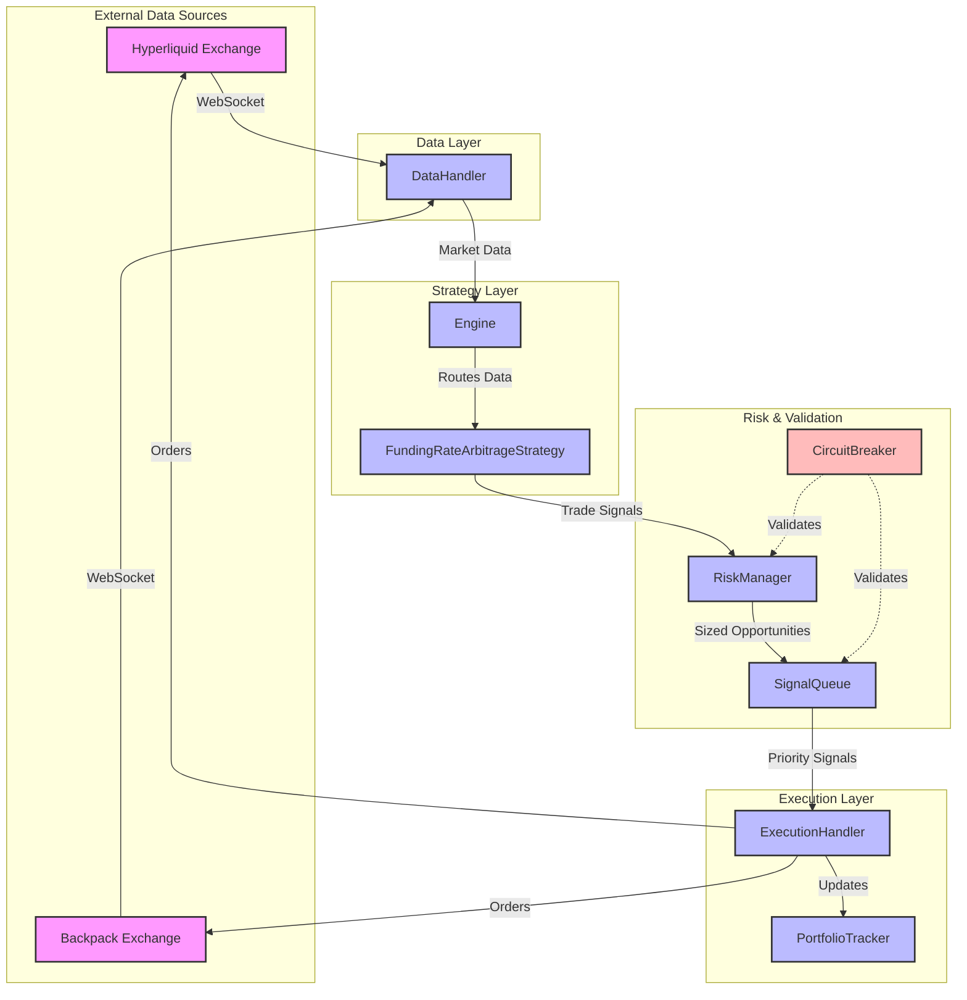
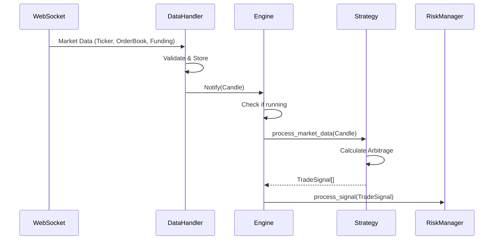
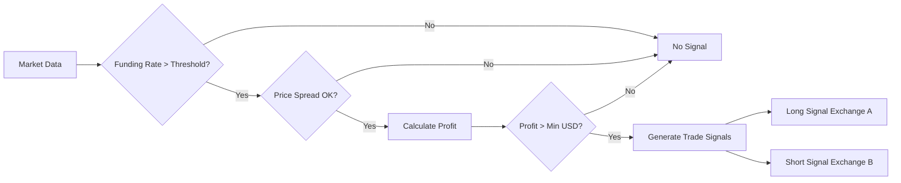
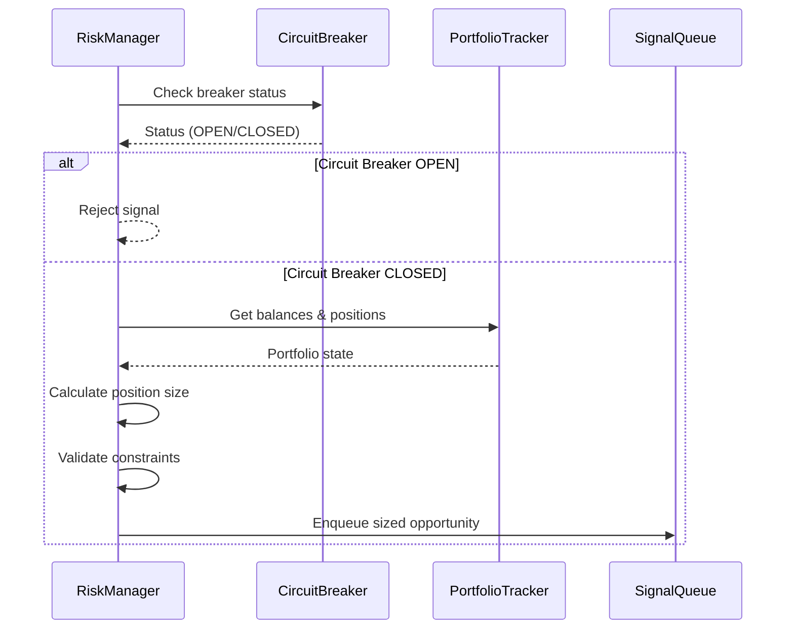
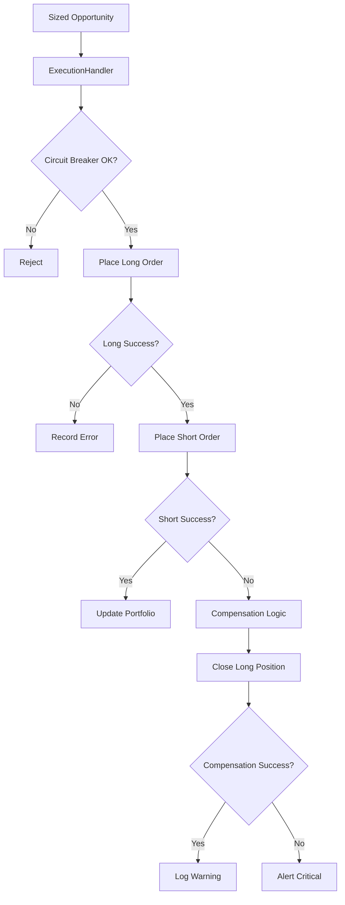

# CyberDeltaEngine Production Testing Guide

## Overview

This guide provides comprehensive recommendations for testing the CyberDeltaEngine business logic in production-like environments. After 2 months of robust API development, this document focuses on validating the core trading logic safely and systematically.

## Table of Contents

1. [Architecture Overview](#architecture-overview)
2. [Testing Approach](#testing-approach)
3. [Business Logic Flow](#business-logic-flow)
4. [Component Interactions](#component-interactions)
5. [Testing Environments](#testing-environments)
6. [Production Testing Recommendations](#production-testing-recommendations)
7. [Monitoring and Validation](#monitoring-and-validation)
8. [Troubleshooting Guide](#troubleshooting-guide)

## Architecture Overview

CyberDeltaEngine is a sophisticated cryptocurrency arbitrage trading system designed for delta-neutral strategies between Hyperliquid and Backpack exchanges.

### Core Components

1. **Engine** (`cyberdelta/core/engine.py`): Central orchestrator
2. **DataHandler** (`cyberdelta/core/data_handler.py`): Market data aggregation
3. **Strategy** (`cyberdelta/strategies/funding_rate_arbitrage.py`): Signal generation
4. **RiskManager** (`cyberdelta/core/risk_manager.py`): Position sizing & validation
5. **SignalQueue** (`cyberdelta/core/signal_queue.py`): Priority-based signal management
6. **ExecutionHandler** (`cyberdelta/core/execution_handler.py`): Order execution
7. **PortfolioTracker** (`cyberdelta/core/portfolio_tracker.py`): State management
8. **CircuitBreaker** (`cyberdelta/validation/circuit_breaker.py`): Safety systems

### High-Level Architecture



## Testing Approach

### Testing Stages

1. **Dry Run Testing** (No real trades)
2. **Testnet Testing** (Simulated environment)
3. **Small Position Testing** (Minimal real funds)
4. **Gradual Scale-Up** (Production readiness)

### Current State Analysis

Based on your configuration:
- ✅ Robust API layer (2 months development)
- ❌ Limited business logic testing
- ❌ No state persistence implementation
- ⚠️ Untested profit/loss tracking

## Business Logic Flow

### 1. Market Data Flow Sequence



### 2. Signal Generation Process



### 3. Risk Validation & Sizing



### 4. Order Execution Flow



## Component Interactions

### Data Handler Responsibilities

```python
# Real-time data management
- WebSocket connection management
- Message parsing and validation
- Data aggregation (tickers, order books, funding rates)
- Staleness detection
- Observer pattern for data distribution
```

### Engine Orchestration

```python
# Strategy lifecycle management
- Strategy registration/enabling
- Market data routing by symbol
- Signal collection and forwarding
- State management (running/stopped)
```

### Risk Manager Validation

```python
# Multi-layer validation
1. Circuit breaker checks
2. Balance verification
3. Leverage constraints
4. Position sizing (Kelly/Simple)
5. Portfolio limits enforcement
6. Drawdown monitoring
```

## Testing Environments

### 1. Dry Run Mode (Recommended Start)

```bash
# Full logic execution without trades
.venv/bin/python main.py --dry-run
```

**What happens:**
- ✅ Live market data connection
- ✅ Strategy calculations
- ✅ Risk validation
- ✅ Signal generation
- ❌ No actual order placement
- ✅ Simulated portfolio updates

**Expected Output:**
```
INFO - Initialized strategy: HL-BP-FundingArbitrage
INFO - Connected to Hyperliquid WebSocket
INFO - Connected to Backpack WebSocket
INFO - Strategy detected opportunity: BTC funding 0.15%, spread 0.08%
INFO - Risk manager validated: position size $200
INFO - [DRY RUN] Would place BUY BTC_USDC on Backpack @ $45,123.50
INFO - [DRY RUN] Would place SELL BTC on Hyperliquid @ $45,159.80
INFO - [DRY RUN] Estimated profit: $12.50 after fees
```

### 2. Testnet Configuration

```yaml
# config/config.yaml
exchanges:
  hyperliquid:
    is_mainnet_environment: false  # Uses testnet
    
  backpack:
    is_mainnet_environment: true   # No testnet available
    
risk:
  global:
    max_position_usd: 100.0       # Small test positions
    max_total_exposure_usd: 500.0
```

### 3. Monitoring Mode

```bash
# Run with minimal positions
.venv/bin/python main.py
```

Monitor these metrics:
- Signal generation frequency
- Risk manager rejection rate
- Circuit breaker triggers
- Portfolio P&L tracking

## Production Testing Recommendations

### Phase 1: Validation (1-2 days)

1. **Dry Run Testing**
   ```bash
   # Start with dry run
   .venv/bin/python main.py --dry-run 2>&1 | tee logs/dryrun_$(date +%Y%m%d_%H%M%S).log
   ```

2. **Verify Core Functions**
   - [ ] Market data reception (check logs for ticker updates)
   - [ ] Funding rate detection (look for opportunities)
   - [ ] Risk calculations (position sizing logs)
   - [ ] Signal generation (trade signal creation)

3. **Check for Issues**
   - [ ] Connection stability
   - [ ] Data staleness warnings
   - [ ] Unexpected errors
   - [ ] Memory/CPU usage

### Phase 2: Testnet Execution (3-5 days)

1. **Configure for Testnet**
   ```yaml
   # Ensure testnet settings
   exchanges:
     hyperliquid:
       is_mainnet_environment: false
   ```

2. **Run with Small Limits**
   ```yaml
   risk:
     global:
       max_position_usd: 50.0
       max_total_exposure_usd: 200.0
   ```

3. **Monitor Execution**
   - Order placement success rate
   - Fill quality (slippage)
   - Compensation logic triggers
   - Portfolio state accuracy

### Phase 3: Limited Production (1 week)

1. **Gradual Position Increase**
   ```yaml
   # Day 1-3: Minimal
   max_position_usd: 100.0
   
   # Day 4-5: Small
   max_position_usd: 500.0
   
   # Day 6-7: Normal
   max_position_usd: 1000.0
   ```

2. **Key Metrics to Track**
   ```python
   # Create monitoring script
   - Total trades executed
   - Success/failure ratio
   - Average profit per trade
   - Maximum drawdown
   - Circuit breaker activations
   ```

### Phase 4: Production Readiness

1. **State Persistence Implementation**
   - Portfolio snapshots
   - Order history
   - Performance metrics

2. **Alerting Setup**
   ```yaml
   monitoring:
     alert_methods: ["log", "telegram", "email"]
     alert_thresholds:
       max_drawdown_pct: 5.0
       min_success_rate: 0.8
   ```

## Monitoring and Validation

### Real-Time Monitoring Script

```python
#!/usr/bin/env python3
# scripts/monitor_trading.py

import asyncio
import json
from datetime import datetime
from pathlib import Path

async def monitor_logs():
    """Monitor trading logs in real-time"""
    log_file = Path("logs/cyberdelta.log")
    
    metrics = {
        "opportunities_detected": 0,
        "signals_generated": 0,
        "orders_placed": 0,
        "orders_failed": 0,
        "circuit_breaker_trips": 0,
        "last_update": datetime.now()
    }
    
    # Tail log file and update metrics
    # ... implementation
    
    print(json.dumps(metrics, indent=2))

if __name__ == "__main__":
    asyncio.run(monitor_logs())
```

### Performance Dashboard

```python
# frontend/monitoring/trading_dashboard.py
# Real-time metrics visualization
- P&L curve
- Position distribution
- Funding rate opportunities
- Risk utilization
- Circuit breaker status
```

## Troubleshooting Guide

### Common Issues and Solutions

#### 1. No Opportunities Detected

**Symptoms:**
```
INFO - Strategy processing market data...
INFO - No arbitrage opportunities found
```

**Checks:**
- Verify funding rates are positive on Hyperliquid
- Check price spread is within threshold
- Ensure both exchanges have data
- Review threshold settings

#### 2. Risk Manager Rejections

**Symptoms:**
```
WARNING - Risk manager rejected signal: Insufficient balance
```

**Solutions:**
- Check portfolio balances
- Verify position size calculations
- Review risk constraints
- Check for stale balance data

#### 3. Circuit Breaker Activations

**Symptoms:**
```
ERROR - Circuit breaker OPEN: APIErrorBreaker
```

**Recovery:**
- Check API error logs
- Verify network connectivity
- Wait for reset timeout
- Review error patterns

#### 4. Order Execution Failures

**Symptoms:**
```
ERROR - Order placement failed: Insufficient margin
```

**Debugging:**
- Verify account settings (leverage)
- Check collateral calculations
- Review order size vs balance
- Ensure symbol mapping correct

### Debug Mode

```bash
# Run with debug logging
LOG_LEVEL=DEBUG .venv/bin/python main.py --dry-run
```

### State Inspection

```python
# scripts/inspect_state.py
import json
from pathlib import Path

def inspect_portfolio_state():
    state_file = Path("data/state.json")
    if state_file.exists():
        with open(state_file) as f:
            state = json.load(f)
            print(f"Balances: {state.get('balances', {})}")
            print(f"Positions: {state.get('positions', [])}")
            print(f"Orders: {state.get('orders', [])}")
```

## Safety Checklist

Before running in production:

- [ ] Dry run executed successfully for 24 hours
- [ ] Testnet trading profitable over 3+ days  
- [ ] Circuit breakers tested and working
- [ ] Error handling verified
- [ ] Monitoring dashboard operational
- [ ] Alert system configured
- [ ] Backup and recovery plan ready
- [ ] Risk limits appropriately set
- [ ] API keys have correct permissions
- [ ] State persistence implemented

## Next Steps

1. **Immediate**: Run dry-run mode and analyze logs
2. **Day 2-3**: Fix any issues found, adjust parameters
3. **Day 4-7**: Testnet execution with monitoring
4. **Week 2**: Small position production testing
5. **Week 3**: Scale to normal operations

## Summary

The CyberDeltaEngine has a well-architected business logic layer with multiple safety mechanisms. The recommended approach is to start with dry-run testing to validate the core logic, then gradually progress through testnet and small position testing before full production deployment.

Key success factors:
- Systematic validation of each component
- Gradual scaling of risk exposure
- Comprehensive monitoring and alerting
- Quick response to issues

The architecture's separation of concerns and safety systems provide a solid foundation for reliable arbitrage trading once properly validated through this testing process.