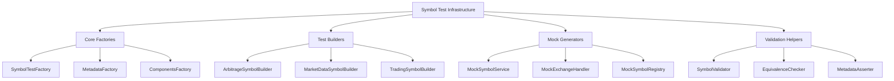
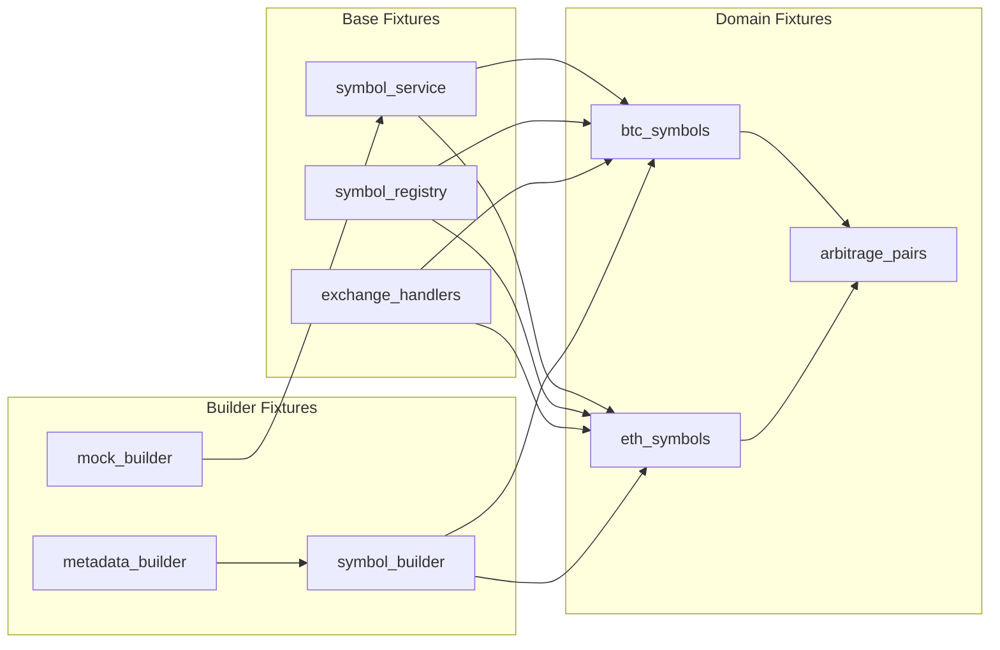
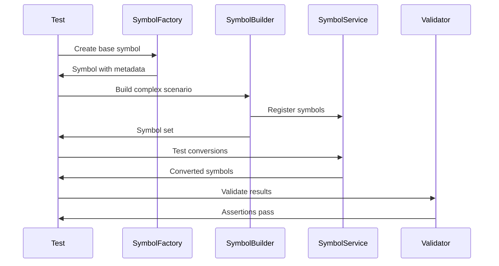

# Symbol Test Refactor Alignment Proposal

## Executive Summary

This document proposes a comprehensive refactor of the CyberDeltaEngine test suite to fully leverage the new Symbol architecture. The goal is to move beyond mechanical updates to create a test infrastructure that uses the Symbol system's type safety, domain modeling, and exchange-agnostic design at 100% effectiveness.

## Current State Analysis

### Symbol Architecture (V7)

The new Symbol system introduces:
1. **Clean Type-Safe Models**: Single `Symbol` model with generic metadata (`BaseSymbol[TMetadata]`)
2. **Exchange-Specific Metadata**: `HyperliquidMetadata` and `BackpackMetadata` 
3. **Protocol-Based Handlers**: `ExchangeHandler` protocol for exchange-specific logic
4. **Service Layer**: `SymbolService` for conversions and equivalence checking
5. **Clean API**: Registry pattern with `symbol()`, `exchanges.hyperliquid()`, `symbols.BTC.hyperliquid()`

### Test Suite Analysis

Current test patterns:
1. **Legacy Factories**: Still using backward-compatibility wrappers
2. **String-Based Testing**: Many tests still use string symbols
3. **Limited Symbol Features**: Not leveraging metadata, equivalence, or type safety
4. **Mixed Approaches**: Some tests use new API, others use old patterns
5. **Missing Helpers**: No Symbol-specific test utilities

## Proposed Improvements

### 1. Enhanced Symbol Test Factories



### 2. Symbol-Aware Fixtures Architecture



### 3. Test Patterns Migration



## Implementation Plan

### Phase 1: Core Infrastructure (Week 1)

#### 1.1 Enhanced Test Factories
```python
# tests/factories/symbol_test_factory.py
class SymbolTestFactory:
    """Enhanced factory for creating test symbols with full metadata."""
    
    @staticmethod
    def create_with_metadata(
        value: str,
        exchange: ExchangeName,
        **metadata_kwargs
    ) -> Symbol:
        """Create symbol with specific metadata."""
        
    @staticmethod
    def create_equivalent_pair(
        base_asset: str,
        exchanges: tuple[ExchangeName, ExchangeName]
    ) -> tuple[Symbol, Symbol]:
        """Create equivalent symbols across exchanges."""
        
    @staticmethod
    def create_arbitrage_set(
        assets: list[str]
    ) -> dict[str, tuple[Symbol, Symbol]]:
        """Create complete arbitrage symbol set."""
```

#### 1.2 Symbol Builders
```python
# tests/builders/symbol_builders.py
class ArbitrageSymbolBuilder:
    """Builder for arbitrage test scenarios."""
    
    def __init__(self):
        self._symbols: dict[str, list[Symbol]] = {}
        
    def add_perpetual_pair(
        self, 
        base_asset: str,
        hl_metadata: dict[str, Any] | None = None,
        bp_metadata: dict[str, Any] | None = None
    ) -> Self:
        """Add perpetual pair with custom metadata."""
        
    def add_spot_pair(
        self,
        base_asset: str,
        quote_asset: str = "USDC"
    ) -> Self:
        """Add spot pair for both exchanges."""
        
    def with_price_discrepancy(
        self,
        base_asset: str,
        hl_price: Decimal,
        bp_price: Decimal
    ) -> Self:
        """Add price data for testing arbitrage signals."""
        
    def build(self) -> ArbitrageTestData:
        """Build complete test scenario."""
```

#### 1.3 Mock Infrastructure
```python
# tests/mocks/symbol_mocks.py
class MockSymbolService:
    """Enhanced mock for SymbolService with builder pattern."""
    
    def __init__(self):
        self._conversions: dict[tuple[str, ExchangeName], Symbol] = {}
        self._equivalences: dict[str, list[Symbol]] = {}
        
    def with_conversion(
        self,
        from_symbol: Symbol,
        to_exchange: ExchangeName,
        result: Symbol
    ) -> Self:
        """Add conversion rule."""
        
    def with_equivalence(
        self,
        symbols: list[Symbol]
    ) -> Self:
        """Add equivalence relationship."""
        
    def build(self) -> SymbolService:
        """Build configured mock service."""
```

### Phase 2: Fixture System (Week 1-2)

#### 2.1 Base Fixtures
```python
# tests/fixtures/symbol_base_fixtures.py

@pytest.fixture
def symbol_service() -> SymbolService:
    """Provide configured SymbolService for tests."""
    return get_symbol_service()

@pytest.fixture
def symbol_registry() -> SymbolRegistry:
    """Provide symbol registry for tests."""
    return get_registry()

@pytest.fixture
def exchange_handlers() -> dict[ExchangeName, ExchangeHandler]:
    """Provide exchange handlers for tests."""
    return {
        ExchangeName.HYPERLIQUID: HyperliquidHandler(),
        ExchangeName.BACKPACK: BackpackHandler(),
    }
```

#### 2.2 Domain Fixtures
```python
# tests/fixtures/symbol_domain_fixtures.py

@pytest.fixture
def btc_symbols(symbol_service: SymbolService) -> SymbolSet:
    """Complete BTC symbol set for testing."""
    return SymbolSet(
        perp_hl=symbols.BTC.hyperliquid(),
        perp_bp=symbols.BTC.backpack(),
        spot_hl=exchanges.hyperliquid("BTC/USDC"),
        spot_bp=exchanges.backpack("BTC_USDC"),
        canonical="BTC_USD",
        equivalences=symbol_service.get_equivalent_symbols(symbols.BTC.hyperliquid())
    )

@pytest.fixture
def arbitrage_pairs() -> dict[str, ArbitragePair]:
    """Common arbitrage pairs for testing."""
    return {
        "BTC": ArbitragePair(
            long=symbols.BTC.hyperliquid(),
            short=symbols.BTC.backpack(),
            spread_threshold=Decimal("0.001")
        ),
        "ETH": ArbitragePair(
            long=symbols.ETH.hyperliquid(),
            short=symbols.ETH.backpack(),
            spread_threshold=Decimal("0.0015")
        ),
    }
```

#### 2.3 Builder Fixtures
```python
# tests/fixtures/symbol_builder_fixtures.py

@pytest.fixture
def symbol_builder() -> SymbolBuilder:
    """Flexible symbol builder for tests."""
    return SymbolBuilder()

@pytest.fixture
def metadata_builder() -> MetadataBuilder:
    """Metadata builder for custom scenarios."""
    return MetadataBuilder()

@pytest.fixture
def mock_symbol_service() -> MockSymbolService:
    """Configurable mock symbol service."""
    return MockSymbolService()
```

### Phase 3: Test Migration (Week 2-3)

#### 3.1 Unit Test Patterns

**Before:**
```python
def test_order_creation():
    symbol = "BTC-PERP"
    order = create_order(symbol, "hyperliquid", ...)
```

**After:**
```python
def test_order_creation(btc_symbols: SymbolSet):
    symbol = btc_symbols.perp_hl
    order = create_order(symbol, ...)
    
    # Leverage metadata
    assert order.symbol_id == symbol.metadata.asset_index
    
    # Test equivalence
    assert symbol_service.are_equivalent(
        order.symbol,
        btc_symbols.perp_bp
    )
```

#### 3.2 Integration Test Patterns

**Before:**
```python
async def test_arbitrage_opportunity():
    hl_symbol = "BTC"
    bp_symbol = "BTC_PERP"
    opportunity = check_arbitrage(hl_symbol, bp_symbol)
```

**After:**
```python
async def test_arbitrage_opportunity(
    arbitrage_pairs: dict[str, ArbitragePair],
    symbol_service: SymbolService
):
    btc_pair = arbitrage_pairs["BTC"]
    
    # Validate pair compatibility
    assert symbol_service.are_equivalent(
        btc_pair.long,
        btc_pair.short
    )
    
    opportunity = check_arbitrage(btc_pair)
    
    # Use metadata for validation
    assert opportunity.long_exchange == btc_pair.long.exchange
    assert opportunity.short_exchange == btc_pair.short.exchange
```

#### 3.3 Mock Test Patterns

**Before:**
```python
def test_symbol_conversion():
    mock_mapper = Mock()
    mock_mapper.get_exchange_symbol.return_value = "BTC-PERP"
```

**After:**
```python
def test_symbol_conversion(mock_symbol_service: MockSymbolService):
    btc_hl = symbols.BTC.hyperliquid()
    btc_bp = symbols.BTC.backpack()
    
    service = (
        mock_symbol_service
        .with_conversion(btc_hl, ExchangeName.BACKPACK, btc_bp)
        .with_equivalence([btc_hl, btc_bp])
        .build()
    )
    
    # Test with full type safety
    result = service.convert_symbol(btc_hl, ExchangeName.BACKPACK)
    assert result == btc_bp
    assert isinstance(result.metadata, BackpackMetadata)
```

### Phase 4: Advanced Helpers (Week 3-4)

#### 4.1 Validation Helpers
```python
# tests/helpers/symbol_validators.py

class SymbolTestValidator:
    """Advanced validation for symbol tests."""
    
    @staticmethod
    def assert_valid_arbitrage_pair(
        long: Symbol,
        short: Symbol,
        symbol_service: SymbolService
    ) -> None:
        """Validate arbitrage pair compatibility."""
        assert symbol_service.are_equivalent(long, short)
        assert long.exchange != short.exchange
        assert long.market_type == short.market_type
        
    @staticmethod
    def assert_metadata_consistency(
        symbol: Symbol,
        expected_metadata: dict[str, Any]
    ) -> None:
        """Validate symbol metadata."""
        if symbol.exchange == ExchangeName.HYPERLIQUID:
            assert isinstance(symbol.metadata, HyperliquidMetadata)
            if "asset_index" in expected_metadata:
                assert symbol.metadata.asset_index == expected_metadata["asset_index"]
```

#### 4.2 Scenario Builders
```python
# tests/helpers/symbol_scenarios.py

class SymbolTestScenarios:
    """Pre-built test scenarios using symbols."""
    
    @staticmethod
    def create_funding_arbitrage_scenario() -> FundingArbScenario:
        """Create complete funding arbitrage test scenario."""
        return FundingArbScenario(
            symbols={
                "BTC": (symbols.BTC.hyperliquid(), symbols.BTC.backpack()),
                "ETH": (symbols.ETH.hyperliquid(), symbols.ETH.backpack()),
            },
            funding_rates={
                symbols.BTC.hyperliquid(): Decimal("0.01"),
                symbols.BTC.backpack(): Decimal("-0.005"),
                symbols.ETH.hyperliquid(): Decimal("0.008"),
                symbols.ETH.backpack(): Decimal("-0.002"),
            },
            positions={
                symbols.BTC.hyperliquid(): Decimal("1.0"),
                symbols.BTC.backpack(): Decimal("-1.0"),
            }
        )
```

#### 4.3 Property-Based Testing
```python
# tests/helpers/symbol_properties.py

@given(
    base_asset=st.sampled_from(["BTC", "ETH", "SOL", "AVAX"]),
    exchange=st.sampled_from(list(ExchangeName))
)
def test_symbol_roundtrip_conversion(
    base_asset: str,
    exchange: ExchangeName,
    symbol_service: SymbolService
):
    """Property: Symbol conversions should round-trip correctly."""
    # Create symbol
    original = symbol(f"{base_asset}-PERP", exchange)
    
    # Convert to other exchange and back
    other_exchange = (
        ExchangeName.BACKPACK 
        if exchange == ExchangeName.HYPERLIQUID 
        else ExchangeName.HYPERLIQUID
    )
    
    converted = symbol_service.convert_symbol(original, other_exchange)
    roundtrip = symbol_service.convert_symbol(converted, exchange)
    
    # Should be equivalent
    assert symbol_service.are_equivalent(original, roundtrip)
```

## Benefits of This Approach

### 1. Type Safety Throughout Tests
- No more string-based symbol handling
- Compile-time checking of symbol usage
- IDE autocomplete for symbol properties

### 2. Domain Modeling in Tests
- Tests reflect real-world concepts
- Arbitrage pairs as first-class objects
- Market relationships properly modeled

### 3. Reduced Test Complexity
- Builders handle complex setup
- Fixtures provide common scenarios
- Validators ensure correctness

### 4. Better Test Coverage
- Metadata validation
- Equivalence testing
- Exchange-specific behavior

### 5. Maintainability
- Single source of truth for symbols
- Consistent patterns across tests
- Easy to add new exchanges

## Migration Strategy

### Week 1: Infrastructure
1. Create enhanced factories
2. Implement builders
3. Set up mock infrastructure

### Week 2: Fixtures
1. Implement base fixtures
2. Create domain fixtures
3. Add builder fixtures

### Week 3: Core Tests
1. Migrate unit tests
2. Update integration tests
3. Refactor mock usage

### Week 4: Advanced Features
1. Add validation helpers
2. Create scenario builders
3. Implement property tests

## Success Metrics

1. **100% Symbol API Usage**: No string symbols in tests
2. **Type Safety**: All symbol operations type-checked
3. **Test Clarity**: Reduced lines of code, increased readability
4. **Coverage**: All symbol features tested
5. **Performance**: No regression in test execution time

## Risks and Mitigations

### Risk 1: Breaking Existing Tests
**Mitigation**: Incremental migration with backward compatibility

### Risk 2: Learning Curve
**Mitigation**: Comprehensive examples and documentation

### Risk 3: Over-Engineering
**Mitigation**: Start simple, add complexity only where needed

## Conclusion

This refactor will transform our test suite from a collection of string-based tests to a type-safe, domain-driven testing framework that fully leverages the Symbol architecture. The investment in proper test infrastructure will pay dividends in:

- Faster test development
- Fewer test bugs
- Better test coverage
- Easier maintenance
- Clear domain modeling

The phased approach ensures we can deliver value incrementally while maintaining test stability throughout the migration.