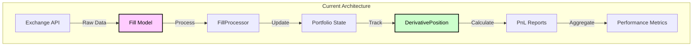
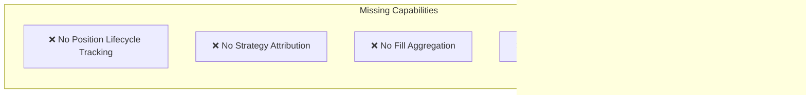
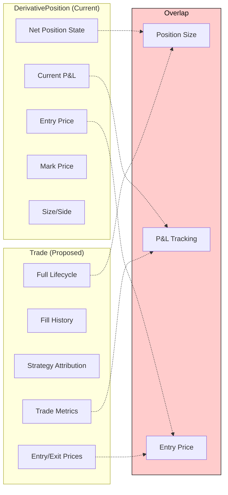
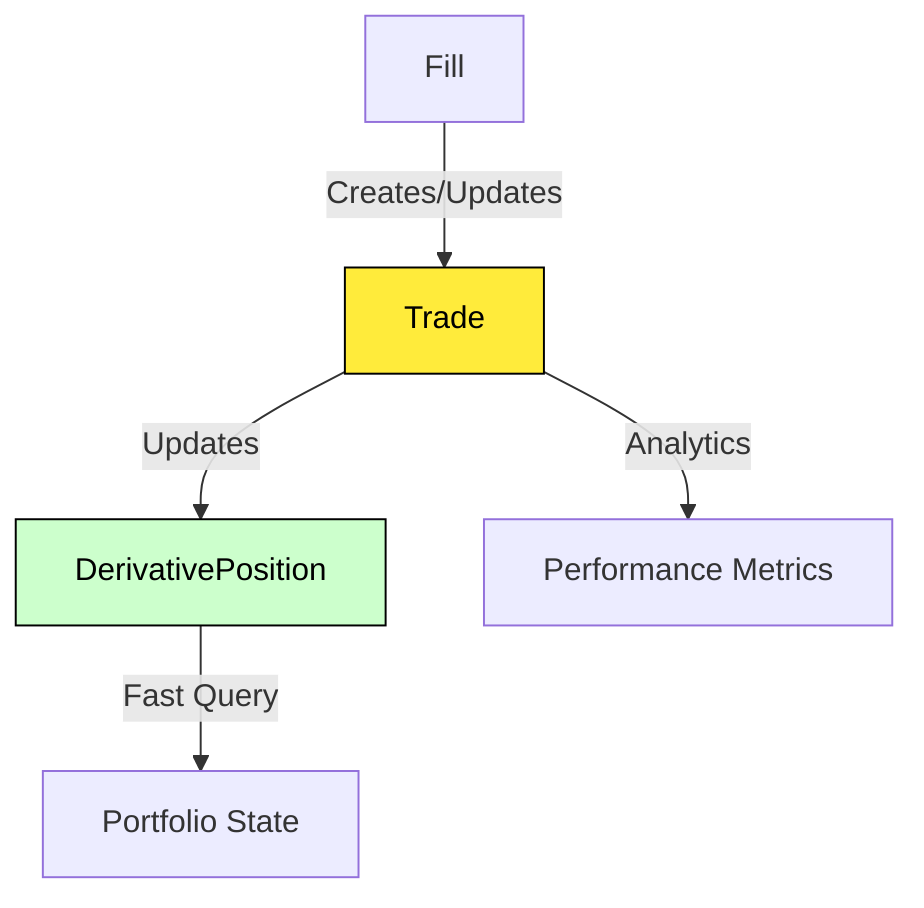
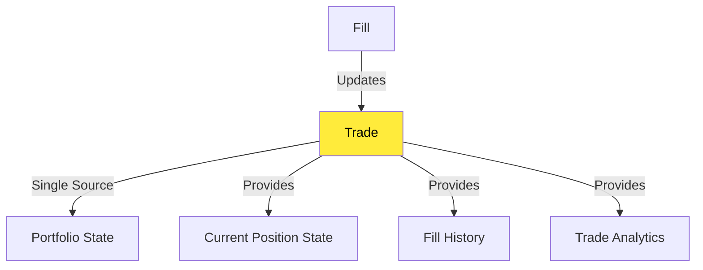
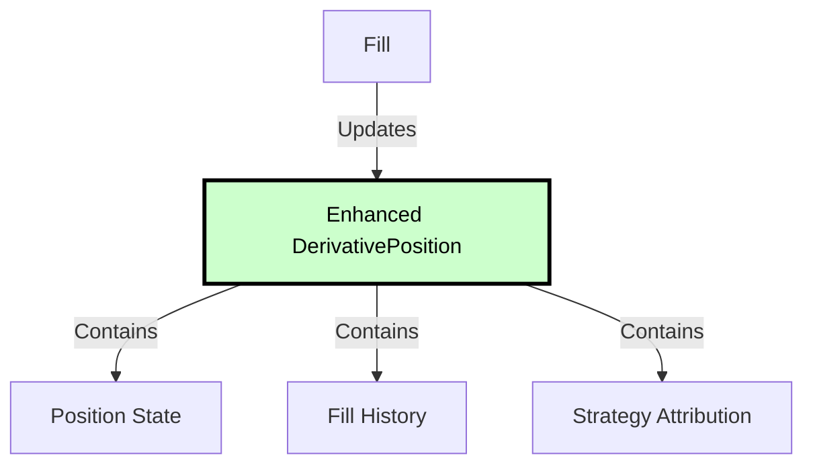
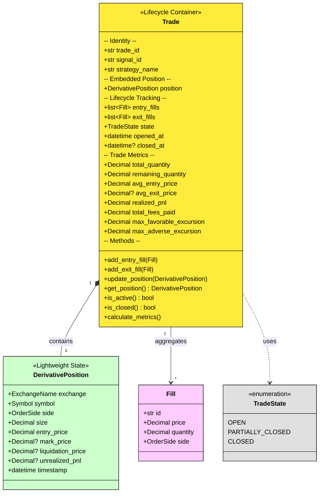
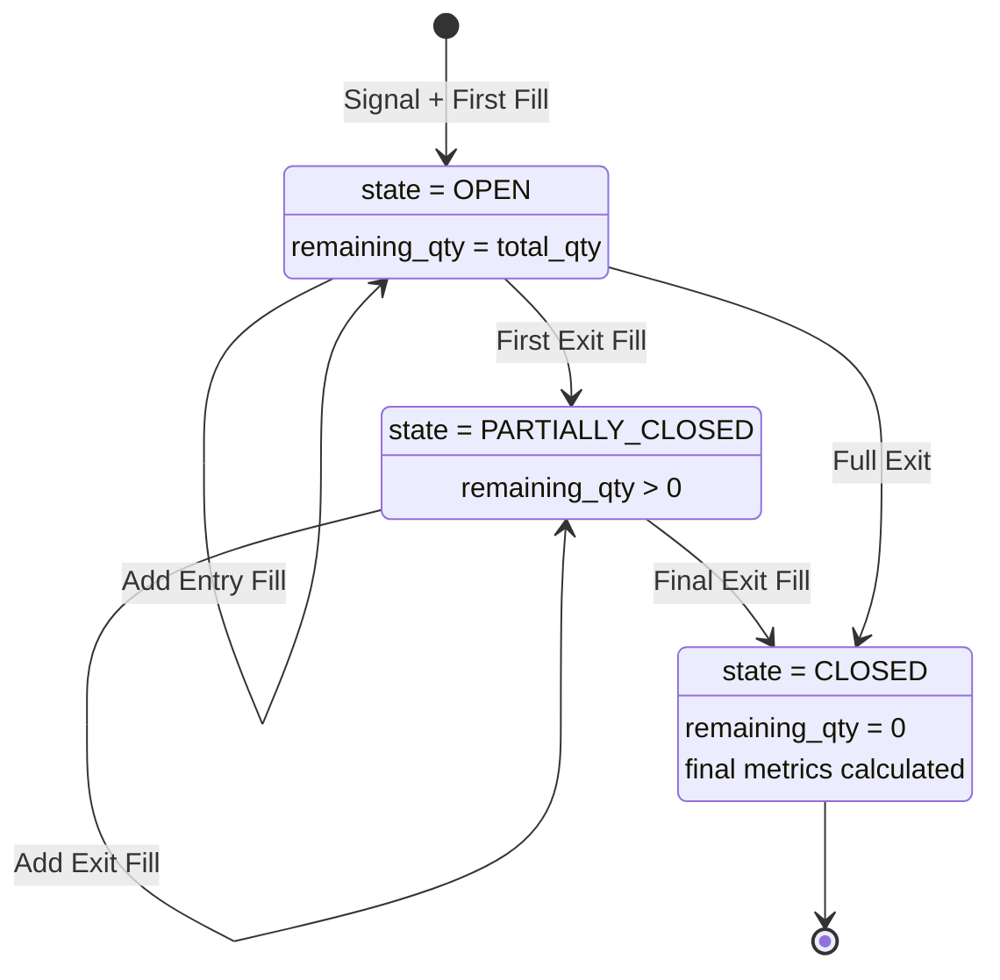
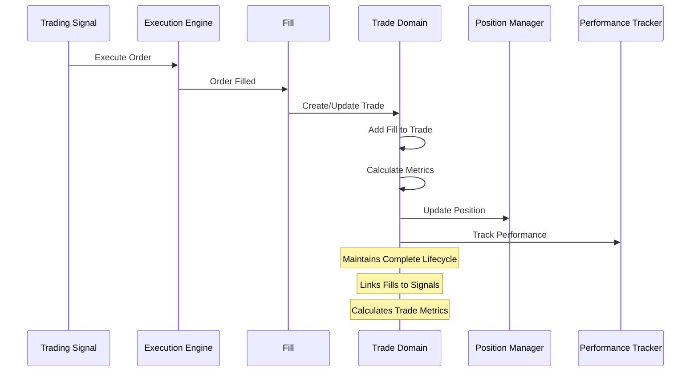
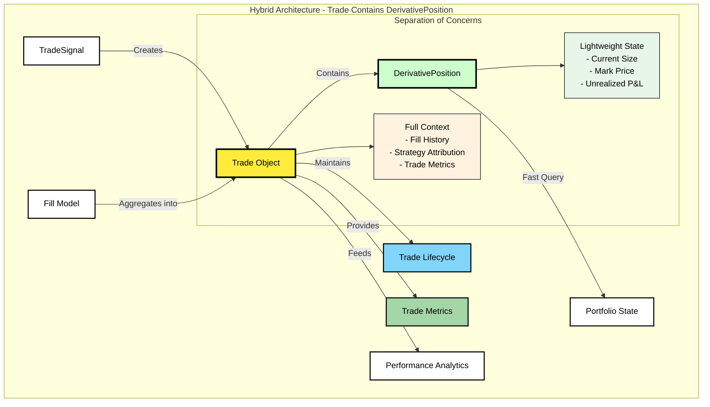

# Trade Domain Object Analysis & Proposal

## Executive Summary

This document analyzes the current state of trade lifecycle tracking in CyberDeltaEngine and proposes the introduction of a new `Trade` domain object to bridge the gap between raw execution data (`Fill`) and position state management (`DerivativePosition`).

## Current State Analysis

### 1. Data Flow Overview



### 2. Existing Models

#### 2.1 Fill (Execution Data)
- **Purpose**: Raw execution record from exchanges
- **Scope**: Single execution event
- **Key Fields**:
  - `id`, `order_id`, `symbol`, `exchange`
  - `price`, `quantity`, `fee`, `side`
  - `executed_at`, `maker_taker`
  - Exchange-specific details (hl_details, bp_details)
- **Location**: `cyberdelta/models/market/fill.py`

#### 2.2 DerivativePosition (Current State)
- **Purpose**: Current position state tracking
- **Scope**: Net position at a point in time
- **Key Fields**:
  - `symbol`, `exchange`, `side`, `size`
  - `entry_price`, `mark_price`, `liquidation_price`
  - `unrealized_pnl`, `realized_pnl`
- **Location**: `cyberdelta/models/derivative_position.py`

#### 2.3 PositionPnLDetail (Reporting)
- **Purpose**: PnL calculation results
- **Scope**: Financial metrics for reporting
- **Key Fields**:
  - `unrealized_pnl_usd`, `realized_pnl_usd`
  - `pnl_percentage`, `fees_paid_usd`
  - `holding_period_days`
- **Location**: `cyberdelta/models/portfolio/pnl_report.py`

### 3. Current Limitations



#### 3.1 Position Lifecycle
- Cannot track multiple fills that comprise a single trade
- No distinction between scaling in/out vs new positions
- Lost context when position is closed

#### 3.2 Strategy Attribution
- Fills don't maintain connection to originating signals
- Cannot analyze strategy performance per trade
- No way to track which strategy initiated a position

#### 3.3 Trade Metrics
- Cannot calculate:
  - Maximum favorable/adverse excursion (MFE/MAE)
  - Risk/reward ratios achieved
  - Holding period statistics
  - Entry/exit efficiency

## Trade vs DerivativePosition: Do We Need Both?

### Current Overlap Analysis



### Three Possible Approaches

#### Option 1: Keep Both (Complementary Roles)
- **DerivativePosition**: Current net position state (lightweight, fast queries)
- **Trade**: Complete history and lifecycle (rich analytics, audit trail)



**Pros:**
- Separation of concerns (state vs history)
- Fast position queries don't need full trade data
- Can have multiple trades per position (pyramiding)

**Cons:**
- Data duplication
- Synchronization complexity
- More models to maintain

#### Option 2: Replace DerivativePosition with Trade
- **Trade** becomes the single source of truth for positions



**Pros:**
- Single source of truth
- No synchronization issues
- Simpler architecture

**Cons:**
- Trade object becomes heavy
- Need to handle closed trades differently
- Query performance for current positions

#### Option 3: Extend DerivativePosition to Include Trade Features
- Enhance **DerivativePosition** to track lifecycle



**Pros:**
- Evolution of existing model
- Backward compatibility
- No new abstractions

**Cons:**
- DerivativePosition becomes complex
- Mixing concerns (current state + history)
- Name doesn't reflect full purpose

### Recommendation: Hybrid Approach - Trade Contains DerivativePosition

After reconsideration, **keeping both but with Trade containing DerivativePosition** is the optimal approach:

1. **DerivativePosition remains lightweight** for fast position queries
2. **Trade adds lifecycle context** around the position
3. **Clear separation of concerns** - current state vs full history
4. **Performance optimized** - can query positions without loading full trades

### Key Insight: Composition Over Replacement

- **DerivativePosition** = Lightweight current state (fast queries, minimal memory)
- **Trade** = Full lifecycle container that **contains** a DerivativePosition
- When position updates, Trade updates its embedded DerivativePosition
- Portfolio can store/query positions directly for performance

## Revised Solution: Trade Contains DerivativePosition

### 1. Conceptual Model (Composition Pattern)



### 2. Trade Lifecycle State Machine



### 3. Data Flow with Trade Object



### 4. Implementation Architecture (Composition Pattern)



## Benefits of Hybrid Approach (Trade + DerivativePosition)

### 1. Performance Optimized
- **Fast Position Queries**: Portfolio can query lightweight DerivativePosition directly
- **Minimal Memory**: DerivativePosition remains small for frequent access
- **Lazy Loading**: Full Trade context loaded only when needed

### 2. Clear Separation of Concerns
- **DerivativePosition**: Current state, fast queries, minimal data
- **Trade**: Full context, analytics, lifecycle management
- **No Duplication**: Trade contains the position, not parallel data

### 3. Backward Compatibility
- **Existing APIs**: Portfolio interfaces can continue using DerivativePosition
- **Gradual Migration**: Can add Trade features without breaking current code
- **Direct Access**: `trade.position` gives direct access to lightweight state

### 4. Best of Both Worlds
- **Lightweight Current State**: DerivativePosition for fast portfolio queries
- **Rich Analytics**: Trade for complete lifecycle tracking and metrics
- **Strategy Attribution**: Full signal-to-close tracking in Trade
- **Audit Trail**: Complete fill history and state transitions

### 5. Usage Patterns
```python
# Fast position query (existing pattern)
position = portfolio.get_position(symbol, exchange)
if position and position.size > 0:
    # Quick position logic

# Rich analytics (new capability)
trade = trade_manager.get_trade_for_position(symbol, exchange)
if trade:
    mfe = trade.max_favorable_excursion
    attribution = trade.strategy_name
    all_fills = trade.entry_fills + trade.exit_fills
```

## Implementation Plan

### Phase 1: Core Trade Model

#### Mutability Design Decision

The `Trade` object should be **mutable** because:

1. **Lifecycle Evolution**: Trades evolve through multiple states (OPEN → PARTIALLY_CLOSED → CLOSED)
2. **Fill Aggregation**: New fills are continuously added during the trade lifecycle
3. **Metric Updates**: P&L, MFE/MAE need real-time updates with market prices
4. **Performance**: Avoiding object recreation for each update

However, mutability should be **controlled**:
- State transitions through defined methods only
- Validation on each mutation
- Immutable snapshots for historical records
- Thread-safe updates with locks when needed

```python
# Location: cyberdelta/models/trading/trade.py
class Trade(BaseModel):
    """Trade lifecycle container that embeds DerivativePosition.

    MUTABLE MODEL with controlled state transitions.
    Contains DerivativePosition for lightweight state access.
    """

    model_config = ConfigDict(
        validate_assignment=True,  # Validate on mutation
        extra="forbid",            # No unexpected fields
        frozen=False               # Mutable by design
    )

    # Identity (immutable after creation)
    trade_id: str = Field(default_factory=lambda: str(uuid.uuid4()))
    signal_id: str | None = None
    strategy_name: str | None = None

    # Embedded lightweight position (mutable)
    position: DerivativePosition

    # Lifecycle state (mutable)
    state: TradeState  # Changes: OPEN -> PARTIALLY_CLOSED -> CLOSED

    # Fill history (mutable collections)
    entry_fills: list[Fill] = Field(default_factory=list)
    exit_fills: list[Fill] = Field(default_factory=list)

    # Trade-specific metrics (not in DerivativePosition)
    total_quantity: Decimal  # Cumulative quantity traded
    remaining_quantity: Decimal  # Current position size (= position.size)
    avg_entry_price: Decimal  # Weighted average entry price
    avg_exit_price: Decimal | None = None  # Weighted average exit price
    realized_pnl: Decimal = Decimal(0)  # Realized P&L from closes
    total_fees_paid: Decimal = Decimal(0)  # Cumulative fees

    # Risk tracking (new capabilities)
    max_favorable_excursion: Decimal = Decimal(0)  # Best price achieved
    max_adverse_excursion: Decimal = Decimal(0)   # Worst price achieved
    planned_stop_loss: Decimal | None = None      # Original stop from signal
    planned_take_profit: Decimal | None = None    # Original target from signal

    # Timestamps
    opened_at: datetime  # Immutable
    closed_at: datetime | None = None  # Set once when closed
    last_updated: datetime  # Updated on each change

    @classmethod
    def create_from_signal_and_fill(
        cls,
        signal: TradeSignal,
        first_fill: Fill
    ) -> "Trade":
        """Create new Trade from signal and first fill."""
        position = DerivativePosition(
            exchange=first_fill.exchange,
            symbol=first_fill.symbol,
            side=first_fill.side,
            size=first_fill.quantity,
            entry_price=first_fill.price,
            timestamp=first_fill.executed_at,
            unrealized_pnl=Decimal(0),
        )

        return cls(
            signal_id=signal.signal_id,
            strategy_name=signal.source_strategy,
            position=position,
            state=TradeState.OPEN,
            entry_fills=[first_fill],
            total_quantity=first_fill.quantity,
            remaining_quantity=first_fill.quantity,
            avg_entry_price=first_fill.price,
            total_fees_paid=first_fill.fee,
            planned_stop_loss=signal.stop_loss,
            planned_take_profit=signal.take_profit,
            opened_at=first_fill.executed_at,
            last_updated=first_fill.executed_at,
        )

    def add_entry_fill(self, fill: Fill) -> None:
        """Add entry fill and update position."""
        if self.state == TradeState.CLOSED:
            raise ValueError("Cannot add fills to closed trade")
        if fill.side != self.position.side:
            raise ValueError("Entry fill side must match trade side")

        self.entry_fills.append(fill)
        self._update_from_entry_fill(fill)
        self._sync_position_from_trade()
        self.last_updated = datetime.now(UTC)

    def add_exit_fill(self, fill: Fill) -> None:
        """Add exit fill and update position/state."""
        if self.state == TradeState.CLOSED:
            raise ValueError("Cannot add fills to closed trade")
        if fill.side == self.position.side:
            raise ValueError("Exit fill must be opposite side")

        self.exit_fills.append(fill)
        self._update_from_exit_fill(fill)
        self._sync_position_from_trade()
        self._update_state()
        self.last_updated = datetime.now(UTC)

    def update_position_from_market(self, mark_price: Decimal) -> None:
        """Update embedded position with market data."""
        self.position.mark_price = mark_price
        if self.position.entry_price:
            # Update unrealized P&L
            price_diff = mark_price - self.position.entry_price
            if self.position.side == OrderSide.SELL:
                price_diff = -price_diff
            self.position.unrealized_pnl = price_diff * self.position.size

        # Update MFE/MAE tracking
        self._update_mfe_mae(mark_price)
        self.position.timestamp = datetime.now(UTC)

    def get_position(self) -> DerivativePosition:
        """Direct access to lightweight position."""
        return self.position

    def is_active(self) -> bool:
        """Check if trade is still active (not closed)."""
        return self.state != TradeState.CLOSED

    def is_closed(self) -> bool:
        """Check if trade is fully closed."""
        return self.state == TradeState.CLOSED

    def _sync_position_from_trade(self) -> None:
        """Keep position in sync with trade state."""
        self.position.size = self.remaining_quantity
        self.position.entry_price = self.avg_entry_price
        self.position.timestamp = datetime.now(UTC)

    def _update_from_entry_fill(self, fill: Fill) -> None:
        """Update trade metrics from entry fill."""
        # Update quantities
        old_total = self.total_quantity
        self.total_quantity += fill.quantity
        self.remaining_quantity += fill.quantity

        # Update weighted average entry price
        old_value = old_total * self.avg_entry_price
        new_value = fill.quantity * fill.price
        self.avg_entry_price = (old_value + new_value) / self.total_quantity

        # Update fees
        self.total_fees_paid += fill.fee

    def _update_from_exit_fill(self, fill: Fill) -> None:
        """Update trade metrics from exit fill."""
        # Update quantities
        self.remaining_quantity -= fill.quantity

        # Calculate realized P&L for this fill
        if self.position.side == OrderSide.BUY:
            # Long position closed
            pnl = (fill.price - self.avg_entry_price) * fill.quantity
        else:
            # Short position closed
            pnl = (self.avg_entry_price - fill.price) * fill.quantity

        self.realized_pnl += pnl
        self.total_fees_paid += fill.fee

        # Update average exit price
        if self.avg_exit_price is None:
            self.avg_exit_price = fill.price
        else:
            # Weighted average of exit fills
            total_exit_qty = sum(f.quantity for f in self.exit_fills)
            old_value = (total_exit_qty - fill.quantity) * self.avg_exit_price
            new_value = fill.quantity * fill.price
            self.avg_exit_price = (old_value + new_value) / total_exit_qty

    def _update_state(self) -> None:
        """Update trade state based on remaining quantity."""
        if self.remaining_quantity == Decimal(0):
            self.state = TradeState.CLOSED
            self.closed_at = datetime.now(UTC)
        elif len(self.exit_fills) > 0:
            self.state = TradeState.PARTIALLY_CLOSED

    def _update_mfe_mae(self, current_price: Decimal) -> None:
        """Update maximum favorable/adverse excursion."""
        if self.position.side == OrderSide.BUY:
            # Long position
            favorable = current_price - self.avg_entry_price
            adverse = self.avg_entry_price - current_price
        else:
            # Short position
            favorable = self.avg_entry_price - current_price
            adverse = current_price - self.avg_entry_price

        if favorable > self.max_favorable_excursion:
            self.max_favorable_excursion = favorable
        if adverse > self.max_adverse_excursion:
            self.max_adverse_excursion = adverse
```

### Phase 1b: Immutable Trade Snapshot
```python
class TradeSnapshot(BaseModel):
    """Immutable snapshot of trade state for history/audit.

    IMMUTABLE MODEL for historical records.
    """

    model_config = ConfigDict(
        frozen=True,  # Immutable
        extra="forbid"
    )

    # All fields from Trade
    trade_id: str
    state: TradeState
    snapshot_timestamp: datetime
    # ... all other fields ...
```

### Phase 2: Trade Manager Service
```python
# Location: cyberdelta/domain/trading/trade_manager.py
class TradeManager:
    """Manages trade lifecycle and state transitions."""

    async def create_trade_from_signal(
        self, signal: TradeSignal, first_fill: Fill
    ) -> Trade:
        """Create new trade from signal and first fill."""

    async def add_fill_to_trade(
        self, trade_id: str, fill: Fill
    ) -> Trade:
        """Add fill to existing trade and update metrics."""

    async def close_trade(
        self, trade_id: str, final_fill: Fill
    ) -> Trade:
        """Close trade with final fill."""

    async def get_open_trades(self) -> list[Trade]:
        """Get all currently open trades."""

    async def calculate_trade_metrics(
        self, trade: Trade, current_price: Decimal
    ) -> TradeMetrics:
        """Calculate current trade metrics."""
```

### Phase 3: Integration Points

1. **Fill Handler Integration**
   - Route fills to TradeManager
   - Maintain trade-fill associations

2. **Portfolio Service Integration**
   - Update positions from trades
   - Track trade-based P&L

3. **Performance Tracker Integration**
   - Use completed trades for metrics
   - Provide trade-level analytics

4. **Strategy Service Integration**
   - Link signals to trades
   - Track strategy performance by trade

## Migration Strategy (Hybrid Approach)

### Step 1: Implement Trade Model with Embedded Position
```python
# New Trade model contains DerivativePosition
class Trade(BaseModel):
    position: DerivativePosition  # Embedded existing model
    # ... add lifecycle and analytics fields

    def get_position(self) -> DerivativePosition:
        """Direct access for existing interfaces."""
        return self.position
```

### Step 2: Dual Storage in Portfolio
```python
class PortfolioStateManager:
    # Keep existing position storage for performance
    _positions: dict[str, DerivativePosition] = {}
    # Add new trade storage for rich context
    _trades: dict[str, Trade] = {}

    async def get_position(self, symbol, exchange) -> DerivativePosition:
        """Fast path - existing interface."""
        return self._positions.get(f"{exchange}:{symbol}")

    async def get_trade(self, symbol, exchange) -> Trade | None:
        """Rich path - new interface."""
        return self._trades.get(f"{exchange}:{symbol}")
```

### Step 3: Gradual Service Enhancement
1. **Fill Handler**: Create Trade alongside DerivativePosition updates
2. **Performance Tracker**: Use Trade when available, fallback to position
3. **Strategy Service**: Link trades to signals
4. **Risk Service**: Continue using lightweight positions

### Step 4: Optional Optimization
Once proven stable, could optimize to single storage:
```python
class PortfolioStateManager:
    _trades: dict[str, Trade] = {}  # Single storage

    async def get_position(self, symbol, exchange) -> DerivativePosition:
        """Extract position from trade."""
        trade = self._trades.get(f"{exchange}:{symbol}")
        return trade.position if trade else None
```

## Conclusion

After analysis, the **hybrid approach of Trade containing DerivativePosition** is optimal:

### Why Composition Over Replacement?
1. **Performance**: DerivativePosition remains lightweight for frequent portfolio queries
2. **Backward Compatibility**: Existing position-based interfaces continue to work
3. **Separation of Concerns**: Current state vs full lifecycle tracking
4. **Gradual Migration**: Can add Trade features without breaking existing functionality

### Key Benefits of Hybrid Design:
1. **Best of Both**: Fast position queries + rich trade analytics
2. **No Duplication**: Trade contains position, not parallel data
3. **Clear Interface**: `trade.get_position()` for lightweight access
4. **Flexible Storage**: Can optimize later while maintaining interfaces
5. **Natural Evolution**: Extends current architecture rather than replacing it

### Final Architecture:
- **DerivativePosition**: Lightweight current state (unchanged)
- **Trade**: Lifecycle container with embedded position + rich analytics
- **Portfolio**: Can store both or just trades (with position extraction)
- **Services**: Choose appropriate model for their needs

This approach respects your point about DerivativePosition being lightweight while adding the rich trade lifecycle tracking capabilities we need.

## Next Steps

1. **Review & Approval**: Discuss proposal with team
2. **Prototype**: Build proof-of-concept Trade model
3. **Test**: Validate with historical data
4. **Implement**: Phase-by-phase rollout
5. **Monitor**: Track improvements in analytics and reporting
