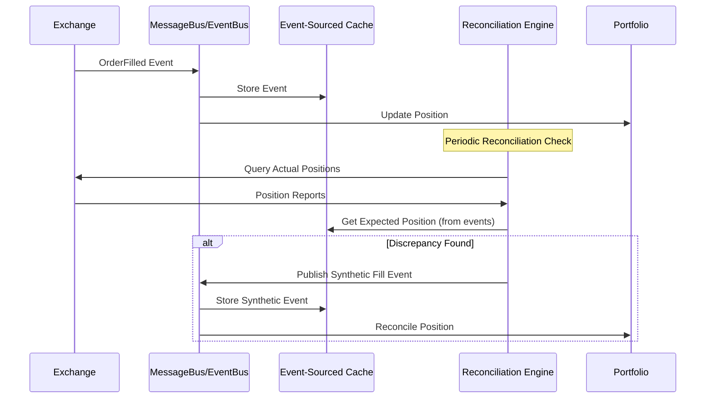

# Nautilus Trader Event System & Reconciliation Engine Integration

## Executive Summary

After deep research into Nautilus Trader's event system, I've discovered sophisticated patterns that demonstrate how event-driven architecture and reconciliation engines work together in production trading systems. This document reveals the critical connection between event sourcing, MessageBus architecture, and real-time state reconciliation that makes Nautilus Trader resilient in live trading environments.

## Event-Driven Reconciliation Architecture

### 1. MessageBus as the Reconciliation Backbone

**Real MessageBus Implementation (Rust Core):**
```python
# Core MessageBus v2 (implemented in Rust for performance)
class MessageBus:
    def register(self, endpoint: str, handler: callable):
        """Register request handlers for data/execution engines"""
        
    def publish(self, topic: str, message: object):
        """Publish events to subscribers with pattern matching"""
        
    def subscribe(self, topic: str, handler: callable, priority: int = 0):
        """Subscribe with priority-based delivery"""
        
    def request(self, message: object, timeout: float = 5.0):
        """Request/response pattern for reconciliation queries"""
        
    def is_pending_request(self, request_id: UUID) -> bool:
        """Check if reconciliation request is still pending"""
```

**Critical Discovery**: The MessageBus isn't just for communication - it's the **reconciliation coordination layer**. Every state change, position update, and order event flows through it, creating an **auditable event trail** for reconciliation.

### 2. Event Sourcing for State Reconstruction

**Real Event Sourcing Pattern from Nautilus:**
```python
# Event sourcing enables complete state reconstruction
class Position:
    def apply_fill(self, fill: Fill) -> tuple[Decimal | None, Decimal]:
        """Apply fill and return (realized_pnl, new_avg_price)"""
        # This creates PositionChanged events automatically
        
    def purge_events_for_order(self, order_id: OrderId):
        """Purge order events while maintaining audit trail"""
        # CRITICAL: Always preserve at least one event for audit

# Event handlers process state changes
def on_position_opened(self, event: PositionOpened):
    # Reconciliation can replay these events to reconstruct state
    
def on_position_changed(self, event: PositionChanged):
    # Each position change creates reconciliation checkpoint
    
def on_position_closed(self, event: PositionClosed):
    # Final state for reconciliation validation
```

**Why This Matters**: Event sourcing means reconciliation can **replay history** to verify current state matches expected state from all events.

### 3. Production Reconciliation Procedures

**Real Reconciliation Flow (from Polymarket Integration):**
```python
class LiveExecutionEngine:
    async def reconcile_state(self, timeout_secs: float = 10.0) -> bool:
        """Production-tested reconciliation process"""
        # 1. Generate Order Status Reports from exchange
        order_reports = await self._generate_order_status_reports()
        
        # 2. Generate Position Status Reports from exchange  
        position_reports = await self._generate_position_status_reports()
        
        # 3. Generate Fill Reports (if supported by venue)
        fill_reports = await self._generate_fill_reports()
        
        # 4. Compare with internal event-sourced state
        discrepancies = self._compare_with_internal_state(
            order_reports, position_reports, fill_reports
        )
        
        # 5. CRITICAL: Generate missing events to align state
        if self.config.generate_missing_orders:
            await self._generate_missing_orders_from_position_diffs(
                position_reports
            )
        
        # 6. Update internal state through event publishing
        return await self._apply_reconciliation_updates(discrepancies)

    async def _generate_missing_orders_from_position_diffs(
        self, position_reports: list[PositionReport]
    ):
        """Generate synthetic events to explain position differences"""
        for position_report in position_reports:
            expected_position = self._calculate_position_from_events(position_report.symbol)
            actual_position = position_report.position
            
            if expected_position != actual_position:
                # Create synthetic market order to explain difference
                synthetic_fill = self._create_synthetic_fill(
                    difference=actual_position - expected_position,
                    symbol=position_report.symbol
                )
                # Publish as event to maintain event sourcing integrity
                await self._msgbus.publish("execution.fill", synthetic_fill)
```

**Key Insight**: Reconciliation doesn't just check state - it **generates events** to maintain the event sourcing integrity while aligning with external reality.

### 4. Memory Management and Event Purging

**Production Event Purging (Critical for Live Systems):**
```python
class LiveExecEngineConfig:
    # Production-critical memory management
    purge_closed_orders_interval_mins: int = 10  # Purge every 10 minutes
    purge_closed_orders_buffer_mins: int = 60    # Keep for 1 hour
    purge_closed_positions_interval_mins: int = 10
    purge_closed_positions_buffer_mins: int = 60
    purge_account_events_interval_mins: int = 10
    purge_account_events_lookback_mins: int = 60

class EventPurger:
    def _purge_closed_orders(self):
        """Remove old events while preserving audit trail"""
        cutoff_time = datetime.now() - timedelta(
            minutes=self.config.purge_closed_orders_buffer_mins
        )
        
        for order in self.cache.orders_closed():
            if order.ts_closed and order.ts_closed < cutoff_time:
                # CRITICAL: Always keep at least one event for audit trail
                # This prevents total loss of historical state
                if len(order.events) > 1:
                    self.cache.purge_order_events(order.id, keep_last=True)
```

**Why Critical**: Live trading systems generate millions of events. Without purging, memory explodes. But purging must preserve **reconciliation capability**.

### 5. In-Flight Order Tracking (Prevents Lost Orders)

**Real In-Flight Monitoring:**
```python
class LiveExecEngineConfig:
    # In-flight order monitoring (CRITICAL for live trading)
    inflight_check_interval_ms: int = 2000      # Check every 2 seconds
    inflight_check_threshold_ms: int = 5000     # Flag orders after 5 seconds
    inflight_check_retries: int = 5             # Retry 5 times before giving up

class InFlightOrderTracker:
    def track_order_submission(self, order: Order):
        """Track order from submission to venue confirmation"""
        self._inflight_orders[order.client_order_id] = {
            'submitted_at': datetime.now(),
            'order': order,
            'retry_count': 0
        }
        
    async def check_inflight_orders(self):
        """Periodic check for orders that might be lost"""
        now = datetime.now()
        for client_order_id, tracking_info in self._inflight_orders.items():
            
            # Check if order has been in-flight too long
            time_inflight = now - tracking_info['submitted_at']
            if time_inflight.total_seconds() * 1000 > self.config.inflight_check_threshold_ms:
                
                # Query venue for order status (reconciliation query)
                venue_status = await self._query_venue_order_status(client_order_id)
                
                if venue_status and venue_status != tracking_info['order'].status:
                    # Generate missing event to reconcile state
                    missing_event = self._create_missing_order_event(
                        order=tracking_info['order'],
                        venue_status=venue_status
                    )
                    await self._msgbus.publish("execution.order_update", missing_event)
```

**Real-World Impact**: Prevents the nightmare scenario where an order is submitted but the confirmation is lost due to network issues, leaving the system unaware of an active order.

## Event-Driven Reconciliation Patterns

### 1. Real-Time State Alignment

**Continuous Reconciliation Through Events:**


### 2. Event Ordering and Sequencing

**Production Event Ordering (Fixed Multiple Bugs):**
```python
# Nautilus had to fix "consistent ordering of execution events"
class EventSequencer:
    def ensure_consistent_ordering(self, events: list[Event]):
        """Fixed: Events must be processed in timestamp order"""
        # Sort by ts_event (when it actually happened)
        # Then by ts_init (when Nautilus received it)
        return sorted(events, key=lambda e: (e.ts_event, e.ts_init))
        
    def handle_position_events(self, events: list[PositionEvent]):
        """Fixed: PositionOpened must come before PositionChanged"""
        # Ensure PositionOpened is generated when reopening closed position
        ordered_events = self.ensure_consistent_ordering(events)
        
        for event in ordered_events:
            if isinstance(event, PositionChanged) and not self._position_exists(event.position_id):
                # Generate missing PositionOpened event
                missing_opened = PositionOpened(
                    position_id=event.position_id,
                    ts_event=event.ts_event - 1  # Slightly before
                )
                self._process_event(missing_opened)
            
            self._process_event(event)
```

### 3. Redis Streams for External Event Publishing

**Real External Event Publishing:**
```python
class MessageBusConfig:
    database: DatabaseConfig = DatabaseConfig()  # Redis connection
    encoding: str = "msgpack"  # Performance over JSON
    timestamps_as_iso8601: bool = True
    buffer_interval_ms: int = 100  # Batch events for performance
    autotrim_mins: int = 30        # Automatic stream trimming
    use_trader_prefix: bool = True
    use_trader_id: bool = True
    streams_prefix: str = "streams"
    types_filter: list[type] = []  # Filter high-frequency events

# External systems can consume event streams
class ExternalReconciler:
    def subscribe_to_event_stream(self):
        """External reconciliation system consumes events"""
        # Stream key: trader:{trader_id}:{instance_id}:streams
        # Contains all trading events for external audit/reconciliation
        redis_stream = f"trader:{self.trader_id}:streams"
        
        # Read events from Redis stream
        events = self.redis.xread({redis_stream: '$'})
        for event in events:
            self.reconcile_external_state(event)
```

### 4. Component State Transitions

**Production Component State Management:**
```python
class ComponentState(Enum):
    PRE_INITIALIZED = "PRE_INITIALIZED"
    DEGRADING = "DEGRADING"        # Temporary issues
    DEGRADED = "DEGRADED"          # Operating with reduced capability
    FAULTING = "FAULTING"          # Serious issues detected
    FAULTED = "FAULTED"            # Component stopped due to errors

class ComponentStateManager:
    def on_reconciliation_failure(self, failure_count: int):
        """Handle reconciliation failures gracefully"""
        if failure_count > 3:
            self.degrade()  # Reduce functionality but keep running
            
        if failure_count > 10:
            self.fault()    # Stop component safely
            
    def degrade(self):
        """Degrade component but maintain event processing"""
        # Continue processing critical events but skip non-essential ones
        self.state = ComponentState.DEGRADING
        self._msgbus.publish("component.state_changed", ComponentStateChanged(
            component_id=self.id,
            new_state=ComponentState.DEGRADING
        ))
```

## Advanced Reconciliation Techniques

### 1. Position Report Filtering

**Production Multi-Node Trading:**
```python
class LiveExecEngineConfig:
    filter_position_reports: bool = False  # Filter conflicting position reports
    filter_unclaimed_external_orders: bool = False  # Filter external orders
    
class PositionReportFilter:
    def filter_position_reports(self, reports: list[PositionReport]) -> list[PositionReport]:
        """Filter position reports to avoid conflicts between trading nodes"""
        # When multiple nodes trade same account, position reports can conflict
        # Filter to only reports relevant to this node's orders
        
        filtered = []
        for report in reports:
            # Only include positions we have orders for
            if self._has_orders_for_symbol(report.symbol):
                filtered.append(report)
        
        return filtered
```

### 2. External Order Claiming

**Handling Orders Placed Outside Nautilus:**
```python
class ExternalOrderHandler:
    def claim_external_orders(self, external_orders: list[Order]):
        """Claim ownership of orders placed outside Nautilus"""
        for order in external_orders:
            if self._should_claim_order(order):
                # Generate OrderInitialized event to bring into event sourcing
                synthetic_event = OrderInitialized(
                    trader_id=self.trader_id,
                    strategy_id=self.strategy_id,
                    instrument_id=order.instrument_id,
                    client_order_id=self._generate_client_order_id(),
                    venue_order_id=order.venue_order_id,
                    order_side=order.side,
                    order_type=order.type,
                    quantity=order.quantity,
                    price=order.price,
                    ts_event=order.ts_init,
                    ts_init=time_ns()
                )
                
                await self._msgbus.publish("execution.order_initialized", synthetic_event)
```

### 3. Data Engine Request Routing

**Central Request/Response Reconciliation:**
```python
class DataEngine:
    def __init__(self):
        # Register as request handler for all data reconciliation
        self._msgbus.register(endpoint="DataEngine.request", handler=self.request)
        
    def request(self, request: RequestData):
        """Central routing for all data requests (including reconciliation)"""
        # Route to appropriate client based on venue
        client = self._clients.get(request.client_id)
        if client is None:
            client = self._routing_map.get(request.venue, self._default_client)
            
        # Route reconciliation requests
        if isinstance(request, RequestInstrument):
            client.request_instrument(request)
        elif isinstance(request, RequestPositions):
            client.request_positions(request)  # For reconciliation
        elif isinstance(request, RequestOrders):
            client.request_orders(request)     # For reconciliation
```

## Real-World Production Lessons

### 1. Event Purging Edge Cases (Critical Learning)

**From Nautilus Release Notes:**
```
"Fixed event purging edge cases for account and position data, 
guaranteeing at least one event is always preserved"
```

**Why Critical**: If you purge ALL events for an order/position, you lose the ability to reconcile. Always keep the last event as a reconciliation anchor.

### 2. Duplicate Event Prevention

**From Nautilus Bug Fixes:**
```python
# Fixed: Backtest duplicate initial account event
# Fixed: dYdX filter fill events if order is already filled
class DuplicateEventFilter:
    def filter_duplicate_fills(self, fill: Fill) -> bool:
        """Prevent duplicate fill processing"""
        order = self.cache.order(fill.client_order_id)
        if order and order.is_completely_filled():
            return False  # Filter out duplicate fill
        return True
```

### 3. WebSocket Reconnection Robustness

**Production WebSocket Event Continuity:**
```python
class WebSocketClient:
    async def _handle_reconnection(self):
        """Ensure event continuity during reconnections"""
        # 1. Buffer events during disconnection
        # 2. Request missed events since last confirmed timestamp
        # 3. Reconcile with cached state
        # 4. Resume normal event processing
        
        last_event_time = self._get_last_confirmed_event_time()
        missed_events = await self._request_missed_events(last_event_time)
        
        for event in missed_events:
            await self._msgbus.publish(event.topic, event)
```

## Integration Lessons for CyberDeltaEngine

### 1. Event-First Reconciliation Design

**Apply Nautilus Pattern:**
```python
class TradeMatchingService:
    def __init__(self, msgbus: MessageBus):
        self._msgbus = msgbus
        
        # Subscribe to all fill events for reconciliation
        self._msgbus.subscribe("execution.fill", self._handle_fill_for_reconciliation)
        self._msgbus.subscribe("portfolio.position_changed", self._handle_position_change)
        
    async def _handle_fill_for_reconciliation(self, fill: Fill):
        """Every fill triggers reconciliation check"""
        # 1. Process fill normally
        completed_trade = await self.process_fill(fill)
        
        # 2. Reconcile with portfolio positions
        await self.reconcile_with_portfolio()
        
        # 3. Publish reconciliation results
        if completed_trade:
            await self._msgbus.publish("trade_matching.trade_completed", completed_trade)
```

### 2. Memory Management for Production

**Apply Event Purging:**
```python
class TradeMatchingConfig:
    # Memory management (learned from Nautilus)
    purge_completed_trades_interval_mins: int = 60
    purge_completed_trades_buffer_mins: int = 1440  # 24 hours
    max_open_trades_in_memory: int = 10000
    
class TradeMatchingService:
    async def _purge_old_trades(self):
        """Purge old completed trades while preserving reconciliation capability"""
        cutoff_time = datetime.now() - timedelta(
            minutes=self.config.purge_completed_trades_buffer_mins
        )
        
        for trade in self._completed_trades:
            if trade.exit_timestamp < cutoff_time:
                # Archive to database before purging from memory
                await self._trade_repository.archive_trade(trade)
                self._completed_trades.remove(trade)
```

### 3. Synthetic Event Generation

**Apply Missing Order Pattern:**
```python
class TradeMatchingReconciler:
    async def reconcile_with_portfolio_positions(self, positions: list[DerivativePosition]):
        """Generate synthetic trades to explain position differences"""
        for position in positions:
            expected_trades = self._calculate_expected_trades_from_position(position)
            actual_trades = self._get_actual_trades_for_position(position)
            
            if expected_trades != actual_trades:
                # Generate synthetic trades (like Nautilus generates missing orders)
                synthetic_trades = self._generate_synthetic_trades(
                    position, expected_trades, actual_trades
                )
                
                for synthetic_trade in synthetic_trades:
                    await self._msgbus.publish("trade_matching.synthetic_trade", synthetic_trade)
```

## Conclusion: Event-Driven Reconciliation as Production Necessity

Nautilus Trader's research reveals that **event-driven reconciliation isn't optional** for production trading systems. The connection between event sourcing and reconciliation provides:

1. **Auditability**: Every state change has an event trail
2. **Recoverability**: State can be reconstructed from events
3. **Real-time Alignment**: Continuous reconciliation through event streams  
4. **Memory Efficiency**: Smart event purging while preserving reconciliation capability
5. **Fault Tolerance**: Component state management with graceful degradation

**For CyberDeltaEngine**: We must implement event-driven reconciliation from day one, not as an afterthought. The TradeMatchingService should publish events for every trade completion and listen for reconciliation events from the portfolio system.

**Critical Insight**: Reconciliation isn't just "checking if things match" - it's **actively generating events** to maintain system consistency while preserving the audit trail that makes event sourcing valuable.

This is the production-grade approach that handles the messy reality of live trading where network issues, partial fills, external orders, and venue inconsistencies are the norm, not the exception.