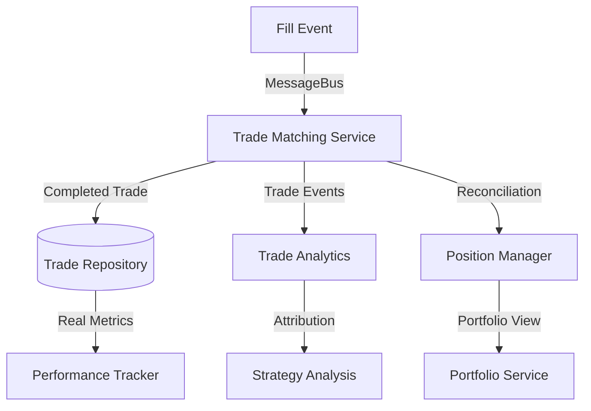

# Nautilus Trader: Position-Centric vs Trade-Centric Models

## Executive Summary

After deep research into Nautilus Trader's actual models and message system, I've discovered they follow a **position-centric approach** rather than trade-centric. They have no concept of "CompletedTrade" or "IncompleteTrade" - instead, they track **Positions** with sophisticated lifecycle events. This reveals both the strengths and fundamental limitations of their approach compared to a trade-matching system.

## Nautilus Trader's Position-Centric Architecture

### 1. Core Position Model (No Trade Concept)

**Real Position Implementation:**
```python
class Position:
    def apply_fill(self, fill: Fill) -> tuple[Decimal | None, Decimal]:
        """Apply fill and return (realized_pnl, new_avg_price)"""
        # Handles position updates but NO trade tracking
        
    def closing_order_side(self) -> OrderSide:
        """Returns the side needed to close this position"""
        
    @property
    def closing_order_id(self) -> OrderId | None:
        """ID of the order that closed this position"""
        
    @property
    def unrealized_pnl(self) -> Decimal | None:
        """Current unrealized PnL (None until realized PnL generated)"""
        
    def purge_events_for_order(self, order_id: OrderId):
        """Purge order events while maintaining audit trail"""
```

**Critical Finding**: Nautilus tracks **position-level changes** but has **no concept of individual trades**. When you buy 100, then buy 50, then sell 80, they see:
- Position: +150 → +70 (with some realized PnL)
- But they **cannot tell you** which specific 80 shares were sold

### 2. Position Lifecycle Events (Not Trade Events)

**Real Position Events:**
```python
# Position lifecycle events through MessageBus
def on_position_opened(self, event: PositionOpened):
    """Position moves from flat to non-zero"""
    
def on_position_changed(self, event: PositionChanged):
    """Position size/price changes (with realized PnL)"""
    
def on_position_closed(self, event: PositionClosed):
    """Position back to flat (final PnL calculation)"""

# Position event sequencing (they had to fix this)
class PositionEventSequencer:
    def ensure_position_opened_before_changed(self):
        """Fixed: PositionOpened must come before PositionChanged"""
        # They had bugs where PositionChanged events came 
        # without corresponding PositionOpened events
```

**Why This Matters**: Position events tell you about net position changes but **not about individual trade completions**. You can't answer:
- "What was my PnL on the trade I opened at 9:30 AM?"
- "How many trades did I complete today?"
- "What's my average winning trade duration?"

### 3. Fill vs Trade Distinction

**What Nautilus Has:**
```python
class Fill:
    """Individual execution of an order"""
    client_order_id: ClientOrderId
    venue_order_id: VenueOrderId
    trade_id: TradeId  # This is just a fill ID, NOT a round-trip trade!
    instrument_id: InstrumentId
    order_side: OrderSide
    quantity: Quantity
    price: Price
    liquidity_side: LiquiditySide
    
# Message system for fills
def on_order_filled(self, event: OrderFilled):
    """Process individual fill"""
    fill = event.fill
    # Updates position but doesn't complete "trades"
```

**What Nautilus is Missing:**
```python
# They have NO equivalent of this:
class CompletedTrade:
    """Round-trip entry + exit"""
    entry_fills: list[Fill]
    exit_fills: list[Fill]
    realized_pnl: Decimal
    duration: timedelta
    is_winner: bool
```

### 4. TradeReport vs Completed Trade

**Nautilus TradeReport (Confusing Name):**
```python
# From Binance Futures TradeReport (this is just a fill report)
class BinanceFuturesTradeReport:
    """This is NOT a completed trade - it's a fill/execution report"""
    def _assign_position_ids(self):
        """Fixed: Correctly assigns position IDs"""
        # They had bugs with position ID assignment in hedging mode
        
# Polymarket Trade Statuses (also just execution status)
class PolymarketTradeStatus:
    MATCHED = "matched"     # Trade matched and sent to executor
    MINED = "mined"         # Transaction mined into chain
    CONFIRMED = "confirmed"  # Achieved finality and was successful
    RETRYING = "retrying"   # Failed and being retried
    FAILED = "failed"       # Failed and not being retried
```

**Reality**: Their "TradeReport" is actually a **fill report** or **execution report**, not a completed round-trip trade.

### 5. Position Flip Logic (Complex Without Trade Tracking)

**Real Position Flip Handling:**
```python
class Position:
    def _handle_position_flip(self, fill: Fill):
        """Handle LONG->SHORT or SHORT->LONG transitions"""
        # Fixed multiple bugs here - position flips are complex!
        
        if fill.quantity >= self.quantity:
            # Complete close or flip
            realized_pnl = self._calculate_realized_pnl(self.quantity, fill.price)
            
            if fill.quantity > self.quantity:
                # Position flip - reset for new direction
                self._reset_for_flip(fill)
                
    def _calculate_realized_pnl_on_flip(self):
        """Fixed: PnL calculation for margin accounts when position flips"""
        # They had multiple bugs with flip PnL calculations
        # Different logic for cash vs margin accounts
```

**The Problem**: Position flips are extremely complex to handle correctly without trade-level tracking. They've had **multiple bug fixes** for position flip logic because they're trying to calculate PnL at the position level rather than matching individual trade components.

### 6. Message System Integration

**Position-Centric Message Flow:**
```mermaid
graph TB
    Fill[Fill Event] -->|MessageBus| Position[Position.apply_fill()]
    Position -->|PositionChanged| Portfolio
    Position -->|Realized PnL| Cache
    Position -->|Position Events| Strategy
    
    subgraph "What's Missing"
        Trade[CompletedTrade] -.->|Not Implemented| TradeRepo[(Trade Repository)]
        Trade -.->|Not Available| Analytics[Trade Analytics]
    end
```

**Real Message Patterns:**
```python
# How they handle fill-to-position updates
class ExecutionEngine:
    def _handle_order_filled(self, event: OrderFilled):
        """Process fill through position updates"""
        position = self._cache.position(event.position_id)
        
        if position:
            realized_pnl, new_avg_price = position.apply_fill(event.fill)
            
            # Publish position change (NOT trade completion)
            if realized_pnl:
                self._msgbus.publish(
                    "execution.position_changed",
                    PositionChanged(position_id=position.id, realized_pnl=realized_pnl)
                )
        
    # They have NO equivalent of:
    def _handle_trade_completed(self, trade: CompletedTrade):
        """This doesn't exist in Nautilus"""
        pass
```

### 7. Performance Metrics Limitations

**Position-Based Statistics (Misleading):**
```python
class WinRate(PortfolioStatistic):
    def calculate_from_realized_pnls(self, realized_pnls: pd.Series):
        """Calculate win rate from POSITION closures, not trades"""
        winners = [x for x in realized_pnls if x > 0.0]
        losers = [x for x in realized_pnls if x <= 0.0]
        return len(winners) / float(max(1, (len(winners) + len(losers))))

# This gives you:
# "65% of my position closures were profitable"
# NOT: "65% of my trades were profitable"
```

**What You Can't Calculate:**
```python
# These are impossible with Nautilus position-only model:
def calculate_trade_based_metrics():
    """All of these are impossible"""
    return {
        "average_winning_trade_duration": "IMPOSSIBLE",
        "number_of_completed_trades": "IMPOSSIBLE", 
        "trades_per_day": "IMPOSSIBLE",
        "average_fills_per_trade": "IMPOSSIBLE",
        "entry_vs_exit_slippage": "IMPOSSIBLE",
        "trade_signal_attribution": "IMPOSSIBLE"
    }
```

## Critical Limitations of Position-Only Model

### 1. Cannot Track Individual Trade Performance

**Scenario**: 
- 9:00 AM: Buy 100 shares @ $100
- 10:00 AM: Buy 50 shares @ $105  
- 11:00 AM: Sell 80 shares @ $110

**Nautilus Position Model:**
```python
# They see position changes:
# +100 @ $100 (Position opened)
# +150 @ $102 (Position changed - weighted average)
# +70 @ $102 (Position changed - some realized PnL)

# But they CANNOT answer:
# "Which 80 shares did I sell?"
# "What was the PnL on that specific trade?"
# "Was that a FIFO or LIFO sale?"
```

**Trade Matching Model (Our Approach):**
```python
# We can track individual trades:
Trade1: Buy 100 @ $100 → Sell 80 @ $110 = $800 profit (FIFO)
Remaining: 20 shares @ $100 + 50 shares @ $105 = 70 shares open
```

### 2. Misleading Performance Statistics

**Nautilus Problem:**
```python
# Scenario: Scale in/out strategy
# Day 1: Buy 100 @ $100
# Day 2: Buy 100 @ $102  
# Day 3: Buy 100 @ $104
# Day 4: Sell 300 @ $106

# Nautilus sees: 1 "winning position" with $600 profit
# Reality: This could be 3 separate trading decisions
```

**Trade-Level Reality:**
```python
# With trade matching:
# Trade 1: Buy 100 @ $100 → Sell 100 @ $106 = $600 profit
# Trade 2: Buy 100 @ $102 → Sell 100 @ $106 = $400 profit  
# Trade 3: Buy 100 @ $104 → Sell 100 @ $106 = $200 profit
# Total: 3 winning trades, average profit $400
```

### 3. Complex Position Flip Bugs

**Why Nautilus Has Position Flip Bugs:**
```python
# They've had to fix multiple position flip bugs because
# position-level accounting is complex:

"Fixed netted Position realized_pnl and realized_return fields"
"Fixed netted Position flip logic to correctly 'reset' the position"
"Fixed Position calculations when base currency == commission currency"
"Fixed PnL calculation for margin accounts when position flips"
```

**Root Cause**: Without trade-level tracking, position flips require complex accounting logic that's error-prone.

### 4. No Trade Attribution or Strategy Analysis

**Impossible with Position-Only Model:**
```python
# Questions Nautilus can't answer:
trades_by_signal = get_trades_by_entry_signal()  # Which signal generated which trade?
trades_by_time_of_day = get_trades_by_hour()     # Best time to trade?
trades_by_market_regime = get_trades_by_vix()    # Performance by market conditions?
partial_vs_single_fills = get_fill_complexity()  # How does execution quality vary?
```

## Memory Management Challenges

### Position Event Purging Complexity

**Real Nautilus Memory Management:**
```python
class LiveExecEngineConfig:
    # They need complex purging because position events accumulate
    purge_closed_positions_interval_mins: int = 10
    purge_closed_positions_buffer_mins: int = 60
    
    # Fixed: "Event purging edge cases for position data,
    # guaranteeing at least one event is always preserved"
    
class Position:
    def purge_events_for_order(self, order_id: OrderId):
        """Critical: Always keep at least one event for audit trail"""
        # They had bugs where purging all events broke reconciliation
```

**Why Complex**: Position events accumulate over time but you need to maintain audit trails for reconciliation. With trade-level tracking, completed trades can be safely archived.

## Message System Comparison

### Nautilus Position-Centric Events

**What They Publish:**
```python
# Position lifecycle events
"execution.position_opened"
"execution.position_changed"  
"execution.position_closed"

# Order execution events  
"execution.order_filled"
"execution.order_canceled"

# But NO trade completion events:
# "trading.trade_completed"     # Doesn't exist
# "trading.trade_opened"        # Doesn't exist
```

### Trade-Centric Events (Our Approach)

**What We Would Publish:**
```python
# Trade lifecycle events
"trade_matching.trade_opened"     # New position started
"trade_matching.trade_extended"   # Added to existing position  
"trade_matching.trade_completed"  # Full round-trip finished
"trade_matching.trade_partial"    # Partial position close

# Detailed trade information
"trade_matching.fill_matched"     # Fill matched to open trade
"trade_matching.reconciliation"   # State alignment events
```

## Architectural Insights for CyberDeltaEngine

### 1. Why We Need Trade-Level Tracking

**Position-Only Limitations:**
```python
# Nautilus approach - position changes only
def track_position_changes(fill: Fill):
    position = get_position(fill.symbol)
    realized_pnl, new_avg_price = position.apply_fill(fill)
    
    # Lost information:
    # - Which specific trade was completed?
    # - How long was that trade open?
    # - What was the signal attribution?
    # - How many fills were in that trade?
```

**Our Trade-Centric Approach:**
```python
# CyberDeltaEngine approach - track both
def track_trade_and_position(fill: Fill):
    # 1. Track individual trades
    completed_trade = trade_matcher.process_fill(fill)
    
    # 2. Update position (for portfolio/risk management)
    position = position_manager.update_from_fill(fill)
    
    # 3. Reconcile between the two
    if completed_trade:
        reconcile_trade_with_position(completed_trade, position)
```

### 2. Event-Driven Trade Completion

**Our Message Flow:**


### 3. Solve Nautilus Limitations

**Our Solutions:**
```python
class TradeMatchingService:
    def process_fill(self, fill: Fill) -> CompletedTrade | None:
        """Track individual trades AND update positions"""
        
        # Match fills to specific trades (FIFO/LIFO)
        completed_trade = self._match_fill_to_trades(fill)
        
        # Update position for portfolio management
        self._position_manager.update_from_fill(fill)
        
        # Publish trade-specific events
        if completed_trade:
            self._msgbus.publish("trade_matching.trade_completed", completed_trade)
            
        return completed_trade
        
    def get_trade_performance_metrics(self) -> dict:
        """Provide metrics impossible with position-only model"""
        return {
            "completed_trades_count": len(self._completed_trades),
            "average_trade_duration": self._calculate_avg_duration(),
            "win_rate_by_trade": self._calculate_trade_win_rate(),
            "average_fills_per_trade": self._calculate_fills_per_trade(),
            "trade_signal_attribution": self._analyze_signal_attribution()
        }
```

## Conclusion: Position-Centric vs Trade-Centric

### Nautilus Strengths (Position-Centric)
1. **Simple for Portfolio Management**: Easy to track current exposure
2. **Risk Management**: Good for position sizing and risk limits  
3. **Exchange Integration**: Matches how exchanges report positions
4. **Memory Efficient**: Fewer objects to track than individual trades

### Nautilus Limitations (Position-Only)
1. **No Trade Performance Analysis**: Can't analyze individual trade quality
2. **Misleading Metrics**: Win rates based on position closures, not trades
3. **Complex Position Flips**: Error-prone without trade-level matching
4. **No Strategy Attribution**: Can't trace trades back to signals
5. **Limited Analytics**: Can't optimize entry/exit techniques

### CyberDeltaEngine Advantage (Both Models)
1. **True Trade Performance**: Track individual round-trip trades
2. **Accurate Metrics**: Real win rates, trade duration, execution quality
3. **Strategy Attribution**: Link trades to signals and market conditions
4. **Position Management**: Still have position-level view for portfolio/risk
5. **Reconciliation**: Cross-check trade-level vs position-level data

**Key Insight**: Nautilus chose simplicity (position-only) but sacrificed trading intelligence. We're building both position AND trade tracking to get the best of both worlds - accurate portfolio management AND genuine trade performance analysis.

This is why our TradeMatchingService is fundamental - it fills the gap that Nautilus left unfilled.