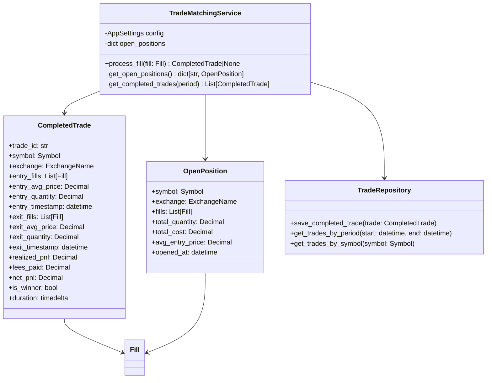
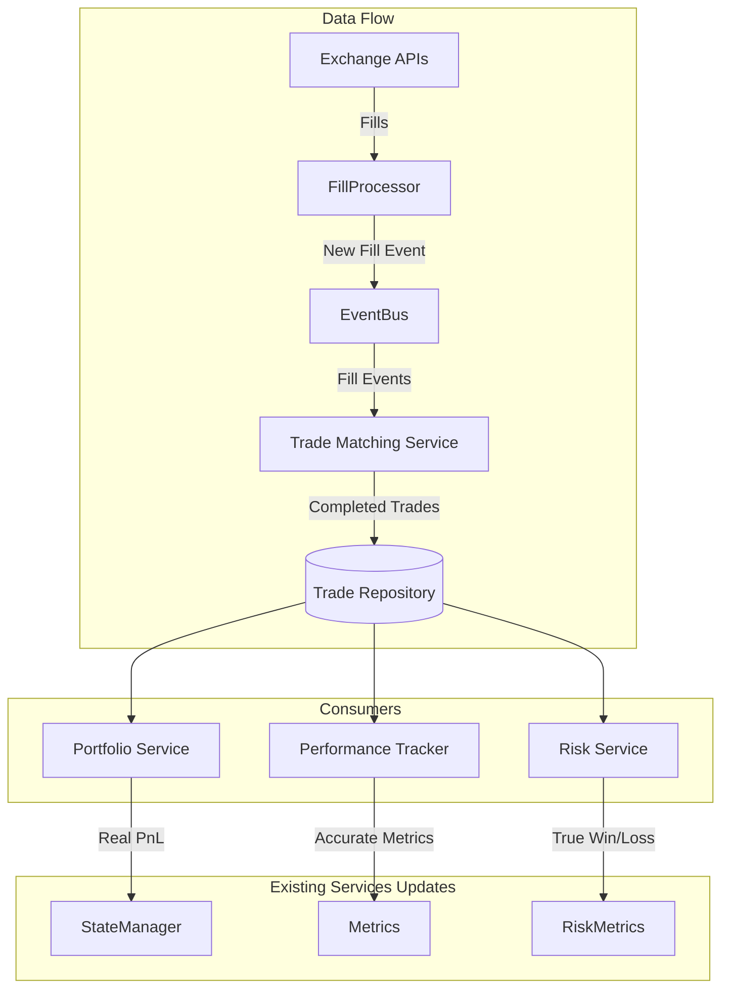
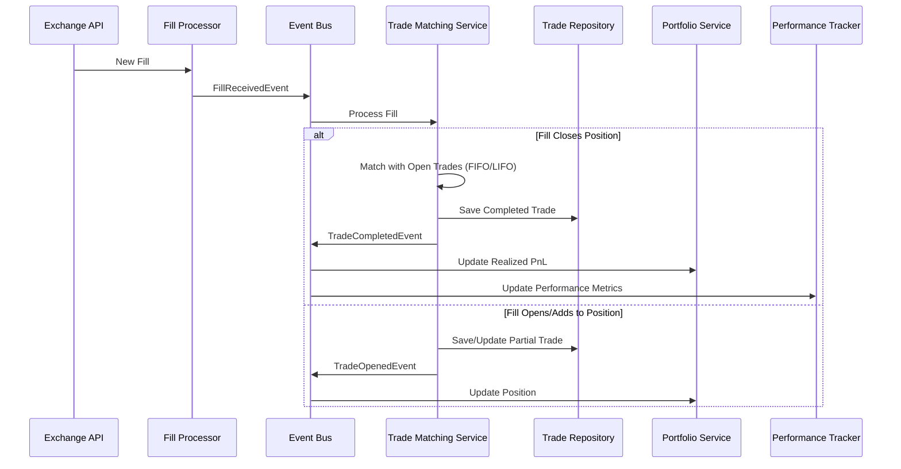
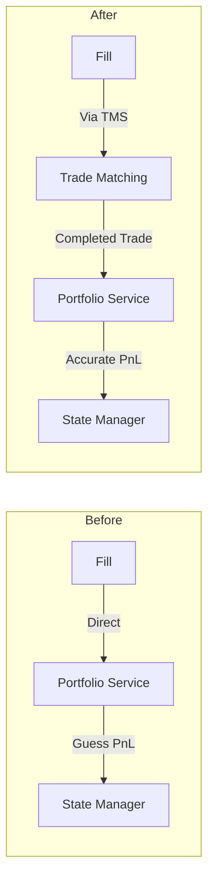

# Trade Matching Service Architecture

## Executive Summary

The CyberDeltaEngine currently lacks a fundamental component for tracking completed trades. This document outlines the architecture for a Trade Matching Service that will provide accurate PnL calculation and performance metrics across the entire trading system.

## Problem Statement

### Current Issues

1. **No Completed Trade Concept**: The system tracks Fills and Positions but has no model for completed round-trip trades
2. **Incorrect PnL Calculations**: Multiple services calculate PnL differently, with dangerous assumptions
3. **Misleading Performance Metrics**: Win/loss statistics based on individual fills, not actual trades
4. **Cannot Track Trading Performance**: Don't know which trades actually made or lost money

### Evidence from Codebase

```python
# From performance_tracker.py - DANGEROUS ASSUMPTION
fill_pnl = fill_value if fill.side == OrderSide.SELL else -fill_value
# Assumes all sells are wins, all buys are losses!

# Multiple inconsistent PnL calculations found:
- portfolio_service.py: _calculate_realized_pnl()
- state_manager.py: _calculate_realized_pnl()
- performance_tracker.py: _calculate_realized_pnl()
- fifo_calculator.py: calculate_realized_pnl_fifo()
```

## Proposed Architecture

### Core Components



### Integration Points



### Event Flow



## Implementation Plan

### Phase 1: Core Models and Service

#### 1.1 Create Trade Models
Location: `@cyberdelta/models/trading/`

```python
# completed_trade.py
from pydantic import BaseModel
from decimal import Decimal
from datetime import datetime, timedelta
from cyberdelta.symbols.models import Symbol
from cyberdelta.enums import ExchangeName
from cyberdelta.models.market.fill import Fill

class CompletedTrade(BaseModel):
    """Represents a completed round-trip trade."""
    
    # Identity
    trade_id: str
    symbol: Symbol
    exchange: ExchangeName
    
    # Entry (opening)
    entry_fills: list[Fill]
    entry_timestamp: datetime
    entry_avg_price: Decimal
    entry_quantity: Decimal
    entry_fees: Decimal
    
    # Exit (closing)
    exit_fills: list[Fill]
    exit_timestamp: datetime
    exit_avg_price: Decimal
    exit_quantity: Decimal
    exit_fees: Decimal
    
    # Calculated PnL
    realized_pnl: Decimal  # (exit_price - entry_price) * quantity
    net_pnl: Decimal  # realized_pnl - total_fees
    return_pct: Decimal
    duration: timedelta
    
    @property
    def is_winner(self) -> bool:
        """Trade is profitable after fees."""
        return self.net_pnl > Decimal(0)
```

#### 1.2 Create Trade Matching Service
Location: `@cyberdelta/domain/trading/trade_matching/`

```python
# trade_matching_service.py
from cyberdelta.config.models import AppSettings
from cyberdelta.models.trading.completed_trade import CompletedTrade
from cyberdelta.models.trading.open_position import OpenPosition
from cyberdelta.models.market.fill import Fill

class TradeMatchingService:
    """Simple FIFO trade matching for accurate PnL tracking."""
    
    def __init__(self, config: AppSettings):
        self.config = config
        # Track open positions in memory
        self._open_positions: dict[str, OpenPosition] = {}
        self._completed_trades: list[CompletedTrade] = []
        
    async def process_fill(self, fill: Fill) -> CompletedTrade | None:
        """Process a fill and return completed trade if position closes."""
        key = f"{fill.exchange.value}:{fill.symbol.value}"
        
        if self._is_opening_position(fill):
            # Add to or create open position
            if key not in self._open_positions:
                self._open_positions[key] = OpenPosition(
                    symbol=fill.symbol,
                    exchange=fill.exchange,
                    fills=[],
                    total_quantity=Decimal(0),
                    total_cost=Decimal(0)
                )
            
            position = self._open_positions[key]
            position.fills.append(fill)
            position.total_quantity += fill.quantity
            position.total_cost += (fill.quantity * fill.price) + fill.fee
            
            return None  # No completed trade yet
            
        else:  # Closing position
            if key not in self._open_positions:
                logger.warning(f"Closing fill without open position: {key}")
                return None
            
            position = self._open_positions[key]
            
            # Create completed trade
            completed_trade = self._create_completed_trade(position, fill)
            
            # Update or remove position
            if fill.quantity >= position.total_quantity:
                del self._open_positions[key]  # Position fully closed
            else:
                # Partial close - reduce position
                self._reduce_position(position, fill.quantity)
            
            self._completed_trades.append(completed_trade)
            return completed_trade
    
    def _is_opening_position(self, fill: Fill) -> bool:
        """Simple logic: BUY opens, SELL closes (for derivatives)."""
        # In reality, would check current position direction
        return fill.side == OrderSide.BUY
```

### Phase 2: Integration with Existing Services

#### 2.1 Update Portfolio Service



Changes needed in `portfolio_service.py`:
```python
# Before (current dangerous code)
def _calculate_realized_pnl(self, fill: Fill) -> Decimal:
    # Makes assumptions about PnL
    return fill.quantity * fill.price  # WRONG!

# After (using Trade Matching Service)
async def update_from_completed_trade(self, trade: CompletedTrade) -> None:
    """Update portfolio from a completed trade."""
    # Use actual calculated PnL from matched trades
    realized_pnl = trade.net_pnl  # Accurate!
    await self._state_manager.add_realized_pnl(realized_pnl)
```

#### 2.2 Fix Performance Tracker

Replace the broken `_calculate_trading_statistics`:
```python
# Current BROKEN implementation
async def _calculate_trading_statistics(self, period_start, period_end):
    fills = await self._get_fills_in_period(period_start, period_end)
    # WRONG: Assumes sells are wins, buys are losses
    fill_pnl = fill_value if fill.side == OrderSide.SELL else -fill_value

# New CORRECT implementation
async def _calculate_trading_statistics(self, period_start, period_end):
    # Get completed trades from repository
    trades = await self._trade_repository.get_trades_by_period(
        period_start, period_end
    )
    
    # Calculate REAL statistics
    winning_trades = [t for t in trades if t.is_winner]
    losing_trades = [t for t in trades if not t.is_winner]
    
    win_rate = len(winning_trades) / len(trades) * 100 if trades else 0
    average_win = sum(t.net_pnl for t in winning_trades) / len(winning_trades)
    average_loss = sum(t.net_pnl for t in losing_trades) / len(losing_trades)
    
    # These metrics are now ACCURATE!
```


## Configuration Requirements

Add to `@cyberdelta/config/models/financial_config.py`:
```python
class TradeMatchingConfig(BaseModel):
    """Configuration for trade matching."""
    
    enable_trade_matching: bool = Field(
        default=True,
        description="Enable trade matching for accurate PnL tracking"
    )
    
    matching_method: Literal["FIFO", "LIFO"] = Field(
        default="FIFO",
        description="Method for matching closing fills with open positions"
    )
    
    partial_fill_timeout_seconds: int = Field(
        default=86400,  # 24 hours
        description="Time before partial fills are considered separate trades"
    )
```

## Database Schema

```sql
-- Completed trades table (optional for persistence)
CREATE TABLE completed_trades (
    trade_id UUID PRIMARY KEY,
    symbol VARCHAR(50) NOT NULL,
    exchange VARCHAR(50) NOT NULL,
    entry_timestamp TIMESTAMP NOT NULL,
    exit_timestamp TIMESTAMP NOT NULL,
    entry_avg_price DECIMAL(20, 8) NOT NULL,
    exit_avg_price DECIMAL(20, 8) NOT NULL,
    quantity DECIMAL(20, 8) NOT NULL,
    realized_pnl DECIMAL(20, 8) NOT NULL,
    net_pnl DECIMAL(20, 8) NOT NULL,
    fees_paid DECIMAL(20, 8) NOT NULL,
    created_at TIMESTAMP DEFAULT CURRENT_TIMESTAMP,
    INDEX idx_symbol_exchange (symbol, exchange),
    INDEX idx_exit_timestamp (exit_timestamp),
    INDEX idx_net_pnl (net_pnl)  -- For finding winners/losers
);
```

## Testing Strategy

### Unit Tests
```python
# tests/unit/domain/trading/test_trade_matching_service.py
def test_fifo_matching():
    """Test FIFO trade matching."""
    # Buy 100 @ $100
    # Buy 50 @ $110
    # Sell 120 @ $115
    # Should match: 100 @ $100 and 20 @ $110
    
def test_lifo_matching():
    """Test LIFO trade matching."""
    # Buy 100 @ $100
    # Buy 50 @ $110
    # Sell 120 @ $115
    # Should match: 50 @ $110 and 70 @ $100
    
def test_partial_fill_aggregation():
    """Test aggregating multiple fills into single trade."""
    # Multiple small fills should aggregate into one trade
```

### Integration Tests
```python
# tests/integration/trading/test_trade_matching_integration.py
async def test_end_to_end_trade_flow():
    """Test complete trade flow from fill to completed trade."""
    # 1. Receive opening fills
    # 2. Receive closing fills
    # 3. Verify completed trade created
    # 4. Verify PnL calculated correctly
    # 5. Verify win/loss status correct
```

## Migration Strategy

### Step 1: Deploy in Shadow Mode
- Run Trade Matching Service alongside existing code
- Log discrepancies but don't use for production decisions
- Compare results with current (incorrect) calculations

### Step 2: Gradual Migration
1. Start with Performance Tracker (lowest risk)
2. Move to Portfolio Service realized PnL
3. Update Risk Service metrics

### Step 3: Full Cutover
- Switch all services to use Trade Matching Service
- Remove old PnL calculation code
- Archive old fill-based statistics

## Risk Analysis

### Risks
1. **Data Migration**: Historical trades need to be matched retroactively
2. **Performance Impact**: Matching algorithm must be efficient
3. **Accuracy**: Incorrect matching could affect PnL calculations

### Mitigations
1. **Backfill Process**: Create script to match historical fills
2. **In-Memory Tracking**: Keep open positions in memory for fast matching
3. **Validation**: Extensive testing with real trade data

## Success Metrics

1. **Accuracy**: 100% of trades correctly matched
2. **Performance**: < 10ms to match a fill
3. **Real Metrics**: Accurate win rate and average win/loss
4. **Reliability**: Zero trade matching errors in production

## Conclusion

The Trade Matching Service is a critical missing component that affects:
- **Financial accuracy**: Real PnL calculation from matched trades
- **Performance metrics**: Accurate win rate and average win/loss
- **Risk management**: True understanding of trading performance
- **Strategic decisions**: Real data for strategy optimization

Without this service, the trading engine is making dangerous assumptions:
- **Current**: "All SELLs are wins, all BUYs are losses" 
- **Reality**: Need to match entry and exit to know actual profit/loss

This must be implemented as a high-priority enhancement to ensure the trading engine knows which trades actually make money.

## Example Impact

### Current (WRONG) Metrics:
```python
# Based on counting SELLs as wins
Win Rate: 65%
Average Win: $500
Average Loss: $300
```

### Real Metrics (with Trade Matching):
```python
# Based on actual completed trades
Win Rate: 45%  # Lower but REAL
Average Win: $800  # Actual profit per winning trade
Average Loss: $600  # Actual loss per losing trade
```

**The difference completely changes trading decisions!**