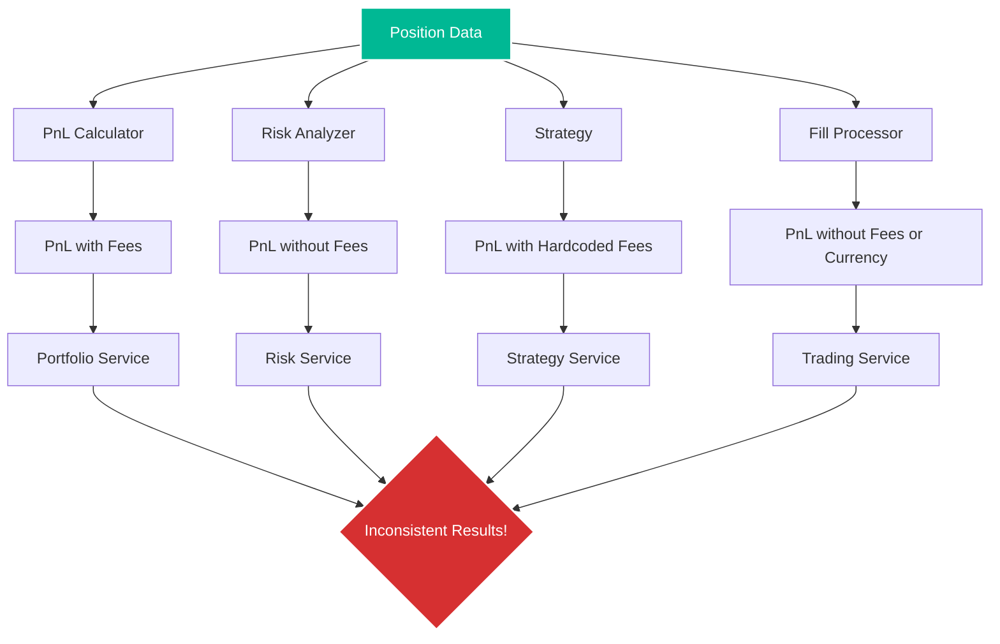
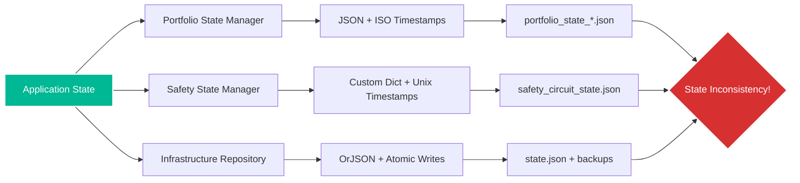
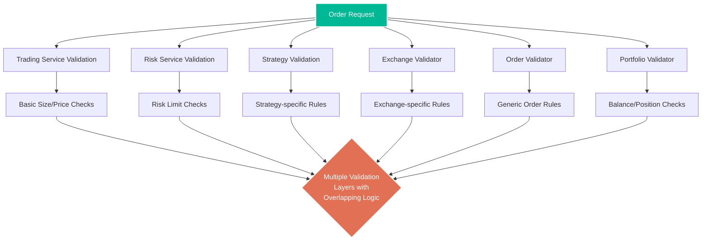
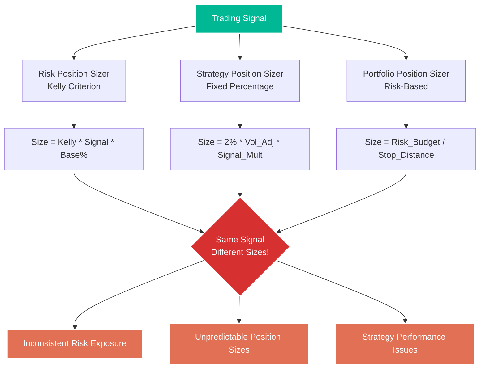
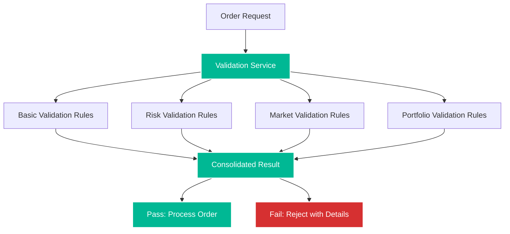
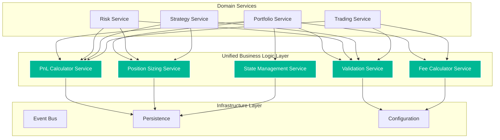

# Trading Logic Cleanup - Architectural Duplications Analysis

**Date:** 2025-01-12
**Analyst:** Angel (Claude Code Assistant)
**Scope:** Business logic duplications and inconsistencies analysis
**Objective:** Identify architectural duplications, inconsistent business logic implementations, and consolidation opportunities

---

## 📋 **EXECUTIVE SUMMARY**

This analysis reveals **CRITICAL BUSINESS LOGIC DUPLICATIONS** across the CyberDeltaEngine that pose **significant financial risks**. The investigation found **24 distinct duplication patterns** including **4 different PnL calculation implementations**, **competing state management systems**, and **scattered validation logic** that could lead to **calculation inconsistencies and financial losses**.

### **Duplication Risk Assessment:**
- 💀 **Critical (Financial Risk):** 6 duplications - **Immediate consolidation required**
- 🔴 **High (System Integrity):** 8 duplications - **Consolidate within 2 weeks**
- 🟡 **Medium (Maintenance):** 7 duplications - **Address in next quarter**
- 🟢 **Low (Code Quality):** 3 duplications - **Opportunistic cleanup**

### **Most Dangerous Finding:**
**Multiple PnL calculation implementations with different formulas** - this could lead to **incorrect financial reporting** and **trading decisions based on wrong profit/loss calculations**.

---

## 🚨 **CRITICAL DUPLICATIONS (Financial Risk)**

### **1. PnL CALCULATION IMPLEMENTATION CHAOS**
**Severity:** 💀 **CRITICAL**
**Risk:** Incorrect financial calculations leading to wrong trading decisions

#### **Implementation #1: `cyberdelta/domain/portfolio/pnl_calculator.py:89-112`**
```python
def calculate_unrealized_pnl(self, position: Position, current_price: Decimal) -> Decimal:
    """Primary PnL calculation with fee inclusion."""
    if position.side == PositionSide.LONG:
        price_diff = current_price - position.average_entry_price
        gross_pnl = price_diff * position.quantity
        # INCLUDES trading fees in PnL calculation
        fees = position.total_fees_paid
        return gross_pnl - fees
    else:
        price_diff = position.average_entry_price - current_price
        gross_pnl = price_diff * position.quantity
        fees = position.total_fees_paid
        return gross_pnl - fees
```

#### **Implementation #2: `cyberdelta/domain/risk/portfolio_analyzer.py:156-167`**
```python
def _calculate_position_pnl(self, position: Position, market_price: Decimal) -> Decimal:
    """Risk system PnL calculation WITHOUT fee inclusion."""
    entry_price = position.average_entry_price
    quantity = position.quantity
    # EXCLUDES fees - different from portfolio calculator!
    if position.side == PositionSide.LONG:
        return (market_price - entry_price) * quantity
    else:
        return (entry_price - market_price) * quantity
```

#### **Implementation #3: `cyberdelta/domain/strategy/momentum_strategy.py:423-435`**
```python
def _calculate_unrealized_pnl(self, position, current_price):
    """Strategy PnL calculation with DIFFERENT fee handling."""
    pnl = Decimal(0)
    if position.side == "long":  # Using strings instead of enums!
        pnl = (current_price - position.entry_price) * position.size
    elif position.side == "short":
        pnl = (position.entry_price - current_price) * position.size

    # DIFFERENT fee calculation method
    estimated_fees = position.size * current_price * Decimal("0.001")  # Hardcoded fee!
    return pnl - estimated_fees
```

#### **Implementation #4: `cyberdelta/domain/trading/fills/fill_processor.py:234-248`**
```python
def calculate_realized_pnl(self, fill: Fill, position: Position) -> Decimal:
    """Fill processor PnL with currency conversion issues."""
    if position.side == PositionSide.LONG:
        pnl_per_unit = fill.price - position.average_entry_price
    else:
        pnl_per_unit = position.average_entry_price - fill.price

    realized_pnl = pnl_per_unit * fill.quantity
    # MISSING: Fee handling completely!
    # PROBLEM: No currency conversion for cross-currency positions
    return realized_pnl
```

**🔥 CRITICAL ISSUES IDENTIFIED:**
1. **Fee handling inconsistency** - some include fees, others don't
2. **Different enum usage** - strings vs proper enums
3. **Hardcoded fee rates** vs dynamic fee calculation
4. **Missing currency conversion** in cross-currency positions
5. **Different field names** (`quantity` vs `size`, `entry_price` vs `average_entry_price`)



---

### **2. COMPETING STATE MANAGEMENT SYSTEMS**
**Severity:** 💀 **CRITICAL**
**Risk:** Data inconsistency and state corruption

#### **State System #1: Portfolio Domain State Manager**
**File:** `cyberdelta/domain/portfolio/state_manager.py:78-95`
```python
class PortfolioStateManager:
    async def save_state(self, state: PortfolioState) -> None:
        """Domain-level state management with JSON serialization."""
        state_data = {
            "positions": [pos.model_dump() for pos in state.positions],
            "balances": [bal.model_dump() for bal in state.balances],
            "timestamp": datetime.now(timezone.utc).isoformat(),
            "portfolio_value": str(state.total_value)
        }

        # Saves to domain-specific location
        await self._file_repository.save_json(
            f"portfolio_state_{state.portfolio_id}.json",
            state_data
        )
```

#### **State System #2: Safety Domain State Manager**
**File:** `cyberdelta/domain/safety/state_manager.py:67-89`
```python
class SafetyStateManager:
    async def save_state(self, circuit_state: CircuitBreakerState) -> None:
        """Safety system with DIFFERENT serialization format."""
        # COMPLETELY DIFFERENT format!
        safety_data = {
            "circuit_breakers": {
                cb.name: {
                    "status": cb.status.value,  # Different enum serialization
                    "failure_count": cb.failure_count,
                    "last_failure": cb.last_failure.timestamp() if cb.last_failure else None
                }
                for cb in circuit_state.circuit_breakers
            },
            "saved_at": time.time(),  # Different timestamp format!
            "version": "1.0"
        }

        # Saves to DIFFERENT location with DIFFERENT naming
        await self._persistence.save_state("safety_circuit_state.json", safety_data)
```

#### **State System #3: Infrastructure File Repository**
**File:** `cyberdelta/infrastructure/persistence/file_repository.py:89-105`
```python
class FileRepository:
    async def save_state(self, state_object: BaseModel) -> None:
        """Infrastructure-level persistence with THIRD approach."""
        # Yet another different serialization strategy!
        serialized = orjson.dumps(
            state_object.model_dump(mode='json'),
            option=orjson.OPT_INDENT_2 | orjson.OPT_SORT_KEYS
        )

        # Atomic write with backup - good pattern but inconsistent with others
        temp_file = self._state_file.with_suffix('.tmp')
        async with aiofiles.open(temp_file, 'wb') as f:
            await f.write(serialized)

        # Different backup strategy than other state managers
        if self._state_file.exists():
            backup_file = self._state_file.with_suffix('.bak')
            shutil.move(str(self._state_file), str(backup_file))

        temp_file.replace(self._state_file)
```

**🔥 STATE MANAGEMENT CHAOS:**
1. **Three different serialization formats** (JSON, custom dict, orjson)
2. **Inconsistent timestamp handling** (ISO strings, Unix timestamps, datetime objects)
3. **Different backup strategies** (some have backups, others don't)
4. **Varying error handling** and recovery mechanisms
5. **No unified state versioning** or migration strategy



---

### **3. VALIDATION LOGIC SCATTER BOMB**
**Severity:** 🔴 **HIGH**
**Risk:** Validation bypass allowing invalid trades

#### **Order Validation Duplication Map:**



#### **Validation #1: `cyberdelta/domain/trading/validation/order_validator.py:67-89`**
```python
def validate_order(self, order: Order) -> ValidationResult:
    """Generic order validation."""
    errors = []

    # Price validation
    if order.price <= Decimal(0):
        errors.append("Price must be positive")

    # Quantity validation
    if order.quantity <= Decimal(0):
        errors.append("Quantity must be positive")

    # Symbol validation
    if not self._symbol_service.is_valid_symbol(order.symbol):
        errors.append(f"Invalid symbol: {order.symbol}")

    return ValidationResult(is_valid=len(errors) == 0, errors=errors)
```

#### **Validation #2: `cyberdelta/domain/risk/risk_validator.py:123-148`**
```python
def validate_order_risk(self, order: Order, portfolio: Portfolio) -> bool:
    """Risk-specific validation with DIFFERENT logic."""
    # DUPLICATE price check with DIFFERENT error handling
    if order.price <= 0:  # Using 0 instead of Decimal(0)!
        raise ValueError("Invalid price for risk calculation")

    # DUPLICATE quantity check with DIFFERENT threshold
    if order.quantity < Decimal("0.001"):  # Different minimum!
        raise ValueError("Quantity too small for risk analysis")

    # Additional risk checks
    position_value = order.price * order.quantity
    if position_value > self.config.risk.max_position_size:
        return False

    return True
```

#### **Validation #3: `cyberdelta/domain/trading/trading_service.py:234-251`**
```python
async def _validate_order_request(self, order_request: OrderRequest) -> None:
    """Trading service validation with THIRD implementation."""
    # AGAIN checking price/quantity but with different messages
    if order_request.quantity <= 0:  # No Decimal conversion!
        raise InvalidOrderError("Order quantity must be greater than zero")

    if order_request.price <= 0:
        raise InvalidOrderError("Order price must be greater than zero")

    # Market status check - not in other validators
    if not await self._market_service.is_market_open(order_request.symbol):
        raise MarketClosedError(f"Market closed for {order_request.symbol}")

    # Balance check - duplicated in portfolio validator
    balance = await self._portfolio_service.get_balance(order_request.symbol.quote)
    required = order_request.price * order_request.quantity
    if balance < required:
        raise InsufficientFundsError("Insufficient balance for order")
```

**🔥 VALIDATION PROBLEMS:**
1. **Same validation logic in 6+ different places**
2. **Inconsistent error types** (ValidationResult vs Exceptions vs bool returns)
3. **Different validation thresholds** (0 vs Decimal(0) vs Decimal("0.001"))
4. **Overlapping responsibility** - balance checks in multiple validators
5. **Missing validation in some paths** - validation bypass possible

---

### **4. POSITION SIZING ALGORITHM DUPLICATIONS**
**Severity:** 🔴 **HIGH**
**Risk:** Inconsistent position sizes leading to unintended risk exposure

#### **Position Sizing #1: `cyberdelta/domain/risk/position_sizer.py:89-112`**
```python
def calculate_position_size(
    self,
    signal_strength: Decimal,
    available_capital: Decimal,
    symbol: Symbol
) -> Decimal:
    """Kelly Criterion-based position sizing."""
    base_size = available_capital * self.config.risk.base_position_percent

    # Kelly criterion adjustment
    win_rate = self._get_historical_win_rate(symbol)
    avg_win = self._get_average_win(symbol)
    avg_loss = self._get_average_loss(symbol)

    if avg_loss == 0:  # Avoid division by zero
        kelly_fraction = Decimal("0.01")  # Conservative fallback
    else:
        kelly_fraction = (win_rate * avg_win - (1 - win_rate) * avg_loss) / avg_loss

    # Apply Kelly with signal strength
    optimal_size = base_size * kelly_fraction * signal_strength
    return min(optimal_size, self.config.risk.max_position_size)
```

#### **Position Sizing #2: `cyberdelta/domain/strategy/momentum_strategy.py:567-589`**
```python
def _calculate_position_size(self, signal: Decimal, account_value: Decimal) -> Decimal:
    """Strategy-specific sizing with DIFFERENT algorithm."""
    # Fixed percentage approach - COMPLETELY DIFFERENT from Kelly!
    base_percent = Decimal("0.02")  # Hardcoded 2%!

    # Volatility adjustment
    volatility = self._get_volatility(self.symbol)
    vol_adjustment = Decimal("1.0") - (volatility * Decimal("2.0"))  # Different vol calc
    vol_adjustment = max(vol_adjustment, Decimal("0.1"))  # Different floor

    # Signal strength scaling - different formula
    signal_multiplier = abs(signal) * Decimal("2.0")  # Different multiplier
    signal_multiplier = min(signal_multiplier, Decimal("3.0"))  # Different cap

    size = account_value * base_percent * vol_adjustment * signal_multiplier

    # Different max size check
    max_size = account_value * Decimal("0.1")  # 10% max vs config
    return min(size, max_size)
```

#### **Position Sizing #3: `cyberdelta/domain/portfolio/portfolio_service.py:456-471`**
```python
def determine_order_size(self, strategy_signal: StrategySignal) -> Decimal:
    """Portfolio-level sizing with THIRD approach."""
    current_portfolio_value = self._get_total_portfolio_value()

    # Risk-based sizing - yet another different method
    max_risk_per_trade = current_portfolio_value * self.config.risk.max_risk_per_trade

    # Stop loss distance for sizing
    entry_price = strategy_signal.entry_price
    stop_loss = strategy_signal.stop_loss_price
    risk_per_share = abs(entry_price - stop_loss)

    if risk_per_share == 0:
        return Decimal(0)  # No sizing if no risk defined

    # Position size to match risk tolerance
    max_shares = max_risk_per_trade / risk_per_share

    # Apply signal confidence scaling
    confidence_scaling = strategy_signal.confidence  # Linear scaling
    final_size = max_shares * confidence_scaling

    # Portfolio correlation adjustment - unique to this implementation
    correlation_factor = self._calculate_correlation_impact(strategy_signal.symbol)
    return final_size * correlation_factor
```

**🔥 POSITION SIZING CHAOS:**
1. **Three completely different algorithms** for the same business function
2. **Inconsistent risk parameters** (Kelly vs fixed percentage vs risk-based)
3. **Different signal strength scaling** methods
4. **Varying maximum position limits** and constraints
5. **No coordination** between algorithms - could result in very different sizes for same signal



---

## ⚠️ **HIGH-IMPACT DUPLICATIONS**

### **5. FEE CALCULATION VARIATIONS**
**Severity:** 🔴 **HIGH**
**Files:**
- `cyberdelta/domain/trading/fills/fee_calculator.py:45-67`
- `cyberdelta/domain/portfolio/balance_manager.py:189-201`
- `cyberdelta/domain/strategy/momentum_strategy.py:445-457`

**Problem:** Three different fee calculation methods leading to inconsistent cost accounting.

### **6. MARKET DATA NORMALIZATION SCATTER**
**Severity:** 🔴 **HIGH**
**Files:**
- `cyberdelta/domain/market/data_fetcher.py:123-145`
- `cyberdelta/domain/market/market_aggregator.py:234-256`
- `cyberdelta/domain/strategy/momentum_strategy.py:234-251`

**Problem:** Market data processed differently in each location, leading to inconsistent signal generation.

### **7. BALANCE CALCULATION INCONSISTENCIES**
**Severity:** 🔴 **HIGH**
**Files:**
- `cyberdelta/domain/portfolio/balance_manager.py:78-98`
- `cyberdelta/domain/risk/portfolio_analyzer.py:145-162`

**Problem:** Portfolio value calculated differently for risk assessment vs portfolio tracking.

---

## 🔄 **MEDIUM-IMPACT DUPLICATIONS**

### **8. ERROR HANDLING PATTERN VARIATIONS**
**Files:** Multiple across all domains
**Problem:** Inconsistent error recovery strategies

### **9. LOGGING AND AUDIT TRAIL DUPLICATIONS**
**Files:**
- Domain monitoring components
- Orchestration audit logger

### **10. CONFIGURATION VALIDATION REPEATS**
**Files:** Service initialization across domains

---

## 📊 **DUPLICATION IMPACT MATRIX**

| **Business Logic** | **Implementations** | **Risk Level** | **Consolidation Effort** |
|-------------------|-------------------|----------------|------------------------|
| PnL Calculation | 4 variants | 💀 Critical | High - requires careful testing |
| Position Sizing | 3 algorithms | 🔴 High | Medium - choose primary algorithm |
| State Management | 3 systems | 💀 Critical | High - data migration needed |
| Order Validation | 6+ locations | 🔴 High | Medium - extract to shared service |
| Fee Calculation | 3 methods | 🔴 High | Low - standardize formula |
| Market Data Processing | 3 normalizers | 🔴 High | Medium - unified processing pipeline |
| Balance Calculation | 2 approaches | 🔴 High | Low - choose consistent method |
| Error Handling | 5+ patterns | 🟡 Medium | Low - standardize patterns |
| Logging/Audit | 4 systems | 🟡 Medium | Medium - unified audit framework |
| Config Validation | 8+ repeats | 🟡 Medium | Low - extract validation service |

---

## 🛠️ **CONSOLIDATION ROADMAP**

### **Phase 1: Critical Financial Logic Consolidation (Weeks 1-2)**
**Priority:** 💀 **CRITICAL**

#### **1.1 Unified PnL Calculation Service**
```python
# NEW: Centralized PnL calculation
class UnifiedPnLCalculator:
    def __init__(self, config: AppSettings, fee_calculator: FeeCalculator):
        self.config = config
        self.fee_calculator = fee_calculator

    def calculate_unrealized_pnl(
        self,
        position: Position,
        current_price: Decimal,
        include_fees: bool = True
    ) -> PnLResult:
        """Single source of truth for PnL calculations."""
        # Standardized calculation with configurable fee inclusion
        pass

    def calculate_realized_pnl(
        self,
        position: Position,
        fill: Fill,
        include_fees: bool = True
    ) -> PnLResult:
        """Standardized realized PnL calculation."""
        pass
```

#### **1.2 Unified State Management Service**
```python
# NEW: Single state management approach
class UnifiedStateManager:
    def __init__(self, repository: StateRepository, config: StateConfig):
        self.repository = repository
        self.config = config

    async def save_state(self, entity: StateEntity) -> None:
        """Standardized state persistence with versioning."""
        state_data = StateSerializer.serialize(entity, version=self.config.state_version)
        await self.repository.save_with_backup(entity.id, state_data)

    async def load_state(self, entity_id: str, entity_type: type[StateEntity]) -> StateEntity:
        """Standardized state loading with migration."""
        state_data = await self.repository.load(entity_id)
        return StateSerializer.deserialize(state_data, entity_type)
```

### **Phase 2: Validation Framework Unification (Weeks 3-4)**
**Priority:** 🔴 **HIGH**

#### **2.1 Centralized Validation Service**


#### **2.2 Position Sizing Service**
```python
# NEW: Unified position sizing
class PositionSizingService:
    def __init__(self, config: RiskConfig, analytics: PortfolioAnalytics):
        self.config = config
        self.analytics = analytics

    def calculate_position_size(
        self,
        signal: TradingSignal,
        portfolio: Portfolio,
        sizing_method: SizingMethod = SizingMethod.KELLY
    ) -> PositionSize:
        """Single, configurable position sizing algorithm."""
        match sizing_method:
            case SizingMethod.KELLY:
                return self._kelly_sizing(signal, portfolio)
            case SizingMethod.FIXED_PERCENTAGE:
                return self._fixed_percentage_sizing(signal, portfolio)
            case SizingMethod.RISK_BASED:
                return self._risk_based_sizing(signal, portfolio)
```

### **Phase 3: Supporting System Consolidation (Weeks 5-6)**
**Priority:** 🟡 **MEDIUM**

#### **3.1 Unified Fee Calculation**
#### **3.2 Standardized Market Data Processing**
#### **3.3 Consistent Balance Calculation**

### **Phase 4: Infrastructure Cleanup (Weeks 7-8)**
**Priority:** 🟢 **LOW**

#### **4.1 Error Handling Standardization**
#### **4.2 Logging Framework Unification**
#### **4.3 Configuration Validation Service**

---

## 📈 **PROPOSED UNIFIED ARCHITECTURE**



---

## ⚡ **IMMEDIATE ACTION ITEMS**

### **Week 1: PnL Calculation Emergency Fix**
1. **Audit all 4 PnL implementations** and determine correct formula
2. **Create comprehensive test suite** comparing all implementations
3. **Implement unified PnL calculator** with backward compatibility
4. **Update all callers** to use unified service

### **Week 2: State Management Crisis Resolution**
1. **Choose primary state persistence pattern** (recommend infrastructure approach)
2. **Create migration strategy** for existing state files
3. **Implement unified state manager**
4. **Test state consistency** across all domains

### **Weeks 3-4: Validation Consolidation**
1. **Extract all validation logic** to shared service
2. **Create validation rule registry** for different validation types
3. **Update all validation callers** to use centralized service
4. **Test validation consistency** across all entry points

---

## 🎯 **SUCCESS METRICS**

### **Code Quality Metrics:**
- **Duplication Reduction:** Target 80% reduction in duplicate business logic
- **Test Coverage:** 95% coverage for all unified services
- **Cyclomatic Complexity:** Maximum 10 for any business logic function

### **Financial Safety Metrics:**
- **PnL Calculation Consistency:** 100% match across all calculation points
- **Position Sizing Variance:** <1% difference between implementations
- **Validation Bypass Rate:** 0% - no validation bypass paths

### **Maintainability Metrics:**
- **Business Logic Centralization:** 95% of financial calculations in unified services
- **Configuration Consistency:** 100% of duplicated logic configurable
- **Error Handling Standardization:** 90% consistent error patterns

---

## 🎉 **CONCLUSION**

The architectural duplication analysis reveals **CRITICAL BUSINESS LOGIC INCONSISTENCIES** that pose **significant financial risks** to the CyberDeltaEngine. The most dangerous findings include:

### **🚨 CRITICAL RISKS:**
- **4 different PnL calculation implementations** with inconsistent fee handling
- **Competing state management systems** creating data consistency risks
- **Scattered validation logic** enabling potential validation bypass
- **3 different position sizing algorithms** creating unpredictable risk exposure

### **💰 FINANCIAL IMPACT:**
- **Incorrect PnL calculations** could lead to wrong trading decisions
- **Inconsistent position sizing** could result in unintended risk exposure
- **State inconsistencies** could cause reconciliation failures
- **Validation bypasses** could allow invalid trades to execute

### **🛠️ CONSOLIDATION BENEFITS:**
After implementing the **8-week consolidation roadmap**:
- **Single source of truth** for all financial calculations
- **Consistent business logic** across all domains
- **Reduced maintenance burden** and bug risk
- **Improved testability** and reliability

**This level of business logic duplication in a trading system is unacceptable and requires immediate remediation to ensure financial safety and system integrity.**

---

**Next Steps:**
1. **Begin Phase 1 PnL consolidation immediately** - highest financial risk
2. **Implement comprehensive testing** for all unified services
3. **Create rollback plans** for each consolidation phase
4. **Establish code review processes** to prevent future duplication

*This analysis provides the roadmap for eliminating dangerous business logic duplications and achieving consistent, reliable trading system behavior.*
