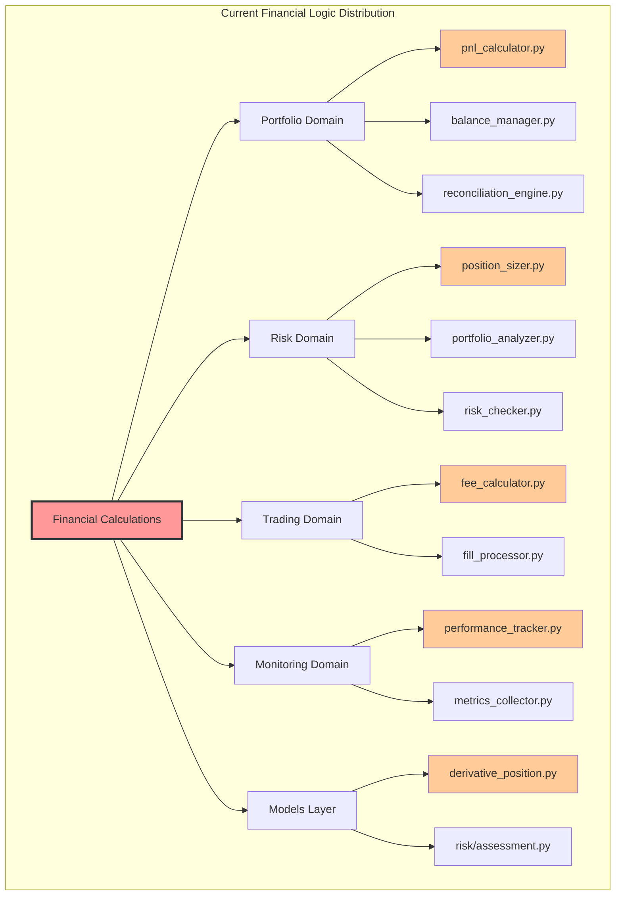
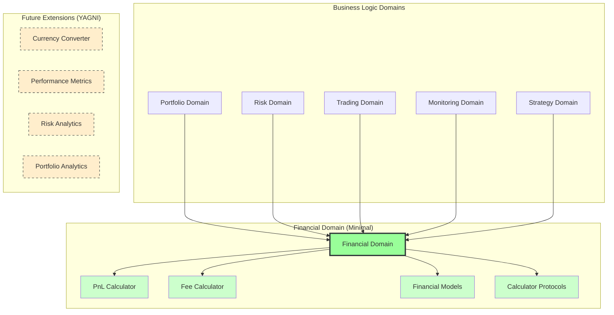
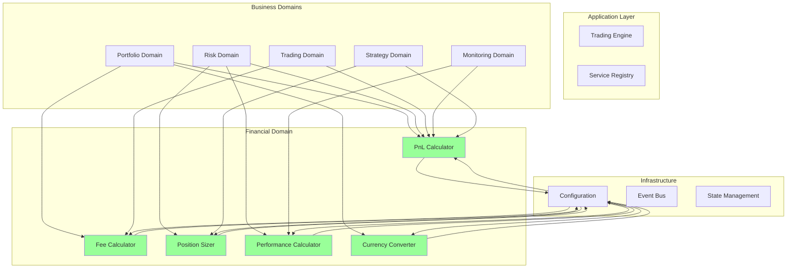
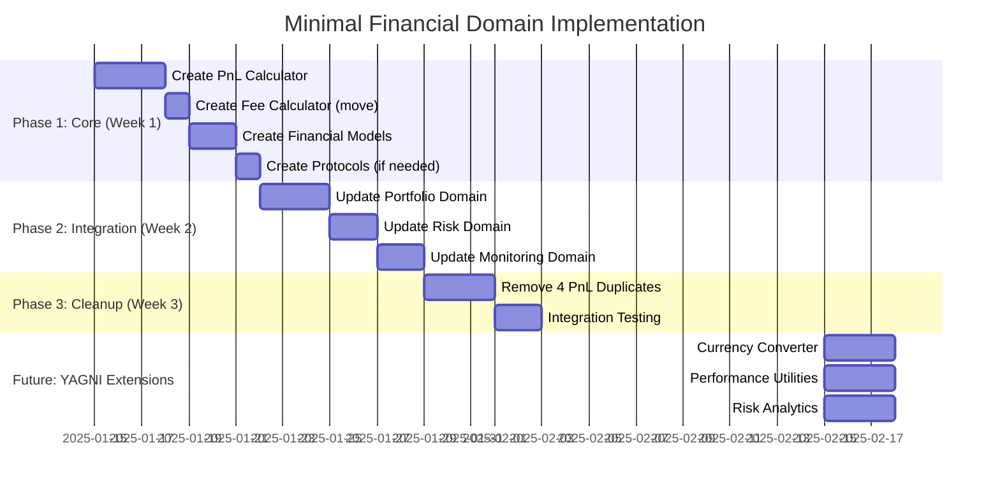
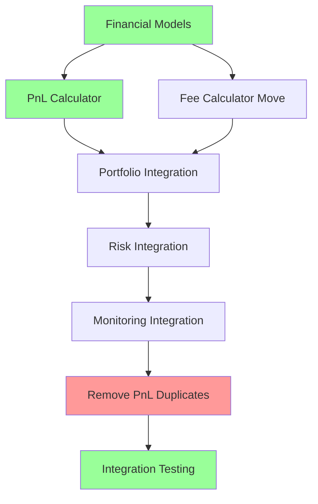
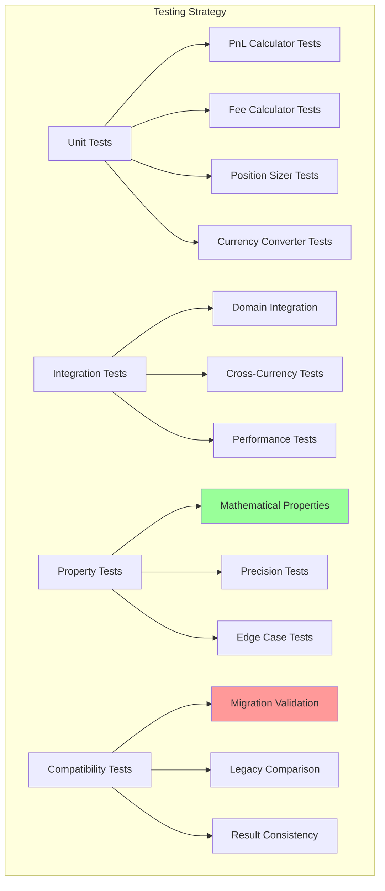

# Financial Module Architecture Plan

**Date:** 2025-01-13
**Status:** Comprehensive Design Plan
**Priority:** 💀 Critical - Financial Calculation Consolidation

---

## 🎯 **Critical Clarification: Domain Responsibilities**

**IMPORTANT:** The financial domain is a **utility layer** for pure mathematical calculations only. It does NOT replace the business logic domains:

### Financial Domain: **Pure Mathematical Calculations**
- PnL computation (given position + price → PnL result)
- Fee calculation (given trade parameters → fee amount)  
- Currency conversion (amount in currency A → amount in currency B)
- Performance metrics (given trade history → Sharpe ratio, drawdown, etc.)
- Position sizing formulas (given risk parameters → position size)

### Risk Domain: **Business Logic & Decision-Making** 
- **Risk assessment** - "Should we take this trade?"
- **Limit checking** - "Does this violate our risk limits?"
- **Exposure management** - "How much total exposure do we have?"
- **Risk constraint application** - "What constraints should we apply?"
- **Circuit breakers** - "Should we halt trading?"

### Portfolio Domain: **State Management & Orchestration**
- **Position tracking** - "What positions do we currently have?"
- **State persistence** - "Save/load portfolio state"
- **Reconciliation** - "Do our records match the exchange?"
- **Trade lifecycle management** - "Process this fill and update positions"
- **Portfolio-level operations** - "Get total portfolio value"

### Example Flow:
```
Portfolio Domain: "I need to check if this trade is allowed"
    ↓
Risk Domain: "Let me assess this trade"
    ↓ (calls)
Financial Domain: "Calculate position size with these parameters"
    ↓ (returns calculated size)
Risk Domain: "Size looks good, but check exposure limits"
    ↓ (calls)  
Financial Domain: "Calculate current portfolio exposure"
    ↓ (returns exposure amount)
Risk Domain: "Exposure is within limits, trade approved"
    ↓ (returns approval)
Portfolio Domain: "Process the approved trade"
```

The financial domain provides **calculation services** that the business domains use to make **decisions**.

---

## Executive Summary

Based on deep analysis of the CyberDeltaEngine codebase, this document presents a comprehensive plan to create a unified `financial` domain module that consolidates all financial calculations, eliminates duplications, and provides a single source of truth for monetary operations.

---

## Current Financial Logic Landscape

### Business Logic Distribution Analysis

After researching the codebase, financial logic is currently scattered across:



### Key Financial Calculations Identified

1. **PnL Calculations** (4 implementations)
   - DerivativePosition.calculate_unrealized_pnl()
   - PortfolioStateManager._calculate_realized_pnl()
   - PerformanceTracker._calculate_pnl methods
   - PnLCalculator (comprehensive)

2. **Fee Calculations**
   - FeeCalculator.calculate_fee() in trading domain
   - Various fee handling in fill processors

3. **Position Sizing**
   - PositionSizer.calculate_position_size() in risk domain
   - Kelly criterion and fixed fraction methods

4. **Performance Metrics**
   - PerformanceTracker with 15+ financial metrics
   - Sharpe, Sortino, drawdown calculations

5. **Risk Assessment**
   - Portfolio value calculations
   - Exposure calculations
   - VaR-like calculations in risk checker

---

## Proposed Financial Domain Architecture

### Minimal Financial Domain Architecture



### Minimal Directory Structure (Following CLAUDE.md)

```
cyberdelta/domain/financial/
├── __init__.py
├── pnl_calculator.py              # Unified PnL calculations (replaces 4 duplicates)
└── fee_calculator.py              # Move existing from trading/fills/

cyberdelta/models/financial/
├── __init__.py
├── pnl_result.py                  # PnLResult model
├── fee_result.py                  # FeeResult model
└── currency_amount.py             # CurrencyAmount model

cyberdelta/protocols/financial/
├── __init__.py
├── pnl_calculator.py              # PnLCalculatorProtocol
└── fee_calculator.py              # FeeCalculatorProtocol
```

**Note:** Configuration already implemented in `cyberdelta/config/models/financial_config.py`

### Future Possibilities (YAGNI - Add Only When Needed)

```
cyberdelta/domain/financial/
├── currency_converter.py          # When multi-currency support needed
├── metrics/
│   ├── performance_calculator.py  # If monitoring domain gets too complex
│   └── risk_metrics.py           # If risk domain needs calculation utilities
└── analytics/
    ├── portfolio_analytics.py    # If portfolio domain needs calculation utilities
    └── exposure_calculator.py    # If exposure calculations become complex
```

**Philosophy:** Start minimal, add complexity only when business logic domains become unwieldy or when we find actual duplications.

---

## Core Components Design (Minimal Scope)

### Problem Statement
**Current Issue:** 4 different PnL calculation implementations scattered across domains:
1. `DerivativePosition.calculate_unrealized_pnl()` 
2. `PortfolioStateManager._calculate_realized_pnl()`
3. `PerformanceTracker._calculate_pnl methods`
4. `PnLCalculator` (comprehensive)

**Goal:** Replace with 1 unified, configuration-driven implementation.

### 1. Unified PnL Calculator (Solves Real Problem)

```python
# cyberdelta/domain/financial/pnl_calculator.py
from decimal import Decimal
from typing import Protocol
from datetime import datetime

from cyberdelta.config.models import AppSettings
from cyberdelta.models import Position, Fill
from cyberdelta.models.financial import PnLResult
from cyberdelta.protocols.financial import FeeCalculatorProtocol

class PnLCalculator:
    """Single source of truth for ALL PnL calculations in the system.
    
    Replaces:
    - DerivativePosition.calculate_unrealized_pnl()
    - PortfolioStateManager._calculate_realized_pnl()
    - PerformanceTracker._calculate_pnl methods
    - Current PnLCalculator in portfolio domain
    
    Configuration-driven approach following CODING_STANDARDS.md:
    - All parameters from AppSettings
    - Configurable fee inclusion
    - Multiple calculation methods
    - Currency-aware calculations
    """
    
    def __init__(
        self,
        config: AppSettings,
        fee_calculator: FeeCalculatorProtocol,
        currency_converter: CurrencyConverterProtocol,
    ):
        self.config = config
        self._fee_calc = fee_calculator
        self._currency_conv = currency_converter
        
        # Cache financial calculation settings
        self._financial_config = config.financial
        self._include_fees = self._financial_config.include_fees_in_pnl
        self._base_currency = self._financial_config.base_currency
        self._calculation_precision = self._financial_config.calculation_precision
        
    def calculate_unrealized_pnl(
        self,
        position: Position,
        mark_price: Decimal,
        include_fees: bool | None = None,
        target_currency: str | None = None
    ) -> PnLResult:
        """Calculate unrealized PnL with full configuration support.
        
        Args:
            position: Position to calculate PnL for
            mark_price: Current market price
            include_fees: Override config default for fee inclusion
            target_currency: Target currency for result (uses base if None)
            
        Returns:
            PnLResult with amount, currency, and calculation metadata
        """
        # Use config default if not specified
        include_fees = include_fees if include_fees is not None else self._include_fees
        target_currency = target_currency or self._base_currency
        
        # Validate inputs
        if position.size == Decimal(0) or not position.entry_price:
            return PnLResult(
                amount=Decimal(0),
                currency=target_currency,
                includes_fees=include_fees,
                calculation_method="zero_position"
            )
            
        # Calculate base PnL
        size_abs = abs(position.size)
        if position.side == OrderSide.BUY:
            gross_pnl = size_abs * (mark_price - position.entry_price)
        else:
            gross_pnl = size_abs * (position.entry_price - mark_price)
            
        # Apply fees if configured
        net_pnl = gross_pnl
        fees_amount = Decimal(0)
        if include_fees and hasattr(position, 'total_fees'):
            fees_amount = position.total_fees or Decimal(0)
            net_pnl = gross_pnl - fees_amount
            
        # Convert to target currency if needed
        if position.quote_currency != target_currency:
            net_pnl = self._currency_conv.convert(
                CurrencyAmount(net_pnl, position.quote_currency),
                target_currency
            ).amount
            
        return PnLResult(
            amount=net_pnl,
            currency=target_currency,
            gross_amount=gross_pnl,
            fees_amount=fees_amount,
            includes_fees=include_fees,
            calculation_method="mark_to_market",
            calculation_timestamp=datetime.utcnow()
        )
        
    def calculate_realized_pnl(
        self,
        position: Position,
        fill: Fill,
        include_fees: bool | None = None,
        target_currency: str | None = None
    ) -> PnLResult:
        """Calculate realized PnL for position closing fill."""
        # Similar implementation with realized PnL logic
        pass
        
    def calculate_portfolio_pnl(
        self,
        positions: list[Position],
        mark_prices: dict[str, Decimal],
        include_fees: bool | None = None
    ) -> PnLResult:
        """Calculate total portfolio PnL across all positions."""
        pass
```

### 2. Financial Models (Type Safety - Following CLAUDE.md)

```python
# cyberdelta/models/financial/pnl_result.py
from decimal import Decimal
from datetime import datetime
from typing import Optional
from pydantic import BaseModel, Field

class PnLResult(BaseModel):
    """Comprehensive PnL calculation result."""
    
    amount: Decimal = Field(description="Net PnL amount")
    currency: str = Field(description="Currency of the result")
    gross_amount: Optional[Decimal] = Field(None, description="PnL before fees")
    fees_amount: Optional[Decimal] = Field(None, description="Fees included/excluded")
    includes_fees: bool = Field(description="Whether fees are included in amount")
    calculation_method: str = Field(description="Method used for calculation")
    calculation_timestamp: datetime = Field(description="When calculation was performed")
    
    @property
    def is_profitable(self) -> bool:
        """Check if PnL is profitable."""
        return self.amount > Decimal(0)
        
    def to_currency(self, target_currency: str, converter) -> "PnLResult":
        """Convert result to different currency."""
        # Implementation for currency conversion
        pass

class CurrencyAmount(BaseModel):
    """Type-safe currency amount."""
    
    amount: Decimal
    currency: str
    precision: Optional[int] = None
    
    def __add__(self, other: "CurrencyAmount") -> "CurrencyAmount":
        if self.currency != other.currency:
            raise ValueError(f"Cannot add {self.currency} and {other.currency}")
        return CurrencyAmount(
            amount=self.amount + other.amount,
            currency=self.currency
        )
        
    def __sub__(self, other: "CurrencyAmount") -> "CurrencyAmount":
        if self.currency != other.currency:
            raise ValueError(f"Cannot subtract {other.currency} from {self.currency}")
        return CurrencyAmount(
            amount=self.amount - other.amount,
            currency=self.currency
        )
```

### 3. Calculator Protocols (Interface Consistency - Following CLAUDE.md)

```python  
# cyberdelta/protocols/financial/pnl_calculator.py
from decimal import Decimal
from typing import Protocol
from cyberdelta.models import Position, Fill
from cyberdelta.models.financial import PnLResult, FeeResult

class PnLCalculatorProtocol(Protocol):
    """Protocol for PnL calculation implementations."""
    
    def calculate_unrealized_pnl(
        self,
        position: Position,
        mark_price: Decimal,
        include_fees: bool | None = None,
        target_currency: str | None = None
    ) -> PnLResult:
        """Calculate unrealized PnL for a position."""
        ...
        
    def calculate_realized_pnl(
        self,
        position: Position,
        fill: Fill,
        include_fees: bool | None = None,
        target_currency: str | None = None
    ) -> PnLResult:
        """Calculate realized PnL for position closing fill."""
        ...

class FeeCalculatorProtocol(Protocol):
    """Protocol for fee calculation implementations."""
    
    def calculate_fee(
        self,
        fill: Fill,
        exchange_config: dict,
    ) -> FeeResult:
        """Calculate fees for a fill."""
        ...
```

### 4. Financial Configuration (Already Implemented)

```python
# Already implemented in cyberdelta/config/models/financial_config.py
from decimal import Decimal
from typing import Literal
from pydantic import BaseModel, Field

# Configuration for financial calculations - already implemented
# See: cyberdelta/config/models/financial_config.py

# Key settings:
# - include_fees_in_pnl: bool 
# - pnl_calculation_method: "mark_to_market" | "fifo" | "lifo"
# - base_currency: str
# - calculation_precision: int
# - fee_calculation_method: "exchange_reported" | "estimated"
```

---

## Integration with Existing Domains

### Domain Interaction Diagram



### Service Injection Pattern

```python
# Example: Portfolio Service using Financial Domain
class PortfolioService:
    def __init__(
        self,
        config: AppSettings,
        pnl_calculator: PnLCalculator,           # Injected from financial domain
        fee_calculator: FeeCalculator,           # Injected from financial domain
        currency_converter: CurrencyConverter,   # Injected from financial domain
        state_manager: PortfolioStateManager,
        event_bus: EventBus,
    ):
        self.config = config
        self._pnl_calc = pnl_calculator
        self._fee_calc = fee_calculator
        self._currency_conv = currency_converter
        self._state_manager = state_manager
        self._event_bus = event_bus
        
    async def get_portfolio_pnl(self) -> PnLResult:
        """Get total portfolio PnL using unified calculator."""
        portfolio_state = await self._state_manager.get_state()
        mark_prices = await self._get_current_mark_prices()
        
        return self._pnl_calc.calculate_portfolio_pnl(
            positions=portfolio_state.positions,
            mark_prices=mark_prices,
            include_fees=True  # Or from config
        )
        
    async def process_fill(self, fill: Fill) -> None:
        """Process fill with unified fee calculation."""
        # Calculate fees using financial domain
        fee_result = self._fee_calc.calculate_fee(
            fill=fill,
            exchange_config=self.config.exchanges[fill.exchange]
        )
        
        # Update position with calculated fees
        await self._update_position_with_fill(fill, fee_result)
```

---

## Minimal Implementation Strategy

### Phase 1: Core Problem Solving (Week 1)



### Implementation Dependencies (Minimal)



### Minimal Implementation Scope

#### Week 1: Core Implementation (Following CLAUDE.md Architecture)

```python
# cyberdelta/domain/financial/__init__.py
"""Minimal financial calculation utilities.

Solves the immediate problem: 4 duplicate PnL implementations.
"""

from cyberdelta.domain.financial.pnl_calculator import PnLCalculator
from cyberdelta.domain.financial.fee_calculator import FeeCalculator

__all__ = [
    "PnLCalculator",    # Replaces 4 duplicate implementations
    "FeeCalculator",    # Moved from trading domain
]
```

```python
# cyberdelta/models/financial/__init__.py
"""Financial domain models following CLAUDE.md architecture."""

from cyberdelta.models.financial.pnl_result import PnLResult
from cyberdelta.models.financial.fee_result import FeeResult
from cyberdelta.models.financial.currency_amount import CurrencyAmount

__all__ = [
    "PnLResult",
    "FeeResult", 
    "CurrencyAmount",
]
```

```python
# cyberdelta/protocols/financial/__init__.py
"""Financial domain protocols following CLAUDE.md architecture."""

from cyberdelta.protocols.financial.pnl_calculator import PnLCalculatorProtocol
from cyberdelta.protocols.financial.fee_calculator import FeeCalculatorProtocol

__all__ = [
    "PnLCalculatorProtocol",
    "FeeCalculatorProtocol",
]
```

#### Actual Files to Create:

**Domain (Business Logic):**
1. **`cyberdelta/domain/financial/pnl_calculator.py`** - Unified implementation
2. **`cyberdelta/domain/financial/fee_calculator.py`** - Move existing

**Models (Following CLAUDE.md):**
3. **`cyberdelta/models/financial/pnl_result.py`** - PnLResult model
4. **`cyberdelta/models/financial/fee_result.py`** - FeeResult model  
5. **`cyberdelta/models/financial/currency_amount.py`** - CurrencyAmount model

**Protocols (Following CLAUDE.md):**
6. **`cyberdelta/protocols/financial/pnl_calculator.py`** - PnLCalculatorProtocol
7. **`cyberdelta/protocols/financial/fee_calculator.py`** - FeeCalculatorProtocol

**Configuration:** Already implemented in `cyberdelta/config/models/financial_config.py`

---

## Testing Strategy

### Financial Domain Testing Architecture



### Critical Test Cases

```python
# tests/unit/domain/financial/test_pnl_calculator.py
import pytest
from decimal import Decimal
from cyberdelta.domain.financial import PnLCalculator, PnLResult

class TestPnLCalculator:
    """Test unified PnL calculator against all legacy implementations."""
    
    @pytest.mark.parametrize("include_fees", [True, False])
    @pytest.mark.parametrize("position_side", [OrderSide.BUY, OrderSide.SELL])
    def test_unrealized_pnl_consistency(self, include_fees, position_side):
        """Ensure new calculator matches legacy implementations."""
        # Test that unified calculator returns same results as:
        # 1. DerivativePosition.calculate_unrealized_pnl()
        # 2. PerformanceTracker calculations
        # 3. Current PnLCalculator
        pass
        
    def test_cross_currency_pnl(self):
        """Test PnL calculation across different currencies."""
        # Position in BTC/USDC, report in USD
        pass
        
    def test_precision_handling(self):
        """Test decimal precision is maintained in calculations."""
        pass
        
    @pytest.mark.property_test
    def test_pnl_mathematical_properties(self):
        """Property-based testing for mathematical correctness."""
        # Properties:
        # - PnL(entry_price, entry_price) == 0
        # - PnL(long) == -PnL(short) for same price movement
        # - PnL linearity with position size
        pass

# tests/integration/financial/test_migration_compatibility.py
class TestMigrationCompatibility:
    """Ensure financial domain migration maintains compatibility."""
    
    async def test_portfolio_service_compatibility(self):
        """Test portfolio service works with new financial domain."""
        pass
        
    async def test_risk_service_compatibility(self):
        """Test risk service works with new financial domain."""
        pass
        
    async def test_performance_consistency(self):
        """Test performance metrics remain consistent after migration."""
        pass
```

---

## Risk Assessment & Mitigation

### Migration Risks

| Risk | Probability | Impact | Mitigation |
|------|-------------|--------|------------|
| Calculation Discrepancies | High | Critical | Parallel testing, gradual rollout |
| Performance Degradation | Medium | High | Benchmarking, optimization |
| Breaking Changes | Medium | High | Backward compatibility layer |
| Integration Complexity | High | Medium | Phased migration, clear interfaces |

### Rollback Strategy

```python
# Backward compatibility during migration
class CompatibilityPnLCalculator:
    """Temporary compatibility layer during migration."""
    
    def __init__(self, legacy_calc, unified_calc, use_legacy: bool = True):
        self._legacy = legacy_calc
        self._unified = unified_calc
        self._use_legacy = use_legacy
        
    def calculate_unrealized_pnl(self, *args, **kwargs):
        if self._use_legacy:
            return self._legacy.calculate_unrealized_pnl(*args, **kwargs)
        else:
            result = self._unified.calculate_unrealized_pnl(*args, **kwargs)
            return result.amount  # Convert to legacy format
```

---

## Success Metrics

### Technical Metrics

- [ ] **Code Duplication**: Reduce financial calculation duplications by 90%
- [ ] **Test Coverage**: Achieve 95% coverage for financial domain
- [ ] **Performance**: Financial calculations <10ms 99th percentile
- [ ] **Type Safety**: 100% type-safe financial operations

### Business Metrics

- [ ] **Calculation Consistency**: 100% consistency across all PnL calculations
- [ ] **Currency Support**: Support for 5+ currencies with conversion
- [ ] **Configuration Coverage**: 100% of financial calculations configurable
- [ ] **Error Reduction**: 80% reduction in financial calculation errors

### Operational Metrics

- [ ] **Migration Success**: Zero data loss during migration
- [ ] **Compatibility**: 100% backward compatibility during transition
- [ ] **Documentation**: Complete API documentation and examples
- [ ] **Team Adoption**: All domains using financial domain within 6 weeks

---

## Conclusion

The proposed financial domain represents a comprehensive solution to the current financial calculation chaos in CyberDeltaEngine. By consolidating all financial logic into a dedicated domain with:

1. **Single Source of Truth**: One place for all financial calculations
2. **Configuration-Driven**: All parameters from AppSettings
3. **Type-Safe**: Proper currency handling and precision management
4. **Extensible**: Easy to add new financial calculations
5. **Testable**: Comprehensive testing strategy
6. **Maintainable**: Clean architecture with clear boundaries

The financial domain will eliminate the dangerous inconsistencies that currently exist and provide a solid foundation for sophisticated financial operations in the trading engine.

**Next Steps:**
1. Stakeholder approval for architectural approach
2. Begin Phase 1 implementation (foundation setup)
3. Establish migration timeline and resources
4. Set up monitoring for migration progress

This architecture ensures that CyberDeltaEngine will have reliable, consistent, and maintainable financial calculations suitable for a production trading system handling real money.

---

## Appendix: Why Financial Calculator Protocols Are Necessary

### Real-World Use Cases for Calculator Protocols

#### 1. **Exchange-Specific Fee Calculation**
Different exchanges have wildly different fee structures:

```python
class BinanceFeeCalculator:
    def calculate_fee(self, fill: Fill) -> FeeResult:
        # Binance: Maker/taker rates, BNB discounts, VIP tiers
        
class HyperliquidFeeCalculator:
    def calculate_fee(self, fill: Fill) -> FeeResult:
        # Hyperliquid: Different fee structure, referral rebates
        
class BackpackFeeCalculator:
    def calculate_fee(self, fill: Fill) -> FeeResult:
        # Backpack: Their own unique fee model
```

**Without protocol:** Each domain would need to know about all calculators
**With protocol:** Domain just uses `FeeCalculatorProtocol`, factory provides the right one

#### 2. **Multi-Method PnL Calculation**
Different accounting methods for realized PnL:

```python
class FIFOPnLCalculator:
    def calculate_realized_pnl(self, trades: list[Fill]) -> PnLResult:
        # First-in-first-out accounting
        
class LIFOPnLCalculator:
    def calculate_realized_pnl(self, trades: list[Fill]) -> PnLResult:
        # Last-in-first-out accounting
        
class WeightedAveragePnLCalculator:
    def calculate_realized_pnl(self, trades: list[Fill]) -> PnLResult:
        # Weighted average cost basis
```

**Use case:** User configurable accounting method, or regulatory requirements per jurisdiction

#### 3. **Testing with Mocks**
```python
class MockPnLCalculator:
    def calculate_unrealized_pnl(self, position: Position, price: Decimal) -> PnLResult:
        return PnLResult(amount=Decimal("100"), currency="USD", ...)  # Predictable test data
```

### Current Reality Check

- **Fee calculation:** We already have exchange-specific differences (Hyperliquid vs Backpack)
- **PnL calculation:** Config already supports different methods (`mark_to_market`, `fifo`, `lifo`)

**Conclusion:** Protocols are not over-engineering - they acknowledge real complexity that already exists in our multi-exchange, multi-method trading system. They provide type-safe abstraction for legitimate business requirements.