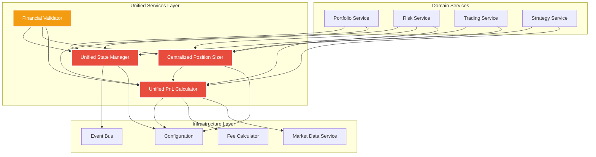
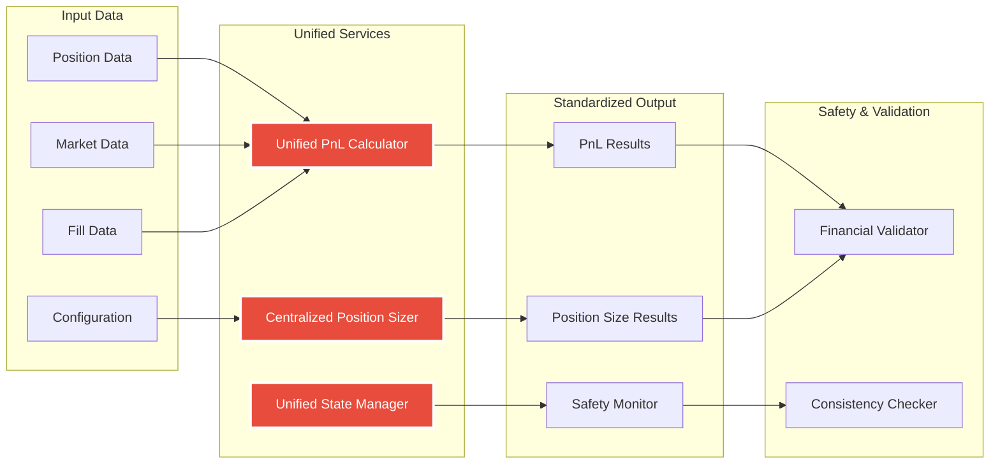

# Module Architecture Diagram - Unified Financial Services

**Date:** 2025-01-13  
**Purpose:** Visual guide for the new unified services architecture  
**Status:** Implementation blueprint  

---

## 🏗️ **COMPLETE MODULE TREE STRUCTURE**

```
cyberdelta/
├── services/                           # 🆕 NEW: Unified Services Layer
│   ├── __init__.py
│   ├── financial/                      # 🆕 Critical Financial Services
│   │   ├── __init__.py
│   │   ├── unified_pnl_calculator.py   # 🆕 CRITICAL: Single PnL source
│   │   ├── position_sizer.py           # 📝 ENHANCED: Centralized sizing
│   │   ├── fee_calculator.py           # 🆕 Unified fee calculation
│   │   └── financial_validator.py      # 🆕 Financial safety checks
│   ├── state/                          # 🆕 State Management Services
│   │   ├── __init__.py
│   │   ├── unified_state_manager.py    # 🆕 Single state manager
│   │   ├── state_serializer.py         # 🆕 Consistent serialization
│   │   ├── backup_manager.py           # 🆕 Unified backup system
│   │   └── migration_manager.py        # 🆕 State migration support
│   └── validation/                     # 🆕 Cross-Service Validation
│       ├── __init__.py
│       ├── consistency_checker.py      # 🆕 Cross-domain validation
│       └── financial_safety_monitor.py # 🆕 Real-time safety monitoring
│
├── models/                             # Enhanced with financial models
│   ├── financial/                      # 🆕 Financial Result Models
│   │   ├── __init__.py
│   │   ├── pnl_result.py              # 🆕 Standardized PnL results
│   │   ├── position_size_result.py     # 🆕 Position sizing results
│   │   ├── financial_metrics.py        # 🆕 Financial calculation metrics
│   │   └── risk_metrics.py            # 🆕 Risk calculation results
│   ├── state/                          # 🆕 State Management Models
│   │   ├── __init__.py
│   │   ├── state_entity.py            # 🆕 Base state entity protocol
│   │   ├── validation_result.py        # 🆕 State validation results
│   │   └── migration_result.py         # 🆕 Migration operation results
│   ├── market/
│   │   ├── order.py                   # 📝 MODIFIED: Use unified PnL
│   │   └── fill.py                    # 📝 MODIFIED: Use unified PnL
│   └── derivative_position.py          # 📝 MODIFIED: Use unified PnL
│
├── protocols/                          # Enhanced with financial protocols
│   ├── financial/                      # 🆕 Financial Service Protocols
│   │   ├── __init__.py
│   │   ├── pnl_calculator_protocol.py  # 🆕 PnL calculation interface
│   │   ├── position_sizer_protocol.py  # 🆕 Position sizing interface
│   │   └── fee_calculator_protocol.py  # 🆕 Fee calculation interface
│   ├── state/                          # 🆕 State Management Protocols
│   │   ├── __init__.py
│   │   ├── state_manager_protocol.py   # 🆕 State management interface
│   │   └── backup_manager_protocol.py  # 🆕 Backup management interface
│   └── market_data.py                  # 📝 ENHANCED: Market data interface
│
├── domain/                             # Modified to use unified services
│   ├── portfolio/
│   │   ├── portfolio_service.py        # 📝 MODIFIED: Use unified PnL
│   │   ├── balance_manager.py          # 📝 MODIFIED: Use unified state
│   │   └── state_manager.py           # 🗑️ DEPRECATED: Replace with unified
│   ├── risk/
│   │   ├── risk_service.py             # 📝 MODIFIED: Use unified services
│   │   ├── position_sizer.py          # 📝 ENHANCED: Becomes centralized
│   │   └── portfolio_analyzer.py       # 📝 MODIFIED: Use unified PnL
│   ├── trading/
│   │   ├── trading_service.py          # 📝 MODIFIED: Remove duplicate sizing
│   │   └── execution/
│   │       └── execution_engine.py     # 📝 MODIFIED: Use unified services
│   ├── strategy/
│   │   └── momentum_strategy.py        # 📝 MODIFIED: Use unified services
│   └── safety/
│       ├── circuit_breaker.py          # 📝 MODIFIED: Use unified state
│       └── state_manager.py           # 🗑️ DEPRECATED: Replace with unified
│
├── apis/                               # Modified to use unified services
│   ├── base/protocols/
│   │   └── mapper_protocols.py        # 📝 MODIFIED: Use unified PnL
│   ├── backpack/mappers/
│   │   ├── account/
│   │   │   └── bp_position_mapper.py  # 📝 MODIFIED: Use unified PnL
│   │   └── trading/
│   │       └── bp_order_mapper.py     # 📝 MODIFIED: Use unified services
│   └── hyperliquid/mappers/
│       ├── account/
│       │   └── hl_position_mapper.py  # 📝 MODIFIED: Use unified PnL
│       └── trading/
│           └── hl_order_mapper.py     # 📝 MODIFIED: Use unified services
│
├── utils/                              # Enhanced with financial utilities
│   ├── parsing.py                     # 📝 ENHANCED: Financial parsing safety
│   ├── decimal_parser.py              # 📝 ENHANCED: Precision validation
│   └── state_manager.py              # 🗑️ DEPRECATED: Replace with unified
│
└── tests/                              # New test structure
    ├── unit/
    │   ├── services/
    │   │   ├── financial/
    │   │   │   ├── test_unified_pnl_calculator.py      # 🆕 CRITICAL tests
    │   │   │   ├── test_position_sizer.py              # 📝 ENHANCED tests
    │   │   │   └── test_financial_validator.py         # 🆕 Safety tests
    │   │   ├── state/
    │   │   │   ├── test_unified_state_manager.py       # 🆕 State tests
    │   │   │   └── test_backup_manager.py             # 🆕 Backup tests
    │   │   └── validation/
    │   │       └── test_consistency_checker.py        # 🆕 Validation tests
    │   └── models/
    │       └── financial/
    │           ├── test_pnl_result.py                 # 🆕 Model tests
    │           └── test_position_size_result.py       # 🆕 Model tests
    └── integration/
        ├── financial/
        │   ├── test_financial_consistency.py          # 🆕 CRITICAL cross-validation
        │   ├── test_pnl_calculation_integration.py    # 🆕 End-to-end PnL tests
        │   └── test_position_sizing_integration.py    # 🆕 Position sizing tests
        └── state/
            ├── test_state_consistency.py              # 🆕 State integration tests
            └── test_migration_integration.py          # 🆕 Migration tests
```

---

## 🔄 **SERVICE DEPENDENCY FLOW**

### **Financial Services Dependencies**



### **Data Flow Architecture**



---

## 📂 **FILE CREATION COMMAND SEQUENCE**

### **Phase 1: Foundation Structure (5 minutes)**
```bash
# Navigate to project
cd /workspaces/CyberDeltaEngine/worktrees/trading-logic-add

# Create unified services directories
mkdir -p cyberdelta/services/{financial,state,validation}
mkdir -p cyberdelta/models/{financial,state}
mkdir -p cyberdelta/protocols/{financial,state}

# Create __init__.py files
find cyberdelta/services cyberdelta/models/financial cyberdelta/models/state cyberdelta/protocols/financial cyberdelta/protocols/state -type d -exec touch {}/__init__.py \;

# Core service files
touch cyberdelta/services/financial/{unified_pnl_calculator.py,position_sizer.py,fee_calculator.py,financial_validator.py}
touch cyberdelta/services/state/{unified_state_manager.py,state_serializer.py,backup_manager.py,migration_manager.py}
touch cyberdelta/services/validation/{consistency_checker.py,financial_safety_monitor.py}

# Model files
touch cyberdelta/models/financial/{pnl_result.py,position_size_result.py,financial_metrics.py,risk_metrics.py}
touch cyberdelta/models/state/{state_entity.py,validation_result.py,migration_result.py}

# Protocol files
touch cyberdelta/protocols/financial/{pnl_calculator_protocol.py,position_sizer_protocol.py,fee_calculator_protocol.py}
touch cyberdelta/protocols/state/{state_manager_protocol.py,backup_manager_protocol.py}
```

### **Phase 2: Test Structure (2 minutes)**
```bash
# Create test directories
mkdir -p tests/unit/services/{financial,state,validation}
mkdir -p tests/unit/models/{financial,state}
mkdir -p tests/integration/{financial,state}

# Unit test files
touch tests/unit/services/financial/{test_unified_pnl_calculator.py,test_position_sizer.py,test_financial_validator.py}
touch tests/unit/services/state/{test_unified_state_manager.py,test_backup_manager.py}
touch tests/unit/services/validation/test_consistency_checker.py
touch tests/unit/models/financial/{test_pnl_result.py,test_position_size_result.py}
touch tests/unit/models/state/{test_state_entity.py,test_validation_result.py}

# Integration test files
touch tests/integration/financial/{test_financial_consistency.py,test_pnl_calculation_integration.py,test_position_sizing_integration.py}
touch tests/integration/state/{test_state_consistency.py,test_migration_integration.py}
```

---

## 🎯 **IMPLEMENTATION PRIORITY ORDER**

### **CRITICAL PATH (Must be done in order):**

1. **🚨 Hour 1:** `models/financial/pnl_result.py` - Foundation for all PnL work
2. **🚨 Hour 2:** `protocols/financial/pnl_calculator_protocol.py` - Interface definition
3. **🚨 Hour 3-4:** `services/financial/unified_pnl_calculator.py` - **CRITICAL BUG FIX**
4. **🚨 Hour 5:** `tests/unit/services/financial/test_unified_pnl_calculator.py` - **VALIDATION**

### **HIGH PRIORITY (Day 1-2):**

5. **Hour 6:** Update `models/derivative_position.py` to use unified calculator
6. **Hour 7:** Update `apis/base/protocols/mapper_protocols.py` to use unified calculator  
7. **Hour 8:** Cross-validation tests in `tests/integration/financial/test_financial_consistency.py`

### **MEDIUM PRIORITY (Day 3-4):**

8. **Position Sizing:** Enhance `services/financial/position_sizer.py`
9. **Position Sizing:** Remove duplicate logic from `domain/trading/trading_service.py`
10. **Position Sizing:** Create `models/financial/position_size_result.py`

### **LOWER PRIORITY (Day 5-6):**

11. **State Management:** Create `services/state/unified_state_manager.py`
12. **State Management:** Create `protocols/state/state_manager_protocol.py`
13. **Migration:** Replace existing state managers

---

## 🔍 **ARCHITECTURAL PRINCIPLES**

### **1. Single Source of Truth**
- **One PnL calculator** for all calculations
- **One position sizer** for all sizing decisions
- **One state manager** for all persistence

### **2. Protocol-Based Design**
- All services implement protocols
- Easy to test with mocks
- Clear interface contracts

### **3. Configuration-Driven**
- All financial parameters from configuration
- No hardcoded values
- Environment-specific settings

### **4. Fail-Fast Validation**
- Validate inputs immediately
- Comprehensive error messages  
- Financial safety checks

### **5. Comprehensive Testing**
- Unit tests for all services
- Integration tests for cross-validation
- Edge case testing for financial safety

---

## 🚀 **READY TO START?**

**Next Steps:**
1. **Run the file creation commands** above
2. **Start with Hour 1** - implement `models/financial/pnl_result.py`
3. **Follow the critical path** in order
4. **Test continuously** as you implement

**Success Criteria:**
- [ ] All files created successfully
- [ ] PnL calculator fixes short position bug
- [ ] Cross-validation tests pass 100%
- [ ] No financial calculation discrepancies

This architecture eliminates the dangerous financial calculation inconsistencies while providing a scalable foundation for all future financial services in the CyberDeltaEngine.