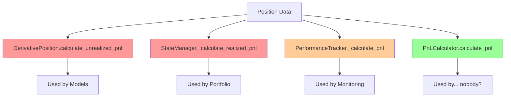

# PnL Calculation Fragmentation Analysis

**Date:** 2025-01-13
**Status:** Critical Issue Confirmed
**Risk Level:** 💀 HIGH - Financial calculation inconsistency

---

## Executive Summary

The CyberDeltaEngine has **4 different PnL calculation implementations** with inconsistent fee handling, creating risk of incorrect financial reporting and trading decisions. Each implementation uses different approaches, field names, and fee inclusion logic.

---

## The Four PnL Implementations

### 1. DerivativePosition Model (`models/derivative_position.py:252`)

```python
def calculate_unrealized_pnl(self, mark_price: Decimal) -> Decimal | None:
    """Calculate current unrealized PnL based on mark price."""
    if self.size == Decimal(0) or not self.entry_price:
        return None
    
    # Always use absolute size for consistent calculation
    size_abs = abs(self.size)
    
    if self.side == OrderSide.BUY:
        return size_abs * (mark_price - self.entry_price)
    # SELL
    return size_abs * (self.entry_price - mark_price)
```

**Characteristics:**
- ❌ **NO FEE HANDLING** - Completely ignores trading fees
- ✅ Uses proper OrderSide enum
- ✅ Returns None for flat positions
- ⚠️ No currency conversion support

---

### 2. Portfolio State Manager (`domain/portfolio/state_manager.py:496`)

```python
def _calculate_realized_pnl(self, position: DerivativePosition, fill: Fill) -> Decimal | None:
    """Calculate realized PnL from position closing fill."""
    if position.entry_price is None:
        raise MissingEntryPriceError(f"{position.exchange}:{position.symbol.value}")
    
    entry_price = position.entry_price
    
    if fill.side == OrderSide.BUY:
        # Closing short position
        if position.side == OrderSide.SELL:
            return (entry_price - fill.price) * fill.quantity
    # Closing long position
    elif position.side == OrderSide.BUY:
        return (fill.price - entry_price) * fill.quantity
```

**Characteristics:**
- ❌ **NO FEE HANDLING** - Ignores fees in realized PnL
- ✅ Proper error handling for missing entry price
- ⚠️ Different calculation logic structure than DerivativePosition
- ⚠️ No currency conversion

---

### 3. Performance Tracker (`domain/monitoring/performance_tracker.py`)

Multiple PnL calculation methods with **configurable fee inclusion**:

```python
async def _calculate_unrealized_pnl(self, portfolio_state: PortfolioState) -> Decimal:
    """Calculate unrealized PnL for open positions."""
    # Calculate unrealized PnL from current positions
    return await self._calculate_unrealized_pnl_from_positions(portfolio_state)

async def _calculate_realized_pnl(
    self, start_time: datetime, end_time: datetime
) -> Decimal:
    """Calculate realized PnL for period."""
    realized_pnl = Decimal(0)
    
    for fill in fills:
        # ... calculation logic
        if self._include_fees:  # Config-driven fee inclusion
            realized_pnl -= fill.fee
    
    return realized_pnl
```

**Characteristics:**
- ✅ **CONFIGURABLE FEE HANDLING** via `include_fees_in_metrics`
- ✅ Separate methods for realized vs unrealized
- ✅ Period-based calculations
- ⚠️ Different from other implementations

---

### 4. PnL Calculator Service (`domain/portfolio/pnl_calculator.py`)

Most comprehensive implementation with full configuration support:

```python
class PnLCalculator(PnLCalculatorProtocol):
    def __init__(self, config: AppSettings, state_manager: PortfolioStateManagerProtocol):
        self.config = config
        self._state_manager = state_manager
        
        # Cache calculation settings from config
        self._calc_config = config.calculation
        self._pnl_method = self._calc_config.pnl_calculation_method
        self._include_fees = self._calc_config.include_fees_in_pnl
        self._base_currency = self._calc_config.base_currency
        
    async def _calculate_mark_to_market_pnl(
        self, include_fees: bool, base_currency: str
    ) -> PnLReport:
        """Calculate using mark-to-market method."""
        # ... 
        if include_fees:
            total_pnl -= total_fees
        # ...
```

**Characteristics:**
- ✅ **FULL FEE CONFIGURATION** via `include_fees_in_pnl`
- ✅ Multiple calculation methods (mark-to-market, realized-only, comprehensive)
- ✅ Base currency awareness
- ✅ Proper PnLReport return type
- ⚠️ Most feature-complete but not used everywhere

---

## The Core Problems

### 1. **Inconsistent Fee Handling**

| Implementation | Fee Support | Configuration | Default |
|---------------|------------|---------------|---------|
| DerivativePosition | ❌ None | N/A | No fees |
| Portfolio StateManager | ❌ None | N/A | No fees |
| Performance Tracker | ✅ Yes | `include_fees_in_metrics` | Config-driven |
| PnL Calculator | ✅ Yes | `include_fees_in_pnl` | Config-driven |

**Risk:** Same position could show different PnL depending on which calculation path is used.

### 2. **Different Field Names**

```python
# DerivativePosition uses:
- self.size
- self.entry_price
- self.side

# Portfolio StateManager uses:
- position.entry_price
- fill.quantity
- position.side

# Performance Tracker uses:
- position.quantity
- position.average_entry_price
- Various custom fields
```

### 3. **Missing Currency Conversion**

None of the implementations handle cross-currency positions properly:
- No USD/USDC conversion
- No handling of positions in non-base currencies
- Silent assumption that all values are in base currency

### 4. **Calculation Method Variations**

Each implementation uses slightly different formulas:
- Some check position side first, others check fill side
- Different handling of absolute values
- Inconsistent null/zero checks

---

## Business Impact

### Financial Reporting Issues
- **Portfolio dashboard** might show different PnL than **risk monitor**
- **Performance metrics** could disagree with **position details**
- **Audit trail** becomes unreliable with multiple calculation sources

### Trading Decision Risks
- Risk manager might see profitable position as loss-making (no fees vs with fees)
- Strategy might exit positions based on incorrect PnL
- Position sizing could be wrong due to PnL miscalculation

### Reconciliation Nightmares
- Exchange PnL won't match internal calculations
- End-of-day reconciliation will always have discrepancies
- Tax reporting becomes problematic

---

## Real-World Scenario

```python
# Scenario: 1 BTC long position
entry_price = Decimal("50000")
current_price = Decimal("51000")
size = Decimal("1.0")
fees_paid = Decimal("100")  # Opening + potential closing fees

# DerivativePosition.calculate_unrealized_pnl():
pnl_1 = 1.0 * (51000 - 50000) = $1000  # Ignores fees

# Performance Tracker (with include_fees=True):
pnl_2 = 1.0 * (51000 - 50000) - 100 = $900  # Includes fees

# Performance Tracker (with include_fees=False):
pnl_3 = 1.0 * (51000 - 50000) = $1000  # Ignores fees

# Result: Same position shows $900 or $1000 profit depending on code path!
```

---

## Root Cause Analysis

### Why This Happened

1. **Organic Growth**: Different developers added PnL calculation where needed
2. **No Central Authority**: No single source of truth for financial calculations
3. **Incomplete Requirements**: Fee handling wasn't specified initially
4. **Domain Boundaries**: Each domain (portfolio, risk, monitoring) implemented its own

### Architecture Flaws



---

## Recommended Solution

### Phase 1: Immediate Consolidation (Week 1)

1. **Create Single Source of Truth**
```python
class UnifiedPnLCalculator:
    """Single authoritative PnL calculation service."""
    
    def calculate_unrealized_pnl(
        self,
        position: Position,
        mark_price: Decimal,
        include_fees: bool = None  # Use config default if not specified
    ) -> PnLResult:
        """Single method for ALL unrealized PnL calculations."""
        
    def calculate_realized_pnl(
        self,
        position: Position,
        fill: Fill,
        include_fees: bool = None
    ) -> PnLResult:
        """Single method for ALL realized PnL calculations."""
```

2. **Deprecate All Other Implementations**
- Mark existing methods as @deprecated
- Log warnings when old methods are called
- Redirect to unified calculator

### Phase 2: Migration (Week 2)

1. Update all callers to use UnifiedPnLCalculator
2. Add comprehensive tests comparing old vs new calculations
3. Run parallel calculations for validation period
4. Monitor for discrepancies

### Phase 3: Cleanup (Week 3)

1. Remove deprecated methods
2. Update documentation
3. Add integration tests
4. Performance optimization

---

## Testing Strategy

### Critical Test Cases

```python
@pytest.mark.parametrize("include_fees", [True, False])
@pytest.mark.parametrize("position_side", [OrderSide.BUY, OrderSide.SELL])
@pytest.mark.parametrize("pnl_type", ["realized", "unrealized"])
def test_pnl_calculation_consistency(include_fees, position_side, pnl_type):
    """Ensure ALL calculation methods return same result."""
    # Test that all 4 implementations return same PnL
    # for identical inputs
```

### Validation Requirements

- [ ] All implementations return identical results for same inputs
- [ ] Fee handling is consistent when configured
- [ ] Null/zero positions handled identically
- [ ] Currency conversion works when implemented
- [ ] Edge cases (negative prices, zero size) handled

---

## Configuration Alignment

Current configuration chaos:
```yaml
calculation:
  include_fees_in_pnl: true  # Used by PnLCalculator
  
performance_metrics:
  include_fees_in_metrics: true  # Used by PerformanceTracker
  
risk:
  include_fees_in_profitability: true  # Used by... nothing?
```

Proposed unified configuration:
```yaml
calculation:
  pnl:
    include_fees: true  # Single source
    method: "mark_to_market"
    base_currency: "USD"
```

---

## Monitoring & Alerts

Add monitoring for PnL calculation discrepancies:

```python
async def monitor_pnl_consistency():
    """Alert if different calculators return different values."""
    for position in positions:
        results = []
        results.append(position.calculate_unrealized_pnl(mark_price))
        results.append(performance_tracker.calculate_pnl(position))
        results.append(pnl_calculator.calculate_pnl(position))
        
        if not all_approximately_equal(results):
            alert("PNL_CALCULATION_DISCREPANCY", position, results)
```

---

## Conclusion

The PnL calculation fragmentation is a **critical financial risk** that needs immediate attention. The current state where the same position can show different PnL values depending on which code path is executed is unacceptable for a trading system.

**Immediate Actions Required:**
1. Freeze all new PnL calculation code
2. Implement UnifiedPnLCalculator this week
3. Add discrepancy monitoring immediately
4. Begin migration next week

**Long-term Success Metrics:**
- Single source of truth for all PnL calculations
- 100% consistency across all components
- Clear, configurable fee handling
- Comprehensive test coverage