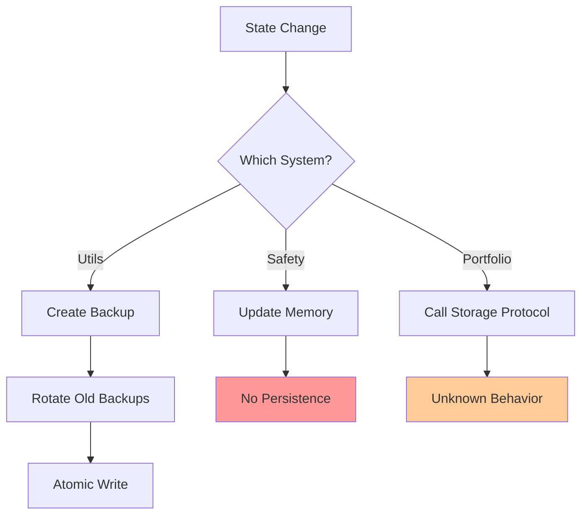
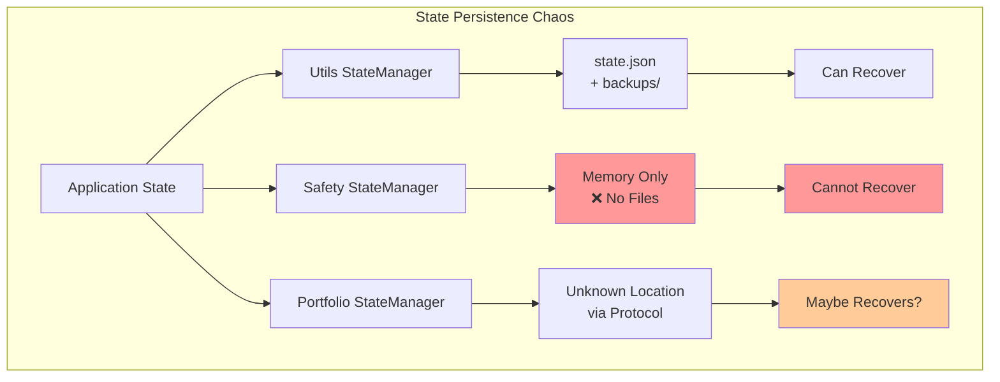
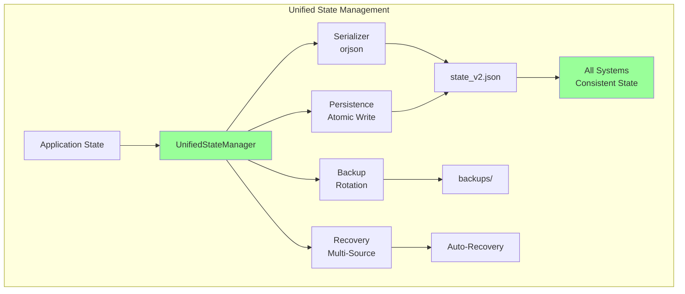

# State Management Fragmentation Analysis

**Date:** 2025-01-13
**Status:** Critical Architecture Issue
**Risk Level:** 💀 HIGH - Data consistency and recovery risks

---

## Executive Summary

CyberDeltaEngine has **3 incompatible state management systems** using different serialization formats, backup strategies, and persistence patterns. This fragmentation creates severe risks for data consistency, system recovery, and state corruption.

---

## The Three State Management Systems

### 1. Utils State Manager (`utils/state_manager.py`)

The most robust implementation with comprehensive features:

```python
class StateManager:
    """Provide reliable state persistence and recovery."""
    
    def save_state(self, state: dict[str, Any]) -> bool:
        # Create state data with metadata
        state_data = {
            "state": state,
            "metadata": {
                "timestamp": datetime.now(UTC).isoformat(),
                "checksum": self._calculate_checksum(state),
            },
        }
        
        # Create a backup before saving (rotation)
        self._create_backup()
        
        # Write state to a temporary file first
        temp_file: str = f"{self.state_file}.tmp"
        with Path(temp_file).open("wb") as file:
            file.write(orjson.dumps(state_data, option=orjson.OPT_INDENT_2))
        
        # Atomically replace the state file
        shutil.move(temp_file, self.state_file)
```

**Characteristics:**
- ✅ **Serialization:** orjson (fast, efficient)
- ✅ **Atomic writes:** Temp file + rename pattern
- ✅ **Backup strategy:** Rotation with configurable count
- ✅ **Integrity:** SHA-256 checksums
- ✅ **Recovery:** From backups with integrity verification
- ✅ **Timestamps:** ISO 8601 format

**File Structure:**
```json
{
  "state": {
    "positions": [...],
    "balances": [...]
  },
  "metadata": {
    "timestamp": "2025-01-13T10:30:00Z",
    "checksum": "sha256hash..."
  }
}
```

---

### 2. Domain Safety State Manager (`domain/safety/state_manager.py`)

Circuit breaker state management with different approach:

```python
class StateManager:
    """Manages circuit breaker state transitions."""
    
    def __init__(self, breaker_name: str, config: AppSettings):
        self._breaker_name = breaker_name
        self._cb_config = config.safety_systems.circuit_breakers
        
        # State tracking IN MEMORY ONLY
        self._state = CircuitBreakerState.CLOSED
        self._last_failure_time: datetime | None = None
        self._half_open_calls = 0
        self._half_open_successes = 0
```

**Characteristics:**
- ❌ **No persistence** - In-memory only!
- ❌ **No serialization** - State lost on restart
- ❌ **No backup** - No recovery possible
- ⚠️ **Different purpose** - Runtime state transitions only
- ✅ **Simple** - No I/O complexity

**Critical Issue:** Circuit breaker state is **lost on every restart**, potentially allowing dangerous operations immediately after system recovery.

---

### 3. Domain Portfolio State Manager (`domain/portfolio/state_manager.py`)

Portfolio-specific state with storage abstraction:

```python
class PortfolioStateManager:
    def __init__(
        self,
        config: AppSettings,
        storage: PortfolioStorageProtocol,
    ):
        self._storage = storage
        self._cached_state: PortfolioState | None = None
        
    async def save_state(self) -> None:
        """Save current portfolio state via storage abstraction."""
        async with self._state_lock:
            if self._cached_state:
                await self._storage.save_state(self._cached_state)
                
    def _calculate_realized_pnl(self, position: DerivativePosition, fill: Fill):
        # Business logic mixed with state management
        pass
```

**Characteristics:**
- 🔄 **Serialization:** Delegated to storage protocol
- ⚠️ **Unknown persistence:** Depends on storage implementation
- ⚠️ **Unknown backup:** Depends on storage implementation
- ✅ **Abstraction:** Uses protocol for flexibility
- ⚠️ **Mixed concerns:** Business logic in state manager

**Problem:** The actual persistence behavior is hidden behind the protocol, making it impossible to know how state is actually saved.

---

## The Fragmentation Problems

### 1. Incompatible Serialization Formats

| System | Format | Library | Structure |
|--------|--------|---------|-----------|
| Utils | JSON | orjson | `{"state": {...}, "metadata": {...}}` |
| Safety | None | N/A | In-memory only |
| Portfolio | Unknown | Delegated | Protocol-dependent |

**Risk:** Cannot migrate or share state between systems.

### 2. Different Backup Strategies



### 3. Timestamp Format Chaos

```python
# Utils State Manager
"timestamp": datetime.now(UTC).isoformat()  # "2025-01-13T10:30:00Z"

# Safety State Manager (if it saved)
self._last_failure_time: datetime | None  # Python datetime object

# Portfolio State Manager
# Unknown - depends on storage implementation
```

### 4. Recovery Capability Comparison

| System | Recovery Source | Integrity Check | Auto-Recovery |
|--------|----------------|-----------------|---------------|
| Utils | Multiple backups | SHA-256 checksum | ✅ Yes |
| Safety | None | N/A | ❌ No |
| Portfolio | Unknown | Unknown | ❓ Maybe |

---

## Real-World Failure Scenarios

### Scenario 1: System Crash During State Save

**Utils State Manager:**
```python
# Crash during write
temp_file.write(data)  # <-- CRASH HERE
# Original state.json is untouched
# On restart: loads previous valid state
# Result: ✅ No corruption
```

**Portfolio State Manager:**
```python
await self._storage.save_state(state)  # <-- CRASH HERE
# Unknown behavior - depends on storage implementation
# Result: ❓ Undefined
```

**Safety State Manager:**
```python
# No persistence, so no crash scenario
# But on restart: ⚠️ All circuit breakers reset to CLOSED!
```

### Scenario 2: Corrupted State File

**Utils State Manager:**
```python
# Detects corruption via checksum
if not self._verify_state_integrity(state_data):
    return self._recover_from_backup()  # ✅ Auto-recovery
```

**Portfolio State Manager:**
```python
# Unknown - depends on storage implementation
# No standard corruption detection
```

### Scenario 3: State Migration Need

Current situation makes migration nearly impossible:
```python
# Utils format
utils_state = {
    "state": {"data": "here"},
    "metadata": {"timestamp": "2025-01-13T10:30:00Z", "checksum": "..."}
}

# Portfolio format (assumed)
portfolio_state = {
    "positions": [...],
    "timestamp": 1234567890,  # Unix timestamp?
    # No metadata? Different structure?
}

# How to migrate? 🤷
```

---

## Critical Issues Deep Dive

### Issue 1: Circuit Breakers Reset on Restart

The safety state manager doesn't persist state, causing:

```python
# Before restart
circuit_breaker.state = OPEN  # Protecting system from failures
circuit_breaker.failure_count = 10
circuit_breaker.last_failure = "2025-01-13T10:00:00Z"

# After restart
circuit_breaker.state = CLOSED  # ⚠️ DANGEROUS!
circuit_breaker.failure_count = 0  # ⚠️ History lost!
circuit_breaker.last_failure = None  # ⚠️ No memory!

# Result: System immediately retries failed operations!
```

### Issue 2: Inconsistent State Across Systems

Different systems save at different times with different data:

```python
# T1: Portfolio updates position
portfolio_state.positions.append(new_position)
await portfolio_state.save()  # Saved to unknown location

# T2: Utils saves application state
app_state["last_update"] = datetime.now()
utils_state.save_state(app_state)  # Saved to state.json

# T3: Safety state changes
circuit_breaker.state = OPEN  # Never saved!

# Result: After restart, systems are out of sync
```

### Issue 3: No Unified Recovery Strategy

Each system has different recovery behavior:

```python
# Recovery attempt after crash
try:
    # Utils: Has sophisticated recovery
    utils_state = state_manager.load_state()
    if not utils_state:
        utils_state = state_manager._recover_from_backup()
    
    # Portfolio: Unknown recovery
    portfolio_state = await portfolio_manager.load_state()
    # What if this fails? No standard fallback
    
    # Safety: No recovery at all
    safety_state = StateManager(config)  # Always starts fresh
    
except Exception as e:
    # No unified error handling
    # Each system fails differently
```

---

## Architecture Impact

### Current Chaos Architecture



### Data Flow Issues

```python
# Current: Multiple uncoordinated saves
async def shutdown_sequence():
    # Each saves independently, possibly inconsistently
    utils_state.save_state({"shutdown": datetime.now()})
    await portfolio_state.save_state()
    # Safety state not saved at all!
    
    # If crash happens between saves?
    # Partial state, inconsistent data
```

---

## Recommended Solution

### Unified State Management Architecture



### Implementation Plan

```python
class UnifiedStateManager:
    """Single state management system for all domains."""
    
    def __init__(self, config: AppSettings):
        self.serializer = StateSerializer()  # orjson-based
        self.persistence = AtomicFilePersistence()
        self.backup_manager = BackupRotationManager()
        self.recovery = StateRecoverySystem()
        
    async def save_state(self, state: ApplicationState) -> None:
        """Save complete application state atomically."""
        # Serialize with consistent format
        data = self.serializer.serialize(state)
        
        # Create backup before save
        await self.backup_manager.create_backup()
        
        # Atomic write
        await self.persistence.write_atomic(data)
        
    async def load_state(self) -> ApplicationState:
        """Load state with automatic recovery."""
        try:
            return await self.persistence.read()
        except StateCorruption:
            return await self.recovery.recover_from_backups()
```

---

## Migration Strategy

### Phase 1: Parallel Implementation (Week 1)
1. Implement UnifiedStateManager alongside existing systems
2. Save to both old and new systems
3. Compare outputs for consistency

### Phase 2: Gradual Migration (Week 2)
1. Migrate safety state to unified system (currently has none)
2. Migrate utils state (closest to target architecture)
3. Migrate portfolio state (most complex)

### Phase 3: Cleanup (Week 3)
1. Remove old state managers
2. Delete legacy state files
3. Update all tests

---

## Critical Success Factors

### Must-Have Features

- [ ] **Atomic writes** - No partial state corruption
- [ ] **Automatic backups** - With rotation
- [ ] **Integrity verification** - Checksums/signatures
- [ ] **Version management** - For state migration
- [ ] **Consistent serialization** - Single format
- [ ] **Recovery cascade** - Multiple fallback sources
- [ ] **Timestamp standardization** - ISO 8601 everywhere

### Testing Requirements

```python
@pytest.mark.critical
async def test_state_crash_recovery():
    """Ensure state survives crashes."""
    # Simulate crash during write
    # Verify recovery works
    
@pytest.mark.critical  
async def test_state_corruption_recovery():
    """Ensure corrupted state can be recovered."""
    # Corrupt state file
    # Verify backup recovery
    
@pytest.mark.critical
async def test_state_consistency():
    """Ensure all domains see consistent state."""
    # Save from multiple domains
    # Verify single consistent view
```

---

## Monitoring & Alerts

```python
class StateHealthMonitor:
    async def check_state_health(self):
        """Monitor state management health."""
        
        # Check state file integrity
        if not await self.verify_checksum():
            alert("STATE_CORRUPTION_DETECTED")
            
        # Check backup freshness
        if await self.backup_age() > timedelta(hours=1):
            alert("STATE_BACKUP_STALE")
            
        # Check state size growth
        if await self.state_size() > self.max_size:
            alert("STATE_SIZE_EXCESSIVE")
```

---

## Conclusion

The state management fragmentation is a **critical architectural flaw** that compromises system reliability and data consistency. The current situation where:
- Circuit breakers lose state on restart (safety risk)
- Different serialization makes migration impossible
- No unified recovery strategy exists

...is unacceptable for a production trading system.

**Immediate Actions:**
1. 🚨 Add persistence to safety state manager (CRITICAL)
2. 📊 Document actual portfolio state persistence behavior
3. 🔄 Begin unified state manager implementation
4. 📝 Create state migration plan

**Success Metrics:**
- Single state file for entire application
- 100% state recovery after crashes
- Consistent format across all domains
- Zero state loss on restart