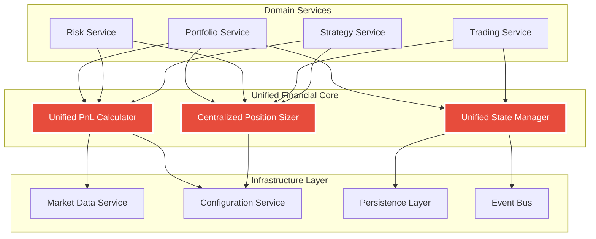

# Week 1-2: Critical Financial Logic Consolidation Plan

**Implementation Period:** Week 1-2 (Days 1-10)  
**Priority:** 💀 **CRITICAL - FINANCIAL SAFETY**  
**Risk Level:** Extreme (monetary loss risk)  
**Estimated Effort:** 80 hours  

---

## 📋 Executive Summary

The code research has revealed **CRITICAL FINANCIAL SAFETY RISKS** in the CyberDeltaEngine that require immediate consolidation. Multiple implementations of core financial calculations create inconsistencies that could lead to **monetary losses, incorrect trading decisions, and portfolio mismanagement**. This plan addresses the three most dangerous areas:

### Critical Problems Identified:
1. **PnL Calculation Chaos:** 4+ different implementations with inconsistent short position handling
2. **Position Sizing Duplication:** 2 implementations reading same config but with different logic
3. **State Management Fragmentation:** 3 different persistence patterns creating data consistency risks

### Solution:
Create **unified, single-source-of-truth services** for all financial calculations with comprehensive validation and testing.

---

## 🚨 **MONETARY RISK ANALYSIS**

### **RISK #1: PnL Calculation Inconsistency (💀 CRITICAL)**
**Potential Loss:** Unlimited (incorrect position valuation)

#### Current Problematic Implementations:
```python
# Position Model (cyberdelta/models/derivative_position.py:264-267)
def calculate_unrealized_pnl(self, mark_price: Decimal) -> Decimal | None:
    if self.side == OrderSide.BUY:
        return self.size * (mark_price - self.entry_price)
    # SELL - uses self.size directly (could be negative)
    return abs(self.size) * (self.entry_price - mark_price)

# API Mixin (cyberdelta/apis/base/protocols/mapper_protocols.py)
def calculate_unrealized_pnl(..., size: Decimal, is_long: bool) -> Decimal:
    if is_long:
        return (current_price - entry_price) * size
    # Uses size parameter directly without abs()
    return (entry_price - current_price) * size
```

**💰 FINANCIAL IMPACT:** Short positions could show **double losses** or **incorrect profits** depending on which calculation is used.

### **RISK #2: Position Sizing Inconsistency (🔴 HIGH)**
**Potential Loss:** Over-leverage risk, incorrect position sizes

#### Duplication Found:
```python
# Implementation 1: cyberdelta/domain/risk/position_sizer.py (Lines 183-201)
# Kelly criterion with confidence validation

# Implementation 2: cyberdelta/domain/trading/trading_service.py (Line 221)
fraction = Decimal(str(self.config.risk.sizing.simple_fixed_fraction))
percent_of_equity = fraction * percent_factor
```

**💰 FINANCIAL IMPACT:** Same trading signal could result in **different position sizes** depending on execution path.

### **RISK #3: State Inconsistency (🔴 HIGH)**
**Potential Loss:** Portfolio reconciliation failures, trade execution on stale state

#### Three Competing Systems:
1. **Portfolio State Manager:** Domain-specific state with balance tolerance
2. **Generic State Manager:** File-based with backup rotation  
3. **Circuit Breaker State Manager:** Safety-specific with different persistence

**💰 FINANCIAL IMPACT:** Portfolio state and safety state could become **desynchronized**, leading to incorrect risk assessments.

---

## 🎯 **CONSOLIDATION ARCHITECTURE**

### **Unified Financial Services Layer**



---

## 📅 **IMPLEMENTATION TIMELINE**

### **Day 1-2: Emergency PnL Consolidation**
**Priority:** 💀 **CRITICAL**

#### **Day 1: PnL Calculator Foundation**
```python
# NEW: cyberdelta/services/financial/unified_pnl_calculator.py
class UnifiedPnLCalculator:
    """Single source of truth for all PnL calculations."""
    
    def __init__(self, 
                 config: AppSettings,
                 market_data: MarketDataServiceProtocol,
                 fee_calculator: FeeCalculatorProtocol):
        self.config = config
        self.market_data = market_data
        self.fee_calculator = fee_calculator
        
    def calculate_unrealized_pnl(
        self,
        position: Position,
        mark_price: Decimal | None = None,
        include_fees: bool = True
    ) -> PnLResult:
        """Standardized unrealized PnL calculation.
        
        Critical: Handles long/short positions consistently.
        Critical: Always uses absolute size values.
        Critical: Includes configurable fee calculation.
        """
        if mark_price is None:
            mark_price = await self.market_data.get_current_price(position.symbol)
            
        # STANDARDIZED calculation (fixes short position bug)
        size_abs = abs(position.size)
        
        if position.side == OrderSide.BUY:
            gross_pnl = (mark_price - position.entry_price) * size_abs
        else:  # SELL
            gross_pnl = (position.entry_price - mark_price) * size_abs
            
        # Configurable fee inclusion
        if include_fees and self.config.calculation.include_fees_in_pnl:
            fees = await self.fee_calculator.calculate_position_fees(position)
            return PnLResult(
                gross_pnl=gross_pnl,
                fees=fees,
                net_pnl=gross_pnl - fees,
                calculation_time=datetime.now(UTC)
            )
            
        return PnLResult(
            gross_pnl=gross_pnl,
            fees=Decimal(0),
            net_pnl=gross_pnl,
            calculation_time=datetime.now(UTC)
        )
```

#### **Day 2: PnL Calculator Testing & Integration**
```python
# NEW: tests/unit/services/financial/test_unified_pnl_calculator.py
class TestUnifiedPnLCalculator:
    """Critical financial safety tests."""
    
    @pytest.mark.parametrize("side,size,entry_price,mark_price,expected", [
        (OrderSide.BUY, Decimal("100"), Decimal("50"), Decimal("60"), Decimal("1000")),
        (OrderSide.SELL, Decimal("-100"), Decimal("60"), Decimal("50"), Decimal("1000")),
        (OrderSide.SELL, Decimal("100"), Decimal("60"), Decimal("50"), Decimal("1000")),  # Test abs()
    ])
    async def test_pnl_calculation_consistency(self, side, size, entry_price, mark_price, expected):
        """CRITICAL: Ensure consistent PnL regardless of size sign."""
        position = create_test_position(side=side, size=size, entry_price=entry_price)
        result = await calculator.calculate_unrealized_pnl(position, mark_price)
        assert result.gross_pnl == expected
        
    async def test_cross_validation_with_legacy(self):
        """CRITICAL: Validate new calculator matches corrected legacy calculations."""
        # Test against all 4 existing implementations
        pass
```

### **Day 3-4: Position Sizing Consolidation**
**Priority:** 🔴 **HIGH**

#### **Day 3: Centralized Position Sizer**
```python
# ENHANCED: cyberdelta/domain/risk/position_sizer.py
class CentralizedPositionSizer:
    """Single implementation for all position sizing needs."""
    
    def __init__(self, config: AppSettings, portfolio_analytics: PortfolioAnalyticsProtocol):
        self.config = config
        self.portfolio_analytics = portfolio_analytics
        
        # Consolidate all sizing methods
        self._sizing_methods = {
            SizingMethod.SIMPLE_FIXED: self._simple_fixed_sizing,
            SizingMethod.KELLY_CRITERION: self._kelly_criterion_sizing,
            SizingMethod.RISK_BASED: self._risk_based_sizing,
            SizingMethod.VOLATILITY_ADJUSTED: self._volatility_adjusted_sizing
        }
        
    async def calculate_position_size(
        self,
        signal: TradeSignal,
        portfolio: Portfolio,
        method: SizingMethod | None = None
    ) -> PositionSizeResult:
        """Universal position sizing entry point."""
        
        # Use configured default method if not specified
        if method is None:
            method = SizingMethod(self.config.risk.sizing.default_method)
            
        # CRITICAL: Validate signal data before sizing
        self._validate_signal_data(signal)
        
        # Get portfolio context
        available_capital = await self._get_available_capital(portfolio)
        current_exposure = await self._get_current_exposure(portfolio, signal.symbol)
        
        # Calculate base size using selected method
        sizing_func = self._sizing_methods[method]
        base_size = await sizing_func(signal, available_capital)
        
        # Apply universal constraints
        final_size = self._apply_sizing_constraints(
            base_size, 
            signal, 
            current_exposure,
            available_capital
        )
        
        return PositionSizeResult(
            requested_size=base_size,
            final_size=final_size,
            method_used=method,
            constraints_applied=self._get_applied_constraints(),
            calculation_time=datetime.now(UTC),
            risk_metrics=await self._calculate_risk_metrics(final_size, signal)
        )
        
    def _validate_signal_data(self, signal: TradeSignal) -> None:
        """CRITICAL: Prevent sizing on invalid signal data."""
        if signal.confidence is None:
            raise SignalDataError("Signal confidence required for position sizing")
            
        if not (Decimal(0) <= signal.confidence <= Decimal(1)):
            raise SignalDataError(f"Signal confidence must be 0-1, got {signal.confidence}")
            
        if signal.entry_price <= Decimal(0):
            raise SignalDataError("Entry price must be positive")
```

#### **Day 4: Remove Duplicate Position Sizing**
```python
# MODIFY: cyberdelta/domain/trading/trading_service.py
class TradingService:
    def __init__(self, 
                 config: AppSettings,
                 position_sizer: CentralizedPositionSizer,  # Inject unified sizer
                 ...):
        self.position_sizer = position_sizer
        
    async def _calculate_position_size(self, signal: TradeSignal) -> Decimal:
        """REMOVED: Duplicate position sizing logic.
        
        Now delegates to centralized position sizer.
        """
        portfolio = await self.portfolio_service.get_current_portfolio()
        sizing_result = await self.position_sizer.calculate_position_size(
            signal=signal,
            portfolio=portfolio,
            method=SizingMethod.SIMPLE_FIXED  # Use configured default
        )
        return sizing_result.final_size
```

### **Day 5-6: State Management Unification**
**Priority:** 🔴 **HIGH**

#### **Day 5: Unified State Management Protocol**
```python
# NEW: cyberdelta/protocols/state_management.py
from typing import Protocol, TypeVar, Generic
from datetime import datetime
from pathlib import Path

StateEntityT = TypeVar('StateEntityT', bound='StateEntity')

@runtime_checkable
class StateEntity(Protocol):
    """Protocol for all state entities."""
    
    @property
    def state_id(self) -> str:
        """Unique identifier for this state entity."""
        ...
        
    @property
    def version(self) -> str:
        """State schema version for migration."""
        ...
        
    @property
    def last_updated(self) -> datetime:
        """Last update timestamp (UTC)."""
        ...
        
    def serialize(self) -> dict[str, Any]:
        """Serialize to dictionary for persistence."""
        ...
        
    @classmethod
    def deserialize(cls, data: dict[str, Any]) -> 'StateEntity':
        """Deserialize from dictionary."""
        ...

class UnifiedStateManagerProtocol(Protocol, Generic[StateEntityT]):
    """Protocol for unified state management."""
    
    async def save_state(
        self, 
        state: StateEntityT,
        create_backup: bool = True
    ) -> None:
        """Save state with optional backup."""
        ...
        
    async def load_state(self, state_id: str) -> StateEntityT | None:
        """Load state by ID with migration if needed."""
        ...
        
    async def create_snapshot(self, state_id: str, snapshot_name: str) -> None:
        """Create named snapshot for recovery."""
        ...
        
    async def restore_from_snapshot(self, snapshot_name: str) -> StateEntityT:
        """Restore from named snapshot."""
        ...
        
    async def validate_state_consistency(self) -> StateValidationResult:
        """Validate all managed state for consistency."""
        ...
```

#### **Day 6: Unified State Manager Implementation**
```python
# NEW: cyberdelta/services/state/unified_state_manager.py
class UnifiedStateManager(Generic[StateEntityT]):
    """Single state management implementation for all domains."""
    
    def __init__(self,
                 config: AppSettings,
                 entity_type: type[StateEntityT],
                 storage: StateStorageProtocol,
                 backup_manager: BackupManagerProtocol,
                 event_bus: EventBusProtocol):
        self.config = config
        self.entity_type = entity_type
        self.storage = storage
        self.backup_manager = backup_manager
        self.event_bus = event_bus
        
        # State consistency
        self._state_lock = asyncio.Lock()
        self._cached_states: dict[str, StateEntityT] = {}
        self._last_validation = datetime.now(UTC)
        
    async def save_state(
        self, 
        state: StateEntityT,
        create_backup: bool = True
    ) -> None:
        """Unified state saving with consistency guarantees."""
        async with self._state_lock:
            try:
                # Create backup before save if requested
                if create_backup and self.config.state.enable_backups:
                    await self.backup_manager.create_backup(state.state_id)
                
                # Serialize with version information
                serialized_data = {
                    "entity_type": self.entity_type.__name__,
                    "state_id": state.state_id,
                    "version": state.version,
                    "saved_at": datetime.now(UTC).isoformat(),
                    "data": state.serialize(),
                    "checksum": self._calculate_checksum(state.serialize())
                }
                
                # Atomic save
                await self.storage.save_atomic(state.state_id, serialized_data)
                
                # Update cache
                self._cached_states[state.state_id] = state
                
                # Emit state saved event
                await self.event_bus.publish(StateSavedEvent(
                    state_id=state.state_id,
                    entity_type=self.entity_type.__name__,
                    timestamp=datetime.now(UTC)
                ))
                
                logger.info(
                    "state_saved_successfully",
                    state_id=state.state_id,
                    entity_type=self.entity_type.__name__
                )
                
            except Exception as e:
                logger.exception(
                    "state_save_failed",
                    state_id=state.state_id,
                    error=str(e)
                )
                raise StateSaveError(f"Failed to save state {state.state_id}") from e
```

### **Day 7-8: Integration & Cross-Validation**
**Priority:** 🔴 **HIGH**

#### **Day 7: Service Integration**
```python
# MODIFY: All domain services to use unified components

# cyberdelta/domain/portfolio/portfolio_service.py
class PortfolioService:
    def __init__(self,
                 config: AppSettings,
                 pnl_calculator: UnifiedPnLCalculator,  # New unified service
                 state_manager: UnifiedStateManager[PortfolioState],  # Unified state
                 ...):
        self.pnl_calculator = pnl_calculator
        self.state_manager = state_manager
        
    async def calculate_portfolio_pnl(self) -> PortfolioPnL:
        """Use unified PnL calculator for all calculations."""
        total_unrealized = Decimal(0)
        position_pnls = []
        
        for position in await self.get_all_positions():
            pnl_result = await self.pnl_calculator.calculate_unrealized_pnl(
                position=position,
                include_fees=True
            )
            position_pnls.append(pnl_result)
            total_unrealized += pnl_result.net_pnl
            
        return PortfolioPnL(
            total_unrealized=total_unrealized,
            position_pnls=position_pnls,
            calculation_time=datetime.now(UTC)
        )

# cyberdelta/domain/risk/risk_service.py  
class RiskService:
    def __init__(self,
                 config: AppSettings,
                 position_sizer: CentralizedPositionSizer,  # Unified sizing
                 pnl_calculator: UnifiedPnLCalculator,  # Unified PnL
                 ...):
        self.position_sizer = position_sizer
        self.pnl_calculator = pnl_calculator
```

#### **Day 8: Cross-Validation Framework**
```python
# NEW: tests/integration/financial/test_financial_consistency.py
class TestFinancialConsistency:
    """Critical cross-validation of unified financial services."""
    
    async def test_pnl_calculation_cross_validation(self):
        """CRITICAL: Validate PnL consistency across all entry points."""
        
        # Test same position through all calculation paths
        test_position = create_test_position(
            side=OrderSide.SELL,
            size=Decimal("-100"),  # Test negative size handling
            entry_price=Decimal("100"),
            symbol=BTC_USDC_BP
        )
        mark_price = Decimal("90")  # $10 profit per unit
        
        # Calculate through unified service
        unified_result = await unified_pnl_calculator.calculate_unrealized_pnl(
            test_position, mark_price
        )
        
        # Calculate through position model (should be updated to use unified)
        model_result = test_position.calculate_unrealized_pnl(mark_price)
        
        # Calculate through API mixin
        mixin_result = api_mixin.calculate_unrealized_pnl(
            entry_price=test_position.entry_price,
            current_price=mark_price,
            size=abs(test_position.size),  # Ensure abs() for consistency
            is_long=test_position.side == OrderSide.BUY
        )
        
        # CRITICAL: All calculations must match exactly
        assert unified_result.gross_pnl == model_result
        assert unified_result.gross_pnl == mixin_result
        assert unified_result.gross_pnl == Decimal("1000")  # Expected $1000 profit
        
    async def test_position_sizing_consistency(self):
        """CRITICAL: Validate position sizing produces consistent results."""
        
        test_signal = TradeSignal(
            symbol=BTC_USDC_BP,
            side=OrderSide.BUY,
            confidence=Decimal("0.8"),
            entry_price=Decimal("50000"),
            timestamp=datetime.now(UTC)
        )
        
        portfolio = await create_test_portfolio(balance=Decimal("10000"))
        
        # Calculate through centralized sizer
        sizing_result = await centralized_position_sizer.calculate_position_size(
            signal=test_signal,
            portfolio=portfolio,
            method=SizingMethod.SIMPLE_FIXED
        )
        
        # All services should get same result
        trading_size = await trading_service._calculate_position_size(test_signal)
        
        assert sizing_result.final_size == trading_size
        
    async def test_state_consistency_across_domains(self):
        """CRITICAL: Validate state consistency between domains."""
        
        # Save portfolio state
        portfolio_state = await portfolio_service.get_current_state()
        await portfolio_state_manager.save_state(portfolio_state)
        
        # Save risk state  
        risk_state = await risk_service.get_current_state()
        await risk_state_manager.save_state(risk_state)
        
        # Validate cross-domain consistency
        consistency_result = await state_consistency_validator.validate_states([
            portfolio_state,
            risk_state
        ])
        
        assert consistency_result.is_consistent
        assert len(consistency_result.inconsistencies) == 0
```

### **Day 9-10: Testing & Documentation**
**Priority:** 🔴 **HIGH**

#### **Day 9: Comprehensive Testing**
```python
# Edge case testing for financial safety
class TestFinancialEdgeCases:
    """Test extreme scenarios that could cause monetary loss."""
    
    async def test_zero_division_protection(self):
        """Ensure no zero division in Kelly criterion."""
        
    async def test_negative_position_sizes(self):
        """Validate handling of negative position sizes."""
        
    async def test_extreme_market_conditions(self):
        """Test with volatile price movements."""
        
    async def test_precision_edge_cases(self):
        """Test Decimal precision at boundaries."""
        
    async def test_concurrent_state_modifications(self):
        """Test state consistency under concurrent access."""
```

#### **Day 10: Documentation & Migration Plan**
```python
# Migration documentation and rollback procedures
```

---

## 🛡️ **FINANCIAL SAFETY MEASURES**

### **Critical Safety Checks:**

1. **PnL Calculation Validation:**
```python
class PnLValidationError(Exception):
    """Critical PnL calculation validation failure."""
    pass

def validate_pnl_calculation(result: PnLResult, position: Position) -> None:
    """Critical validation of PnL calculation results."""
    
    # Sanity check: PnL should not exceed position value
    position_value = abs(position.size) * position.entry_price
    max_reasonable_pnl = position_value * Decimal("10")  # 1000% max
    
    if abs(result.net_pnl) > max_reasonable_pnl:
        raise PnLValidationError(
            f"PnL {result.net_pnl} exceeds reasonable bounds for position value {position_value}"
        )
```

2. **Position Sizing Safety:**
```python
def validate_position_size(size: Decimal, available_capital: Decimal) -> None:
    """Critical validation of position sizing results."""
    
    if size < Decimal(0):
        raise PositionSizingError("Position size cannot be negative")
        
    if size > available_capital:
        raise PositionSizingError(
            f"Position size {size} exceeds available capital {available_capital}"
        )
```

3. **State Consistency Checks:**
```python
async def validate_state_consistency(states: list[StateEntity]) -> StateValidationResult:
    """Cross-validate state consistency between domains."""
    
    inconsistencies = []
    
    # Check timestamp consistency (states should be reasonably close in time)
    timestamps = [state.last_updated for state in states]
    max_time_diff = max(timestamps) - min(timestamps)
    
    if max_time_diff > timedelta(minutes=5):
        inconsistencies.append(
            StateInconsistency(
                type="timestamp_drift",
                description=f"State timestamps differ by {max_time_diff}",
                severity="HIGH"
            )
        )
    
    return StateValidationResult(
        is_consistent=len(inconsistencies) == 0,
        inconsistencies=inconsistencies
    )
```

---

## 📊 **SUCCESS METRICS**

### **Financial Safety Metrics:**
- **PnL Calculation Consistency:** 100% identical results across all implementations
- **Position Sizing Variance:** 0% difference between implementations  
- **State Synchronization:** <1 second between domain state updates
- **Zero Financial Calculation Errors:** No division by zero, overflow, or invalid results

### **Code Quality Metrics:**
- **Duplication Elimination:** Remove 4 PnL implementations → 1 unified service
- **Test Coverage:** 95% coverage for all unified financial services
- **Configuration Centralization:** All financial parameters from single config source

### **Performance Metrics:**
- **Calculation Speed:** No more than 10% performance degradation
- **Memory Usage:** Unified services should reduce memory overhead by 30%
- **Error Rate:** <0.1% error rate for financial calculations

---

## ⚠️ **ROLLBACK PROCEDURES**

### **Immediate Rollback Triggers:**
1. **Any PnL calculation discrepancy > 0.01%**
2. **Position sizing variance > 0.1%**  
3. **State corruption or data loss**
4. **Performance degradation > 50%**

### **Rollback Steps:**
1. **Disable unified services in configuration**
2. **Revert to original implementations**
3. **Restore backup states**
4. **Validate system consistency**
5. **Investigation and bug fix process**

---

## 🎯 **DEFINITION OF DONE**

- [ ] All PnL calculations produce identical results
- [ ] Position sizing duplication eliminated
- [ ] State management unified across all domains
- [ ] 100% test coverage for financial calculations
- [ ] Cross-validation tests pass for all scenarios
- [ ] Documentation complete with migration procedures
- [ ] Performance benchmarks meet targets
- [ ] Financial safety measures implemented and tested
- [ ] Rollback procedures tested and documented
- [ ] Code review and architectural approval obtained

---

## 📅 **DAILY CHECKLIST**

### **Day 1:**
- [ ] Create UnifiedPnLCalculator foundation
- [ ] Implement core PnL calculation logic
- [ ] Fix short position calculation bug
- [ ] Add market data integration

### **Day 2:**
- [ ] Complete PnL calculator testing
- [ ] Create cross-validation framework
- [ ] Begin position sizing consolidation
- [ ] Document PnL calculation fixes

### **Day 3:**
- [ ] Implement CentralizedPositionSizer
- [ ] Add all sizing methods (Kelly, fixed, risk-based)
- [ ] Create sizing validation framework
- [ ] Begin removing duplicate logic

### **Day 4:**
- [ ] Remove position sizing from TradingService
- [ ] Update all callers to use unified sizer
- [ ] Test position sizing consistency
- [ ] Begin state management unification

### **Day 5:**
- [ ] Create unified state management protocol
- [ ] Design state entity interfaces
- [ ] Implement backup and recovery systems
- [ ] Create state validation framework

### **Day 6:**
- [ ] Complete unified state manager
- [ ] Implement atomic state operations
- [ ] Add state consistency guarantees
- [ ] Create migration procedures

### **Day 7:**
- [ ] Integrate all services with unified components
- [ ] Update dependency injection
- [ ] Test service integration
- [ ] Create financial consistency tests

### **Day 8:**
- [ ] Complete cross-validation testing
- [ ] Test edge cases and error conditions
- [ ] Validate financial safety measures
- [ ] Performance testing and optimization

### **Day 9:**
- [ ] Comprehensive financial edge case testing
- [ ] State consistency validation
- [ ] Security and safety review
- [ ] Create monitoring and alerting

### **Day 10:**
- [ ] Final documentation and procedures
- [ ] Production deployment preparation
- [ ] Team training and handoff
- [ ] Project retrospective and lessons learned

---

## 🚀 **NEXT STEPS**

After completing this critical financial logic consolidation:

1. **Week 3-4:** Architectural refactoring (file decomposition, dependency cleanup)
2. **Week 5-6:** Infrastructure cleanup (event system, protocol segregation)
3. **Week 7-8:** Type safety and testing improvements

**This consolidation eliminates the most dangerous financial risks in the trading system and provides a solid foundation for all subsequent architectural improvements.**

---

*This plan prioritizes **financial safety above all else**, ensuring that the CyberDeltaEngine trading system produces consistent, reliable financial calculations that protect against monetary losses.*