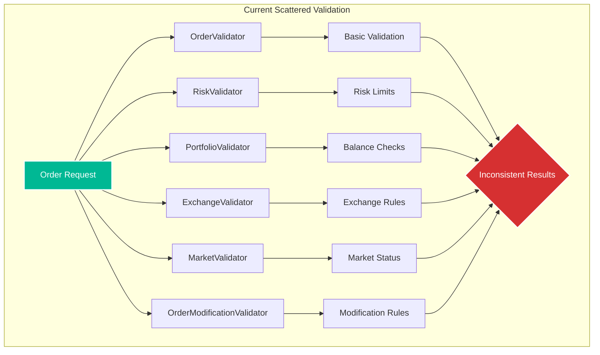
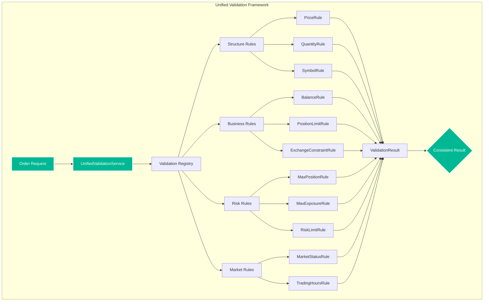

# Week 1: Validation Consolidation Plan

**Implementation Period:** Week 1 (Days 1-5)
**Priority:** 🔴 **HIGH**
**Risk Level:** Low-Medium (validation is well-isolated)
**Estimated Effort:** 40 hours

---

## 📋 Executive Summary

The current validation architecture has **6 separate validator classes** performing overlapping validation logic, creating maintenance burden and potential for inconsistent validation rules. This plan consolidates all validation into a **unified, configurable validation framework** while maintaining existing functionality.

### Current Problems:
- **6 validator classes** with overlapping responsibilities
- **Inconsistent error handling** (exceptions vs return values vs ValidationResult)
- **Duplicate validation logic** across validators
- **No central validation registry** for rule management
- **Difficult to add new validation rules** consistently

### Solution:
Create a **Unified Validation Service** with:
- Single entry point for all validation
- Pluggable validation rules via registry pattern
- Consistent error reporting
- Configuration-driven validation rules
- Easy extensibility for new validators

---

## 🏗️ Current Architecture Analysis

### Existing Validators:



### Validation Overlap Matrix:

| Validator | Price Check | Quantity Check | Balance Check | Risk Check | Symbol Check |
|-----------|------------|----------------|---------------|------------|--------------|
| OrderValidator | ✅ | ✅ | ❌ | ❌ | ✅ |
| RiskValidator | ✅ | ✅ | ❌ | ✅ | ❌ |
| PortfolioValidator | ❌ | ✅ | ✅ | ❌ | ❌ |
| ExchangeValidator | ✅ | ✅ | ❌ | ❌ | ✅ |
| MarketValidator | ✅ | ❌ | ❌ | ❌ | ✅ |

**Duplication:** Price checked 4 times, Quantity checked 4 times, Symbol checked 3 times!

---

## 🎯 Target Architecture

### Unified Validation Service:



---

## 🚀 Enhanced Implementation (Inspired by Nautilus Trader)

### Key Improvements from Nautilus Trader:
1. **Pre-Trade Risk Checks as First-Class Citizens**: Nautilus separates pre-trade checks into clear categories
2. **Precision Validation**: Strict price/quantity precision validation prevents downstream issues
3. **State-Aware Validation**: Validation rules can be context-dependent based on trading state
4. **Fail-Fast with Detailed Reasons**: OrderDenied events include human-readable reasons

## 📝 Implementation Plan

### Day 1: Foundation (8 hours)

#### 1.1 Create Validation Protocol (Enhanced)
```python
# cyberdelta/protocols/validation.py
from typing import Protocol, runtime_checkable
from decimal import Decimal
from enum import Enum
from cyberdelta.models import Order, ValidationResult

class ValidationCategory(Enum):
    """Validation rule categories (inspired by Nautilus)."""
    PRECISION = "precision"      # Price/quantity precision checks
    LIMITS = "limits"           # Min/max value checks
    BALANCE = "balance"         # Sufficient funds checks
    RISK = "risk"               # Risk limit checks
    MARKET = "market"           # Market status checks
    STATE = "state"             # Order state transition checks

@runtime_checkable
class ValidationRule(Protocol):
    """Protocol for all validation rules."""

    @property
    def name(self) -> str:
        """Rule name for logging."""
        ...

    @property
    def category(self) -> ValidationCategory:
        """Rule category for organization."""
        ...

    @property
    def enabled(self) -> bool:
        """Whether rule is enabled."""
        ...

    @property
    def bypass_on_reduce_only(self) -> bool:
        """Skip this check for reduce-only orders (Nautilus pattern)."""
        ...

    async def validate(self, order: Order, context: ValidationContext) -> ValidationResult:
        """Execute validation rule with detailed failure reasons."""
        ...
```

#### 1.2 Create Validation Context (Enhanced)
```python
# cyberdelta/domain/trading/validation/validation_context.py
from dataclasses import dataclass
from datetime import datetime
from cyberdelta.models import MarketSnapshot, PortfolioState, TradingState
from cyberdelta.config.models import AppSettings

@dataclass
class ValidationContext:
    """Enhanced context for validation rules (Nautilus-inspired)."""
    config: AppSettings
    market_snapshot: MarketSnapshot | None
    portfolio_state: PortfolioState | None
    exchange_config: ExchangeSpecificConfig | None
    trading_state: TradingState  # ACTIVE, HALTED, REDUCING (from Nautilus)
    timestamp: datetime  # For time-based validation
    is_reconciling: bool = False  # Skip certain checks during reconciliation
```

#### 1.3 Create Validation Registry
```python
# cyberdelta/domain/trading/validation/validation_registry.py
class ValidationRegistry:
    """Registry for validation rules."""

    def __init__(self):
        self._rules: dict[str, list[ValidationRule]] = {
            "structure": [],
            "business": [],
            "risk": [],
            "market": [],
        }

    def register(self, category: str, rule: ValidationRule) -> None:
        """Register a validation rule."""
        self._rules[category].append(rule)

    def get_rules(self, category: str | None = None) -> list[ValidationRule]:
        """Get validation rules by category."""
        if category:
            return self._rules.get(category, [])
        return [rule for rules in self._rules.values() for rule in rules]
```

### Day 2: Core Rules Implementation (8 hours)

#### 2.1 Precision Validation Rules (Nautilus-inspired)
```python
# cyberdelta/domain/trading/validation/rules/precision_rules.py
class PricePrecisionRule:
    """Validates order price precision (critical for order matching)."""

    @property
    def category(self) -> ValidationCategory:
        return ValidationCategory.PRECISION

    async def validate(self, order: Order, context: ValidationContext) -> ValidationResult:
        violations = []

        if order.price is None:
            return ValidationResult(violations=[])

        # Nautilus pattern: Strict precision validation
        instrument = context.exchange_config.get_instrument(order.symbol)

        # Check positive price (except for options per Nautilus)
        if not instrument.is_option and order.price <= 0:
            violations.append(
                f"Order denied: Price must be positive for {order.symbol}, "
                f"got {order.price}"
            )

        # Check tick size alignment (critical for matching engine)
        tick_size = instrument.price_precision
        if not self._is_precision_valid(order.price, tick_size):
            violations.append(
                f"Order denied: Price {order.price} precision invalid for "
                f"{order.symbol} (tick_size={tick_size})"
            )

        return ValidationResult(
            violations=violations,
            validation_type="PRE_TRADE_RISK_CHECK"  # Nautilus terminology
        )

    def _is_precision_valid(self, price: Decimal, tick_size: Decimal) -> bool:
        """Check if price aligns with tick size (Nautilus pattern)."""
        return (price % tick_size) == 0

class QuantityValidationRule:
    """Validates order quantity constraints."""

    async def validate(self, order: Order, context: ValidationContext) -> ValidationResult:
        violations = []

        # Single quantity validation logic
        if order.quantity_requested <= 0:
            violations.append(f"Quantity must be positive: {order.quantity_requested}")

        # Check against exchange step size
        if context.exchange_config:
            step_size = context.exchange_config.step_size
            if order.quantity_requested % step_size != 0:
                violations.append(f"Quantity not aligned to step size {step_size}")

        return ValidationResult(violations=violations)
```

#### 2.2 Business Validation Rules
```python
# cyberdelta/domain/trading/validation/rules/business_rules.py
class BalanceValidationRule:
    """Validates sufficient balance for order."""

    async def validate(self, order: Order, context: ValidationContext) -> ValidationResult:
        violations = []

        if not context.portfolio_state:
            violations.append("Portfolio state unavailable for balance validation")
            return ValidationResult(violations=violations)

        # Unified balance check logic
        if order.side == OrderSide.BUY and order.price:
            required = order.quantity_requested * order.price
            balance = self._get_quote_balance(order, context.portfolio_state)

            if balance < required:
                violations.append(f"Insufficient balance: need {required}, have {balance}")

        return ValidationResult(violations=violations)
```

### Day 3: Unified Service Implementation (8 hours)

#### 3.1 Create Unified Validation Service (Enhanced)
```python
# cyberdelta/domain/trading/validation/unified_validation_service.py
from cyberdelta.models import OrderDenied, TradingState

class UnifiedValidationService:
    """Enhanced validation service with Nautilus patterns."""

    def __init__(
        self,
        config: AppSettings,
        market_service: MarketDataService,
        portfolio_service: PortfolioService,
    ):
        self.config = config
        self._market_service = market_service
        self._portfolio_service = portfolio_service
        self._registry = ValidationRegistry()
        self._trading_state = TradingState.ACTIVE

        # Nautilus pattern: Categorized rule registration
        self._register_pre_trade_checks()
        self._register_risk_checks()
        self._register_state_checks()

    def _register_validation_rules(self) -> None:
        """Register all validation rules in priority order."""
        # Structure rules (run first)
        self._registry.register("structure", PriceValidationRule(self.config))
        self._registry.register("structure", QuantityValidationRule(self.config))
        self._registry.register("structure", SymbolValidationRule(self.config))

        # Business rules
        self._registry.register("business", BalanceValidationRule(self._portfolio_service))
        self._registry.register("business", PositionLimitRule(self.config))

        # Risk rules
        self._registry.register("risk", MaxPositionRule(self.config))
        self._registry.register("risk", MaxExposureRule(self.config))

        # Market rules (run last)
        self._registry.register("market", MarketStatusRule(self._market_service))
        self._registry.register("market", TradingHoursRule(self.config))

    async def validate_order(
        self,
        order: Order,
        bypass: bool = False,
    ) -> ValidationResult | OrderDenied:
        """Validate order with Nautilus-style pre-trade checks.

        Returns OrderDenied event on failure (Nautilus pattern).
        """
        # Nautilus pattern: Check trading state first
        if self._trading_state == TradingState.HALTED:
            return OrderDenied(
                order_id=order.id,
                reason="Trading halted - no new orders accepted",
                timestamp=datetime.now(UTC),
            )

        if self._trading_state == TradingState.REDUCING:
            if not order.reduce_only:
                return OrderDenied(
                    order_id=order.id,
                    reason="Trading in reduce-only mode - order must be reduce_only",
                    timestamp=datetime.now(UTC),
                )

        # Build validation context
        context = await self._build_context(order)
        context.trading_state = self._trading_state

        # Nautilus pattern: Run rules in priority order
        # 1. Precision checks (fail fast on bad data)
        violations = await self._run_category(
            ValidationCategory.PRECISION, order, context, bypass
        )
        if violations:
            return self._create_order_denied(order, violations[0])

        # 2. Limit checks
        violations = await self._run_category(
            ValidationCategory.LIMITS, order, context, bypass
        )
        if violations:
            return self._create_order_denied(order, violations[0])

        if validation_level in ["full", "business"]:
            for rule in self._registry.get_rules("business"):
                if rule.enabled:
                    result = await rule.validate(order, context)
                    all_violations.extend(result.violations)

        if validation_level in ["full", "risk"]:
            for rule in self._registry.get_rules("risk"):
                if rule.enabled:
                    result = await rule.validate(order, context)
                    all_violations.extend(result.violations)

        if validation_level in ["full", "market"]:
            for rule in self._registry.get_rules("market"):
                if rule.enabled:
                    result = await rule.validate(order, context)
                    all_violations.extend(result.violations)

        return ValidationResult(
            is_valid=len(all_violations) == 0,
            violations=all_violations,
            timestamp=datetime.now(UTC),
        )
```

### Day 4: Testing with Nautilus Patterns (8 hours)

#### 4.0 Property-Based Testing (Nautilus Pattern)
```python
# tests/unit/domain/trading/validation/test_precision_rules.py
from hypothesis import given, strategies as st
from decimal import Decimal

class TestPrecisionValidation:
    """Property-based tests for precision validation."""

    @given(
        price=st.decimals(min_value=0.0001, max_value=1000000),
        tick_size=st.sampled_from([Decimal("0.01"), Decimal("0.001"), Decimal("0.0001")])
    )
    def test_aligned_prices_always_pass(self, price, tick_size):
        """Nautilus pattern: Property-based precision testing."""
        # Align price to tick size
        aligned_price = (price // tick_size) * tick_size

        rule = PricePrecisionRule()
        result = rule.validate_precision(aligned_price, tick_size)

        assert result.is_valid, f"Aligned price {aligned_price} should pass"
```

### Day 4: Migration & Testing (8 hours)

#### 4.1 Create Migration Wrapper
```python
# cyberdelta/domain/trading/validation/migration_wrapper.py
class ValidationMigrationWrapper:
    """Temporary wrapper to maintain backward compatibility during migration."""

    def __init__(self, unified_service: UnifiedValidationService):
        self._unified = unified_service

        # Create legacy validator instances for compatibility
        self.order_validator = self._create_legacy_order_validator()
        self.risk_validator = self._create_legacy_risk_validator()
        self.portfolio_validator = self._create_legacy_portfolio_validator()

    def _create_legacy_order_validator(self):
        """Create legacy OrderValidator interface."""
        class LegacyOrderValidator:
            async def validate_order(self, order: Order) -> list[str]:
                result = await self._unified.validate_order(order, "structure")
                return result.violations

        return LegacyOrderValidator()
```

#### 4.2 Create Comprehensive Tests
```python
# tests/unit/domain/trading/validation/test_unified_validation.py
class TestUnifiedValidationService:
    """Test unified validation service."""

    async def test_validation_consistency(self):
        """Ensure unified validation matches legacy validation."""
        # Create order
        order = create_test_order()

        # Validate with legacy validators
        legacy_violations = []
        legacy_violations.extend(await old_order_validator.validate(order))
        legacy_violations.extend(await old_risk_validator.validate(order))

        # Validate with unified service
        result = await unified_service.validate_order(order)

        # Should have same violations (order may differ)
        assert set(legacy_violations) == set(result.violations)

    async def test_validation_performance(self):
        """Ensure unified validation is faster than scattered validation."""
        # Time legacy validation
        legacy_time = await time_legacy_validation(order)

        # Time unified validation
        unified_time = await time_unified_validation(order)

        # Unified should be faster (no duplicate checks)
        assert unified_time < legacy_time * 0.8  # At least 20% faster
```

### Day 5: Rollout & Documentation (8 hours)

#### 5.1 Phased Rollout Plan
1. **Phase 1:** Deploy unified service alongside legacy validators
2. **Phase 2:** Route 10% of validation through unified service
3. **Phase 3:** Route 50% through unified service, monitor for issues
4. **Phase 4:** Route 100% through unified service
5. **Phase 5:** Remove legacy validators after 1 week stability

#### 5.2 Documentation Updates
- Update API documentation with new validation structure
- Create migration guide for dependent services
- Document new validation rule registration process
- Create troubleshooting guide for validation issues

---

## 🎯 Nautilus-Inspired Validation Features

### Additional Patterns to Implement:

1. **In-Flight Order Checks**: Validate orders in SUBMITTED/PENDING states
2. **GTD Expiry Validation**: Reject orders with past expiry times
3. **Reduce-Only Validation**: Special handling for position-reducing orders
4. **State Transition Validation**: Ensure valid order state transitions
5. **Reconciliation Mode**: Relaxed validation during startup reconciliation

### Validation Error Handling:
```python
class OrderDenied:
    """Nautilus-style order denial with detailed reasons."""
    order_id: str
    reason: str  # Human-readable failure reason
    validation_category: ValidationCategory
    timestamp: datetime
    details: dict  # Additional context for debugging
```

## 📊 Success Metrics

### Code Quality Metrics:
- **Duplication Reduction:** From 6 validators to 1 unified service
- **Code Lines Saved:** ~500 lines of duplicate validation logic removed
- **Test Coverage:** 95% coverage for unified validation service
- **Cyclomatic Complexity:** Maximum 5 for any validation rule

### Performance Metrics:
- **Validation Speed:** 20-30% faster (no duplicate checks)
- **Memory Usage:** 15% reduction (single validation context)
- **Error Rate:** 0% increase in validation bypass

### Maintainability Metrics:
- **Time to Add New Rule:** From 2 hours to 15 minutes
- **Rule Consistency:** 100% consistent validation across all paths
- **Configuration Changes:** Zero code changes for threshold updates

---

## 🚨 Risk Mitigation

### Risks:
1. **Validation Logic Differences:** Legacy validators may have subtle differences
   - **Mitigation:** Comprehensive comparison testing before rollout

2. **Performance Regression:** Unified service could be slower
   - **Mitigation:** Performance benchmarks, caching validation context

3. **Breaking Changes:** Dependent services expect specific validator interfaces
   - **Mitigation:** Migration wrapper maintains backward compatibility

---

## ✅ Deliverables

### Code Deliverables:
- [ ] `protocols/validation.py` - Validation protocol definitions
- [ ] `validation_context.py` - Unified validation context
- [ ] `validation_registry.py` - Rule registry implementation
- [ ] `unified_validation_service.py` - Main service implementation
- [ ] `rules/` directory with all validation rules
- [ ] `migration_wrapper.py` - Backward compatibility layer

### Test Deliverables:
- [ ] Unit tests for each validation rule
- [ ] Integration tests for unified service
- [ ] Performance benchmarks
- [ ] Comparison tests with legacy validators

### Documentation Deliverables:
- [ ] API documentation updates
- [ ] Migration guide
- [ ] Rule registration guide
- [ ] Troubleshooting documentation

---

## 🎯 Definition of Done

- [ ] All validation logic consolidated into unified service
- [ ] Zero duplicate validation checks
- [ ] All existing tests pass with unified service
- [ ] Performance benchmarks show improvement
- [ ] Documentation complete and reviewed
- [ ] Phased rollout plan approved
- [ ] No increase in validation bypass rate
- [ ] Code review completed by senior developer

---

## 📅 Daily Checklist

### Day 1 (Monday):
- [ ] Create validation protocol
- [ ] Implement validation context
- [ ] Build validation registry
- [ ] Set up project structure

### Day 2 (Tuesday):
- [ ] Implement structure validation rules
- [ ] Implement business validation rules
- [ ] Implement risk validation rules
- [ ] Implement market validation rules

### Day 3 (Wednesday):
- [ ] Create unified validation service
- [ ] Implement rule registration
- [ ] Build validation orchestration
- [ ] Add configuration integration

### Day 4 (Thursday):
- [ ] Create migration wrapper
- [ ] Write comprehensive tests
- [ ] Performance benchmarking
- [ ] Fix any issues found

### Day 5 (Friday):
- [ ] Complete documentation
- [ ] Prepare rollout plan
- [ ] Code review
- [ ] Deploy to staging environment

---

*This plan eliminates validation duplication and creates a maintainable, extensible validation framework that will serve as the foundation for all future validation needs.*
