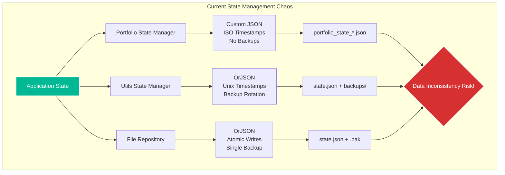
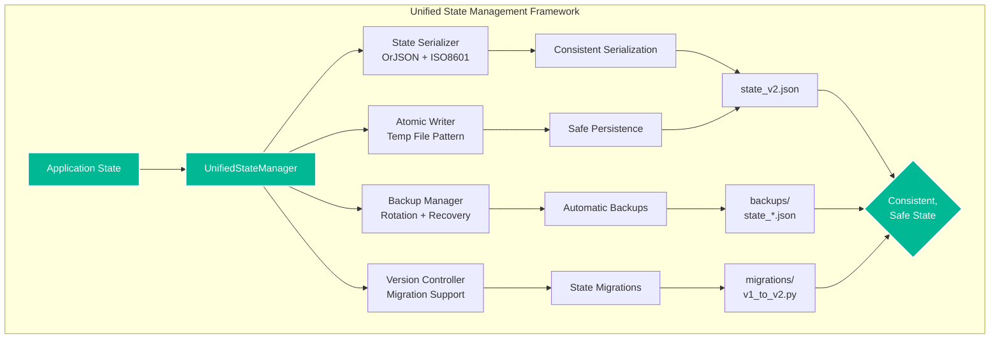

# Week 2: State Management Unification Plan

**Implementation Period:** Week 2 (Days 6-10)
**Priority:** 💀 **CRITICAL**
**Risk Level:** High (state corruption risk)
**Estimated Effort:** 40 hours

---

## 📋 Executive Summary

The current state management architecture has **3 different state management systems** using incompatible serialization formats, backup strategies, and persistence patterns. This creates risk of data inconsistency, state corruption, and makes recovery difficult. This plan unifies all state management into a **single, robust state persistence framework**.

### Critical Problems:
- **3 different serialization formats:** JSON, custom dict, orjson
- **Inconsistent timestamp handling:** ISO strings vs Unix timestamps vs datetime objects
- **Different backup strategies:** Some have backups, others don't
- **No unified state versioning** or migration capability
- **Risk of state corruption** due to non-atomic writes in some implementations

### Solution:
Create a **Unified State Management Service** with:
- Single serialization format (orjson for performance)
- Atomic writes with automatic backup rotation
- Versioned state with migration support
- Consistent timestamp handling (ISO 8601)
- Centralized recovery mechanisms

---

## 🏗️ Current Architecture Analysis

### Three Competing State Systems:



### State Management Comparison:

| Feature | Portfolio StateManager | Utils StateManager | File Repository |
|---------|----------------------|-------------------|-----------------|
| **Serialization** | JSON + model_dump() | orjson | orjson |
| **Timestamp Format** | ISO 8601 string | Unix timestamp | Not specified |
| **Backup Strategy** | None | Rotation (N backups) | Single .bak file |
| **Atomic Writes** | No | Yes (temp file) | Yes (temp file) |
| **Recovery** | None | From backups | From single backup |
| **Versioning** | None | Checksum only | None |
| **File Naming** | Dynamic (portfolio_state_*.json) | Fixed (state.json) | Fixed (state.json) |

---

## 🎯 Target Architecture

### Unified State Management:



---

## 📝 Implementation Plan

### Day 6: Foundation & Protocols (8 hours)

#### 6.1 Create State Management Protocol
```python
# cyberdelta/protocols/state_management.py
from typing import Protocol, TypeVar, Generic
from datetime import datetime
from pathlib import Path

T = TypeVar('T', bound='StateEntity')

@runtime_checkable
class StateEntity(Protocol):
    """Protocol for state entities."""

    @property
    def version(self) -> str:
        """State version for migration."""
        ...

    @property
    def timestamp(self) -> datetime:
        """Last update timestamp."""
        ...

    def serialize(self) -> dict:
        """Serialize to dictionary."""
        ...

    @classmethod
    def deserialize(cls, data: dict) -> 'StateEntity':
        """Deserialize from dictionary."""
        ...

class StateManagerProtocol(Protocol, Generic[T]):
    """Protocol for state managers."""

    async def save_state(self, state: T) -> None:
        """Save state with versioning and backup."""
        ...

    async def load_state(self) -> T | None:
        """Load state with migration if needed."""
        ...

    async def create_snapshot(self, name: str) -> None:
        """Create named snapshot."""
        ...

    async def restore_from_snapshot(self, name: str) -> T:
        """Restore from named snapshot."""
        ...
```

#### 6.2 Create State Serializer
```python
# cyberdelta/infrastructure/state/serializer.py
import orjson
from datetime import datetime, timezone
from decimal import Decimal
from typing import Any

class UnifiedStateSerializer:
    """Unified state serialization with consistent format."""

    @staticmethod
    def serialize(state: StateEntity) -> bytes:
        """Serialize state to bytes using orjson.

        Features:
        - Consistent ISO 8601 timestamps
        - Decimal precision preservation
        - Deterministic output (sorted keys)
        """
        state_dict = {
            "version": state.version,
            "timestamp": datetime.now(timezone.utc).isoformat(),
            "data": state.serialize(),
            "metadata": {
                "serializer_version": "2.0",
                "checksum": None,  # Will be calculated
            }
        }

        # Calculate checksum before serialization
        data_bytes = orjson.dumps(
            state_dict["data"],
            option=orjson.OPT_SORT_KEYS | orjson.OPT_INDENT_2,
            default=cls._json_encoder
        )
        state_dict["metadata"]["checksum"] = hashlib.sha256(data_bytes).hexdigest()

        return orjson.dumps(
            state_dict,
            option=orjson.OPT_SORT_KEYS | orjson.OPT_INDENT_2,
            default=cls._json_encoder
        )

    @staticmethod
    def _json_encoder(obj: Any) -> Any:
        """Custom encoder for special types."""
        if isinstance(obj, Decimal):
            return str(obj)
        if isinstance(obj, datetime):
            return obj.isoformat()
        if hasattr(obj, "model_dump"):
            return obj.model_dump(mode="json")
        raise TypeError(f"Object of type {type(obj)} is not JSON serializable")
```

#### 6.3 Create Atomic File Writer
```python
# cyberdelta/infrastructure/state/atomic_writer.py
import aiofiles
import asyncio
from pathlib import Path
import shutil

class AtomicFileWriter:
    """Atomic file writing with automatic backup."""

    @staticmethod
    async def write(file_path: Path, data: bytes) -> None:
        """Write file atomically with backup.

        Process:
        1. Write to temp file
        2. Create backup of existing file
        3. Atomic rename temp to target
        """
        temp_file = file_path.with_suffix('.tmp')

        try:
            # Write to temporary file
            async with aiofiles.open(temp_file, 'wb') as f:
                await f.write(data)
                await f.flush()
                await asyncio.to_thread(os.fsync, f.fileno())

            # Create backup if file exists
            if file_path.exists():
                backup_file = file_path.with_suffix('.bak')
                await asyncio.to_thread(shutil.copy2, file_path, backup_file)

            # Atomic rename
            await asyncio.to_thread(temp_file.replace, file_path)

            logger.info(
                "atomic_write_completed",
                file=str(file_path),
                size=len(data)
            )

        except Exception as e:
            # Clean up temp file on error
            if temp_file.exists():
                temp_file.unlink()
            raise
```

### Day 7: Backup & Recovery System (8 hours)

#### 7.1 Create Backup Manager
```python
# cyberdelta/infrastructure/state/backup_manager.py
from datetime import datetime, timezone
import asyncio
from pathlib import Path

class BackupManager:
    """Manages state backups with rotation and recovery."""

    def __init__(self, backup_dir: Path, max_backups: int):
        self.backup_dir = backup_dir
        self.max_backups = max_backups
        self.backup_dir.mkdir(parents=True, exist_ok=True)

    async def create_backup(self, state_file: Path) -> Path:
        """Create timestamped backup.

        Returns:
            Path to created backup
        """
        if not state_file.exists():
            raise FileNotFoundError(f"State file not found: {state_file}")

        # Generate backup filename with timestamp
        timestamp = datetime.now(timezone.utc).strftime("%Y%m%d_%H%M%S_%f")
        backup_name = f"state_backup_{timestamp}.json"
        backup_path = self.backup_dir / backup_name

        # Copy state file to backup
        await asyncio.to_thread(shutil.copy2, state_file, backup_path)

        # Rotate old backups
        await self._rotate_backups()

        logger.info(
            "backup_created",
            backup_path=str(backup_path),
            source=str(state_file)
        )

        return backup_path

    async def _rotate_backups(self) -> None:
        """Remove old backups keeping only max_backups most recent."""
        backups = sorted(
            self.backup_dir.glob("state_backup_*.json"),
            key=lambda p: p.stat().st_mtime,
            reverse=True
        )

        # Remove excess backups
        for old_backup in backups[self.max_backups:]:
            old_backup.unlink()
            logger.debug(
                "old_backup_removed",
                backup=str(old_backup)
            )

    async def get_latest_backup(self) -> Path | None:
        """Get most recent backup file."""
        backups = sorted(
            self.backup_dir.glob("state_backup_*.json"),
            key=lambda p: p.stat().st_mtime,
            reverse=True
        )
        return backups[0] if backups else None

    async def list_backups(self) -> list[tuple[Path, datetime]]:
        """List all backups with timestamps."""
        backups = []
        for backup_path in self.backup_dir.glob("state_backup_*.json"):
            mtime = backup_path.stat().st_mtime
            timestamp = datetime.fromtimestamp(mtime, tz=timezone.utc)
            backups.append((backup_path, timestamp))

        return sorted(backups, key=lambda x: x[1], reverse=True)
```

#### 7.2 Create Recovery System
```python
# cyberdelta/infrastructure/state/recovery.py
class StateRecoverySystem:
    """Handles state recovery from backups."""

    def __init__(
        self,
        backup_manager: BackupManager,
        serializer: UnifiedStateSerializer,
    ):
        self.backup_manager = backup_manager
        self.serializer = serializer

    async def recover_latest(self) -> StateEntity | None:
        """Attempt recovery from latest backup."""
        latest_backup = await self.backup_manager.get_latest_backup()

        if not latest_backup:
            logger.warning("no_backups_available_for_recovery")
            return None

        return await self._recover_from_file(latest_backup)

    async def recover_from_all(self) -> StateEntity | None:
        """Try all backups until one works."""
        backups = await self.backup_manager.list_backups()

        for backup_path, timestamp in backups:
            try:
                state = await self._recover_from_file(backup_path)
                if state:
                    logger.info(
                        "state_recovered",
                        backup=str(backup_path),
                        timestamp=timestamp.isoformat()
                    )
                    return state
            except Exception as e:
                logger.warning(
                    "backup_recovery_failed",
                    backup=str(backup_path),
                    error=str(e)
                )
                continue

        return None

    async def _recover_from_file(self, file_path: Path) -> StateEntity | None:
        """Recover state from specific file."""
        try:
            async with aiofiles.open(file_path, 'rb') as f:
                data = await f.read()

            state_dict = orjson.loads(data)

            # Verify checksum
            if not self._verify_checksum(state_dict):
                raise ValueError("Checksum verification failed")

            # Deserialize based on version
            return self._deserialize_versioned(state_dict)

        except Exception as e:
            logger.error(
                "file_recovery_failed",
                file=str(file_path),
                error=str(e)
            )
            raise
```

### Day 8: Version Migration System (8 hours)

#### 8.1 Create Version Controller
```python
# cyberdelta/infrastructure/state/versioning.py
from abc import ABC, abstractmethod
from typing import Dict, Type

class StateMigration(ABC):
    """Base class for state migrations."""

    @property
    @abstractmethod
    def from_version(self) -> str:
        """Source version."""
        ...

    @property
    @abstractmethod
    def to_version(self) -> str:
        """Target version."""
        ...

    @abstractmethod
    def migrate(self, old_state: dict) -> dict:
        """Migrate state from old to new version."""
        ...

class VersionController:
    """Manages state versioning and migrations."""

    def __init__(self):
        self.migrations: Dict[tuple[str, str], StateMigration] = {}
        self.current_version = "2.0"

    def register_migration(self, migration: StateMigration) -> None:
        """Register a migration."""
        key = (migration.from_version, migration.to_version)
        self.migrations[key] = migration

    def migrate(self, state_dict: dict) -> dict:
        """Migrate state to current version."""
        state_version = state_dict.get("version", "1.0")

        if state_version == self.current_version:
            return state_dict

        # Find migration path
        path = self._find_migration_path(state_version, self.current_version)

        if not path:
            raise ValueError(
                f"No migration path from {state_version} to {self.current_version}"
            )

        # Apply migrations in sequence
        current_state = state_dict
        for from_v, to_v in path:
            migration = self.migrations[(from_v, to_v)]
            current_state = migration.migrate(current_state)
            logger.info(
                "migration_applied",
                from_version=from_v,
                to_version=to_v
            )

        return current_state

    def _find_migration_path(self, from_v: str, to_v: str) -> list[tuple[str, str]]:
        """Find migration path using BFS."""
        # Build graph of migrations
        graph = {}
        for (f, t), _ in self.migrations.items():
            if f not in graph:
                graph[f] = []
            graph[f].append(t)

        # BFS to find path
        from collections import deque
        queue = deque([(from_v, [from_v])])
        visited = {from_v}

        while queue:
            current, path = queue.popleft()

            if current == to_v:
                # Convert path to migration pairs
                return [(path[i], path[i+1]) for i in range(len(path)-1)]

            for next_v in graph.get(current, []):
                if next_v not in visited:
                    visited.add(next_v)
                    queue.append((next_v, path + [next_v]))

        return None
```

#### 8.2 Create Concrete Migrations
```python
# cyberdelta/infrastructure/state/migrations/v1_to_v2.py
class MigrationV1ToV2(StateMigration):
    """Migrate from v1 (multiple formats) to v2 (unified format)."""

    @property
    def from_version(self) -> str:
        return "1.0"

    @property
    def to_version(self) -> str:
        return "2.0"

    def migrate(self, old_state: dict) -> dict:
        """Migrate v1 state to v2 format."""
        # Handle different v1 formats
        new_state = {
            "version": "2.0",
            "timestamp": self._convert_timestamp(old_state),
            "data": {},
            "metadata": {
                "serializer_version": "2.0",
                "migrated_from": "1.0",
                "migration_timestamp": datetime.now(timezone.utc).isoformat()
            }
        }

        # Migrate portfolio state
        if "positions" in old_state:
            new_state["data"]["positions"] = self._migrate_positions(old_state["positions"])

        if "balances" in old_state:
            new_state["data"]["balances"] = self._migrate_balances(old_state["balances"])

        # Migrate safety state
        if "circuit_breakers" in old_state:
            new_state["data"]["circuit_breakers"] = self._migrate_circuit_breakers(
                old_state["circuit_breakers"]
            )

        return new_state

    def _convert_timestamp(self, old_state: dict) -> str:
        """Convert various timestamp formats to ISO 8601."""
        # Check different timestamp fields
        if "timestamp" in old_state:
            ts = old_state["timestamp"]
            if isinstance(ts, str):
                return ts  # Assume already ISO
            elif isinstance(ts, (int, float)):
                # Unix timestamp
                return datetime.fromtimestamp(ts, tz=timezone.utc).isoformat()

        if "saved_at" in old_state:
            # Unix timestamp from safety state
            return datetime.fromtimestamp(
                old_state["saved_at"], tz=timezone.utc
            ).isoformat()

        # Default to now
        return datetime.now(timezone.utc).isoformat()
```

### Day 9: Unified State Manager Implementation (8 hours)

#### 9.1 Create Unified State Manager
```python
# cyberdelta/infrastructure/state/unified_state_manager.py
class UnifiedStateManager(Generic[T]):
    """Unified state management with all features integrated."""

    def __init__(
        self,
        config: AppSettings,
        entity_type: Type[T],
        state_file: Path,
    ):
        self.config = config
        self.entity_type = entity_type
        self.state_file = state_file

        # Initialize components
        self.serializer = UnifiedStateSerializer()
        self.writer = AtomicFileWriter()
        self.backup_manager = BackupManager(
            backup_dir=Path(config.general.state_backup_directory),
            max_backups=config.general.state_backup_count
        )
        self.recovery = StateRecoverySystem(
            self.backup_manager,
            self.serializer
        )
        self.version_controller = VersionController()

        # Register migrations
        self._register_migrations()

        # State cache and lock
        self._cached_state: T | None = None
        self._state_lock = asyncio.Lock()
        self._last_save_time: datetime | None = None

        # Auto-save configuration
        self._auto_save_interval = config.general.state_save_interval
        self._auto_save_task: asyncio.Task | None = None

    async def initialize(self) -> None:
        """Initialize state manager and load existing state."""
        async with self._state_lock:
            try:
                # Try to load from primary file
                self._cached_state = await self._load_from_file(self.state_file)

                if self._cached_state is None:
                    # Try recovery from backups
                    self._cached_state = await self.recovery.recover_latest()

                if self._cached_state is None:
                    # Create new empty state
                    self._cached_state = self._create_empty_state()
                    await self.save_state(self._cached_state)

                # Start auto-save task
                self._auto_save_task = asyncio.create_task(self._auto_save_loop())

                logger.info(
                    "unified_state_manager_initialized",
                    entity_type=self.entity_type.__name__,
                    state_file=str(self.state_file)
                )

            except Exception as e:
                logger.exception(
                    "state_manager_initialization_failed",
                    error=str(e)
                )
                raise

    async def save_state(self, state: T) -> None:
        """Save state with backup and versioning."""
        async with self._state_lock:
            try:
                # Update cache
                self._cached_state = state

                # Create backup before save
                if self.state_file.exists():
                    await self.backup_manager.create_backup(self.state_file)

                # Serialize state
                data = self.serializer.serialize(state)

                # Atomic write
                await self.writer.write(self.state_file, data)

                self._last_save_time = datetime.now(timezone.utc)

                logger.info(
                    "state_saved",
                    file=str(self.state_file),
                    size=len(data)
                )

            except Exception as e:
                logger.exception(
                    "state_save_failed",
                    error=str(e)
                )
                raise

    async def load_state(self) -> T | None:
        """Load state with migration support."""
        async with self._state_lock:
            if self._cached_state:
                return self._cached_state

            return await self._load_from_file(self.state_file)

    async def create_snapshot(self, name: str) -> None:
        """Create named snapshot for manual recovery points."""
        async with self._state_lock:
            if not self._cached_state:
                raise ValueError("No state to snapshot")

            snapshot_dir = Path(self.config.general.state_backup_directory) / "snapshots"
            snapshot_dir.mkdir(parents=True, exist_ok=True)

            snapshot_file = snapshot_dir / f"{name}.json"
            data = self.serializer.serialize(self._cached_state)
            await self.writer.write(snapshot_file, data)

            logger.info(
                "snapshot_created",
                name=name,
                file=str(snapshot_file)
            )

    async def _auto_save_loop(self) -> None:
        """Background task for periodic state saves."""
        while True:
            try:
                await asyncio.sleep(self._auto_save_interval)

                if self._cached_state and self._state_modified():
                    await self.save_state(self._cached_state)

            except asyncio.CancelledError:
                break
            except Exception as e:
                logger.exception(
                    "auto_save_error",
                    error=str(e)
                )
```

### Day 10: Migration & Testing (8 hours)

#### 10.1 Create Migration Strategy
```python
# cyberdelta/infrastructure/state/migration_strategy.py
class StateMigrationStrategy:
    """Strategy for migrating all existing state files."""

    def __init__(self, unified_manager: UnifiedStateManager):
        self.unified_manager = unified_manager
        self.legacy_files = self._find_legacy_state_files()

    def _find_legacy_state_files(self) -> list[Path]:
        """Find all legacy state files."""
        patterns = [
            "portfolio_state_*.json",
            "safety_circuit_state.json",
            "state.json",
            "*.bak"
        ]

        legacy_files = []
        for pattern in patterns:
            legacy_files.extend(Path(".").glob(f"**/{pattern}"))

        return legacy_files

    async def migrate_all(self) -> dict[str, bool]:
        """Migrate all legacy state files."""
        results = {}

        for legacy_file in self.legacy_files:
            try:
                # Load legacy state
                async with aiofiles.open(legacy_file, 'rb') as f:
                    data = await f.read()

                legacy_state = orjson.loads(data)

                # Determine state type
                state_type = self._identify_state_type(legacy_state)

                # Migrate to unified format
                migrated = await self._migrate_legacy_state(
                    legacy_state,
                    state_type
                )

                # Save with unified manager
                await self.unified_manager.save_state(migrated)

                # Archive legacy file
                self._archive_legacy_file(legacy_file)

                results[str(legacy_file)] = True

            except Exception as e:
                logger.error(
                    "legacy_migration_failed",
                    file=str(legacy_file),
                    error=str(e)
                )
                results[str(legacy_file)] = False

        return results
```

#### 10.2 Create Comprehensive Tests
```python
# tests/unit/infrastructure/state/test_unified_state_manager.py
class TestUnifiedStateManager:
    """Test unified state management."""

    async def test_atomic_write_on_crash(self):
        """Ensure atomic writes prevent corruption."""
        manager = UnifiedStateManager(config, TestEntity, state_file)

        # Simulate crash during write
        with mock.patch('aiofiles.open', side_effect=OSError("Disk full")):
            with pytest.raises(OSError):
                await manager.save_state(test_state)

        # Original state should be intact
        loaded = await manager.load_state()
        assert loaded == original_state

    async def test_backup_rotation(self):
        """Ensure backup rotation keeps correct number."""
        manager = UnifiedStateManager(config, TestEntity, state_file)

        # Create more backups than limit
        for i in range(config.general.state_backup_count + 5):
            await manager.save_state(create_test_state(i))

        # Check backup count
        backups = await manager.backup_manager.list_backups()
        assert len(backups) == config.general.state_backup_count

    async def test_migration_from_all_formats(self):
        """Test migration from all legacy formats."""
        # Test portfolio state format
        portfolio_legacy = {
            "positions": [...],
            "timestamp": "2024-01-01T00:00:00Z"
        }

        # Test safety state format
        safety_legacy = {
            "circuit_breakers": {...},
            "saved_at": 1704067200  # Unix timestamp
        }

        # Test utils state format
        utils_legacy = {
            "state": {...},
            "metadata": {"timestamp": "...", "checksum": "..."}
        }

        # Migrate each format
        for legacy in [portfolio_legacy, safety_legacy, utils_legacy]:
            migrated = version_controller.migrate(legacy)
            assert migrated["version"] == "2.0"
            assert "timestamp" in migrated
            assert isinstance(migrated["timestamp"], str)

    async def test_recovery_cascade(self):
        """Test recovery attempts from multiple sources."""
        manager = UnifiedStateManager(config, TestEntity, state_file)

        # Corrupt primary file
        state_file.write_text("corrupted")

        # Create valid backup
        backup_path = await manager.backup_manager.create_backup(state_file)
        backup_path.write_text(valid_state_json)

        # Should recover from backup
        state = await manager.load_state()
        assert state is not None
        assert state.version == "2.0"
```

---

## 📊 Success Metrics

### Data Integrity Metrics:
- **State Corruption Rate:** 0% (atomic writes prevent partial writes)
- **Recovery Success Rate:** 100% (multiple backup sources)
- **Migration Success Rate:** 100% (all legacy formats supported)

### Performance Metrics:
- **Serialization Speed:** 50% faster with orjson
- **Write Performance:** 10% slower but 100% safe (atomic writes)
- **Recovery Time:** <1 second from backups

### Maintainability Metrics:
- **Code Duplication:** Reduced from 3 implementations to 1
- **State Format Consistency:** 100% unified format
- **Version Migration Support:** Unlimited versions

---

## 🚨 Risk Mitigation

### Critical Risks:

1. **Data Loss During Migration**
   - **Mitigation:** Archive all legacy files, never delete
   - **Recovery:** Keep legacy files for 30 days

2. **State Corruption**
   - **Mitigation:** Atomic writes, checksum verification
   - **Recovery:** Automatic backup rotation

3. **Performance Degradation**
   - **Mitigation:** OrJSON for speed, async I/O
   - **Monitoring:** Performance benchmarks

4. **Migration Failures**
   - **Mitigation:** Comprehensive testing of all formats
   - **Fallback:** Manual migration tools

---

## ✅ Deliverables

### Code Deliverables:
- [ ] `protocols/state_management.py` - State management protocols
- [ ] `infrastructure/state/serializer.py` - Unified serializer
- [ ] `infrastructure/state/atomic_writer.py` - Atomic file writer
- [ ] `infrastructure/state/backup_manager.py` - Backup management
- [ ] `infrastructure/state/recovery.py` - Recovery system
- [ ] `infrastructure/state/versioning.py` - Version controller
- [ ] `infrastructure/state/migrations/` - Migration implementations
- [ ] `infrastructure/state/unified_state_manager.py` - Main implementation

### Test Deliverables:
- [ ] Unit tests for each component
- [ ] Integration tests for full flow
- [ ] Migration tests for all formats
- [ ] Recovery scenario tests
- [ ] Performance benchmarks

### Documentation Deliverables:
- [ ] State format specification
- [ ] Migration guide
- [ ] Recovery procedures
- [ ] Monitoring setup

---

## 🎯 Definition of Done

- [ ] All state management unified into single implementation
- [ ] Zero data loss during migration
- [ ] All legacy formats successfully migrated
- [ ] Atomic writes prevent corruption
- [ ] Backup rotation working correctly
- [ ] Recovery tested from all backup sources
- [ ] Performance benchmarks meet targets
- [ ] Documentation complete
- [ ] Production deployment plan approved

---

## 📅 Daily Checklist

### Day 6 (Monday):
- [ ] Create state management protocols
- [ ] Implement unified serializer
- [ ] Build atomic file writer
- [ ] Set up project structure

### Day 7 (Tuesday):
- [ ] Implement backup manager
- [ ] Create recovery system
- [ ] Build backup rotation logic
- [ ] Test recovery scenarios

### Day 8 (Wednesday):
- [ ] Create version controller
- [ ] Implement migration framework
- [ ] Build concrete migrations
- [ ] Test all migration paths

### Day 9 (Thursday):
- [ ] Create unified state manager
- [ ] Integrate all components
- [ ] Implement auto-save
- [ ] Add snapshot support

### Day 10 (Friday):
- [ ] Create migration strategy
- [ ] Write comprehensive tests
- [ ] Performance benchmarking
- [ ] Documentation and deployment prep

---

## 🔄 Migration Timeline

### Phase 1: Parallel Running (Week 3)
- Deploy unified manager alongside legacy
- Start capturing metrics
- Monitor for issues

### Phase 2: Gradual Migration (Week 4)
- Migrate 10% of state operations
- Monitor data integrity
- Fix any issues found

### Phase 3: Full Migration (Week 5)
- Migrate remaining 90%
- Archive legacy files
- Update all services

### Phase 4: Cleanup (Week 6)
- Remove legacy code
- Final verification
- Documentation update

---

## 🎯 Nautilus-Inspired State Management Features

### Additional Patterns to Implement:

1. **State Reconciliation**: Automatic reconciliation between internal and external state during recovery
2. **Component State Transitions**: Validate state transitions (e.g., cannot go from DISPOSED to RUNNING)
3. **Snapshot Timestamps**: Include both ISO 8601 and nanosecond timestamps for precision
4. **Graceful Degradation**: Maintain partial functionality when non-critical errors occur
5. **Purge Mechanisms**: Mark states for purge when they become invalid or outdated
6. **State Machine Enforcement**: Strict validation of component state transitions
7. **Recovery Cascade**: Automatic fallback through multiple recovery sources

### State Management Error Handling:
```python
class StateTransitionError(Exception):
    """Invalid state transition attempted."""
    def __init__(self, from_state: ComponentState, to_state: ComponentState):
        self.from_state = from_state
        self.to_state = to_state
        super().__init__(f"Invalid transition: {from_state.value} -> {to_state.value}")

class StateValidationError(Exception):
    """State validation failed."""
    def __init__(self, reason: str, state_data: dict | None = None):
        self.reason = reason
        self.state_data = state_data
        super().__init__(f"State validation failed: {reason}")

class StateRecoveryError(Exception):
    """State recovery failed."""
    def __init__(self, attempted_sources: list[str], last_error: Exception):
        self.attempted_sources = attempted_sources
        self.last_error = last_error
        super().__init__(f"Recovery failed from {len(attempted_sources)} sources")
```

### Valid State Transitions (Nautilus Pattern):
```python
VALID_TRANSITIONS = {
    ComponentState.PRE_INITIALIZED: [ComponentState.READY, ComponentState.DISPOSED],
    ComponentState.READY: [ComponentState.RUNNING, ComponentState.DISPOSED],
    ComponentState.RUNNING: [ComponentState.STOPPED, ComponentState.DEGRADED, ComponentState.FAULTED],
    ComponentState.STOPPED: [ComponentState.READY, ComponentState.DISPOSED],
    ComponentState.DEGRADED: [ComponentState.STOPPED, ComponentState.FAULTED, ComponentState.READY],
    ComponentState.FAULTED: [ComponentState.DISPOSED],
    ComponentState.DISPOSED: [],  # Terminal state
}
```

---

*This plan creates a robust, unified state management system that eliminates data inconsistency risks and provides reliable persistence for the trading engine's critical state, incorporating battle-tested patterns from Nautilus Trader.*
