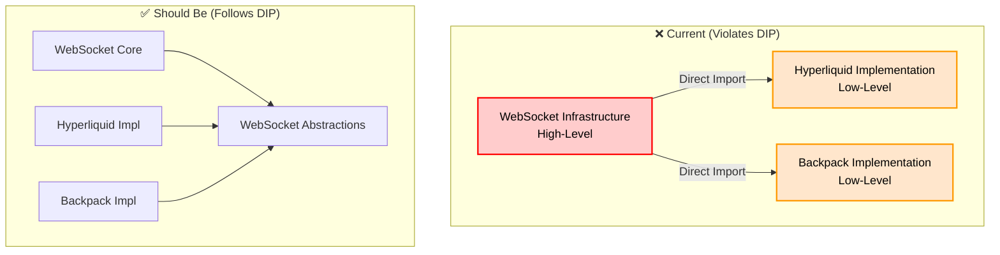
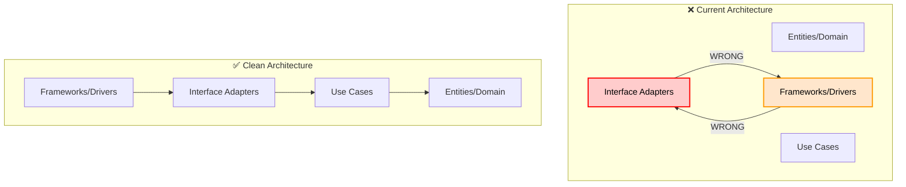
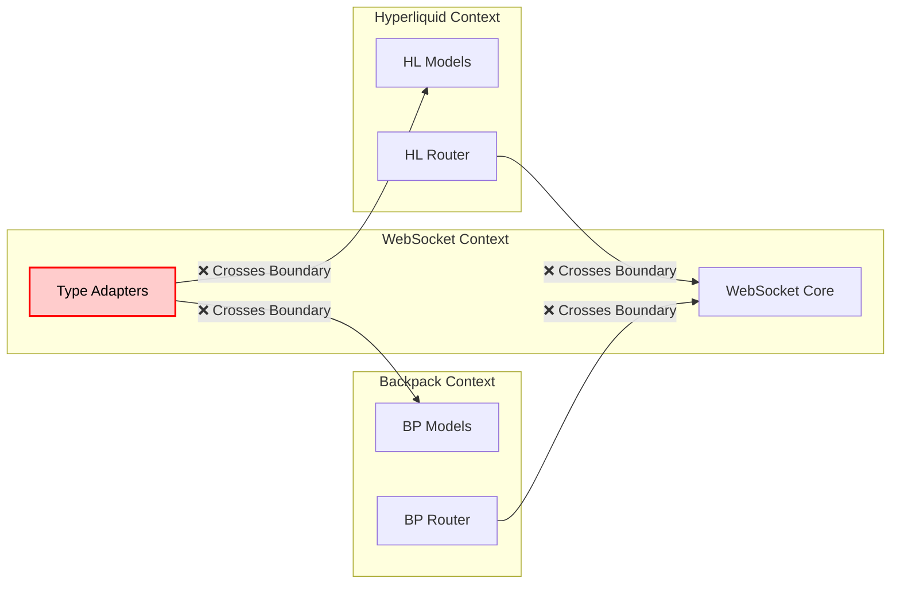
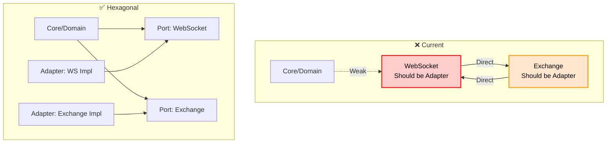

# Architectural Violations Analysis

## SOLID Principles Violations

### 1. Dependency Inversion Principle (DIP) Violation

**Principle:** High-level modules should not depend on low-level modules. Both should depend on abstractions.

**Violation:**


**Code Example:**
```python
# ❌ VIOLATION: ws_type_adapters.py (Infrastructure)
from cyberdelta.apis.hyperliquid.models.hl_raw_ws_events import HyperliquidRawWsFillEvent
# Infrastructure depends on specific implementation!

# ✅ CORRECT: Should be
from cyberdelta.protocols.websocket import WebSocketEventProtocol
# Infrastructure depends on abstraction
```

### 2. Open/Closed Principle (OCP) Violation

**Principle:** Software entities should be open for extension but closed for modification.

**Violation:** Adding a new exchange requires modifying core infrastructure files.

```python
# ❌ VIOLATION: Must modify ws_type_adapters.py for each new exchange
class WebSocketTypeAdapters:
    @staticmethod
    def create_hyperliquid_fill_adapter():  # Hardcoded
        return TypeAdapter(HyperliquidRawWsFillEvent)

    @staticmethod
    def create_backpack_transaction_adapter():  # Hardcoded
        return TypeAdapter(BackpackRawWsTransaction)

    # Must ADD new method for new exchange - violates OCP!
    @staticmethod
    def create_newexchange_adapter():  # Must modify this class
        return TypeAdapter(NewExchangeEvent)
```

**Should Be:**
```python
# ✅ CORRECT: Registry pattern - open for extension
class WebSocketTypeRegistry:
    def register_adapter(self, key: str, adapter: TypeAdapter):
        self._adapters[key] = adapter

    # New exchanges register themselves - no modification needed
```

### 3. Interface Segregation Principle (ISP) Violation

**Principle:** Clients should not be forced to depend on interfaces they don't use.

**Violation:** WebSocket infrastructure knows about ALL exchange-specific types.

```python
# ❌ VIOLATION: ws_discriminated_unions.py
DiscriminatedHyperliquidData = Union[
    HyperliquidRawWsChannel,
    HyperliquidRawWsSubscription,
    HyperliquidRawWsUserEvent,
    HyperliquidRawWsFill,
    HyperliquidRawWsOrderUpdate,
    # ... 10+ more Hyperliquid-specific types
]

# Backpack doesn't need to know about Hyperliquid types!
# But infrastructure forces all types together
```

### 4. Single Responsibility Principle (SRP) Violation

**Principle:** A class should have only one reason to change.

**Violation:** `ws_type_adapters.py` has multiple responsibilities:
1. Create type adapters (core responsibility)
2. Know about Hyperliquid types (exchange-specific)
3. Know about Backpack types (exchange-specific)
4. Know about future exchange types (scalability issue)

```python
# ❌ VIOLATION: Multiple responsibilities
class WebSocketTypeAdapters:
    # Responsibility 1: Adapter creation
    # Responsibility 2: Hyperliquid knowledge
    # Responsibility 3: Backpack knowledge
    # Changes for ANY reason affect this class
```

### 5. Liskov Substitution Principle (LSP) - Indirect Violation

**Principle:** Subtypes must be substitutable for their base types.

**Violation:** Exchange implementations can't be substituted due to hardcoded dependencies.

```python
# ❌ Cannot substitute exchanges cleanly
# Infrastructure expects specific types, not base types
```

## Clean Architecture Violations

### 1. Dependency Rule Violation

**Rule:** Dependencies should point inward toward higher-level policies.



### 2. Layer Violations

| Layer | Should Contain | Actually Contains | Violation |
|-------|---------------|-------------------|-----------|
| Domain | Business entities | ✅ Models | None |
| Application | Use cases | ✅ Services | None |
| Interface | Adapters, Presenters | ❌ Exchange-specific types | Knows implementations |
| Infrastructure | Frameworks, Drivers | ❌ Business logic | Mixed responsibilities |

## Domain-Driven Design (DDD) Violations

### 1. Bounded Context Violation

**Principle:** Each bounded context should be independent.

**Violation:** WebSocket infrastructure crosses bounded contexts:



### 2. Anti-Corruption Layer Missing

**Principle:** Use an anti-corruption layer between bounded contexts.

**Current:** Direct imports between contexts
**Should Have:** Translation layer between WebSocket and Exchange contexts

## Hexagonal Architecture (Ports & Adapters) Violations

### 1. Port/Adapter Pattern Violation



## Coupling and Cohesion Violations

### 1. High Coupling
```python
# Coupling Analysis
ws_type_adapters.py:
  - Coupled to: 14+ exchange-specific models
  - Coupling type: Content Coupling (worst type)
  - Impact: Cannot change exchange models without affecting infrastructure
```

### 2. Low Cohesion
```python
# Cohesion Analysis
ws_type_adapters.py:
  - Responsibilities: 5+ unrelated
  - Cohesion type: Coincidental (worst type)
  - Impact: Changes for any reason affect entire module
```

## Specific Anti-Patterns Present

### 1. God Object
`ws_type_adapters.py` knows too much about the entire system.

### 2. Inappropriate Intimacy
Infrastructure has intimate knowledge of implementation details.

### 3. Feature Envy
WebSocket infrastructure is more interested in exchange data than its own.

### 4. Shotgun Surgery
Adding new exchange requires changes across multiple infrastructure files.

### 5. Circular Dependency
The classic anti-pattern causing the immediate issue.

## Metrics of Violation

### Afferent/Efferent Coupling
```
ws_type_adapters.py:
  Ca (Afferent): 5  (used by 5 modules)
  Ce (Efferent): 20+ (uses 20+ modules)
  Instability: 0.8 (highly unstable)

exchange_api.py:
  Ca: 15+ (used by many)
  Ce: 5   (uses few)
  Instability: 0.25 (stable abstraction)
```

### Cyclomatic Complexity
```
ws_type_adapters.py: 25+ (very high)
ws_discriminated_unions.py: 20+ (high)
hl_ws_router.py: 30+ (very high)
```

### Lines of Code per Responsibility
```
ws_type_adapters.py:
  Core responsibility: ~50 lines
  Hyperliquid knowledge: ~150 lines
  Backpack knowledge: ~100 lines
  Ratio: 1:6 (should be 1:0)
```

## Business Impact of Violations

### 1. Development Velocity
- **Current:** Adding exchange requires 5+ file modifications
- **Should be:** Adding exchange requires 0 infrastructure modifications

### 2. Testing
- **Current:** Cannot unit test infrastructure without all exchanges
- **Should be:** Infrastructure testable in isolation

### 3. Deployment Risk
- **Current:** Infrastructure changes affect all exchanges
- **Should be:** Exchange changes isolated

### 4. Maintenance Cost
- **Current:** High coupling means cascading changes
- **Should be:** Localized changes

## Violation Severity Matrix

| Violation | Severity | Impact | Urgency |
|-----------|----------|--------|---------|
| Circular Dependency | 🔴 Critical | Blocks Development | Immediate |
| DIP Violation | 🔴 Critical | Architecture Debt | High |
| OCP Violation | 🟠 High | Scalability Issue | High |
| SRP Violation | 🟠 High | Maintenance Cost | Medium |
| Coupling Issues | 🟠 High | Change Risk | Medium |
| Missing Abstractions | 🟡 Medium | Design Debt | Medium |

## Required Refactoring Scope

### Immediate (P0)
1. Break circular dependency
2. Extract exchange-specific types from infrastructure

### Short-term (P1)
1. Introduce abstraction layer
2. Implement registration pattern
3. Remove hardcoded types

### Long-term (P2)
1. Full hexagonal architecture
2. Proper bounded contexts
3. Anti-corruption layers

## Conclusion

The current architecture violates fundamental design principles at multiple levels:
- **SOLID:** All 5 principles violated to varying degrees
- **Clean Architecture:** Dependency rule completely broken
- **DDD:** Bounded contexts not respected
- **Hexagonal:** No proper ports/adapters

These violations compound to create a brittle, unmaintainable system that will become exponentially more difficult to extend and maintain as more exchanges are added. The immediate circular dependency is just the visible symptom of deeper architectural debt.
