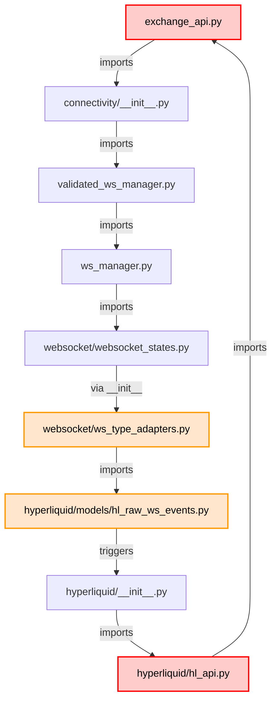
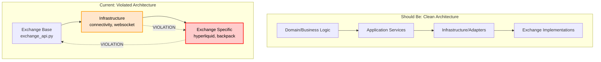
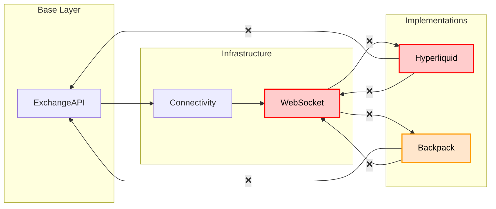
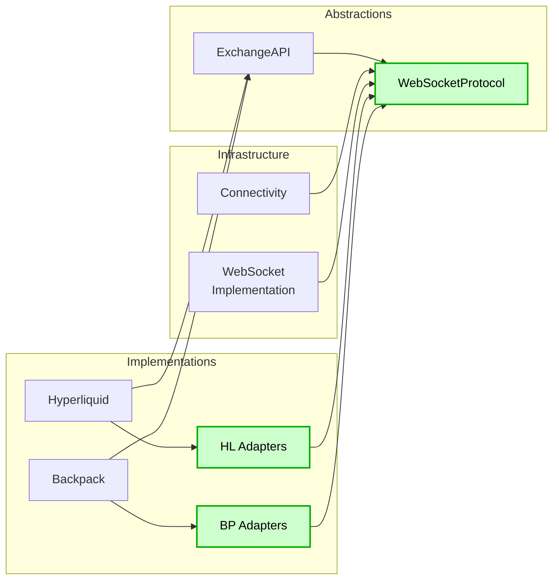

# WebSocket API Circular Dependency Analysis

## Executive Summary

The CyberDeltaEngine codebase has a critical circular dependency between the base Exchange API abstraction and exchange-specific implementations (particularly Hyperliquid). This creates a fundamental architectural violation where infrastructure layers depend on implementation details, preventing proper module initialization and blocking runtime execution.

## The Problem

When attempting to import `ExchangeAPI` or run `main.py`, Python encounters a circular import:

```
ImportError: cannot import name 'ExchangeAPI' from partially initialized module
'cyberdelta.apis.base.exchange_api' (most likely due to a circular import)
```

## Root Cause Analysis

### Primary Circular Chain



### Architectural Layer Violation



## Detailed Import Chain Analysis

### 1. Starting Point: exchange_api.py
```python
# File: cyberdelta/apis/base/exchange_api.py
from cyberdelta.apis.connectivity.connectivity_models import (
    ConnectivityConfig,
    ConnectivityState,
)
```

### 2. Connectivity Layer Chain
```python
# File: cyberdelta/apis/connectivity/__init__.py
from .validated_ws_manager import ValidatedWebSocketManager

# File: cyberdelta/apis/connectivity/validated_ws_manager.py
from cyberdelta.apis.connectivity.ws_manager import MessageHandler, WebSocketManager

# File: cyberdelta/apis/connectivity/ws_manager.py
from cyberdelta.apis.websocket.websocket_states import CancellationState
```

### 3. WebSocket Layer - The Violation Point
```python
# File: cyberdelta/apis/websocket/__init__.py
from .ws_type_adapters import WebSocketTypeAdapters

# File: cyberdelta/apis/websocket/ws_type_adapters.py (VIOLATION!)
from cyberdelta.apis.hyperliquid.models.hl_raw_ws_events import (
    HyperliquidRawWsFillEvent,  # ← Exchange-specific import in infrastructure!
)
from cyberdelta.apis.backpack.models.bp_raw_ws_models import (
    BackpackRawWsTransaction,  # ← Another violation!
)
```

### 4. Exchange Package Initialization
```python
# File: cyberdelta/apis/hyperliquid/__init__.py
from .hl_api import HyperliquidAPI  # Triggers the import

# File: cyberdelta/apis/hyperliquid/hl_api.py
from cyberdelta.apis.base.exchange_api import ExchangeAPI  # CIRCULAR!
```

## Files Involved in Circular Dependency

### Core Circle (17 files)
1. `cyberdelta/apis/base/exchange_api.py`
2. `cyberdelta/apis/connectivity/__init__.py`
3. `cyberdelta/apis/connectivity/validated_ws_manager.py`
4. `cyberdelta/apis/connectivity/ws_manager.py`
5. `cyberdelta/apis/websocket/__init__.py`
6. `cyberdelta/apis/websocket/websocket_states.py`
7. `cyberdelta/apis/websocket/ws_type_adapters.py` ⚠️
8. `cyberdelta/apis/websocket/ws_discriminated_unions.py` ⚠️
9. `cyberdelta/apis/hyperliquid/__init__.py`
10. `cyberdelta/apis/hyperliquid/hl_api.py`
11. `cyberdelta/apis/hyperliquid/models/hl_raw_ws_events.py`
12. `cyberdelta/apis/hyperliquid/hl_ws_router.py` ⚠️
13. `cyberdelta/apis/backpack/__init__.py`
14. `cyberdelta/apis/backpack/bp_api.py`
15. `cyberdelta/apis/backpack/models/bp_raw_ws_models.py`
16. `cyberdelta/apis/backpack/bp_ws_router.py` ⚠️
17. `cyberdelta/apis/websocket/ws_message_handler.py`

## Architectural Violations

### Violation 1: Infrastructure Depends on Implementation
**Location:** `ws_type_adapters.py`
```python
# WRONG: Infrastructure layer importing specific implementations
from cyberdelta.apis.hyperliquid.models.hl_raw_ws_events import HyperliquidRawWsFillEvent
from cyberdelta.apis.backpack.models.bp_raw_ws_models import BackpackRawWsTransaction
```

**Impact:** WebSocket infrastructure is tightly coupled to specific exchanges, making it impossible to add new exchanges without modifying core infrastructure.

### Violation 2: Discriminated Unions with Hardcoded Types
**Location:** `ws_discriminated_unions.py`
```python
# WRONG: Infrastructure defining exchange-specific types
DiscriminatedHyperliquidData = Annotated[
    Union[
        HyperliquidRawWsChannel,
        HyperliquidRawWsSubscription,
        # ... more Hyperliquid-specific types
    ],
    Field(discriminator="channel"),
]
```

**Impact:** Every new exchange requires modifying core WebSocket infrastructure files.

### Violation 3: Exchange Routers Import WebSocket Implementation
**Location:** `hl_ws_router.py`, `bp_ws_router.py`
```python
# WRONG: Implementation importing infrastructure internals
from cyberdelta.apis.websocket.ws_message_handler import (
    WebSocketMessageHandler,
    WebSocketRouter,
)
```

**Impact:** Exchange implementations are coupled to specific WebSocket implementation details rather than interfaces.

## Dependency Direction Analysis

### Current (Broken) Dependencies


### Correct Dependencies (Target)


## Type Adapter Registration Pattern

The current implementation hardcodes type adapters in the infrastructure:

```python
# Current: ws_type_adapters.py
class WebSocketTypeAdapters:
    """Hardcoded adapters for all exchanges."""

    @staticmethod
    def create_hyperliquid_fill_adapter() -> TypeAdapter[HyperliquidRawWsFillEvent]:
        # Hardcoded Hyperliquid-specific adapter
        return TypeAdapter(HyperliquidRawWsFillEvent)
```

This should be inverted to a registration pattern:

```python
# Proposed: ws_type_registry.py
class WebSocketTypeRegistry:
    """Registry for exchange-specific type adapters."""

    def register_adapter(self, exchange: str, event_type: str, adapter: TypeAdapter) -> None:
        """Exchanges register their own adapters."""
        self._adapters[(exchange, event_type)] = adapter
```

## Impact Analysis

### Current Issues
1. **Cannot import ExchangeAPI** - Blocks all exchange implementations
2. **Cannot run main.py** - Application fails to start
3. **Cannot add new exchanges** - Would require modifying core infrastructure
4. **Tight coupling** - Changes to exchange models break infrastructure
5. **Violates SOLID principles** - Specifically Dependency Inversion and Open/Closed

### Business Impact
- **Development velocity:** Slowed by architectural debt
- **Testing:** Cannot unit test layers independently
- **Scalability:** Adding new exchanges requires core changes
- **Maintainability:** Changes cascade across layers
- **Risk:** Production failures from import order changes

## Comparison: Hyperliquid vs Backpack

| Aspect | Hyperliquid | Backpack | Notes |
|--------|-------------|----------|-------|
| Direct API import | ❌ Fails | ✅ Works* | *Only when not through __init__ |
| WebSocket models imported by infra | ✅ Yes | ✅ Yes | Both violate architecture |
| Router imports WS implementation | ✅ Yes | ✅ Yes | Both have coupling issue |
| Discriminated unions | ✅ Hardcoded | ✅ Hardcoded | Both in infrastructure |
| Type adapters | ✅ Hardcoded | ✅ Hardcoded | Both in infrastructure |

## Key Findings

1. **The WebSocket layer was designed as exchange-aware rather than exchange-agnostic**
   - This is the fundamental architectural flaw
   - Infrastructure should never import from implementations

2. **Both Hyperliquid and Backpack have the same architectural issues**
   - Backpack only appears to work due to import timing
   - The same circular dependency pattern exists

3. **The discriminated union pattern is implemented backwards**
   - Unions should be defined by implementations, not infrastructure
   - Infrastructure should work with abstract types

4. **Type adapters are hardcoded instead of registered**
   - Infrastructure knows about all exchange types
   - Violates Open/Closed Principle

## Conclusion

This is not just a technical import issue but a fundamental architectural debt. The WebSocket infrastructure layer has been implemented with knowledge of specific exchange implementations, creating tight coupling and circular dependencies. This violates core architectural principles (DIP, OCP) and creates a brittle system that will become increasingly difficult to maintain and extend.

The solution requires inverting the dependencies through proper abstraction and registration patterns, allowing exchange implementations to extend the infrastructure without the infrastructure knowing about specific implementations.
