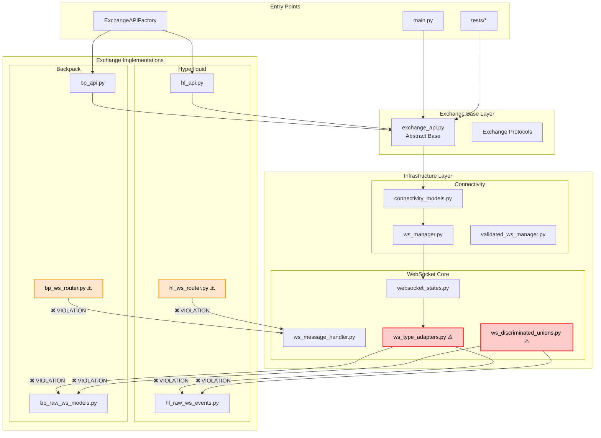
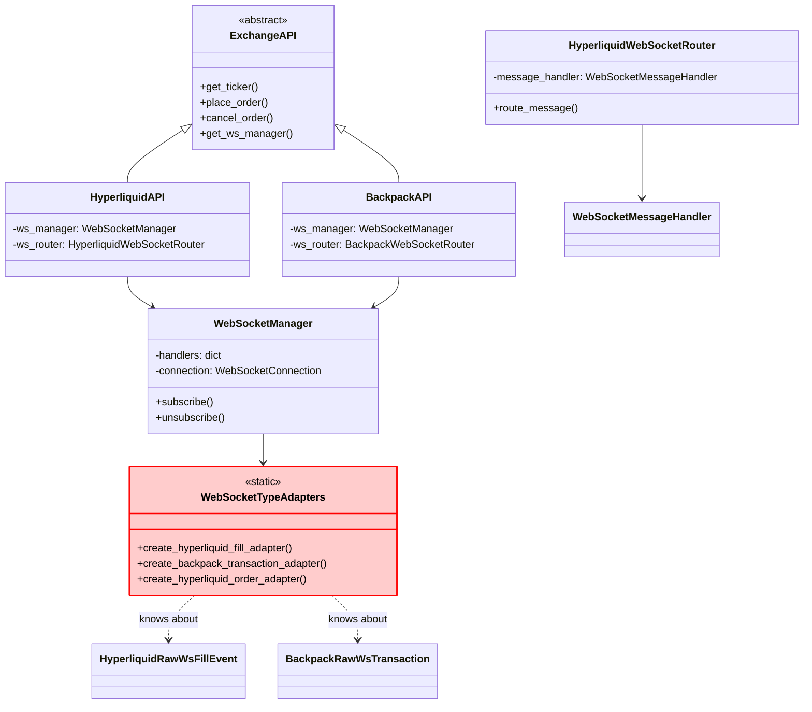
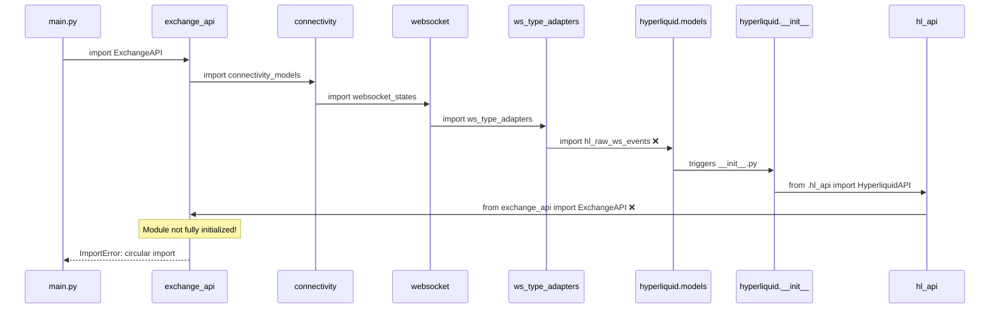
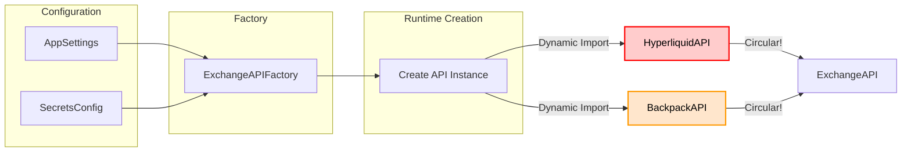

# Current Architecture - Detailed Analysis

## Overview

This document provides a detailed view of the current architecture showing how the circular dependency manifests across different layers and modules.

## Layer Structure



## Module Dependencies

### Exchange API Base
```python
# exchange_api.py dependencies
cyberdelta.apis.connectivity.connectivity_models
cyberdelta.apis.connectivity.validated_ws_manager
cyberdelta.config.models.exchange_config
cyberdelta.models.market.*
cyberdelta.models.trading.*
```

### Connectivity Layer
```python
# ws_manager.py dependencies
cyberdelta.apis.websocket.websocket_states  # ← Starts upward dependency
cyberdelta.apis.connectivity.connection_config
cyberdelta.apis.connectivity.rate_limiter
```

### WebSocket Layer (Violation Point)
```python
# ws_type_adapters.py - THE MAIN VIOLATOR
from cyberdelta.apis.hyperliquid.models.hl_raw_ws_events import (
    HyperliquidRawWsFillEvent,
    HyperliquidRawWsLedgerUpdate,
    HyperliquidRawWsNonFundingLedgerUpdate,
    HyperliquidRawWsOrderUpdate,
    HyperliquidRawWsPong,
    HyperliquidRawWsUserEvent,
)
from cyberdelta.apis.backpack.models.bp_raw_ws_models import (
    BackpackRawWsAccountData,
    BackpackRawWsBalanceData,
    BackpackRawWsEventData,
    BackpackRawWsOrderUpdate,
    BackpackRawWsPriceData,
    BackpackRawWsTransaction,
)
```

## Class Relationships



## Import Flow Timeline



## WebSocket Infrastructure Problems

### 1. Type Adapter Hardcoding
```python
class WebSocketTypeAdapters:
    """Central adapter factory with hardcoded exchange knowledge."""

    @staticmethod
    def create_hyperliquid_fill_adapter() -> TypeAdapter[HyperliquidRawWsFillEvent]:
        return TypeAdapter(HyperliquidRawWsFillEvent)

    @staticmethod
    def create_backpack_transaction_adapter() -> TypeAdapter[BackpackRawWsTransaction]:
        return TypeAdapter(BackpackRawWsTransaction)

    # One method per exchange type - not scalable!
```

### 2. Discriminated Union Hardcoding
```python
# ws_discriminated_unions.py
DiscriminatedHyperliquidData = Annotated[
    Union[
        HyperliquidRawWsChannel,
        HyperliquidRawWsSubscription,
        HyperliquidRawWsUserEvent,
        # ... all Hyperliquid types hardcoded
    ],
    Field(discriminator="channel"),
]

DiscriminatedBackpackData = Annotated[
    Union[
        BackpackRawWsEventData,
        BackpackRawWsOrderUpdate,
        # ... all Backpack types hardcoded
    ],
    Field(discriminator="type"),
]
```

### 3. Router Implementation Issues
```python
# hl_ws_router.py
from cyberdelta.apis.websocket.ws_message_handler import (
    WebSocketMessageHandler,  # Infrastructure detail
    WebSocketRouter,          # Should be protocol
)

class HyperliquidWebSocketRouter(WebSocketRouter):
    """Tightly coupled to WebSocket implementation."""

    def __init__(self, message_handler: WebSocketMessageHandler):
        # Direct dependency on implementation
        self._message_handler = message_handler
```

## Configuration Flow



## Key Architectural Smells

1. **Infrastructure knows about implementations**
   - `ws_type_adapters.py` imports specific exchange models
   - `ws_discriminated_unions.py` defines exchange-specific unions

2. **Implementations depend on infrastructure internals**
   - Exchange routers import `WebSocketMessageHandler` directly
   - Should depend on protocols/interfaces

3. **No abstraction layer between WebSocket and exchanges**
   - Direct coupling via imports
   - No registration or plugin mechanism

4. **Package initialization triggers imports**
   - `__init__.py` files import implementation classes
   - Causes immediate circular dependency

## Module Size and Complexity

| Module | Lines | Imports | Violations |
|--------|-------|---------|------------|
| ws_type_adapters.py | 300+ | 15+ | 10+ exchange-specific |
| ws_discriminated_unions.py | 250+ | 12+ | All unions hardcoded |
| hl_ws_router.py | 400+ | 8+ | Infrastructure imports |
| bp_ws_router.py | 350+ | 7+ | Infrastructure imports |
| exchange_api.py | 500+ | 20+ | Clean (base) |

## Coupling Metrics

- **Afferent Coupling (Ca):** Number of classes that depend on this class
  - `exchange_api.py`: 15+ (all exchanges + tests)
  - `ws_type_adapters.py`: 5+ (WebSocket infrastructure)

- **Efferent Coupling (Ce):** Number of classes this class depends on
  - `ws_type_adapters.py`: 20+ (all exchange models!)
  - `hl_ws_router.py`: 10+ (infrastructure + models)

- **Instability (I = Ce / (Ca + Ce)):**
  - `ws_type_adapters.py`: 0.8 (highly unstable, changes frequently)
  - `exchange_api.py`: 0.25 (stable abstraction)

The high instability of infrastructure components that should be stable indicates the architectural violation.
