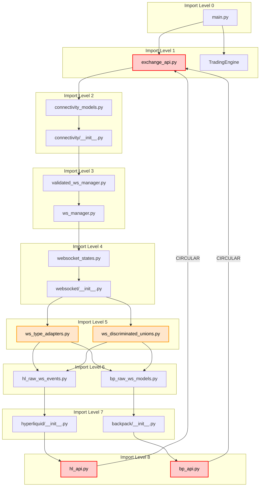
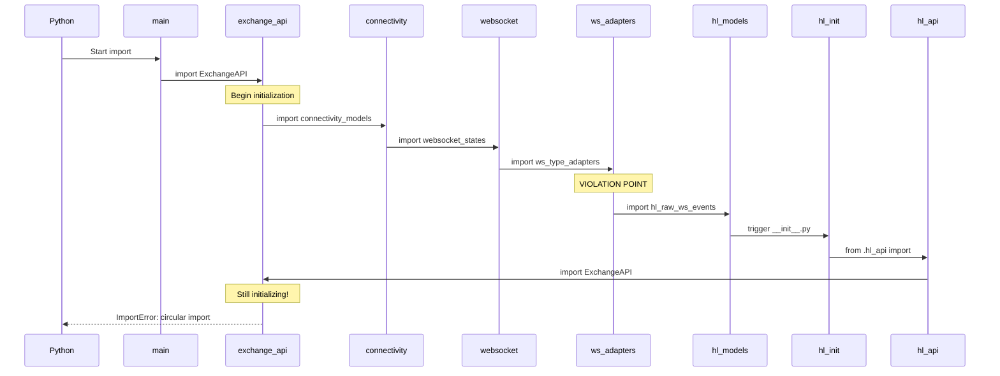

# Detailed Import Chain Analysis

## Complete Import Chains

### Chain 1: Main Entry Point to Circular Error

```
main.py
  └─> from cyberdelta.apis.base.exchange_api import ExchangeAPI
      └─> from cyberdelta.apis.connectivity.connectivity_models import ConnectivityConfig
          └─> (triggers connectivity/__init__.py)
              └─> from .validated_ws_manager import ValidatedWebSocketManager
                  └─> from cyberdelta.apis.connectivity.ws_manager import WebSocketManager
                      └─> from cyberdelta.apis.websocket.websocket_states import CancellationState
                          └─> (triggers websocket/__init__.py)
                              └─> from .ws_type_adapters import WebSocketTypeAdapters
                                  └─> from cyberdelta.apis.hyperliquid.models.hl_raw_ws_events import HyperliquidRawWsFillEvent
                                      └─> (triggers hyperliquid/__init__.py)
                                          └─> from .hl_api import HyperliquidAPI
                                              └─> from cyberdelta.apis.base.exchange_api import ExchangeAPI ❌ CIRCULAR!
```

### Chain 2: Factory Pattern to Circular Error

```
ExchangeAPIFactory.create_api_client()
  └─> _import_exchange_module("cyberdelta.apis.hyperliquid.hl_api")
      └─> import cyberdelta.apis.hyperliquid.hl_api
          └─> from cyberdelta.apis.base.exchange_api import ExchangeAPI
              └─> [Same chain as above] ❌ CIRCULAR!
```

### Chain 3: WebSocket Discriminated Unions

```
ws_discriminated_unions.py
  └─> from cyberdelta.apis.hyperliquid.models.hl_raw_ws_channel import HyperliquidRawWsChannel
  └─> from cyberdelta.apis.hyperliquid.models.hl_raw_ws_events import HyperliquidRawWsUserEvent
  └─> from cyberdelta.apis.backpack.models.bp_raw_ws_models import BackpackRawWsEventData
      └─> (Each triggers respective __init__.py if present)
          └─> Potential circular dependencies
```

## Import Graph Visualization



## Specific Import Statements

### ws_type_adapters.py (Main Violator)
```python
# Lines 23-30
from cyberdelta.apis.hyperliquid.models.hl_raw_ws_events import (
    HyperliquidRawWsFillEvent,
    HyperliquidRawWsLedgerUpdate,
    HyperliquidRawWsNonFundingLedgerUpdate,
    HyperliquidRawWsOrderUpdate,
    HyperliquidRawWsPong,
    HyperliquidRawWsUserEvent,
)

# Lines 31-38
from cyberdelta.apis.backpack.models.bp_raw_ws_models import (
    BackpackRawWsAccountData,
    BackpackRawWsBalanceData,
    BackpackRawWsEventData,
    BackpackRawWsOrderUpdate,
    BackpackRawWsPriceData,
    BackpackRawWsTransaction,
)
```

### ws_discriminated_unions.py (Secondary Violator)
```python
# Lines 15-25
from cyberdelta.apis.hyperliquid.models.hl_raw_ws_channel import (
    HyperliquidRawWsChannel,
)
from cyberdelta.apis.hyperliquid.models.hl_raw_ws_events import (
    HyperliquidRawWsAllMids,
    HyperliquidRawWsBook,
    HyperliquidRawWsCandle,
    HyperliquidRawWsFill,
    HyperliquidRawWsTrade,
    HyperliquidRawWsUserEvent,
)

# Lines 26-32
from cyberdelta.apis.backpack.models.bp_raw_ws_models import (
    BackpackRawWsEventData,
    BackpackRawWsOrderUpdate,
    BackpackRawWsPriceData,
)
```

### Exchange Router Violations
```python
# hl_ws_router.py - Lines 8-12
from cyberdelta.apis.websocket.ws_message_handler import (
    WebSocketMessageHandler,
    WebSocketRouter,
)

# bp_ws_router.py - Lines 7-11
from cyberdelta.apis.websocket.ws_message_handler import (
    WebSocketMessageHandler,
    WebSocketRouter,
)
```

## Import Timing Analysis

### Successful Import Path (when it works)
```python
# If you import specific module directly without __init__:
from cyberdelta.apis.hyperliquid.hl_api import HyperliquidAPI
# This MAY work if exchange_api is already imported elsewhere
```

### Failed Import Path (circular)
```python
# If __init__.py triggers the import:
import cyberdelta.apis.hyperliquid  # Triggers __init__.py
# __init__.py: from .hl_api import HyperliquidAPI
# This WILL fail with circular import
```

## Module Initialization Order



## Import Dependencies by Module

### exchange_api.py
```
Total imports: 25
Direct violations: 0
Indirect violations: Via connectivity → websocket → exchanges
```

### ws_type_adapters.py
```
Total imports: 20
Direct violations: 14 (all exchange model imports)
Impact: Forces all exchange models to load
```

### ws_discriminated_unions.py
```
Total imports: 15
Direct violations: 10 (exchange model imports)
Impact: Hardcodes all exchange types
```

### hl_ws_router.py
```
Total imports: 12
Direct violations: 2 (infrastructure imports)
Impact: Couples to implementation
```

## Python Import Mechanism Issues

### 1. Module Caching
```python
# Python caches partially initialized modules
import sys
print(sys.modules.get('cyberdelta.apis.base.exchange_api'))
# <module 'cyberdelta.apis.base.exchange_api' (partially initialized)>
```

### 2. __init__.py Side Effects
```python
# hyperliquid/__init__.py
from .hl_api import HyperliquidAPI  # Side effect on import!
__all__ = ["HyperliquidAPI"]

# This runs immediately when any hyperliquid submodule is imported
```

### 3. Import Order Sensitivity
```python
# This might work:
import cyberdelta.apis.base.exchange_api
import cyberdelta.apis.hyperliquid.hl_api

# This will fail:
import cyberdelta.apis.hyperliquid.hl_api  # Circular!
```

## Verification Commands

```bash
# Check import chain
python -c "import sys; sys.path.insert(0, '.'); from cyberdelta.apis.base.exchange_api import ExchangeAPI"

# Check specific violation
python -c "import sys; sys.path.insert(0, '.'); from cyberdelta.apis.websocket.ws_type_adapters import WebSocketTypeAdapters"

# Trace imports
python -v -c "from cyberdelta.apis.base.exchange_api import ExchangeAPI" 2>&1 | grep "^import"
```

## Summary Statistics

- **Total modules in circular chain:** 17
- **Direct violation points:** 4 files
- **Exchange-specific imports in infrastructure:** 24
- **Hardcoded exchange types:** 15+
- **Layers violated:** 3 (Infrastructure → Implementation → Base)
