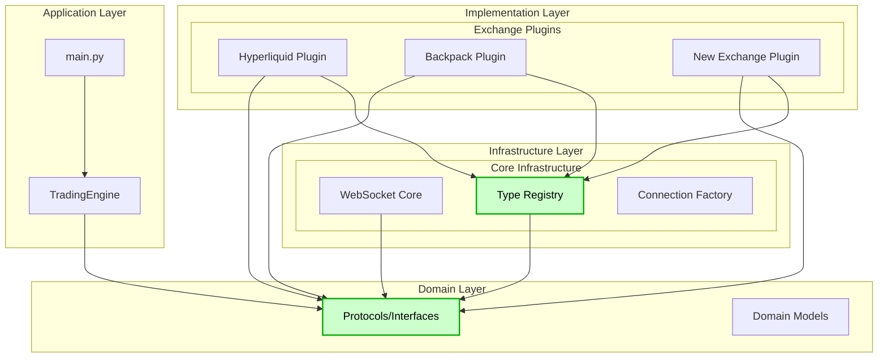
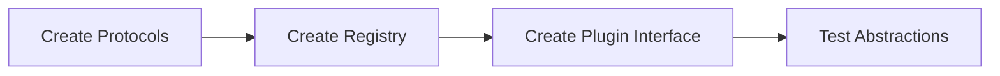
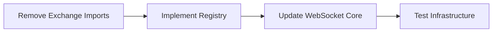
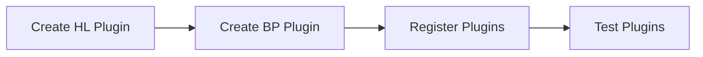
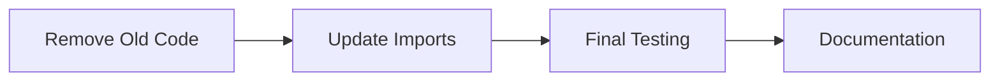
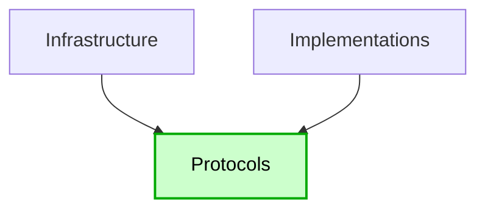

# Proposed Solution Architecture

## Overview

This document presents a comprehensive solution to fix the circular dependency and establish a clean, scalable architecture for the WebSocket/API system.

## Solution Summary

Transform the current tightly-coupled architecture into a plugin-based system using:
1. **Dependency Inversion** via protocols/interfaces
2. **Registration Pattern** for type adapters
3. **Plugin Architecture** for exchange implementations
4. **Event-Driven** communication between layers

## High-Level Architecture



## Detailed Solution Components

### 1. Protocol Layer (New)

Create abstract protocols that define contracts without implementation:

```python
# cyberdelta/protocols/websocket_protocol.py
from typing import Protocol, TypeVar, Generic, Any
from abc import abstractmethod

T = TypeVar('T')

class WebSocketEventProtocol(Protocol):
    """Base protocol for all WebSocket events."""

    @abstractmethod
    def get_event_type(self) -> str:
        """Return the event type identifier."""
        ...

    @abstractmethod
    def to_dict(self) -> dict[str, Any]:
        """Convert to dictionary representation."""
        ...

class WebSocketAdapterProtocol(Protocol[T]):
    """Protocol for type adapters."""

    @abstractmethod
    def parse(self, data: dict[str, Any]) -> T:
        """Parse raw data into typed event."""
        ...

    @abstractmethod
    def validate(self, data: dict[str, Any]) -> bool:
        """Validate if data matches expected format."""
        ...

class WebSocketRouterProtocol(Protocol):
    """Protocol for message routing."""

    @abstractmethod
    async def route_message(self, message: dict[str, Any]) -> None:
        """Route message to appropriate handler."""
        ...

class ExchangePluginProtocol(Protocol):
    """Protocol for exchange plugins."""

    @abstractmethod
    def register_adapters(self, registry: 'TypeRegistryProtocol') -> None:
        """Register type adapters with the registry."""
        ...

    @abstractmethod
    def get_router(self) -> WebSocketRouterProtocol:
        """Get the WebSocket router for this exchange."""
        ...
```

### 2. Type Registry (Replaces ws_type_adapters.py)

```python
# cyberdelta/infrastructure/websocket/type_registry.py
from typing import Dict, Type, Any, Optional
from cyberdelta.protocols.websocket_protocol import (
    WebSocketAdapterProtocol,
    TypeRegistryProtocol
)

class WebSocketTypeRegistry(TypeRegistryProtocol):
    """Central registry for type adapters - knows no specific types."""

    def __init__(self):
        self._adapters: Dict[str, WebSocketAdapterProtocol] = {}
        self._discriminators: Dict[str, str] = {}

    def register_adapter(
        self,
        exchange: str,
        event_type: str,
        adapter: WebSocketAdapterProtocol
    ) -> None:
        """Register an adapter for a specific exchange and event type."""
        key = f"{exchange}:{event_type}"
        self._adapters[key] = adapter

    def get_adapter(
        self,
        exchange: str,
        event_type: str
    ) -> Optional[WebSocketAdapterProtocol]:
        """Retrieve an adapter for parsing."""
        key = f"{exchange}:{event_type}"
        return self._adapters.get(key)

    def register_discriminator(self, exchange: str, field: str) -> None:
        """Register the discriminator field for an exchange."""
        self._discriminators[exchange] = field

    # No knowledge of specific exchange types!
```

### 3. Exchange Plugin Implementation

```python
# cyberdelta/apis/hyperliquid/hl_plugin.py
from cyberdelta.protocols.websocket_protocol import (
    ExchangePluginProtocol,
    WebSocketRouterProtocol,
    TypeRegistryProtocol
)
from .adapters.hl_type_adapters import HyperliquidTypeAdapters
from .routers.hl_ws_router import HyperliquidWebSocketRouter

class HyperliquidPlugin(ExchangePluginProtocol):
    """Plugin for Hyperliquid exchange."""

    def __init__(self):
        self._adapters = HyperliquidTypeAdapters()
        self._router = HyperliquidWebSocketRouter()

    def register_adapters(self, registry: TypeRegistryProtocol) -> None:
        """Register all Hyperliquid type adapters."""
        # Register discriminator
        registry.register_discriminator("hyperliquid", "channel")

        # Register each adapter
        for event_type, adapter in self._adapters.get_all_adapters().items():
            registry.register_adapter("hyperliquid", event_type, adapter)

    def get_router(self) -> WebSocketRouterProtocol:
        """Get the Hyperliquid router."""
        return self._router
```

### 4. Plugin Registration System

```python
# cyberdelta/infrastructure/plugins/plugin_manager.py
from typing import Dict, Optional
from cyberdelta.protocols.websocket_protocol import ExchangePluginProtocol

class PluginManager:
    """Manages exchange plugins."""

    def __init__(self, registry: WebSocketTypeRegistry):
        self._plugins: Dict[str, ExchangePluginProtocol] = {}
        self._registry = registry

    def register_plugin(self, exchange: str, plugin: ExchangePluginProtocol) -> None:
        """Register an exchange plugin."""
        self._plugins[exchange] = plugin
        plugin.register_adapters(self._registry)

    def get_plugin(self, exchange: str) -> Optional[ExchangePluginProtocol]:
        """Get a registered plugin."""
        return self._plugins.get(exchange)

    def auto_discover_plugins(self) -> None:
        """Auto-discover and register plugins."""
        # Use entry points or configuration
        pass
```

### 5. Refactored WebSocket Manager

```python
# cyberdelta/infrastructure/websocket/ws_manager.py
from cyberdelta.protocols.websocket_protocol import (
    WebSocketEventProtocol,
    WebSocketRouterProtocol
)

class WebSocketManager:
    """WebSocket manager - no knowledge of specific exchanges."""

    def __init__(
        self,
        registry: WebSocketTypeRegistry,
        plugin_manager: PluginManager
    ):
        self._registry = registry
        self._plugin_manager = plugin_manager
        # No imports of exchange-specific types!

    async def process_message(
        self,
        exchange: str,
        message: dict[str, Any]
    ) -> None:
        """Process a WebSocket message."""
        # Get plugin for this exchange
        plugin = self._plugin_manager.get_plugin(exchange)
        if not plugin:
            raise ValueError(f"No plugin registered for {exchange}")

        # Get router from plugin
        router = plugin.get_router()

        # Route message (plugin handles specifics)
        await router.route_message(message)
```

## Migration Strategy

### Phase 1: Create Abstraction Layer (Week 1)


### Phase 2: Refactor Infrastructure (Week 2)


### Phase 3: Implement Plugins (Week 3)


### Phase 4: Clean Up (Week 4)


## File Structure After Refactoring

```
cyberdelta/
├── protocols/
│   ├── __init__.py
│   ├── websocket_protocol.py      # All WebSocket protocols
│   ├── exchange_protocol.py       # Exchange protocols
│   └── type_adapter_protocol.py   # Adapter protocols
│
├── infrastructure/
│   ├── websocket/
│   │   ├── __init__.py
│   │   ├── ws_manager.py         # Clean, no exchange imports
│   │   ├── type_registry.py      # Replaces ws_type_adapters
│   │   └── connection.py
│   │
│   └── plugins/
│       ├── __init__.py
│       ├── plugin_manager.py     # Plugin registration
│       └── plugin_loader.py      # Auto-discovery
│
└── apis/
    ├── hyperliquid/
    │   ├── __init__.py           # No circular imports!
    │   ├── hl_api.py
    │   ├── hl_plugin.py          # NEW: Plugin implementation
    │   ├── adapters/
    │   │   └── hl_type_adapters.py  # Exchange-specific adapters
    │   └── routers/
    │       └── hl_ws_router.py   # Implements protocol
    │
    └── backpack/
        ├── __init__.py           # No circular imports!
        ├── bp_api.py
        ├── bp_plugin.py          # NEW: Plugin implementation
        ├── adapters/
        │   └── bp_type_adapters.py
        └── routers/
            └── bp_ws_router.py
```

## Configuration Changes

```yaml
# config.yaml
plugins:
  exchanges:
    hyperliquid:
      enabled: true
      module: "cyberdelta.apis.hyperliquid.hl_plugin"
      class: "HyperliquidPlugin"
    backpack:
      enabled: true
      module: "cyberdelta.apis.backpack.bp_plugin"
      class: "BackpackPlugin"
    # Easy to add new exchanges!
    newexchange:
      enabled: false
      module: "cyberdelta.apis.newexchange.plugin"
      class: "NewExchangePlugin"
```

## Benefits of Proposed Solution

### 1. No Circular Dependencies


### 2. Open/Closed Principle
- Add new exchanges without modifying infrastructure
- Register new types without changing core code

### 3. Dependency Inversion
- High-level modules depend on abstractions
- Low-level modules implement abstractions

### 4. Testability
- Infrastructure testable without exchange code
- Exchanges testable with mock infrastructure
- Protocols provide clear testing interfaces

### 5. Scalability
- Add unlimited exchanges
- No infrastructure changes required
- Plugin system scales horizontally

## Implementation Priority

### Critical Path (Must Do First)
1. Create protocol layer
2. Implement type registry
3. Remove exchange imports from infrastructure

### High Priority
1. Create plugin manager
2. Implement first plugin (Hyperliquid)
3. Test circular dependency resolution

### Medium Priority
1. Implement remaining plugins
2. Add auto-discovery
3. Update documentation

## Success Metrics

| Metric | Current | Target |
|--------|---------|--------|
| Circular Dependencies | 1 major | 0 |
| Infrastructure files modified per new exchange | 4+ | 0 |
| Exchange-specific imports in infrastructure | 24+ | 0 |
| Test isolation | Poor | Complete |
| Time to add new exchange | Days | Hours |

## Example: Adding a New Exchange

### Current Process (Complex)
1. Modify `ws_type_adapters.py` ❌
2. Modify `ws_discriminated_unions.py` ❌
3. Add hardcoded methods ❌
4. Risk breaking existing exchanges ❌

### New Process (Simple)
```python
# 1. Create plugin
class NewExchangePlugin(ExchangePluginProtocol):
    def register_adapters(self, registry):
        # Register your adapters
        pass

# 2. Register in config
plugins:
  newexchange:
    enabled: true
    module: "path.to.plugin"

# 3. Done! No infrastructure changes needed ✅
```

## Conclusion

This solution:
1. **Eliminates the circular dependency** by inverting dependencies
2. **Establishes clean architecture** with proper layers
3. **Enables scalability** through plugin system
4. **Improves maintainability** via clear abstractions
5. **Reduces risk** by isolating changes

The investment in this refactoring will pay dividends as the system grows to support 20+ exchanges.
