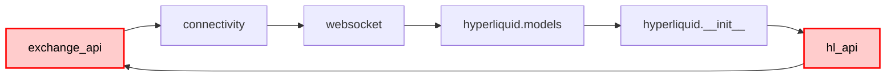
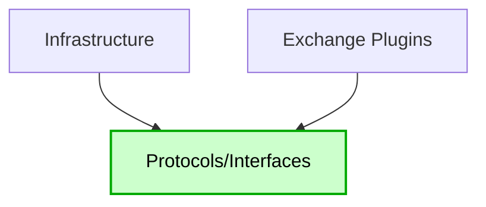

# WebSocket API Circular Dependency Documentation

## Overview

This directory contains comprehensive documentation of the critical circular dependency issue in the CyberDeltaEngine WebSocket/API architecture.

## Problem Statement

The CyberDeltaEngine codebase suffers from a circular import dependency that prevents the application from running:

```
ImportError: cannot import name 'ExchangeAPI' from partially initialized module
'cyberdelta.apis.base.exchange_api' (most likely due to a circular import)
```

## Documentation Structure

### 1. [CIRCULAR_DEPENDENCY_ANALYSIS.md](./CIRCULAR_DEPENDENCY_ANALYSIS.md)
**Executive analysis of the circular dependency**
- Root cause identification
- Business impact assessment
- High-level architectural violations
- Key findings and conclusions

### 2. [CURRENT_ARCHITECTURE.md](./CURRENT_ARCHITECTURE.md)
**Detailed view of existing architecture**
- Layer structure and dependencies
- Module relationships
- Class diagrams
- Coupling metrics

### 3. [IMPORT_CHAIN_DETAILS.md](./IMPORT_CHAIN_DETAILS.md)
**Complete import chain analysis**
- Step-by-step import flow
- Specific import statements
- Module initialization order
- Verification commands

### 4. [ARCHITECTURAL_VIOLATIONS.md](./ARCHITECTURAL_VIOLATIONS.md)
**Comprehensive violation analysis**
- SOLID principles violations
- Clean Architecture violations
- DDD and Hexagonal Architecture issues
- Anti-patterns and code smells

### 5. [PROPOSED_SOLUTION.md](./PROPOSED_SOLUTION.md)
**Complete solution architecture**
- Plugin-based system design
- Protocol layer implementation
- Migration strategy
- Implementation examples

## Quick Summary

### The Problem


### Root Cause
The WebSocket infrastructure layer (`ws_type_adapters.py`, `ws_discriminated_unions.py`) directly imports exchange-specific models, violating the Dependency Inversion Principle and creating circular dependencies.

### The Solution


## Key Violations

1. **Dependency Inversion Principle**: Infrastructure depends on implementations
2. **Open/Closed Principle**: Must modify core files for new exchanges
3. **Single Responsibility**: Infrastructure knows about all exchanges
4. **Clean Architecture**: Dependencies flow in wrong direction

## Impact

- **Development**: Cannot import or run main.py
- **Testing**: Cannot test layers independently
- **Scalability**: Adding exchanges requires core changes
- **Maintenance**: High coupling creates cascading changes

## Proposed Solution Summary

Transform to a **plugin-based architecture**:
1. Create protocol layer for abstractions
2. Implement type registry pattern
3. Convert exchanges to plugins
4. Remove all exchange imports from infrastructure

## Benefits

- ✅ Zero circular dependencies
- ✅ Add exchanges without infrastructure changes
- ✅ Complete test isolation
- ✅ Reduced coupling
- ✅ Improved maintainability

## Next Steps

1. **Immediate**: Review proposed solution
2. **Phase 1**: Create abstraction layer
3. **Phase 2**: Refactor infrastructure
4. **Phase 3**: Implement plugins
5. **Phase 4**: Clean up and document

## Related Files

- Source of issue: `cyberdelta/apis/websocket/ws_type_adapters.py`
- Main violator: `cyberdelta/apis/websocket/ws_discriminated_unions.py`
- Affected: All exchange implementations
- Entry point: `main.py`

## Metrics

| Metric | Current | After Solution |
|--------|---------|----------------|
| Circular Dependencies | 1 critical | 0 |
| Files to modify per exchange | 4+ | 0 |
| Exchange imports in infrastructure | 24+ | 0 |
| Architecture violations | 10+ | 0 |

## Conclusion

This is not just a technical import issue but a fundamental architectural debt that violates core design principles. The proposed plugin-based solution will eliminate the circular dependency and establish a clean, scalable architecture for supporting 20+ exchanges.
