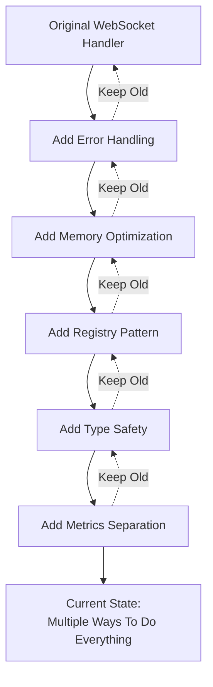
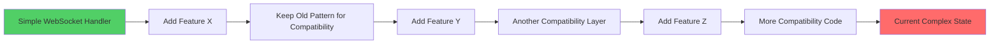

# WebSocket Module Architecture Debt Analysis

**Analysis Date:** 2025-08-16  
**Focus:** Technical debt patterns and refactoring archaeology  
**Severity:** HIGH - Multiple incomplete refactors have created complex, unmaintainable architecture

## 🏗️ **Architecture Debt Patterns Identified**

### **Pattern 1: The Refactoring Graveyard**

**Definition:** Multiple sequential refactors where each adds new patterns without removing old ones.

**Evidence in WebSocket Module:**



**Result:** Current module has 4 ways to process messages, 4 ways to create contexts, multiple error handling approaches.

### **Pattern 2: The Directory Multiplication Syndrome**

**Evidence:**
```
cyberdelta/apis/websocket/
├── metrics/          # Implementation classes
│   ├── error_metrics.py
│   ├── general_metrics.py  
│   └── processing_metrics.py
├── models/           # Pydantic models (DUPLICATE!)
│   ├── error_metrics.py     # Same names, different content
│   ├── general_metrics.py   # Same names, different content
│   └── processing.py        # Similar functionality
├── error_handling/   # Error handling implementations
├── exceptions/       # Exception definitions
├── memory/           # Memory optimization (YAGNI)
├── registry/         # Registry patterns (Overengineered)
├── security/         # Security validation
└── validation/       # More validation (OVERLAP with security)
```

**Problem:** Unclear separation of concerns, overlapping responsibilities, directory structure that doesn't match actual usage patterns.

### **Pattern 3: The YAGNI Violation Cascade**

**Overengineered Components with No Clear Need:**

1. **Memory Optimization System** (300+ lines)
   ```python
   # memory/memory_optimized.py
   class MemoryOptimizedMessageContext:
       # Thread-safe memory pooling
       # Deque-based object reuse  
       # Statistics tracking
   ```
   **Problem:** No evidence of memory pressure, no performance requirements documented

2. **Complex Registry System** (400+ lines)
   ```python
   # registry/registry_factory.py, registry_builder.py
   # Pattern-heavy factory for simple object creation
   ```
   **Problem:** Simple factory methods would suffice

3. **Multi-level Metrics Architecture**
   ```python
   # Separate models/ and metrics/ with complex relationships
   ```
   **Problem:** Could be unified into single coherent system

### **Pattern 4: The Type Safety Theater**

**False Type Safety Through Workarounds:**

```python
# ws_protocols.py:68
domain_model: object  # "For circular import avoidance"

# ws_context.py:61  
domain_model: Any = Field(default=None, exclude=True)

# Multiple places
envelope_validator: Callable[[dict[str, Any]], EnvelopeType] | None
```

**Problem:** Using `Any` and `object` to avoid proper type definitions. Real type safety would use Union types and proper protocols.

### **Pattern 5: The Backwards Compatibility Debt**

**Evidence of Incomplete Migrations:**

```python
# ws_router.py:66
# BaseErrorHandler import removed - deprecated and not used

# ws_context.py:159
def raw_model(self) -> object | None:
    """Get raw validated model (envelope) for compatibility with BaseContextProtocol."""

# exceptions/payload_validation.py
class PayloadTooLargeError(PayloadSizeError):
    """Backward compatibility alias for PayloadSizeError"""
```

**Problem:** Multiple deprecated patterns kept "for compatibility" but never cleaned up.

## 📊 **Quantitative Debt Metrics**

### **Complexity Metrics**

| Metric | Current | Industry Standard | Debt Level |
|--------|---------|------------------|------------|
| Files per Feature | 8-12 | 3-5 | HIGH |
| Ways to Process Messages | 4 | 1 | CRITICAL |
| Ways to Create Context | 4 | 1 | CRITICAL |
| Any/object Usage | 15+ instances | 0-2 | HIGH |
| Backwards Compatibility | 8+ remnants | 0 | MEDIUM |

### **File Organization Debt**

```
Current Structure Issues:
├── Duplicate concerns (metrics/ vs models/)           # HIGH DEBT
├── Overlapping responsibilities (security/ vs validation/) # MEDIUM DEBT  
├── Unclear boundaries (error_handling/ vs exceptions/)    # MEDIUM DEBT
├── YAGNI violations (memory/, complex registries)         # HIGH DEBT
└── Scattered related code (contexts across multiple files) # MEDIUM DEBT
```

### **Pattern Multiplication**

```python
# Processing Patterns (4 different approaches):
PydanticWebSocketProcessor     # Generic processor
TypeSafeWebSocketProcessor     # Registry-based  
WebSocketTransformer          # Multiple transformer classes
BaseWebSocketRouter           # Router with processing

# Context Creation (4 different patterns):
WebSocketMessageContext()      # Direct creation
MemoryOptimizedMessageContext() # Memory pooling
WebSocketContextRegistry       # Registry pattern  
Manual context building        # Ad-hoc creation

# Error Handling (3 different approaches):
WebSocketErrorHandler          # Main handler
RecoveryStrategyRouter         # Strategy pattern
Direct exception creation      # Manual error handling
```

## 🔍 **Root Cause Analysis**

### **Why This Happened**

1. **Incremental Refactoring Without Vision**
   - Each refactor solved immediate problem
   - No holistic architecture planning
   - Fear of breaking existing code led to additive changes

2. **Lack of Deprecation Strategy**
   - Old patterns kept "for compatibility"
   - No timeline for removing deprecated code
   - Accumulated technical debt over time

3. **Feature Creep Through "Best Practices"**
   - Added memory optimization "because it's a good practice"
   - Complex registries "for better testability"
   - Multiple abstraction layers "for flexibility"

4. **Analysis Paralysis on Design Decisions**
   - Couldn't decide between approaches, so kept both
   - "Let's support multiple patterns for different use cases"
   - Avoided making hard choices about what to remove

### **The Complexity Spiral**



## 🎯 **Debt Categories and Priorities**

### **Critical Debt (Must Fix)**
1. **Pattern Multiplication** - Multiple ways to do the same thing
2. **Directory Duplication** - metrics/ vs models/ confusion
3. **Processing Chaos** - 4 different processing approaches

### **High Debt (Should Fix)**
1. **YAGNI Violations** - Overengineered memory optimization
2. **Type Safety Theater** - Any/object workarounds
3. **Registry Overuse** - Complex patterns for simple needs

### **Medium Debt (Nice to Fix)**
1. **Backwards Compatibility** - Deprecated pattern remnants
2. **Import Complexity** - 30+ files with import aliases
3. **Documentation Lag** - Docs describing removed features

## 🔧 **Debt Resolution Strategy**

### **Archaeological Approach**

Treat this as **archaeology** - carefully excavating and removing layers of incomplete refactors:

```python
# Layer 6: Current Type Safety Additions (2024-2025)
# Layer 5: Registry Pattern Addition (2024)  
# Layer 4: Memory Optimization Addition (2024)
# Layer 3: Error Handling Refactor (2024)
# Layer 2: Metrics Separation (2023-2024)
# Layer 1: Original WebSocket Handler (Base)

# Strategy: Remove layers 2-6, rebuild properly on layer 1
```

### **Clean Slate Philosophy**

Instead of incremental fixes, rebuild key components:

```python
# Don't fix: Multiple processing patterns
# Do: Choose one, implement properly, remove others

# Don't fix: Complex context creation  
# Do: Single factory method, remove complexity

# Don't fix: Registry overengineering
# Do: Simple factory functions
```

### **Ruthless Deprecation**

Remove deprecated patterns without backwards compatibility:

```python
# Old way (remove completely):
context = memory_pool.get_optimized_context()

# New way (single pattern):
context = WebSocketContextFactory.create(...)
```

## 📈 **Technical Debt Payoff**

### **Before Cleanup**
```
Cognitive Load: HIGH
- 4 ways to process messages
- 4 ways to create contexts  
- Complex directory structure
- Multiple deprecated patterns

Maintenance Cost: HIGH
- Bug fixes require understanding multiple patterns
- New features unclear which pattern to use
- Testing complexity due to pattern multiplication

Onboarding Time: HIGH  
- Developers must learn multiple approaches
- Unclear which patterns are current/deprecated
- Complex import structure
```

### **After Cleanup**
```
Cognitive Load: LOW
- 1 clear way to process messages
- 1 clear way to create contexts
- Simple, logical directory structure
- No deprecated patterns

Maintenance Cost: LOW
- Single pattern to understand and maintain
- Clear place to add new features
- Simple testing with unified approach

Onboarding Time: LOW
- Single pattern to learn
- Clear current architecture
- Simple import structure
```

## 🎯 **Success Metrics**

### **Debt Reduction Targets**

| Metric | Before | After | Improvement |
|--------|--------|-------|-------------|
| Processing Patterns | 4 | 1 | 75% reduction |
| Context Creation Patterns | 4 | 1 | 75% reduction |
| File Count | 57 | ~35 | 38% reduction |
| Any/object Usage | 15+ | <5 | 70% reduction |
| Directory Confusion | High | None | 100% resolution |
| YAGNI Violations | Multiple | None | 100% removal |

### **Quality Metrics**

1. **Single Responsibility:** Each file has one clear purpose
2. **No Duplication:** No duplicate implementations  
3. **Clear Patterns:** One obvious way to do each operation
4. **Type Safety:** Proper types, no workarounds
5. **YAGNI Compliance:** Features only when needed

### **Developer Experience Metrics**

1. **Onboarding Time:** New developer productive in 1 day
2. **Feature Addition:** Clear place to add new functionality
3. **Bug Fixing:** Single place to look for each type of issue
4. **Testing:** Simple test setup with clear patterns

## 💡 **Lessons Learned**

### **For Future Refactoring**

1. **Have a Clear End State Vision** - Don't refactor incrementally without knowing the target architecture
2. **Be Ruthless with Deprecation** - Set timelines for removing old patterns
3. **One Thing at a Time** - Don't add new features while cleaning up old ones
4. **Measure Complexity** - Track metrics to prevent complexity creep
5. **Question Every Abstraction** - Each layer should solve a real problem

### **Red Flags to Watch For**

1. **Multiple Ways to Do X** - Sign of incomplete consolidation
2. **"Compatibility" Code** - Often debt in disguise
3. **Complex Factory Patterns** - Usually overengineered
4. **Directory Name Confusion** - Sign of unclear separation of concerns
5. **Any/object Workarounds** - Sign of architectural problems

---

**Conclusion:** The WebSocket module is a textbook example of technical debt accumulation through incomplete refactoring. The solution is archaeological cleanup - removing layers of incomplete refactors and rebuilding with clear, simple patterns.