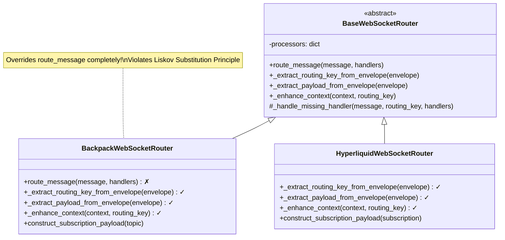
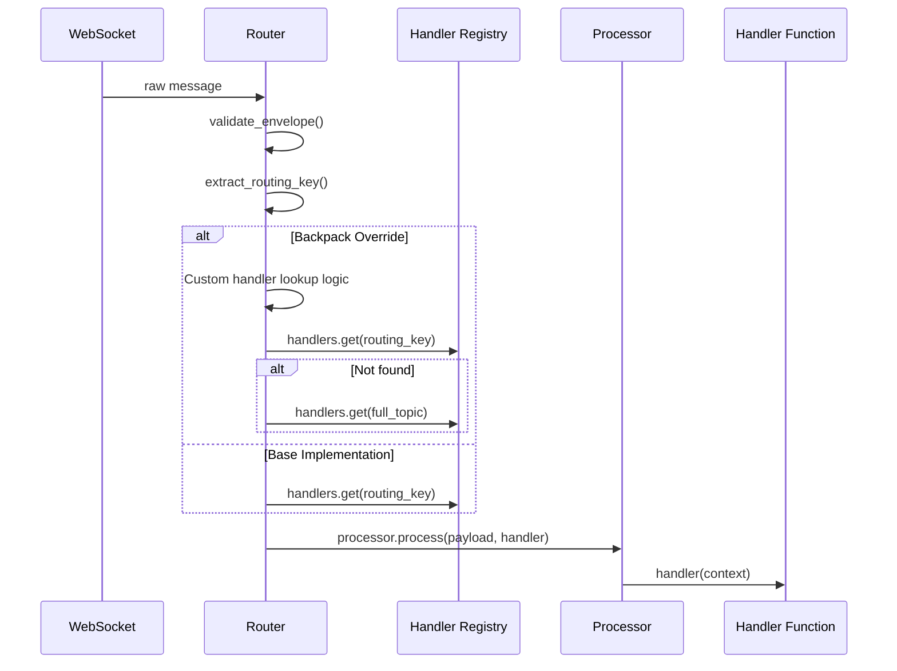
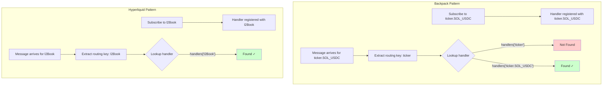
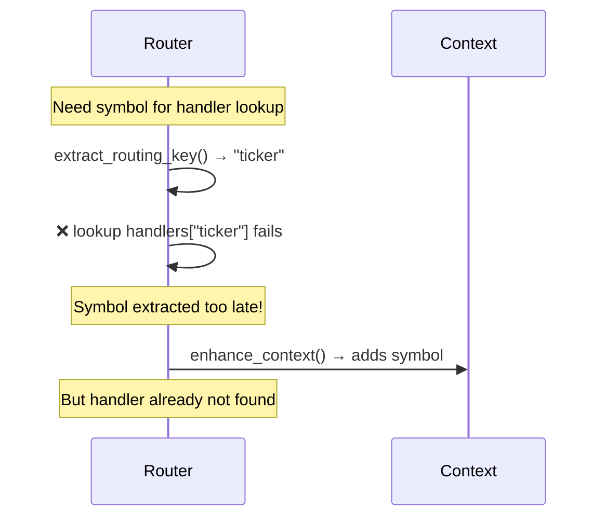
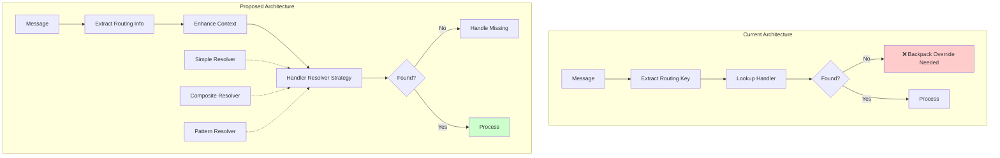

# WebSocket Architecture Override Analysis and Refactoring Proposal

## Executive Summary

This document analyzes the WebSocket message routing architecture in CyberDelta Engine, focusing on the override patterns found in Backpack and Hyperliquid implementations. We identify architectural issues that force subclasses to override core routing logic and propose refactoring solutions to improve the design.

## Table of Contents
1. [Current Architecture Overview](#current-architecture-overview)
2. [Override Pattern Analysis](#override-pattern-analysis)
3. [Root Cause Analysis](#root-cause-analysis)
4. [Proposed Solutions](#proposed-solutions)
5. [Implementation Roadmap](#implementation-roadmap)
6. [Risk Assessment](#risk-assessment)

## Current Architecture Overview

### Class Hierarchy



### Current Message Flow



## Override Pattern Analysis

### 1. Backpack Overrides

#### Complete `route_message` Override
```python
# BackpackWebSocketRouter completely replaces the base implementation
async def route_message(self, message: dict[str, Any], handlers: dict[str, MessageHandler]) -> None:
    # 406 → 449: Complete reimplementation with custom handler lookup
    # PROBLEM: Violates LSP - changes expected behavior
```

**Why this override exists:**
- Handlers are registered as `"ticker.SOL_USDC"` not just `"ticker"`
- Base class assumes simple key lookup: `handlers.get(routing_key)`
- Backpack needs composite lookup: try `routing_key`, then `full_topic`

#### Other Overrides
```python
# These are acceptable template method overrides
_extract_routing_key_from_envelope()  # Parses "ticker.SOL_USDC" → "ticker"
_extract_payload_from_envelope()      # Handles dict or list payloads
_enhance_context()                    # Adds symbol and full_topic to context
```

### 2. Hyperliquid Implementation

Hyperliquid does NOT override `route_message`, showing better alignment with base design:

```python
# HyperliquidWebSocketRouter only overrides template methods
_extract_routing_key_from_envelope()  # Maps channel to routing key
_extract_payload_from_envelope()      # Extracts data from channel message
_enhance_context()                    # Adds coin to context
```

### Handler Registration Patterns



## Root Cause Analysis

### 1. Rigid Handler Lookup Strategy

The base class hardcodes handler lookup:
```python
# BaseWebSocketRouter line 318
handler = handlers.get(routing_key)  # Too simple!
```

This assumes all exchanges use simple routing keys, but:
- **Backpack**: Uses `type.symbol` format (e.g., `ticker.SOL_USDC`)
- **Binance**: Might use `symbol@type` format (e.g., `btcusdt@ticker`)
- **Hyperliquid**: Uses simple channel names (works with base)

### 2. Symbol Resolution Timing



### 3. Missing Abstraction Layers

Current design conflates:
1. **Message routing** (which processor handles this message type)
2. **Handler resolution** (which user callback to invoke)
3. **Context enhancement** (extracting additional data)

## Proposed Solutions

### Solution 1: Strategy Pattern for Handler Resolution

```python
from abc import ABC, abstractmethod
from typing import Protocol

class HandlerResolver(Protocol):
    """Strategy for resolving handlers from registry."""
    
    def resolve_handler(
        self,
        routing_key: str,
        context: dict[str, Any],
        handlers: dict[str, MessageHandler]
    ) -> MessageHandler | None:
        """Find appropriate handler for the message."""
        ...

class SimpleHandlerResolver:
    """Default resolver - exact key match."""
    
    def resolve_handler(self, routing_key: str, context: dict[str, Any], 
                       handlers: dict[str, MessageHandler]) -> MessageHandler | None:
        return handlers.get(routing_key)

class CompositeKeyHandlerResolver:
    """Resolver for topic.symbol style keys."""
    
    def resolve_handler(self, routing_key: str, context: dict[str, Any],
                       handlers: dict[str, MessageHandler]) -> MessageHandler | None:
        # Try simple key first
        if routing_key in handlers:
            return handlers[routing_key]
        
        # Try composite key
        if "symbol" in context:
            full_topic = f"{routing_key}.{context['symbol']}"
            return handlers.get(full_topic)
        
        return None

class PatternMatchingHandlerResolver:
    """Resolver supporting wildcards like ticker.*"""
    
    def resolve_handler(self, routing_key: str, context: dict[str, Any],
                       handlers: dict[str, MessageHandler]) -> MessageHandler | None:
        # Exact match first
        if routing_key in handlers:
            return handlers[routing_key]
        
        # Pattern matching
        symbol = context.get("symbol", "")
        full_key = f"{routing_key}.{symbol}" if symbol else routing_key
        
        for pattern, handler in handlers.items():
            if self._matches_pattern(pattern, full_key):
                return handler
        
        return None
```

### Solution 2: Refactored Base Router

```python
class BaseWebSocketRouter:
    def __init__(
        self,
        exchange_name: str,
        error_handler: BaseErrorHandler,
        handler_resolver: HandlerResolver | None = None,
        **kwargs
    ):
        self.handler_resolver = handler_resolver or SimpleHandlerResolver()
        # ... rest of init
    
    async def route_message(
        self,
        message: dict[str, Any],
        handlers: dict[str, MessageHandler]
    ) -> None:
        # 1. Validate envelope
        validated_envelope = self.envelope_validator(message)
        
        # 2. Extract routing key
        routing_key = self._extract_routing_key_from_envelope(validated_envelope)
        
        # 3. Create and enhance context (BEFORE handler lookup)
        context = self._create_enhanced_context(validated_envelope, routing_key)
        context = await self._enhance_context(context, routing_key)
        
        # 4. Resolve handler using strategy
        handler = self.handler_resolver.resolve_handler(
            routing_key, context, handlers
        )
        
        if not handler:
            await self._handle_missing_handler(message, routing_key, handlers)
            return
        
        # 5. Process message
        payload = self._extract_payload_from_envelope(validated_envelope)
        processor = self.processors.get(routing_key)
        
        if processor:
            await processor.process(payload, handler, context)
```

### Solution 3: Template Method with Hooks

```python
class BaseWebSocketRouter:
    async def route_message(self, message: dict[str, Any], 
                           handlers: dict[str, MessageHandler]) -> None:
        # Core algorithm with extension points
        
        # 1. Validate
        validated_envelope = self.envelope_validator(message)
        
        # 2. Extract routing info
        routing_info = self._extract_routing_info(validated_envelope)
        
        # 3. Find handler (delegated to subclass)
        handler = self._resolve_handler(routing_info, handlers)
        
        # ... rest of routing
    
    def _extract_routing_info(self, envelope: Any) -> dict[str, Any]:
        """Extract all routing-relevant information."""
        return {
            "routing_key": self._extract_routing_key_from_envelope(envelope),
            "envelope": envelope,
            # Subclasses can override to add more
        }
    
    def _resolve_handler(
        self, 
        routing_info: dict[str, Any],
        handlers: dict[str, MessageHandler]
    ) -> MessageHandler | None:
        """Override in subclasses for custom resolution."""
        return handlers.get(routing_info["routing_key"])
```

### Improved Architecture Flow



## Implementation Roadmap

### Phase 1: Add Handler Resolver (Backward Compatible)
1. Create `HandlerResolver` protocol and implementations
2. Add optional `handler_resolver` parameter to `BaseWebSocketRouter`
3. Update base `route_message` to use resolver if provided
4. No breaking changes - existing code continues to work

### Phase 2: Migrate Exchanges
1. Update `BackpackWebSocketRouter` to use `CompositeKeyHandlerResolver`
2. Remove `route_message` override from Backpack
3. Test thoroughly with existing integration tests
4. Document the new pattern

### Phase 3: Enhanced Features
1. Add `PatternMatchingHandlerResolver` for wildcard subscriptions
2. Add handler chaining/middleware support
3. Add metrics and debugging for handler resolution

### Migration Example

```python
# Before
class BackpackWebSocketRouter(BaseWebSocketRouter):
    async def route_message(self, message, handlers):
        # 50+ lines of override code
        ...

# After
class BackpackWebSocketRouter(BaseWebSocketRouter):
    def __init__(self, ...):
        super().__init__(
            exchange_name="backpack",
            handler_resolver=CompositeKeyHandlerResolver(),
            ...
        )
    # No route_message override needed!
```

## Risk Assessment

### Low Risk
- Changes are backward compatible
- Existing tests provide safety net
- Can be rolled out incrementally

### Medium Risk
- Handler resolution performance (mitigated by caching)
- Increased complexity (mitigated by clear documentation)

### Benefits
- Eliminates LSP violation
- Reduces code duplication
- Makes exchange-specific behavior explicit
- Enables new features (pattern matching, middleware)

## Conclusion

The current override pattern in `BackpackWebSocketRouter` is a symptom of inflexible design in the base class. By introducing a **Handler Resolver Strategy**, we can:

1. Eliminate the need for `route_message` overrides
2. Make handler resolution behavior explicit and configurable
3. Support more complex routing patterns
4. Maintain backward compatibility

This refactoring follows SOLID principles and makes the system more extensible for future exchange integrations.