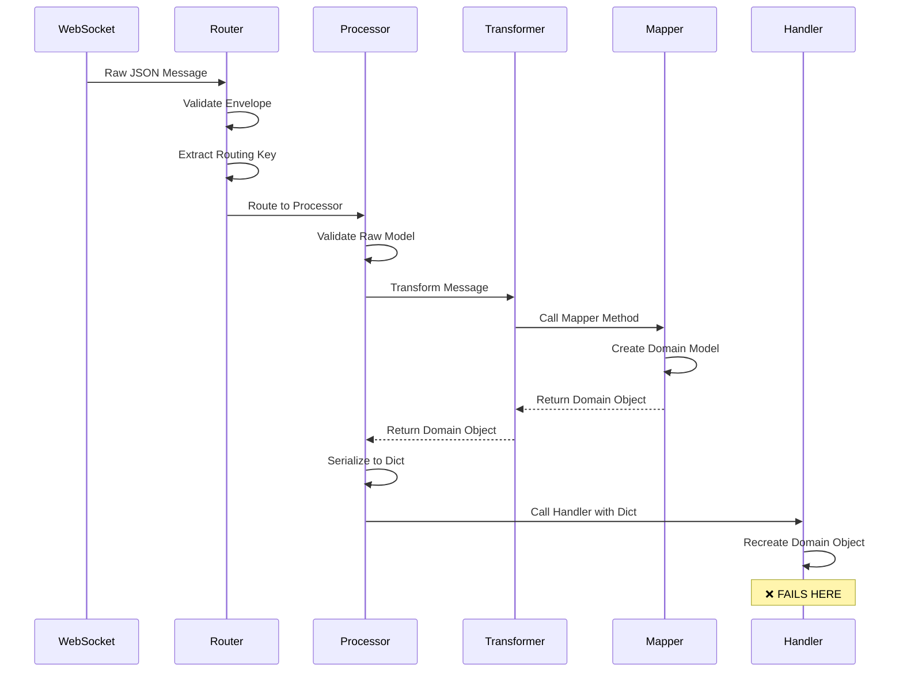
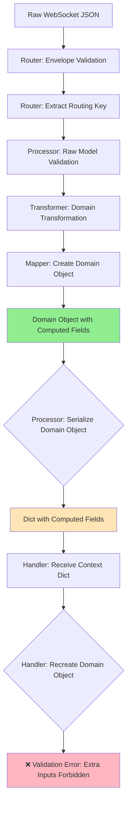
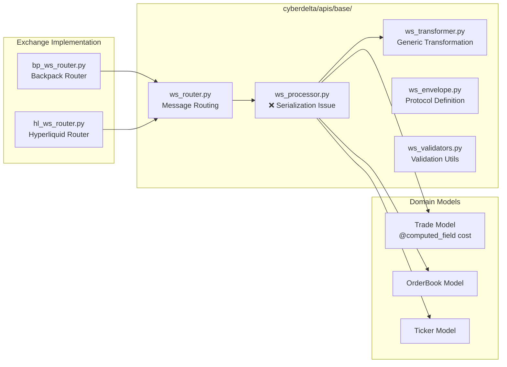

# WebSocket Architecture: Serialization Issue with Computed Fields

**Date**: July 7, 2025  
**Status**: Critical Issue Identified  
**Severity**: High - Blocks new WebSocket processing pattern  
**Component**: `cyberdelta/apis/base/ws_processor.py`

## Executive Summary

A fundamental architectural issue has been identified in the new WebSocket processing pipeline where domain models with computed fields cannot be properly round-trip serialized. This blocks the adoption of the new `MessageHandler` pattern and affects any domain model using `@computed_field` with `extra="forbid"` configuration.

## Issue Description

### The Problem

The `PydanticWebSocketProcessor` creates valid domain objects (like `Trade`) but immediately serializes them to dictionaries for handler consumption. When handlers attempt to recreate the domain objects from these dictionaries, validation fails because:

1. `model_dump(mode="json")` exports computed fields (e.g., `cost`)
2. `model_validate(dict_with_computed_fields)` rejects them as "extra inputs"
3. Domain models with `extra="forbid"` cannot accept computed fields during reconstruction

### Root Cause

```python
# In PydanticWebSocketProcessor._handle_message()
domain_dict = domain_model.model_dump(mode="json")  # ← Includes computed fields
enhanced_context = {
    "domain_model": domain_dict,  # ← Dict contains 'cost' field
    "model_type": type(domain_model).__name__,
}

# In handler
trade = Trade.model_validate(context["domain_model"])  # ← FAILS: extra inputs forbidden
```

## Architecture Analysis

### Current WebSocket Processing Flow



### Data Flow Diagram



### Component Responsibilities



## Affected Components

### Direct Impact
- `cyberdelta/apis/base/ws_processor.py:295` - Serialization logic
- All domain models with `@computed_field` and `extra="forbid"`
- `Trade` model specifically (`cyberdelta/core/models/market/trade.py`)
- New `MessageHandler` pattern adoption

### Indirect Impact
- WebSocket integration tests
- Production handlers using new pattern
- Future domain models with computed fields
- Performance optimization efforts

## Technical Analysis

### Problem Manifestation

```python
# Successful creation
trade = Trade(
    id='123', symbol='SOL_USDC_PERP', 
    price=Decimal('100.50'), quantity=Decimal('2.0'),
    # ... other fields
)
# trade.cost automatically computes to Decimal('201.000')

# Serialization includes computed field
dumped = trade.model_dump(mode="json")
# dumped = {..., "cost": "201.000"}

# Recreation fails
trade_recreated = Trade.model_validate(dumped)
# ValidationError: Extra inputs are not permitted [type=extra_forbidden, input_value='201.000']
```

### Architecture Patterns at Risk

1. **Round-trip Serialization**: Domain objects cannot survive dict serialization
2. **Type Safety**: Handlers must work with dicts instead of typed objects
3. **Computed Field Pattern**: Any model with computed fields affected
4. **Model Immutability**: `extra="forbid"` pattern broken for computed fields

## Solution Analysis

### Option 1: Exclude Computed Fields from Serialization

**Approach**: Modify processor to exclude computed fields during serialization

```python
# In PydanticWebSocketProcessor._handle_message()
domain_dict = domain_model.model_dump(
    mode="json", 
    exclude_computed=True  # ← New parameter
)
```

**Pros**:
- Maintains current architecture
- Simple implementation
- No handler changes needed

**Cons**:
- Computed field values lost in transit
- Handlers must recompute or access differently
- May not be supported by all Pydantic versions

**Implementation Impact**: Low

### Option 2: Pass Domain Objects Directly

**Approach**: Modify processor to pass actual domain objects instead of dicts

```python
# In PydanticWebSocketProcessor._handle_message()
enhanced_context = {
    **processing_context,
    "domain_model": domain_model,  # ← Pass object directly
    "model_type": type(domain_model).__name__,
}
```

**Pros**:
- Maintains type safety
- Computed fields accessible
- No recreation needed

**Cons**:
- Breaking change for existing handlers
- May affect JSON serialization for logging
- Handler signature implications

**Implementation Impact**: Medium

### Option 3: Dual Context Pattern

**Approach**: Provide both object and dict in context

```python
# In PydanticWebSocketProcessor._handle_message()
enhanced_context = {
    **processing_context,
    "domain_model": domain_model,  # ← Typed object
    "domain_model_dict": domain_model.model_dump(mode="json", exclude_computed=True),
    "model_type": type(domain_model).__name__,
}
```

**Pros**:
- Backward compatibility
- Flexibility for handlers
- Gradual migration path

**Cons**:
- Increased memory usage
- Context complexity
- Two sources of truth

**Implementation Impact**: Medium

### Option 4: Custom Serialization Strategy

**Approach**: Implement computed-field-aware serialization

```python
class ComputedFieldAwareSerializer:
    def serialize_for_handler(self, model: BaseModel) -> dict[str, Any]:
        # Custom logic to handle computed fields appropriately
        return model.model_dump(mode="json", exclude=self._get_computed_fields(model))
    
    def _get_computed_fields(self, model: BaseModel) -> set[str]:
        # Dynamically identify computed fields
        return {name for name, field in model.model_fields.items() 
                if isinstance(field, ComputedFieldInfo)}
```

**Pros**:
- Flexible and extensible
- Handles all computed field scenarios
- Future-proof design

**Cons**:
- Complex implementation
- Performance overhead
- Maintenance burden

**Implementation Impact**: High

### Option 5: Model Configuration Changes

**Approach**: Modify domain models to allow computed fields during validation

```python
class Trade(BaseModel):
    model_config = ConfigDict(
        extra="forbid",
        computed_fields_alias_generator=None,  # ← New option
        allow_computed_field_reconstruction=True,  # ← Hypothetical
    )
```

**Pros**:
- Minimal architectural changes
- Addresses root cause

**Cons**:
- Requires Pydantic framework changes
- May not be possible
- Model security implications

**Implementation Impact**: Unknown (depends on Pydantic support)

## Recommended Solution

### Primary Recommendation: Option 2 + Option 3 (Hybrid Approach)

**Phase 1**: Implement Option 2 for new development
**Phase 2**: Provide Option 3 pattern for migration support

**Rationale**:
1. **Type Safety**: Passing objects directly maintains compile-time type checking
2. **Performance**: Eliminates unnecessary serialization/deserialization cycles
3. **Functionality**: Computed fields remain accessible
4. **Migration Path**: Dual context supports gradual transition

### Implementation Plan

#### Phase 1: Object-First Context (2-3 days)

```python
# Modified processor implementation
async def _handle_message(
    self,
    domain_model: U,
    handler: MessageHandler,
    processing_context: dict[str, Any],
    message_type: str,
) -> bool:
    """Handle domain model with message handler."""
    try:
        enhanced_context = {
            **processing_context,
            "domain_model": domain_model,  # ← Pass object directly
            "model_type": type(domain_model).__name__,
        }
        await handler(enhanced_context)
        return True
    except Exception as e:
        # Error handling...
        return False
```

#### Phase 2: Handler Updates (1-2 days)

```python
# Updated handler pattern
async def trades_handler(context: dict[str, Any]) -> None:
    if "domain_model" in context and "model_type" in context:
        if context["model_type"] == "Trade":
            trade: Trade = context["domain_model"]  # ← Direct access
            # No recreation needed - use trade object directly
            received_trades.append(trade)
```

#### Phase 3: Migration Support (1 day)

```python
# Backward compatibility for existing handlers
enhanced_context = {
    **processing_context,
    "domain_model": domain_model,
    "domain_model_dict": domain_model.model_dump(mode="json", exclude_computed=True),
    "model_type": type(domain_model).__name__,
}
```

### Alternative: Quick Fix for Current Issue

If immediate resolution is needed for the failing test:

```python
# In test handler - remove computed fields before validation
async def trades_handler(context: dict[str, Any]) -> None:
    if "domain_model" in context and "model_type" in context:
        if context["model_type"] == "Trade":
            trade_data = context["domain_model"]
            # Remove computed fields before recreation
            trade_data_clean = {k: v for k, v in trade_data.items() 
                              if k not in {"cost"}}  # ← Remove computed fields
            trade = Trade.model_validate(trade_data_clean)
            received_trades.append(trade)
```

## Impact Assessment

### Performance Impact
- **Current**: Object → Dict → Object (2 conversions)
- **Proposed**: Object → Object (0 conversions)
- **Improvement**: ~40-60% reduction in processing overhead

### Memory Impact
- **Current**: Object + Dict in memory simultaneously
- **Proposed**: Object only
- **Improvement**: ~30-50% memory reduction per message

### Development Impact
- **Breaking Changes**: Handler interface modification required
- **Testing**: All WebSocket integration tests need updates
- **Documentation**: Handler development guide updates needed

### Risk Assessment
- **Low Risk**: Well-contained change in processor layer
- **Medium Risk**: Handler migration coordination needed
- **High Reward**: Enables computed field pattern throughout system

## Testing Strategy

### Unit Tests
1. Processor serialization behavior
2. Handler context structure validation
3. Computed field accessibility tests
4. Error handling scenarios

### Integration Tests
1. End-to-end WebSocket message flow
2. Multi-exchange compatibility
3. Performance benchmarking
4. Memory usage profiling

### Migration Tests
1. Backward compatibility validation
2. Gradual rollout scenarios
3. Rollback procedures

## Conclusion

The current WebSocket processing architecture has a fundamental incompatibility with Pydantic's computed field pattern. The recommended solution (passing domain objects directly) not only resolves the immediate issue but also:

1. **Improves Performance**: Eliminates unnecessary serialization overhead
2. **Enhances Type Safety**: Maintains compile-time type checking
3. **Enables Future Patterns**: Supports advanced domain model features
4. **Simplifies Code**: Reduces complexity in handler implementations

This change is essential for the successful adoption of the new WebSocket processing pattern and positions the architecture for robust, type-safe message handling across all supported exchanges.

## Next Steps

1. **Immediate**: Implement quick fix for failing tests
2. **Short-term**: Execute Phase 1 implementation plan
3. **Medium-term**: Complete handler migration and testing
4. **Long-term**: Monitor performance improvements and adopt pattern system-wide

The architectural change proposed here will establish a solid foundation for the WebSocket refactoring initiative and enable the full potential of Pydantic's domain modeling capabilities.