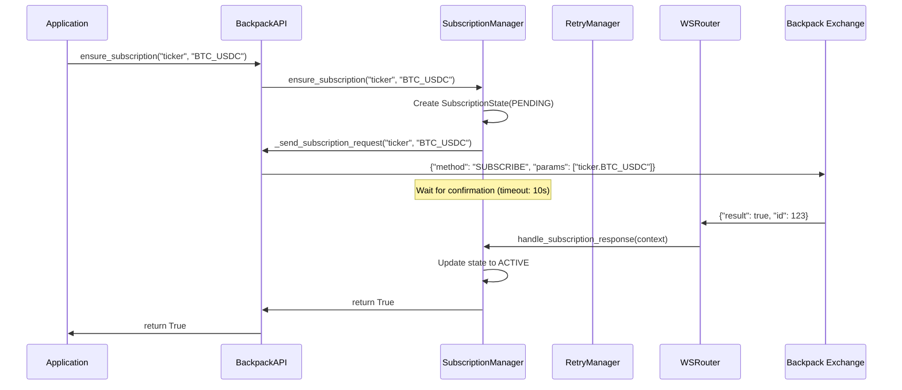
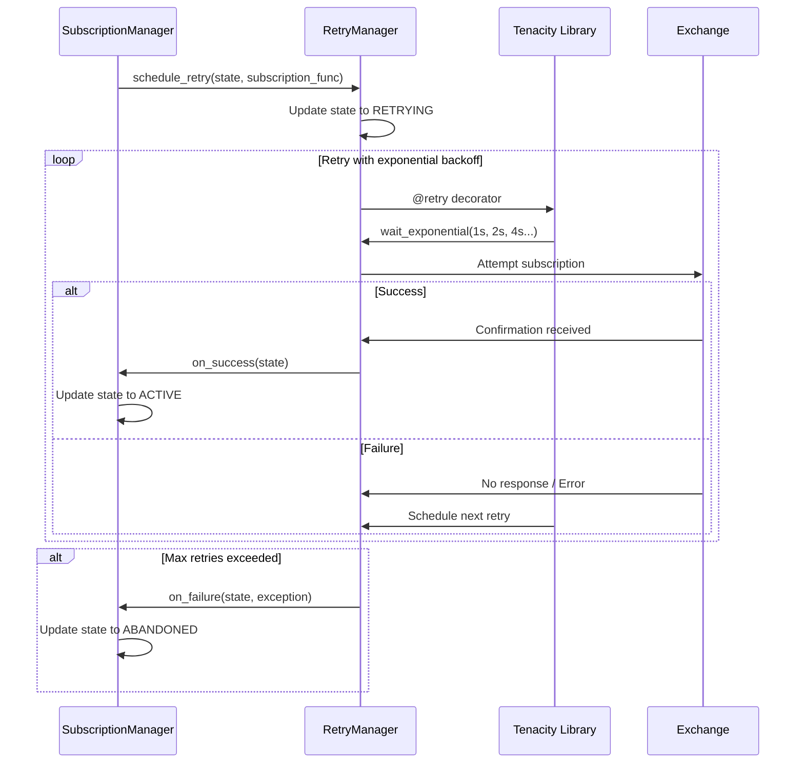
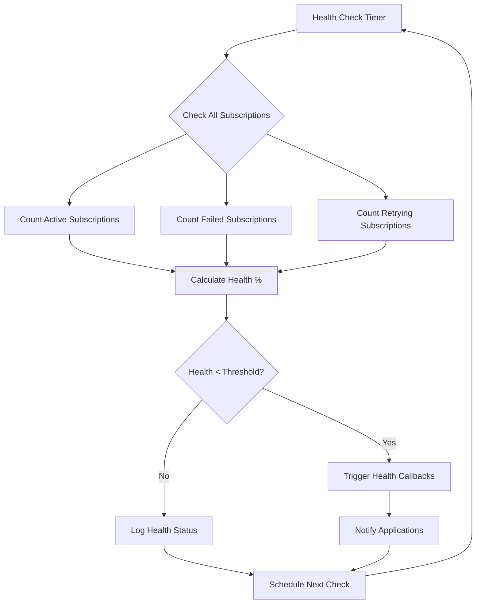

# Base Class Envelope Analysis

## BaseSubscriptionResponse - Unused Base Class Discovery

### Finding
The `BaseSubscriptionResponse` class in `cyberdelta/apis/base/ws_models.py` is defined but **never actually used** by any exchange implementation.

### Evidence
1. **No inheritance found**:
   - Searched for `(BaseSubscriptionResponse)` - no results
   - Searched for imports of `BaseSubscriptionResponse` - no results
   - No exchange-specific models inherit from it

2. **Each exchange handles subscription responses differently**:

   **Hyperliquid**:
   - Has a channel called "subscriptionResponse"
   - Simply logs and ignores these messages (returns None)
   - No model needed
   ```python
   if channel == "subscriptionResponse":
       self.logger.debug(
           "subscription_response_received",
           exchange=self.exchange_name,
           message="Received subscription response message",
       )
       return None  # Don't route subscription responses
   ```

   **Backpack**:
   - Sends `{"result": true, "id": 1}`
   - Created `BackpackSubscriptionResponse` because format doesn't match base class
   - Base class expects: `success`, `error`, `subscribed_topics`
   - Backpack sends: `result`, `id`

### Why This Happened
The `BaseSubscriptionResponse` was created as an aspirational base class for a common subscription response pattern that doesn't actually exist across exchanges:

- **Base class structure**:
  - `success: bool` (with validation requiring error when False)
  - `error: str | None`
  - `subscribed_topics: list[str]`
  - Complex validation logic

- **Reality**:
  - Hyperliquid: No model needed, just ignores
  - Backpack: Completely different field names and structure

### Conclusion
This is a case of over-engineering where a base class was created for a theoretical common pattern that doesn't exist in practice. Each exchange's subscription response format is too different to share a common base class.

### Recommendation
Consider either:
1. Removing `BaseSubscriptionResponse` since it's unused
2. Documenting it as "reserved for future use" if there's a plan to standardize
3. Making it more flexible to accommodate different exchange formats

## Hyperliquid Subscription Response Improvement

### Problem
Hyperliquid was just logging and ignoring subscription responses without proper validation or processing.

### Solution Implemented
Created a proper Pydantic model `HyperliquidSubscriptionResponse` that:

1. **Validates the subscription response structure**:
   ```python
   class HyperliquidSubscriptionResponse(BaseModel):
       channel: str = Field(default="subscriptionResponse", const=True)
       data: dict[str, Any] = Field(..., description="Subscription confirmation details")
   ```

2. **Extracts useful information**:
   - `subscription_type`: The channel that was subscribed to (e.g., "l2Book")
   - `subscription_coin`: The coin/symbol if present (e.g., "BTC")
   - `is_successful`: Whether the subscription succeeded

3. **Provides structured logging**:
   ```python
   self.logger.info(
       "hyperliquid_subscription_confirmed",
       exchange=self.exchange_name,
       subscription_type=envelope.subscription_type,
       subscription_coin=envelope.subscription_coin,
       is_successful=envelope.is_successful,
       message="Subscription confirmation received",
   )
   ```

### Benefits
- Type safety for subscription responses
- Better debugging and monitoring capabilities
- Foundation for subscription state tracking
- Consistent with Backpack's approach of having a proper model
- **Subscription responses are now routable** - applications can register handlers for "subscriptionResponse" channel

### How to Use
Applications can now register handlers to process subscription confirmations:

```python
async def handle_subscription_response(context: WebSocketContextUnion) -> None:
    """Handle Hyperliquid subscription confirmations."""
    # Subscription responses are control messages - access via raw_model
    if hasattr(context, "raw_model") and isinstance(
        context.raw_model, HyperliquidSubscriptionResponse
    ):
        response = context.raw_model
        if response.is_successful:
            logger.info(
                f"Successfully subscribed to {response.subscription_type} "
                f"coin={response.subscription_coin}"
            )
            # Track active subscriptions, update UI, etc.
        else:
            logger.error(f"Failed to subscribe to {response.subscription_type}")
            # Retry logic, error handling, etc.

# Register the handler
handlers = {
    "subscriptionResponse": handle_subscription_response
}
```

### Architecture Notes
- Subscription responses are treated as control messages, not domain models
- They use `ControlMessageTransformer` which returns None (no domain model)
- The validated model is available in `context.raw_model`
- This follows the pattern for system/control messages that don't map to business domain objects

## Current Implementation Status

### What We Have ✅
1. **Pydantic Models** for validation:
   - `HyperliquidSubscriptionResponse` with computed properties (`subscription_type`, `subscription_coin`, `is_successful`)
   - `BackpackSubscriptionResponse` with result and ID tracking

2. **Processors** to handle the messages:
   - Added `processors["subscriptionResponse"]` for both exchanges
   - Uses `ControlMessageTransformer` for proper architecture compliance

3. **Routing Logic** to make them routable:
   - Both exchanges return `"subscriptionResponse"` routing key
   - Messages are no longer ignored - they're properly routed to handlers

4. **Enhanced Logging** with structured data:
   - Hyperliquid logs subscription type, coin, and success status
   - Backpack logs result and ID

5. **Architectural Foundation**:
   - Control messages use `ControlMessageTransformer`
   - Raw models accessible via `context.raw_model`
   - Consistent patterns across both exchanges

### What We DON'T Have Yet ❌

**Business logic in two places:**

#### 1. Application-Level Handlers (User Code)
Applications using the API need to register handlers with their business logic:

```python
# This is what applications need to implement
async def handle_subscription_response(context: WebSocketContextUnion) -> None:
    """Handle subscription confirmations."""
    if hasattr(context, "raw_model"):
        if isinstance(context.raw_model, HyperliquidSubscriptionResponse):
            response = context.raw_model
            # Business logic here - track state, retry failed subs, etc.
            if response.is_successful:
                subscription_tracker.mark_active(response.subscription_type, response.subscription_coin)
            else:
                retry_manager.schedule_retry(response.subscription_type)

        elif isinstance(context.raw_model, BackpackSubscriptionResponse):
            response = context.raw_model
            # Business logic here
            if response.result:
                subscription_tracker.mark_active("unknown", response.id)

# Register the handler
handlers = {
    "subscriptionResponse": handle_subscription_response,
    # other handlers...
}
```

#### 2. Built-in API Module Logic (Inside the APIs)
The API modules themselves could include built-in subscription management:

1. **Subscription State Tracking** - Track which channels are successfully subscribed
   ```python
   class SubscriptionTracker:
       def __init__(self):
           self.active_subscriptions: dict[str, set[str]] = {}
           self.pending_subscriptions: dict[str, datetime] = {}

       def mark_subscription_confirmed(self, channel: str, symbol: str | None = None):
           # Track confirmed subscriptions

       def get_active_subscriptions(self) -> dict[str, set[str]]:
           # Return current active subscriptions
   ```

2. **Retry Logic** - Automatically retry failed subscriptions
   ```python
   class SubscriptionRetryManager:
       def __init__(self, max_retries: int = 3, retry_delay: float = 5.0):
           self.max_retries = max_retries
           self.retry_delay = retry_delay
           self.retry_attempts: dict[str, int] = {}

       async def handle_failed_subscription(self, channel: str, symbol: str | None = None):
           # Implement exponential backoff retry logic
   ```

3. **Subscription Validation** - Verify received confirmations match requested subscriptions
   ```python
   class SubscriptionValidator:
       def __init__(self):
           self.requested_subscriptions: set[str] = set()

       def validate_response(self, response: HyperliquidSubscriptionResponse | BackpackSubscriptionResponse) -> bool:
           # Verify response matches a pending request
   ```

## Architecture Layers

### 1. Infrastructure Layer (What We Built) ✅
- **Location**: `cyberdelta/apis/*/` (routers, processors, models)
- **Purpose**: Type-safe message handling, validation, routing
- **Responsibilities**: Get subscription responses to handlers safely

### 2. API Module Layer (Missing Built-in Logic) ❌
- **Location**: Inside `BackpackAPI`, `HyperliquidAPI` classes
- **Purpose**: Common subscription management that most applications need
- **Examples**:
  ```python
  # Inside BackpackAPI class
  def get_active_subscriptions(self) -> dict[str, bool]:
      """Get status of all subscriptions."""
      return self._subscription_tracker.get_status()

  async def ensure_subscription(self, channel: str, max_retries: int = 3) -> bool:
      """Ensure a subscription is active, with retries."""
      # Built-in retry logic
  ```

### 3. Application Layer (User Code) ❌
- **Location**: User's application code
- **Purpose**: Business-specific logic for subscription events
- **Examples**:
  ```python
  # In user's trading bot
  async def handle_subscription_response(context: WebSocketContextUnion) -> None:
      # Update UI, trigger alerts, log to database, etc.
      if response.is_successful:
          trading_bot.mark_market_data_ready(response.subscription_coin)
  ```

## Proposed Subscription Management Module

### Architecture Design

The subscription management logic should be implemented as a **separate module** in Layer 2 (API Module Layer), not in the routers. This follows single responsibility principle and proper separation of concerns.

```
cyberdelta/apis/base/
├── ws_subscription_manager.py     # NEW - Base subscription management
├── ws_subscription_state.py       # NEW - State models and enums
├── ws_subscription_retry.py       # NEW - Tenacity-based retry logic
├── ws_router.py                   # Existing - Focus on routing
├── ws_processor.py                # Existing
└── ws_transformer.py              # Existing

cyberdelta/apis/backpack/
├── bp_subscription_manager.py     # NEW - Backpack-specific manager
├── bp_ws_router.py                # Existing - Routes to manager
└── bp_api.py                      # Modified - Uses manager

cyberdelta/apis/hyperliquid/
├── hl_subscription_manager.py     # NEW - Hyperliquid-specific manager
├── hl_ws_router.py                # Existing - Routes to manager
└── hl_api.py                      # Modified - Uses manager
```

### Implementation Details

#### 1. Base Subscription State Models

```python
# cyberdelta/apis/base/ws_subscription_state.py
from enum import Enum
from datetime import datetime, UTC
from pydantic import BaseModel, Field
from typing import Optional, Dict, Set

class SubscriptionStatus(Enum):
    """Status of a WebSocket subscription."""
    PENDING = "pending"           # Subscription request sent, awaiting confirmation
    ACTIVE = "active"            # Confirmed active by exchange
    FAILED = "failed"            # Explicitly failed by exchange
    TIMEOUT = "timeout"          # No response received within timeout
    RETRYING = "retrying"        # In retry backoff period
    ABANDONED = "abandoned"      # Max retries exceeded, giving up

class SubscriptionState(BaseModel):
    """State tracking for a single subscription."""
    channel: str
    symbol: Optional[str] = None
    status: SubscriptionStatus
    requested_at: datetime = Field(default_factory=lambda: datetime.now(UTC))
    confirmed_at: Optional[datetime] = None
    failed_at: Optional[datetime] = None
    retry_count: int = 0
    last_error: Optional[str] = None

    @property
    def subscription_key(self) -> str:
        """Unique key for this subscription."""
        return f"{self.channel}:{self.symbol}" if self.symbol else self.channel

    @property
    def is_active(self) -> bool:
        """Check if subscription is confirmed active."""
        return self.status == SubscriptionStatus.ACTIVE

    @property
    def needs_retry(self) -> bool:
        """Check if subscription needs retry."""
        return self.status in {SubscriptionStatus.FAILED, SubscriptionStatus.TIMEOUT}

class SubscriptionHealth(BaseModel):
    """Overall health status of all subscriptions."""
    total_subscriptions: int
    active_subscriptions: int
    failed_subscriptions: int
    retrying_subscriptions: int
    health_percentage: float
    last_updated: datetime = Field(default_factory=lambda: datetime.now(UTC))
```

#### 2. Tenacity-Based Retry Logic

```python
# cyberdelta/apis/base/ws_subscription_retry.py
import asyncio
from datetime import datetime, UTC, timedelta
from typing import Dict, Callable, Awaitable, Optional
from tenacity import (
    retry,
    stop_after_attempt,
    wait_exponential,
    retry_if_exception_type,
    before_sleep_log,
    after_log
)
import structlog
from .ws_subscription_state import SubscriptionState, SubscriptionStatus

logger = structlog.get_logger()

class SubscriptionRetryManager:
    """Manages subscription retries using tenacity for robust backoff strategies."""

    def __init__(
        self,
        max_retries: int = 5,
        initial_wait: float = 1.0,
        max_wait: float = 60.0,
        multiplier: float = 2.0,
        timeout_seconds: float = 30.0
    ):
        self.max_retries = max_retries
        self.initial_wait = initial_wait
        self.max_wait = max_wait
        self.multiplier = multiplier
        self.timeout_seconds = timeout_seconds
        self._retry_tasks: Dict[str, asyncio.Task] = {}

    @retry(
        stop=stop_after_attempt(5),
        wait=wait_exponential(multiplier=2, min=1, max=60),
        retry=retry_if_exception_type((ConnectionError, TimeoutError)),
        before_sleep=before_sleep_log(logger, "warning"),
        after=after_log(logger, "info")
    )
    async def _execute_subscription_with_retry(
        self,
        subscription_func: Callable[[], Awaitable[bool]],
        subscription_key: str
    ) -> bool:
        """Execute subscription with tenacity retry logic."""
        try:
            result = await asyncio.wait_for(
                subscription_func(),
                timeout=self.timeout_seconds
            )
            logger.info(
                "subscription_retry_success",
                subscription_key=subscription_key,
                message="Subscription succeeded after retry"
            )
            return result
        except asyncio.TimeoutError:
            logger.warning(
                "subscription_retry_timeout",
                subscription_key=subscription_key,
                timeout=self.timeout_seconds
            )
            raise TimeoutError(f"Subscription timeout after {self.timeout_seconds}s")
        except Exception as e:
            logger.error(
                "subscription_retry_failed",
                subscription_key=subscription_key,
                error=str(e),
                error_type=type(e).__name__
            )
            raise

    async def schedule_retry(
        self,
        state: SubscriptionState,
        subscription_func: Callable[[], Awaitable[bool]],
        on_success: Optional[Callable[[SubscriptionState], Awaitable[None]]] = None,
        on_failure: Optional[Callable[[SubscriptionState, Exception], Awaitable[None]]] = None
    ) -> None:
        """Schedule a subscription retry with exponential backoff."""
        subscription_key = state.subscription_key

        # Cancel existing retry if running
        if subscription_key in self._retry_tasks:
            self._retry_tasks[subscription_key].cancel()

        # Update state
        state.status = SubscriptionStatus.RETRYING
        state.retry_count += 1

        # Create retry task
        self._retry_tasks[subscription_key] = asyncio.create_task(
            self._retry_subscription(state, subscription_func, on_success, on_failure)
        )

    async def _retry_subscription(
        self,
        state: SubscriptionState,
        subscription_func: Callable[[], Awaitable[bool]],
        on_success: Optional[Callable[[SubscriptionState], Awaitable[None]]],
        on_failure: Optional[Callable[[SubscriptionState, Exception], Awaitable[None]]]
    ) -> None:
        """Internal retry logic."""
        try:
            success = await self._execute_subscription_with_retry(
                subscription_func,
                state.subscription_key
            )

            if success:
                state.status = SubscriptionStatus.ACTIVE
                state.confirmed_at = datetime.now(UTC)
                if on_success:
                    await on_success(state)
            else:
                raise ConnectionError("Subscription returned False")

        except Exception as e:
            state.status = SubscriptionStatus.ABANDONED
            state.failed_at = datetime.now(UTC)
            state.last_error = str(e)

            if on_failure:
                await on_failure(state, e)

        finally:
            # Clean up task reference
            self._retry_tasks.pop(state.subscription_key, None)

    def cancel_retry(self, subscription_key: str) -> bool:
        """Cancel a pending retry."""
        if subscription_key in self._retry_tasks:
            self._retry_tasks[subscription_key].cancel()
            del self._retry_tasks[subscription_key]
            return True
        return False

    def get_retry_status(self) -> Dict[str, Dict[str, any]]:
        """Get status of all active retries."""
        return {
            key: {
                "done": task.done(),
                "cancelled": task.cancelled(),
                "exception": str(task.exception()) if task.done() and task.exception() else None
            }
            for key, task in self._retry_tasks.items()
        }
```

#### 3. Base Subscription Manager

```python
# cyberdelta/apis/base/ws_subscription_manager.py
import asyncio
from datetime import datetime, UTC, timedelta
from typing import Dict, Set, Optional, Callable, Awaitable, Protocol
from abc import ABC, abstractmethod

from .ws_subscription_state import SubscriptionState, SubscriptionStatus, SubscriptionHealth
from .ws_subscription_retry import SubscriptionRetryManager
from cyberdelta.apis.base.ws_context import WebSocketContextUnion

class SubscriptionResponse(Protocol):
    """Protocol for subscription response models."""
    @property
    def is_successful(self) -> bool: ...

class BaseSubscriptionManager(ABC):
    """Base class for managing WebSocket subscriptions across exchanges."""

    def __init__(
        self,
        exchange_name: str,
        confirmation_timeout: float = 10.0,
        health_check_interval: float = 30.0,
        max_retries: int = 5
    ):
        self.exchange_name = exchange_name
        self.confirmation_timeout = confirmation_timeout
        self.health_check_interval = health_check_interval

        # State tracking
        self._subscriptions: Dict[str, SubscriptionState] = {}
        self._pending_confirmations: Dict[str, asyncio.Event] = {}

        # Retry management
        self._retry_manager = SubscriptionRetryManager(max_retries=max_retries)

        # Health monitoring
        self._health_check_task: Optional[asyncio.Task] = None
        self._health_callbacks: List[Callable[[SubscriptionHealth], Awaitable[None]]] = []

        # Metrics
        self._total_requests = 0
        self._total_confirmations = 0
        self._total_failures = 0

    async def handle_subscription_response(self, context: WebSocketContextUnion) -> None:
        """Handle subscription response from the exchange."""
        response = self._extract_response_from_context(context)
        if not response:
            return

        subscription_key = self._extract_subscription_key(response)
        if not subscription_key:
            return

        # Update state based on response
        if subscription_key in self._subscriptions:
            state = self._subscriptions[subscription_key]

            if response.is_successful:
                await self._handle_successful_subscription(state, response)
            else:
                await self._handle_failed_subscription(state, response)

        # Notify any waiting confirmation
        if subscription_key in self._pending_confirmations:
            self._pending_confirmations[subscription_key].set()

    async def ensure_subscription(
        self,
        channel: str,
        symbol: Optional[str] = None,
        max_retries: Optional[int] = None
    ) -> bool:
        """Ensure a subscription is active, with automatic retries."""
        subscription_key = f"{channel}:{symbol}" if symbol else channel

        # Check if already active
        if subscription_key in self._subscriptions:
            state = self._subscriptions[subscription_key]
            if state.is_active:
                return True

        # Create new subscription state
        state = SubscriptionState(
            channel=channel,
            symbol=symbol,
            status=SubscriptionStatus.PENDING
        )
        self._subscriptions[subscription_key] = state

        # Attempt subscription with retries
        try:
            return await self._attempt_subscription_with_retries(state, max_retries)
        except Exception as e:
            state.status = SubscriptionStatus.ABANDONED
            state.last_error = str(e)
            return False

    @abstractmethod
    async def _send_subscription_request(self, channel: str, symbol: Optional[str] = None) -> bool:
        """Send subscription request to exchange. Must be implemented by subclasses."""
        pass

    @abstractmethod
    def _extract_response_from_context(self, context: WebSocketContextUnion) -> Optional[SubscriptionResponse]:
        """Extract subscription response from context. Must be implemented by subclasses."""
        pass

    @abstractmethod
    def _extract_subscription_key(self, response: SubscriptionResponse) -> Optional[str]:
        """Extract subscription key from response. Must be implemented by subclasses."""
        pass

    # ... (additional methods for health monitoring, metrics, etc.)
```

### Message Flow Diagrams

#### Subscription Request Flow



#### Retry Flow on Failure



#### Health Monitoring Flow



### API Integration

#### Updated API Classes

```python
# cyberdelta/apis/backpack/bp_api.py
class BackpackAPI:
    def __init__(self, ...):
        # ... existing initialization
        self._subscription_manager = BackpackSubscriptionManager(
            exchange_name="backpack",
            api_instance=self  # Pass reference for sending requests
        )

        # Register built-in subscription handler
        self._default_handlers["subscriptionResponse"] = (
            self._subscription_manager.handle_subscription_response
        )

    async def ensure_ticker_subscription(self, symbol: str) -> bool:
        """Ensure ticker subscription with automatic retries."""
        return await self._subscription_manager.ensure_subscription("ticker", symbol)

    def get_subscription_health(self) -> SubscriptionHealth:
        """Get current subscription health status."""
        return self._subscription_manager.get_health_status()

    async def retry_failed_subscriptions(self) -> Dict[str, bool]:
        """Manually retry all failed subscriptions."""
        return await self._subscription_manager.retry_all_failed()
```

### Benefits of This Design

1. **Separation of Concerns**: Routers route, managers manage subscriptions
2. **Robust Retry Logic**: Tenacity provides battle-tested exponential backoff
3. **Health Monitoring**: Built-in subscription health tracking and callbacks
4. **Exchange Agnostic**: Base classes handle common logic, subclasses add exchange-specific behavior
5. **Testable**: Each component can be unit tested independently
6. **Observable**: Comprehensive logging and metrics for debugging
7. **Configurable**: Retry policies, timeouts, and health thresholds are configurable

### Recommended Next Steps
1. **Implement base subscription management module** with tenacity integration
2. **Create exchange-specific managers** for Backpack and Hyperliquid
3. **Integrate managers into API classes** with clean public interfaces
4. **Add health monitoring and metrics** for production observability
5. **Create comprehensive tests** for retry logic and state management
6. **Document usage patterns** for application developers
