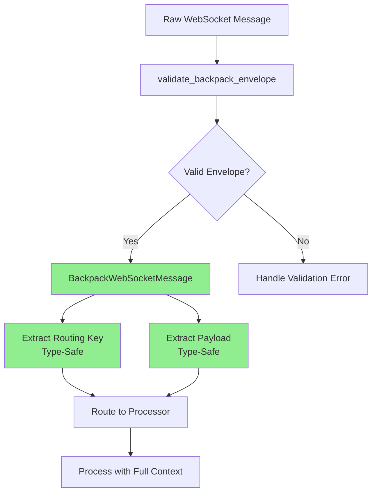

# Hyperliquid WebSocket Envelope Refactor - Critical Analysis

## Executive Summary

During the WebSocket refactoring to improve Pydantic validation and type safety, we discovered that while Backpack received a comprehensive envelope validation layer, **Hyperliquid was left with the same architectural gaps** that originally plagued Backpack. This document details the missing validation layer and provides a roadmap for achieving consistency across exchanges.

## Problem Discovery

### Pyright Type Errors Revealed the Gap

While fixing pyright errors, we encountered persistent type issues in Hyperliquid:

```python
# /workspaces/CyberDeltaEngine/worktrees/ws-pydantic/cyberdelta/apis/hyperliquid/hl_ws_router.py
error: Return type, "dict[Unknown, Unknown]", is partially unknown (reportUnknownVariableType)
error: Return type, "list[Unknown]", is partially unknown (reportUnknownVariableType)
```

These errors were symptoms of a deeper architectural issue: **missing envelope validation**.

## Current State Comparison

### Backpack (After Refactor) ✅



### Hyperliquid (Current) ❌

```mermaid
flowchart TD
    A[Raw WebSocket Message] --> B[Direct Dict Access]
    B --> C[message.get 'channel']
    B --> D[message['data']]
    C --> E{Channel Valid?}
    D --> F[Extract Payload<br/>Type Unknown]
    E -->|Maybe| G[Route to Processor]
    E -->|No| H[Runtime Error]
    F --> G
    G --> I[Process with Limited Context]

    style B fill:#FFB6C1
    style C fill:#FFB6C1
    style D fill:#FFB6C1
    style F fill:#FFB6C1
```

## Detailed Code Analysis

### 1. Raw Dictionary Access Pattern

#### Hyperliquid Current Implementation ❌

```python
# hl_ws_router.py - Multiple unsafe dictionary accesses

def _extract_routing_key(self, message: dict[str, Any]) -> str | None:
    """Extract routing key with raw dict access."""
    # Line 291 - Unsafe access, no validation
    channel = message.get("channel")

    if channel in {"l2Book", "trades", "userEvents"}:
        return channel

    # More unsafe nested access for user events
    if channel == "user" and "data" in message:
        data = message["data"]
        if isinstance(data, dict) and "type" in data:
            user_type = data["type"]
            # ... complex routing logic

def _extract_payload(self, message: dict[str, Any]) -> dict[str, Any] | list[Any]:
    """Extract payload with type issues."""
    if "data" in message:
        data = message["data"]  # Type: Any
        if isinstance(data, dict):
            return data  # Pyright: dict[Unknown, Unknown] ❌
        if isinstance(data, list):
            return data  # Pyright: list[Unknown] ❌
```

#### Backpack Improved Implementation ✅

```python
# bp_ws_router.py - Type-safe envelope access

def _extract_routing_key_from_envelope(self, envelope: BackpackWebSocketMessage) -> str | None:
    """Extract routing key from VALIDATED envelope."""
    # Type-safe access to validated fields
    if isinstance(envelope, BackpackLegacyTypeEnvelope):
        return envelope.type  # Fully typed!

    if isinstance(envelope, BackpackRawWebSocketEnvelope):
        stream = envelope.stream  # Validated string!
        routing_key, _ = ExchangeSpecificValidators.validate_backpack_topic(stream)
        return routing_key

def _extract_payload_from_envelope(self, envelope: BackpackWebSocketMessage) -> dict[str, Any]:
    """Extract payload from VALIDATED envelope."""
    # No type issues - envelope is validated!
    if isinstance(envelope, (BackpackRawWebSocketEnvelope, BackpackLegacyTopicEnvelope)):
        return envelope.data  # Type-safe access
```

### 2. Missing Envelope Models

#### What Backpack Has ✅

```python
# bp_ws_envelope.py - Comprehensive envelope validation

class BackpackRawWebSocketEnvelope(BaseModel):
    """Raw WebSocket message envelope from Backpack."""
    stream: RawBpNonEmptyStringMax128 = Field(
        ...,
        description="Stream identifier following Backpack's <type>.<symbol> format"
    )
    data: dict[str, Any] | list[Any] = Field(
        ...,
        description="Stream-specific payload data"
    )

    @field_validator("stream")
    @classmethod
    def validate_stream_format(cls, v: str) -> str:
        """Validate stream name format."""
        # Comprehensive validation logic
        valid_patterns = [
            r"^(depth|ticker|trade|bookTicker)\\.[A-Z_]+$",
            r"^kline\\.[0-9]+[mhd]\\.[A-Z_]+$",
            # ... more patterns
        ]
        if not any(re.match(pattern, v) for pattern in valid_patterns):
            raise ValueError(f"Invalid stream format: {v}")
        return v

def validate_backpack_envelope(message: dict[str, Any]) -> BackpackWebSocketMessage:
    """Validate and parse envelope with proper error handling."""
    format_type = detect_envelope_format(message)

    if format_type == "stream":
        return BackpackRawWebSocketEnvelope.model_validate(message)
    elif format_type == "topic":
        return BackpackLegacyTopicEnvelope.model_validate(message)
    # ... handle other formats
```

#### What Hyperliquid is Missing ❌

```python
# hl_ws_envelope.py - DOES NOT EXIST!
# No envelope validation
# No type-safe models
# No format detection
# No validation functions
```

### 3. Error Handling and Context

#### Backpack - Rich Context ✅

```python
async def route_message(self, message: dict[str, Any], handlers: dict[str, MessageHandler]) -> None:
    """Route with comprehensive validation and context."""

    # Step 1: Validate envelope FIRST
    try:
        validated_envelope = validate_backpack_envelope(message)
    except (ValidationError, ValueError) as e:
        await self.error_handler.handle_unroutable_message(
            message=message,
            reason=f"Invalid message envelope format: {e}",
            context={
                "exchange": self.exchange_name,
                "validation_error": str(e),
                "envelope_format": detect_envelope_format(message)  # Rich context!
            }
        )
        return

    # Step 2: Rich context for processing
    context = {
        "original_message": message,
        "validated_envelope": validated_envelope,  # Type-safe envelope!
        "envelope_type": type(validated_envelope).__name__,
        "routing_key": routing_key,
        "exchange": self.exchange_name,
    }
```

#### Hyperliquid - Limited Context ❌

```python
async def route_message(self, message: dict[str, Any], handlers: dict[str, MessageHandler]) -> None:
    """Route without envelope validation."""

    # No envelope validation!
    routing_key = self._extract_routing_key(message)  # Raw dict access

    if not routing_key:
        await self.error_handler.handle_unroutable_message(
            message=message,
            reason="Unable to determine routing key",
            context={"exchange": self.exchange_name}  # Limited context
        )
        return

    # Basic context only
    context = {
        "original_message": message,  # No validated envelope!
        "routing_key": routing_key,
        "exchange": self.exchange_name,
    }
```

## Real-World Message Examples

### Hyperliquid WebSocket Messages

```json
// L2 Book Update
{
  "channel": "l2Book",
  "data": {
    "coin": "BTC",
    "time": 1234567890123,
    "levels": [
      ["50000.0", "1.5"],    // [price, size]
      ["49999.0", "2.0"]
    ]
  }
}

// Trade Update
{
  "channel": "trades",
  "data": {
    "coin": "ETH",
    "side": "B",
    "px": "3000.0",
    "sz": "0.5",
    "time": 1234567890123
  }
}

// User Order Update
{
  "channel": "user",
  "data": {
    "type": "orderUpdate",
    "orders": [{
      "oid": 12345,
      "coin": "BTC",
      "side": "B",
      "limitPx": "50000.0",
      "sz": "0.1"
    }]
  }
}
```

### Current Handling Problems

1. **No validation that `channel` exists**
   ```python
   channel = message.get("channel")  # Could be None!
   ```

2. **No validation of channel values**
   ```python
   if channel in {"l2Book", "trades", "userEvents"}:  # What about typos?
   ```

3. **No validation of data structure**
   ```python
   data = message["data"]  # Could raise KeyError!
   ```

## Proposed Solution

### 1. Create Hyperliquid Envelope Models

```python
# cyberdelta/apis/hyperliquid/models/hl_ws_envelope.py

from pydantic import BaseModel, Field, field_validator, ConfigDict
from typing import Any, Literal

class HyperliquidChannelType(str, Enum):
    """Valid Hyperliquid WebSocket channels."""
    L2_BOOK = "l2Book"
    TRADES = "trades"
    USER_EVENTS = "user"
    ORDERS = "orders"
    FILLS = "fills"
    ALL_MIDS = "allMids"

class HyperliquidRawWebSocketEnvelope(BaseModel):
    """Validated envelope for Hyperliquid WebSocket messages.

    All Hyperliquid WebSocket messages follow this format:
    {
        "channel": "<channel_name>",
        "data": <channel_specific_payload>
    }
    """

    channel: str = Field(
        ...,
        min_length=1,
        max_length=64,
        description="Channel identifier (e.g., 'l2Book', 'trades', 'user')"
    )
    data: dict[str, Any] | list[Any] = Field(
        ...,
        description="Channel-specific payload data"
    )

    model_config = ConfigDict(
        extra="forbid",  # Reject unknown fields
        frozen=True,     # Immutable after creation
        validate_assignment=True
    )

    @field_validator("channel")
    @classmethod
    def validate_channel(cls, v: str) -> str:
        """Validate channel is a known type."""
        try:
            HyperliquidChannelType(v)
        except ValueError:
            valid_channels = [ch.value for ch in HyperliquidChannelType]
            raise ValueError(
                f"Unknown channel '{v}'. Valid channels: {', '.join(valid_channels)}"
            )
        return v

class HyperliquidUserEventEnvelope(HyperliquidRawWebSocketEnvelope):
    """Specialized envelope for user channel messages."""

    channel: Literal["user"] = Field(default="user")
    data: dict[str, Any] = Field(...)  # User events are always dicts

    @field_validator("data")
    @classmethod
    def validate_user_data(cls, v: dict[str, Any]) -> dict[str, Any]:
        """Validate user event has required type field."""
        if "type" not in v:
            raise ValueError("User event data must contain 'type' field")

        valid_types = {"orderUpdate", "fill", "position"}
        if v["type"] not in valid_types:
            raise ValueError(f"Invalid user event type: {v['type']}")

        return v

def validate_hyperliquid_envelope(message: dict[str, Any]) -> HyperliquidRawWebSocketEnvelope:
    """Validate and parse Hyperliquid WebSocket message envelope.

    Args:
        message: Raw WebSocket message dictionary

    Returns:
        Validated envelope model instance

    Raises:
        ValidationError: If message doesn't match expected format
        ValueError: If message structure is invalid
    """
    # Check basic structure
    if not isinstance(message, dict):
        raise ValueError(f"Expected dict, got {type(message).__name__}")

    if "channel" not in message:
        raise ValueError("Missing required 'channel' field")

    if "data" not in message:
        raise ValueError("Missing required 'data' field")

    # Special handling for user channel
    if message.get("channel") == "user":
        return HyperliquidUserEventEnvelope.model_validate(message)

    # General envelope validation
    return HyperliquidRawWebSocketEnvelope.model_validate(message)
```

### 2. Update Router to Use Envelope Validation

```python
# hl_ws_router.py - Updated implementation

async def route_message(
    self,
    message: dict[str, Any],
    handlers: dict[str, MessageHandler]
) -> None:
    """Route messages with proper envelope validation."""

    # Step 1: Validate envelope structure FIRST
    try:
        validated_envelope = validate_hyperliquid_envelope(message)
    except (ValidationError, ValueError) as e:
        await self.error_handler.handle_unroutable_message(
            message=message,
            reason=f"Invalid message envelope: {e}",
            context={
                "exchange": self.exchange_name,
                "validation_error": str(e),
                "message_keys": list(message.keys()) if isinstance(message, dict) else None
            }
        )
        return

    # Step 2: Extract routing key from VALIDATED envelope
    routing_key = self._extract_routing_key_from_envelope(validated_envelope)

    # Step 3: Create rich context
    context = {
        "original_message": message,
        "validated_envelope": validated_envelope,
        "envelope_type": type(validated_envelope).__name__,
        "channel": validated_envelope.channel,
        "routing_key": routing_key,
        "exchange": self.exchange_name,
    }

    # ... rest of routing logic

def _extract_routing_key_from_envelope(
    self,
    envelope: HyperliquidRawWebSocketEnvelope
) -> str | None:
    """Extract routing key from VALIDATED envelope - type safe!"""

    channel = envelope.channel  # Type-safe access!

    # Direct channel routing
    if channel in {"l2Book", "trades", "allMids"}:
        return channel

    # User event routing
    if isinstance(envelope, HyperliquidUserEventEnvelope):
        user_type = envelope.data["type"]  # Safe - validated!
        if user_type == "orderUpdate":
            return "orders"
        elif user_type == "fill":
            return "fills"

    return None

def _extract_payload_from_envelope(
    self,
    envelope: HyperliquidRawWebSocketEnvelope
) -> dict[str, Any] | list[Any]:
    """Extract payload from VALIDATED envelope - no type issues!"""
    return envelope.data  # Already properly typed!
```

## Benefits of Implementation

### 1. Type Safety ✅

```python
# Before: Type errors
data = message["data"]  # Any
return data  # dict[Unknown, Unknown] ❌

# After: Type safe
data = envelope.data  # dict[str, Any] | list[Any]
return data  # Properly typed! ✅
```

### 2. Early Validation ✅

```python
# Before: Runtime errors possible
channel = message.get("channel")  # Could be None
data = message["data"]  # Could raise KeyError

# After: Validation catches issues early
validated_envelope = validate_hyperliquid_envelope(message)
# If we get here, channel and data are guaranteed to exist!
```

### 3. Better Error Messages ✅

```python
# Before:
KeyError: 'data'  # Cryptic runtime error

# After:
ValidationError: Missing required 'data' field in Hyperliquid envelope
```

### 4. Consistency with Backpack ✅

Both exchanges would follow the same pattern:
1. Validate envelope structure
2. Extract routing information from validated envelope
3. Process with full type safety and context

## Migration Path

### Phase 1: Add Envelope Models
1. Create `hl_ws_envelope.py` with models
2. Add comprehensive tests
3. No breaking changes yet

### Phase 2: Update Router
1. Add `route_message_v2` with envelope validation
2. Deprecate raw dict access methods
3. Run both in parallel for testing

### Phase 3: Full Migration
1. Switch to validated flow
2. Remove deprecated methods
3. Update all tests

## Conclusion

The Hyperliquid WebSocket implementation currently lacks the envelope validation layer that makes Backpack type-safe and robust. By implementing the proposed envelope models and validation flow, we would:

1. **Eliminate pyright type errors** about `dict[Unknown, Unknown]`
2. **Catch malformed messages early** with clear error messages
3. **Achieve consistency** across exchange implementations
4. **Complete the WebSocket refactoring goals** of full Pydantic validation

This is not just about fixing type errors - it's about building a robust, maintainable, and type-safe WebSocket infrastructure that can handle the complexities of real-time financial data.
