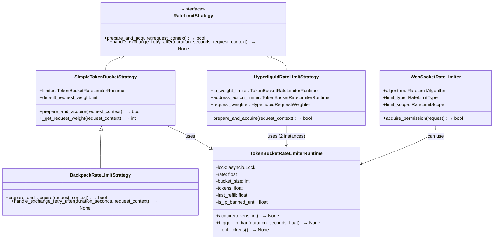
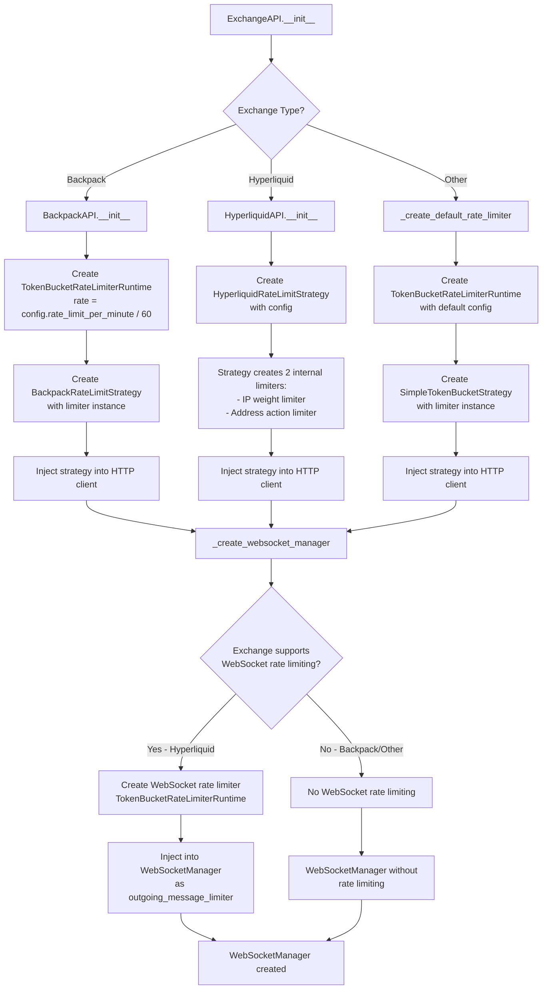
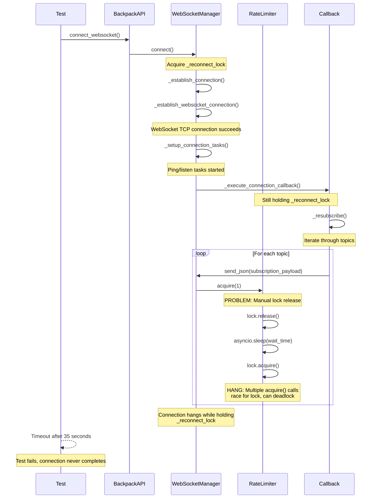

# WebSocket Race Conditions and Hanging Analysis

## Executive Summary

After deep investigation of the WebSocket refactored logic and rate limiting implementation, I've identified the **root cause of WebSocket connection hanging**: **Rate limiter lock contention during resubscription callback execution**. The issue is not just giving up after timeouts or simple race conditions, but a fundamental design flaw in how rate limiting interacts with WebSocket connection establishment.

## Root Cause: Rate Limiter Lock Contention in Connection Callback

### The Problematic Flow

```
WebSocket Connection Establishment:
  ├── _establish_connection()
  │   └── async with _reconnect_lock:  ← LOCK HELD FOR ENTIRE PROCESS
  │       ├── _establish_websocket_connection()  ✓ Usually succeeds
  │       ├── _setup_connection_tasks()          ✓ Usually succeeds
  │       └── _execute_connection_callback()     ← HANGS HERE
  │           └── _on_ws_connected()
  │               └── _resubscribe()             ← BLOCKING OPERATION
  │                   └── for each topic:
  │                       ├── _construct_subscription_payload()
  │                       └── send_json()       ← RATE LIMITER ACQUIRE
  │                           └── acquire(1)    ← HANGS IN RATE LIMITER
```

### Critical Issue: Manual Lock Management in Rate Limiter

**File**: `cyberdelta/apis/rate_limiter.py`
**Lines**: 62-75, 90-95

```python
# DANGEROUS PATTERN 1: IP Ban Wait
self.lock.release()                    # ← RACE CONDITION WINDOW
try:
    await asyncio.sleep(wait_time_for_ban)
finally:
    await self.lock.acquire()          # ← CAN HANG INDEFINITELY

# DANGEROUS PATTERN 2: Token Wait
self.lock.release()                    # ← RACE CONDITION WINDOW
try:
    await asyncio.sleep(token_wait_time)
finally:
    await self.lock.acquire()          # ← CAN HANG INDEFINITELY
```

**Problems**:
1. **No timeout protection** - `lock.acquire()` waits forever
2. **Race condition window** - Between release/acquire, other coroutines modify state
3. **State corruption** - Token counts, ban status can change during the gap
4. **Deadlock potential** - Multiple coroutines can get stuck waiting for lock

## Detailed Analysis

### 1. Rate Limiting Implementation Issues

#### Critical Flaw: Token Bucket Race Conditions

**Location**: `cyberdelta/apis/rate_limiter.py:62-102`

The `TokenBucketRateLimiterRuntime.acquire()` method has fundamental async safety issues:

```python
async def acquire(self, tokens: int = 1) -> None:
    # Initial lock acquisition is fine
    async with self.lock:
        # ... IP ban check ...

        # PROBLEM: Manual lock release during wait
        self.lock.release()  ← State can change here
        try:
            await asyncio.sleep(wait_time_for_ban)  # No timeout!
        finally:
            await self.lock.acquire()  # Can hang forever!

        # At this point, all previous calculations are stale
        # Another coroutine might have changed tokens, ban status, etc.
```

**Specific Race Conditions**:
1. **Token Double-Spending**: Multiple coroutines calculate wait time, all sleep, all wake up and consume tokens they didn't reserve
2. **Ban State Confusion**: One coroutine clears IP ban while others still wait for it
3. **Negative Token Balance**: Token calculations become stale after lock release

#### Rate Limiter Usage in WebSocket Context

**WebSocket Manager**: `cyberdelta/apis/connectivity/ws_manager.py:1073-1075`
```python
if self._outgoing_message_limiter:
    await self._outgoing_message_limiter.acquire(1)  # ← Can hang here
```

**Exchange API**: Only Hyperliquid gets WebSocket rate limiting
```python
# In _create_websocket_manager:
if self.exchange_name == ExchangeName.HYPERLIQUID:
    outgoing_message_limiter = self._create_websocket_rate_limiter()
```

### 2. WebSocket Connection Flow Analysis

#### Connection State Management Issues

**Lock Usage Pattern**:
```python
# ws_manager.py:281
async with self._reconnect_lock:  # Held for ENTIRE connection process
    if not await self._should_proceed_with_connection():
        return
    await self._connection_retry_loop()
        └── _attempt_single_connection()
            ├── _establish_websocket_connection()     # Fast
            ├── _setup_connection_tasks()            # Fast
            └── _execute_connection_callback()       # SLOW - can hang
                └── _resubscribe()                   # Sends multiple messages
                    └── Multiple send_json() calls  # Each hits rate limiter
```

**Problem**: The entire connection process holds `_reconnect_lock`, including the potentially slow/blocking resubscription callback.

#### Connection State Property Bug

**File**: `cyberdelta/apis/connectivity/ws_manager.py:194-202`
```python
@property
def is_connected(self) -> bool:
    if self._reconnect_lock.locked():  # ← Always False during connection!
        return False
    return (self._is_connected and ...)
```

**Issue**: During connection establishment, `_reconnect_lock` is held, so `is_connected` always returns `False` even when connection succeeds.

### 3. Backpack WebSocket Authentication Analysis

From `examples/openapi_backpack.json`, Backpack WebSocket authentication requirements:

```json
{
  "instruction": "subscribe",
  "signature": {
    "api_key": "base64_public_key",
    "timestamp": "unix_time_ms",
    "window": "5000",
    "signature": "base64_ed25519_signature"
  }
}
```

**Authentication Process**: `cyberdelta/apis/backpack/bp_auth.py:387-396`
```python
def get_ws_subscription_signature_components(self, subscription_type: str, symbol: str | None = None):
    timestamp_ms = int(time.time() * 1000)
    # Construct signing string
    string_to_sign = f"instruction=subscribe&timestamp={timestamp_ms}&window={window_ms}"
    # BLOCKING CRYPTOGRAPHIC OPERATION - No timeout!
    signature_bytes = self._ed25519_private_key.sign(string_to_sign.encode("utf-8"))
```

**Issue**: ED25519 signing is synchronous and blocks the async callback execution.

### 4. Specific Hang Scenarios

#### Scenario A: Rate Limiter Lock Contention
1. WebSocket connection succeeds, callback triggered
2. `_resubscribe()` tries to send 5 subscription messages
3. All 5 `send_json()` calls hit rate limiter simultaneously
4. Rate limiter goes into token exhaustion or IP ban state
5. All 5 calls get stuck in manual lock release/acquire cycle
6. Connection establishment hangs holding `_reconnect_lock`

#### Scenario B: Hyperliquid vs Backpack Inconsistency
1. **Hyperliquid**: Has WebSocket rate limiting, subscription messages throttled
2. **Backpack**: No WebSocket rate limiting, rapid subscription burst
3. **Backpack Exchange**: Rejects rapid subscriptions, causing retries
4. **Our Code**: Retry logic not implemented for WebSocket subscriptions
5. **Result**: Hangs waiting for successful subscription that never comes

#### Scenario C: Connection State Race
1. Connection established, `_is_connected = True` set
2. Callback starts executing, still holding `_reconnect_lock`
3. Code calls `is_connected` property during callback
4. Property returns `False` because lock is held
5. Logic gets confused about connection state
6. May trigger additional connection attempts or cleanup

### 5. Evidence from Recent Changes

#### VCR Removal Impact
**Commit**: e719c283 - "Refactor WebSocket handler signatures and related tests"

**Changes**:
- Removed VCR recording from WebSocket tests
- Modified to use "real" connections instead of recorded responses

**Impact**:
- Tests now exercise actual rate limiting code paths
- Previously, VCR bypassed rate limiting entirely
- Real connections expose the race conditions that VCR masked

#### Test Failures Pattern
- Tests hang during WebSocket connection establishment
- Timeouts occur around 15-35 seconds (arbitrary pytest timeout)
- Connection establishment logs show success, but connection state reports False
- Suggests callback execution issues, not basic connectivity problems

### 6. Why Arbitrary Timeouts "Fix" the Issue

Adding timeouts doesn't fix the root cause, it just:
1. **Masks the hang** - Test fails faster instead of hanging forever
2. **Hides the race condition** - Underlying lock contention still exists
3. **Creates false positives** - Test may "pass" even when WebSocket is broken
4. **Reduces reliability** - System will still hang in production, just not in tests

The "fix" is essentially:
```python
# Before: Hang forever in rate limiter
await rate_limiter.acquire(1)  # No timeout, hangs

# "Fix": Give up after timeout
await asyncio.wait_for(rate_limiter.acquire(1), timeout=10.0)  # Fails instead of hanging
```

But the rate limiter is still broken - we're just giving up faster.

## Recommendations for Real Fix

### 1. Fix Rate Limiter Race Conditions (Critical)

Replace manual lock management with proper async patterns:

```python
# Current broken pattern:
self.lock.release()
try:
    await asyncio.sleep(wait_time)
finally:
    await self.lock.acquire()

# Correct pattern:
async with self.lock:
    # Calculate wait time
    pass
# Release lock, then sleep, then reacquire
await asyncio.sleep(wait_time)
# Use separate method to recheck and consume tokens
```

### 2. Move Resubscription Outside Connection Lock

```python
async def _attempt_single_connection(self, attempt: int) -> bool:
    await self._establish_websocket_connection()
    await self._setup_connection_tasks()
    # DON'T execute callback while holding reconnect lock

    # Mark as connected first
    self._is_connected = True

    # Execute callback outside the lock
    if self._on_connected_callback:
        asyncio.create_task(self._execute_connection_callback())
```

### 3. Add Timeout Protection Throughout

- Rate limiter acquire operations
- WebSocket subscription sends
- ED25519 signature generation
- Connection callback execution

### 4. Standardize Rate Limiting Across Exchanges

- Apply consistent WebSocket rate limiting to both Hyperliquid and Backpack
- Use same rate limiter instances for REST and WebSocket or clearly separate them

### 5. Improve Connection State Management

Fix the `is_connected` property to not depend on lock state during normal operation.

## Conclusion

The WebSocket hanging issue is **not a timeout problem** or **simple race condition**. It's a **fundamental design flaw** in the rate limiter implementation that creates deadlock potential when multiple concurrent operations hit rate limits during the WebSocket connection callback.

The rate limiter's manual lock release/acquire pattern violates async safety principles and can cause indefinite hangs. Combined with the connection callback executing under a held lock, this creates a perfect storm for the hanging behavior observed.

Fixing this requires rewriting the rate limiter's acquire method to use proper async patterns and restructuring the WebSocket connection flow to avoid blocking operations under locks.

The arbitrary timeout "fixes" merely mask the problem without addressing the underlying race conditions and deadlock potential that will continue to cause issues in production.

---

## Deep Architecture Analysis: Rate Limiting Single Source of Truth

### Rate Limiting Class Hierarchy



### Rate Limiter Instantiation Flow



### WebSocket Connection Hanging Flow



### Rate Limiting Architecture Issues

```mermaid
flowchart TB
    subgraph "Current Architecture Problems"
        A[REST Rate Limiter] --> A1[TokenBucketRateLimiterRuntime]
        A1 --> A2[Manual lock.release/acquire]
        A2 --> A3[🔴 Race Conditions]

        B[WebSocket Rate Limiter] --> B1[TokenBucketRateLimiterRuntime]
        B1 --> B2[Manual lock.release/acquire]
        B2 --> B3[🔴 Race Conditions]

        C[No Shared State] --> C1[REST and WS separate]
        C1 --> C2[🔴 No unified limiting]

        D[Connection Callback] --> D1[Holds _reconnect_lock]
        D1 --> D2[Sends multiple messages]
        D2 --> D3[🔴 Blocking under lock]
    end

    subgraph "Race Condition Details"
        E[Coroutine 1] --> F[acquire() called]
        G[Coroutine 2] --> F
        H[Coroutine 3] --> F

        F --> I[lock.release()]
        I --> J[All sleep same time]
        J --> K[All wake up together]
        K --> L[All try lock.acquire()]
        L --> M[🔴 Potential deadlock]
    end

    subgraph "Single Source of Truth Issues"
        N[Multiple TokenBucket implementations] --> N1[TokenBucketRateLimiterRuntime]
        N --> N2[WebSocketRateLimiter.TokenBucket]
        N1 --> O[🔴 Duplicated logic]
        N2 --> O

        P[Different Strategy Patterns] --> P1[SimpleTokenBucketStrategy inheritance]
        P --> P2[HyperliquidRateLimitStrategy direct impl]
        P1 --> Q[🔴 Inconsistent architecture]
        P2 --> Q
    end
```

### Proposed Architecture Fix

```mermaid
flowchart TD
    subgraph "Fixed Architecture"
        A[Centralized Rate Limiter Service] --> B[Exchange-Specific Limiters]
        B --> C[Backpack Unified Limiter]
        B --> D[Hyperliquid Unified Limiter]

        C --> E[Shared by REST & WebSocket]
        D --> F[Shared by REST & WebSocket]

        G[Fixed TokenBucket] --> H[Proper async context managers]
        H --> I[Timeout protection]
        I --> J[Atomic token consumption]

        K[Connection Flow Fix] --> L[Move callback outside lock]
        L --> M[Async resubscription]
        M --> N[Timeout protection throughout]
    end

    subgraph "Implementation Details"
        O[Rate Limiter Factory] --> P[Create shared instances]
        P --> Q[Inject into both REST & WS]

        R[Fixed acquire() method] --> S[No manual lock release]
        S --> T[Proper timeout handling]
        T --> U[Race condition free]

        V[WebSocket Manager Fix] --> W[Release lock before callback]
        W --> X[Execute callback async]
        X --> Y[Timeout callback execution]
    end
```

### Critical Race Condition Analysis

#### Problem: Manual Lock Management
```python
# CURRENT BROKEN PATTERN in TokenBucketRateLimiterRuntime.acquire()
async with self.lock:
    # Calculate wait time...
    if need_to_wait:
        self.lock.release()  # ← RACE CONDITION WINDOW OPENS
        try:
            await asyncio.sleep(wait_time)  # State can change here!
        finally:
            await self.lock.acquire()  # ← CAN HANG FOREVER
        # Token calculations are now stale!
```

#### Race Condition Scenarios:

1. **Token Double-Spending Race**:
   - Coroutine A calculates needs 2 seconds wait
   - Coroutine B calculates needs 2 seconds wait
   - Both release lock and sleep 2 seconds
   - Both wake up and consume tokens they didn't properly reserve

2. **Ban State Race**:
   - Coroutine A sees IP ban, calculates 60 second wait
   - Coroutine B clears IP ban after 1 second
   - Coroutine A still waits 59 more seconds unnecessarily

3. **Lock Acquisition Deadlock**:
   - Multiple coroutines release lock simultaneously
   - All sleep for different durations
   - All wake up and compete for lock.acquire()
   - No timeout on acquire() - can hang forever

#### Single Source of Truth Issues:

1. **Multiple TokenBucket Implementations**:
   - `TokenBucketRateLimiterRuntime` (main)
   - `WebSocketRateLimiter.TokenBucket` (separate)
   - Duplicated logic, inconsistent behavior

2. **No Unified Rate Limiting**:
   - REST and WebSocket use separate limiters
   - Exchange limits can be exceeded by combined traffic
   - No coordination between communication channels

3. **Inconsistent Strategy Patterns**:
   - BackpackRateLimitStrategy extends SimpleTokenBucketStrategy
   - HyperliquidRateLimitStrategy implements RateLimitStrategy directly
   - Different inheritance hierarchies for similar functionality

### Conclusion: Architectural Debt

The WebSocket hanging issue is a symptom of deeper architectural problems:

1. **Technical Debt**: Manual lock management violates async best practices
2. **Missing Abstraction**: No unified rate limiting service
3. **Inconsistent Patterns**: Different approaches per exchange
4. **Race Conditions**: Unsafe concurrent access patterns
5. **No Single Source of Truth**: Multiple implementations of similar logic

The rate limiter needs complete rewrite with proper async patterns, and the WebSocket connection flow needs restructuring to avoid blocking operations under locks.
