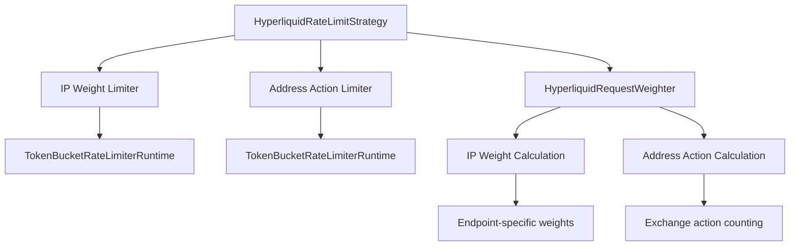

# Comprehensive Rate Limiting Strategy Analysis

## Executive Summary

The CyberDeltaEngine implements two distinct rate limiting approaches for Backpack and Hyperliquid exchanges, each reflecting the unique requirements and complexity of the respective exchange APIs. This analysis reveals significant architectural inconsistencies, potential improvements, and implementation patterns that are contributing to WebSocket hanging issues.

## Backpack Exchange Rate Limiting Analysis

### 1. Rate Limiting Configuration and Implementation

**Configuration Source:**
- Simple rate limiting based on `rate_limit_per_minute` from `ExchangeSpecificConfig`
- Configured in `/workspaces/CyberDeltaEngine/worktrees/ws-pydantic/cyberdelta/config/models/config_models.py:153-157`
- Validation enforced in lines 318-325 requiring non-null value for Backpack

**Implementation Details:**
- **Strategy Class**: `BackpackRateLimitStrategy` extends `SimpleTokenBucketStrategy`
- **Location**: `/workspaces/CyberDeltaEngine/worktrees/ws-pydantic/cyberdelta/apis/backpack/bp_rate_limit_strategy.py`
- **Core Limiter**: `TokenBucketRateLimiterRuntime` with async implementation
- **Rate Calculation**: `rate_per_second = rate_limit_per_minute / 60.0`
- **Bucket Size**: `max(1, int(rate_per_second * 2))` (2-second burst capacity)

### 2. Rate Limits Application (REST vs WebSocket)

**REST API Rate Limiting:**
```python
# Applied in ExchangeAPI._apply_rate_limiting()
rate_limit_context = RateLimitRequestContext(
    endpoint=endpoint,
    method=method,
    payload=payload
)
await self.rate_limit_strategy.prepare_and_acquire(rate_limit_context)
```

**WebSocket Rate Limiting:**
- **❌ Inconsistent Implementation**: No specific WebSocket rate limiting for Backpack
- Uses same `TokenBucketRateLimiterRuntime` for outgoing WebSocket messages
- Applied in `WebSocketManager.send_json()` at lines 1074-1075

```python
# In WebSocketManager.send_json():
if self._outgoing_message_limiter:
    await self._outgoing_message_limiter.acquire(1)  # ← Can hang here
```

### 3. Error Handling and Retry-After Mechanisms

**Exchange-Specific Error Handling:**
- **Retry-After Parsing**: Implemented in `BackpackErrorMapper` (lines 317-373)
- **Patterns Supported**: Multiple formats including seconds, milliseconds, various text patterns
- **Information Flow**: Populates `APIError.retry_after` field for higher-level application logic

**Strategy Integration:**
```python
def handle_exchange_retry_after(self, duration_seconds: float, request_context: RateLimitRequestContext) -> None:
    """Handle exchange-advised retry after by triggering IP ban."""
    self.limiter.trigger_ip_ban(duration_seconds)
```

### 4. Configuration Values and Sources

**Configuration Hierarchy:**
```yaml
exchanges:
  backpack:
    rate_limit_per_minute: 600  # Required for Backpack
    # Derives: rate_per_second = 10.0, bucket_size = 20
```

**Backpack Rate Limiter Creation:**
```python
# In BackpackAPI.__init__()
rate_per_second = exchange_config.rate_limit_per_minute / 60.0
bucket_size = max(1, int(rate_per_second * 2))
bp_limiter_primitive = TokenBucketRateLimiterRuntime(
    rate=rate_per_second,
    bucket_size=bucket_size,
)
bp_strategy = BackpackRateLimitStrategy(
    limiter=bp_limiter_primitive,
    default_request_weight=1,
)
```

### 5. Backpack-Specific Features

**Limited Dynamic Adjustment:**
- `_update_rate_limit_from_headers()` is no-op for Backpack
- No dynamic rate limit adjustment from response headers
- Relies entirely on error-based feedback through retry-after parsing

**Error Code Mapping:**
- Standard `APIErrorCode.RATE_LIMITED` for all rate limit errors
- No specialized error codes for different rate limit types

## Hyperliquid Exchange Rate Limiting Analysis

### 1. Complex Dual Rate Limiting System

**Dual Limiter Architecture:**


**Configuration Requirements:**
```yaml
exchanges:
  hyperliquid:
    ip_weight_limit_per_minute: 1200
    info_request_type_ip_weights:
      l2Book: 2
      allMids: 2
      meta: 2
      userRole: 60
    default_info_weight: 20
    exchange_action_base_ip_weight: 1
    address_action_safety_net:
      rate_per_minute: 300
    websocket_send_rate_per_minute: 120  # Optional
```

### 2. Request Weighting System

**HyperliquidRequestWeighter Implementation:**

**IP Weight Calculation:**
```python
def get_ip_weight(self, endpoint: str, action_payload: dict[str, Any] | None = None) -> int:
    if endpoint == "/info":
        request_type = action_payload.get("type", "unknown") if action_payload else "unknown"
        return self._info_request_type_ip_weights.get(request_type, self._default_info_weight)
    elif endpoint == "/exchange":
        actions = action_payload.get("actions", []) if action_payload else []
        batch_length = len(actions)
        return self._exchange_action_base_ip_weight + (batch_length // 40)
    else:
        return self._default_info_weight
```

**Address Action Calculation:**
```python
def get_address_action_count(self, endpoint: str, action_payload: dict[str, Any] | None = None) -> int:
    if endpoint == "/exchange":
        actions = action_payload.get("actions", []) if action_payload else []
        return len(actions)
    return 0  # Only /exchange endpoint contributes to address actions
```

### 3. WebSocket Rate Limiting Implementation

**WebSocket-Specific Configuration:**
```python
# In ExchangeAPI._create_websocket_manager()
if (
    self.exchange_name == ExchangeName.HYPERLIQUID
    and self._config
    and self._config.websocket_send_rate_per_minute is not None
):
    outgoing_message_limiter = self._create_websocket_rate_limiter()
```

**❌ Architectural Issue**: Hardcoded exchange check in base class violates strategy pattern

### 4. Limiter Coordination

**Sequential Acquisition Pattern:**
```python
async def prepare_and_acquire(self, request_context: RateLimitRequestContext) -> bool:
    ip_cost = self._request_weighter.get_ip_weight(endpoint, action_payload)
    address_action_cost = self._request_weighter.get_address_action_count(endpoint, action_payload)
    
    # Sequential acquisition - both must succeed
    if ip_cost > 0:
        await self._ip_weight_limiter.acquire(tokens_to_consume=ip_cost)
    if address_action_cost > 0:
        await self._address_action_limiter.acquire(tokens_to_consume=address_action_cost)
    
    return True
```

**Safety Net Design:**
- Address action limiter provides additional protection for trading operations
- Independent of IP weight limiting
- Lower rate limit as safety mechanism

### 5. Error Handling and IP Ban Management

**IP Ban Triggering:**
```python
async def trigger_ip_ban_on_main_pool(self, duration_seconds: float) -> None:
    """Trigger IP ban specifically on the IP weight limiter (main pool)."""
    await self._ip_weight_limiter.trigger_ip_ban(duration_seconds)
    # Note: Address action limiter is NOT affected by IP bans
```

## Architecture Comparison

### Rate Limiting Approach Comparison

| Aspect | Backpack | Hyperliquid |
|--------|----------|-------------|
| **Complexity** | Simple single token bucket | Dual limiter system |
| **Configuration** | Single rate value | Multiple weighted parameters |
| **Request Weighting** | Uniform (1 token/request) | Dynamic, endpoint-specific |
| **WebSocket Limiting** | Shared with REST (❌) | Optional separate limiter |
| **Error Feedback** | Retry-after parsing | IP ban detection |
| **Dynamic Adjustment** | None | None (both no-op) |
| **Safety Mechanisms** | IP ban only | IP ban + address action limiting |

### Configuration Management Patterns

**Backpack - Simple Pattern:**
```python
# Direct configuration injection
class BackpackAPI(ExchangeAPI):
    def __init__(self, exchange_config: ExchangeSpecificConfig, exchange_secrets: ApiKeyAuthSecrets):
        # Simple rate limiter creation
        rate_per_second = exchange_config.rate_limit_per_minute / 60.0
        bucket_size = max(1, int(rate_per_second * 2))
        bp_limiter_primitive = TokenBucketRateLimiterRuntime(
            rate=rate_per_second,
            bucket_size=bucket_size,
        )
```

**Hyperliquid - Complex Pattern:**
```python
# Factory-based configuration
class HyperliquidAPI(ExchangeAPI):
    def __init__(self, exchange_config: ExchangeSpecificConfig, exchange_secrets: PrivateKeyAuthSecrets):
        # Complex multi-limiter creation
        hl_strategy = HyperliquidRateLimitStrategy(hl_exchange_config)
        # Strategy creates multiple internal limiters and request weighter
```

## Critical Architectural Issues

### 1. WebSocket Rate Limiting Inconsistency

**❌ Problem**: Inconsistent WebSocket rate limiting patterns
- **Backpack**: No WebSocket-specific configuration, shares REST limiter
- **Hyperliquid**: Optional dedicated WebSocket limiter
- **Both**: Use problematic `TokenBucketRateLimiterRuntime` with race conditions

**Hardcoded Exchange Logic:**
```python
# In ExchangeAPI._create_websocket_manager() - VIOLATION OF STRATEGY PATTERN
if self.exchange_name == ExchangeName.HYPERLIQUID:
    outgoing_message_limiter = self._create_websocket_rate_limiter()
```

### 2. TokenBucket Implementation Duplication

**Two Separate Implementations:**

1. **Production**: `TokenBucketRateLimiterRuntime` (has race conditions)
2. **Alternative**: `TokenBucket` (safer, unused - introduced during Pydantic refactor)

**Race Condition in Production Implementation:**
```python
# PROBLEMATIC PATTERN in TokenBucketRateLimiterRuntime.acquire()
async with self.lock:
    if self.tokens < tokens_to_consume:
        token_wait_time = (tokens_to_consume - self.tokens) / self.rate
        self.lock.release()  # ← RACE CONDITION WINDOW
        try:
            await asyncio.sleep(token_wait_time)  # State can change!
        finally:
            await self.lock.acquire()  # ← CAN HANG FOREVER
```

### 3. Configuration Validation Inconsistency

**Backpack Validation:**
```python
# Simple validation in ExchangeSpecificConfig
@model_validator(mode="after")
def check_exchange_specific_rate_limit_configs(self) -> Self:
    if self.exchange_name == ExchangeName.BACKPACK:
        if self.rate_limit_per_minute is None:
            raise RequiredParameterError("rate_limit_per_minute is required for Backpack")
```

**Hyperliquid Validation:**
```python
# Complex multi-stage validation
# 1. In ExchangeSpecificConfig (config model validation)
# 2. In HyperliquidRequestWeighter.__init__() (component validation)  
# 3. In HyperliquidRateLimitStrategy.__init__() (strategy validation)
```

### 4. Error Handling Variations

**Different Error Code Patterns:**
```python
# Backpack: Generic rate limiting
APIErrorCode.RATE_LIMITED

# Hyperliquid: Could benefit from more specific codes
APIErrorCode.IP_BAN_SUSPECTED  # For IP-specific bans
APIErrorCode.ADDRESS_ACTION_LIMITED  # For address action limits
```

## WebSocket Hanging Root Cause Analysis

### Primary Cause: Rate Limiter Race Conditions

**Hang Location**: `TokenBucketRateLimiterRuntime.acquire()` during WebSocket resubscription

**Sequence Leading to Hang:**
1. WebSocket connection establishes successfully
2. Connection callback (`_on_ws_connected`) executes under `_reconnect_lock`
3. `_resubscribe()` sends multiple subscription messages
4. Each `send_json()` calls `await rate_limiter.acquire(1)`
5. **Race condition in acquire() causes deadlock**
6. Connection hangs while holding `_reconnect_lock`

**Both Exchanges Affected:**
- Backpack: Uses same rate limiter for WebSocket messages
- Hyperliquid: May use separate WebSocket limiter, but same race condition

### Secondary Issues Contributing to Hang

**Connection Callback Under Lock:**
```python
# In WebSocketManager._establish_connection()
async with self._reconnect_lock:  # LOCK HELD FOR ENTIRE PROCESS
    await self._connection_retry_loop()
        └── _attempt_single_connection()
            └── _execute_connection_callback()  # ← HANGS HERE
                └── _resubscribe()              # ← BLOCKING OPERATION
                    └── Multiple send_json() calls with rate limiting
```

**is_connected Property Bug:**
```python
@property
def is_connected(self) -> bool:
    if self._reconnect_lock.locked():  # ← Always False during connection!
        return False
    return (self._is_connected and ...)
```

## Recommendations

### 1. Immediate Fixes (Critical)

**Fix Race Conditions in TokenBucketRateLimiterRuntime:**
```python
# SAFE PATTERN - No manual lock management
async def acquire(self, tokens_to_consume: int = 1) -> float:
    while True:
        async with self.lock:
            self._refill_tokens()
            if self.tokens >= tokens_to_consume:
                self.tokens -= tokens_to_consume
                return 0.0  # No wait needed
            
            # Calculate wait time while holding lock
            wait_time = (tokens_to_consume - self.tokens) / self.rate
        
        # Sleep OUTSIDE the lock
        await asyncio.sleep(wait_time)
        # Loop back to recheck and acquire
```

**Move WebSocket Callback Outside Connection Lock:**
```python
async def _attempt_single_connection(self, attempt: int) -> bool:
    await self._establish_websocket_connection()
    await self._setup_connection_tasks()
    # Mark as connected BEFORE callback
    self._is_connected = True
    
    # Execute callback OUTSIDE the reconnect lock
    if self._on_connected_callback:
        asyncio.create_task(self._execute_connection_callback())
    
    return True
```

### 2. Architectural Improvements

**Unify WebSocket Rate Limiting Pattern:**
```python
# Add to RateLimitStrategy interface
class RateLimitStrategy:
    def create_websocket_limiter(self) -> TokenBucketRateLimiterRuntime | None:
        """Create WebSocket-specific rate limiter if needed."""
        return None  # Default: no separate WebSocket limiting

# Exchange-specific implementations
class BackpackRateLimitStrategy(SimpleTokenBucketStrategy):
    def create_websocket_limiter(self) -> TokenBucketRateLimiterRuntime | None:
        # Share same limiter between REST and WebSocket
        return self.limiter

class HyperliquidRateLimitStrategy(RateLimitStrategy):
    def create_websocket_limiter(self) -> TokenBucketRateLimiterRuntime | None:
        # Create separate WebSocket limiter if configured
        if self._config.websocket_send_rate_per_minute:
            return self._create_ws_limiter()
        return None
```

**Remove Hardcoded Exchange Logic:**
```python
# In ExchangeAPI._create_websocket_manager()
outgoing_message_limiter = self.rate_limit_strategy.create_websocket_limiter()
# No more hardcoded exchange name checks
```

### 3. Long-term Improvements

**Consolidate TokenBucket Implementations:**
- Merge safer patterns from `TokenBucket` into `TokenBucketRateLimiterRuntime`
- Remove duplicate implementation
- Maintain backward compatibility

**Standardize Configuration Patterns:**
- Consistent validation approach across exchanges
- Reduce configuration complexity
- Better error messages

**Enhanced Error Handling:**
- Exchange-specific error codes where beneficial
- Automatic rate limit strategy notification
- Consistent retry-after handling

## Conclusion

The WebSocket hanging issue stems from fundamental race conditions in the `TokenBucketRateLimiterRuntime` implementation, combined with architectural inconsistencies between the two exchange rate limiting strategies. While both exchanges implement rate limiting, they do so with different patterns and complexities that mask the underlying technical debt.

**Key Findings:**
1. **Race conditions** in production token bucket implementation cause WebSocket hangs
2. **Architectural inconsistencies** between exchanges create maintenance complexity
3. **Safer alternative implementation** exists but is unused (Pydantic refactor artifact)
4. **WebSocket rate limiting patterns** are inconsistent across exchanges

**Priority Actions:**
1. Fix race conditions in `TokenBucketRateLimiterRuntime` (critical for WebSocket stability)
2. Unify WebSocket rate limiting patterns across exchanges
3. Remove hardcoded exchange logic from base classes
4. Consolidate duplicate TokenBucket implementations

The analysis shows that while the rate limiting strategies serve their purpose, they need architectural cleanup to eliminate the WebSocket hanging issues and improve long-term maintainability.