# WebSocket Module Architecture Documentation

## Current Architecture Overview

The WebSocket module is a complex system designed to handle real-time message processing from multiple cryptocurrency exchanges. However, multiple refactoring iterations have created a labyrinthine architecture with significant redundancy.

## Architecture Diagrams

### 1. High-Level Component Architecture

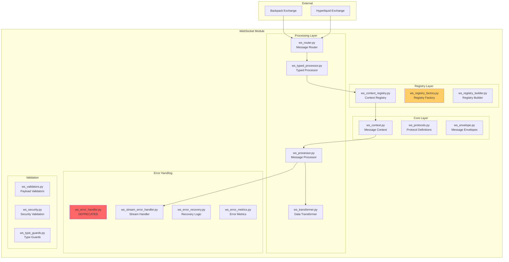

### 2. Message Processing Flow

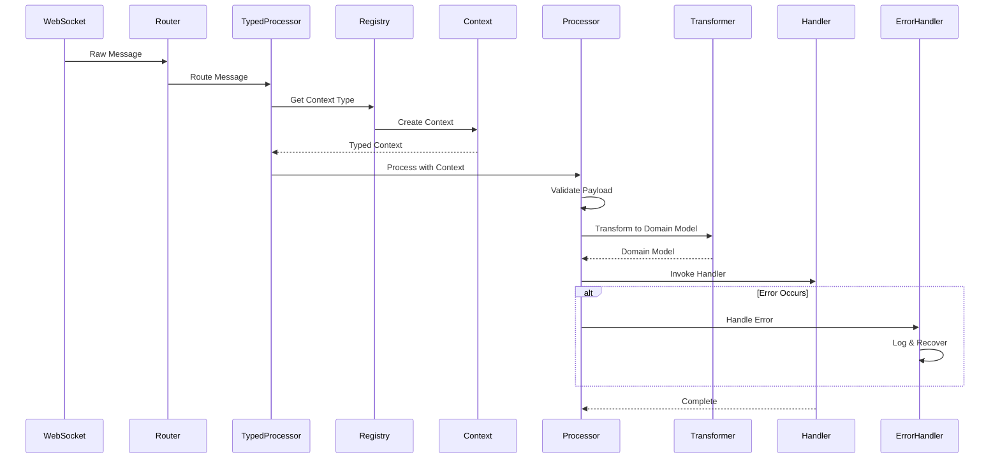

### 3. Error Handling Hierarchy (Current Chaos)

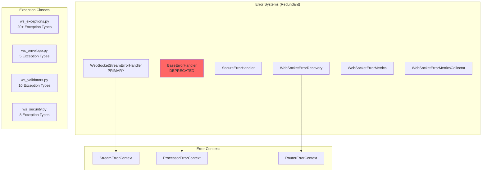

### 4. Registry and Factory Pattern (Over-engineered)

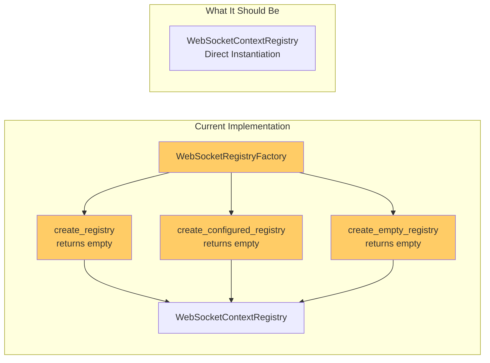

### 5. Type Safety Issues

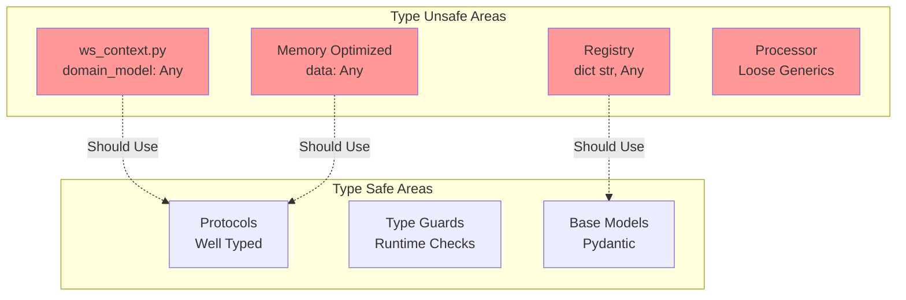

## Proposed Simplified Architecture

### 1. Consolidated Module Structure

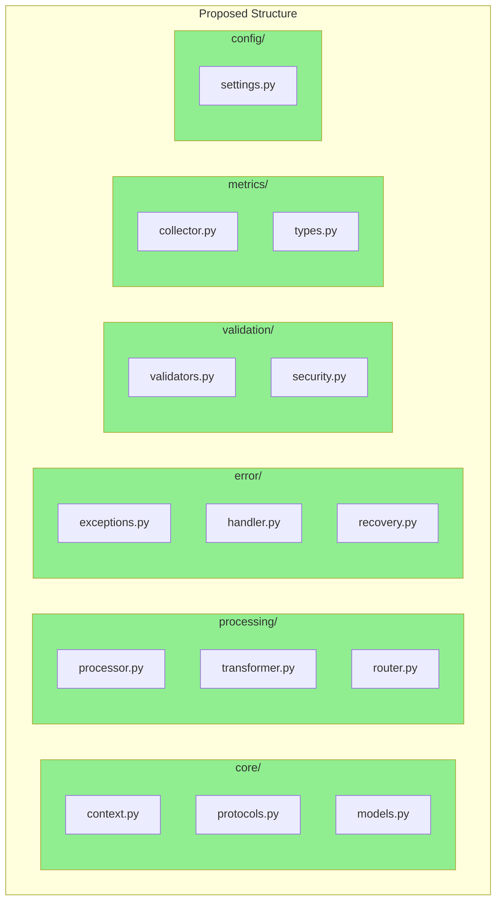

### 2. Simplified Processing Flow

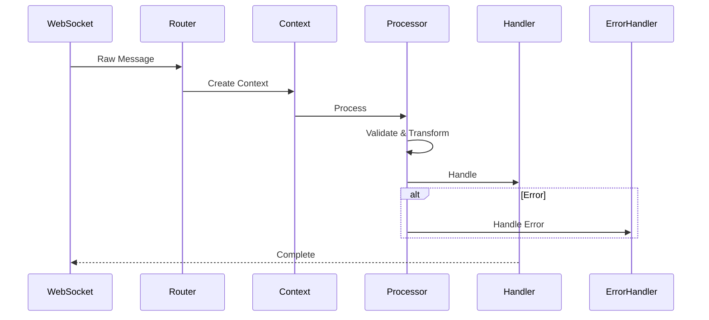

## Dependency Graph Analysis

### Current Dependencies (Circular Issues)

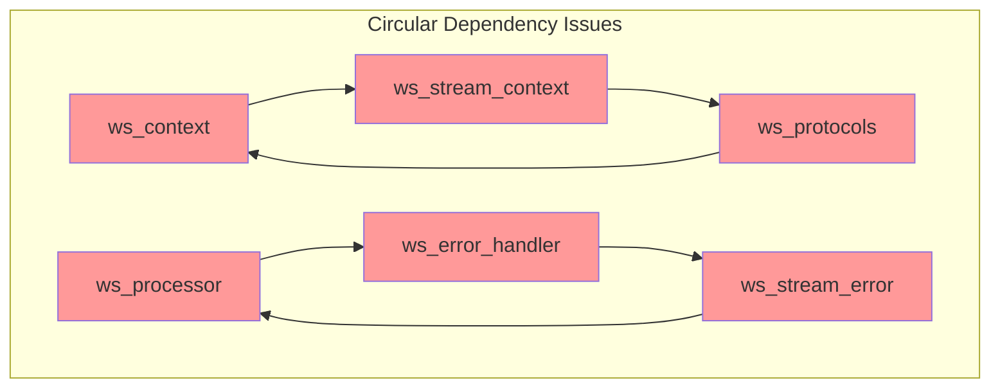

### Proposed Clean Dependencies

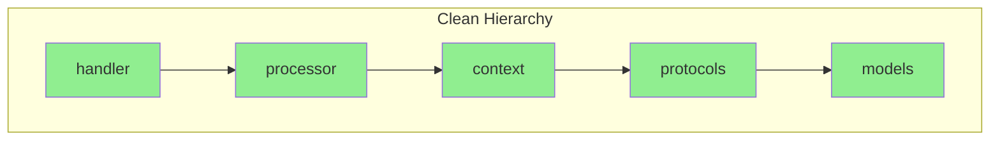

## Performance Bottlenecks

### Current Hotspots

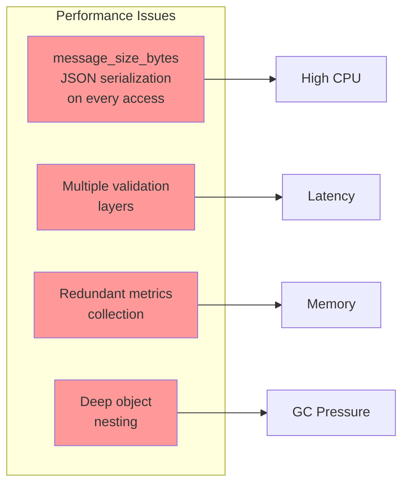

## Module Interconnections

### Exchange-Specific Integration

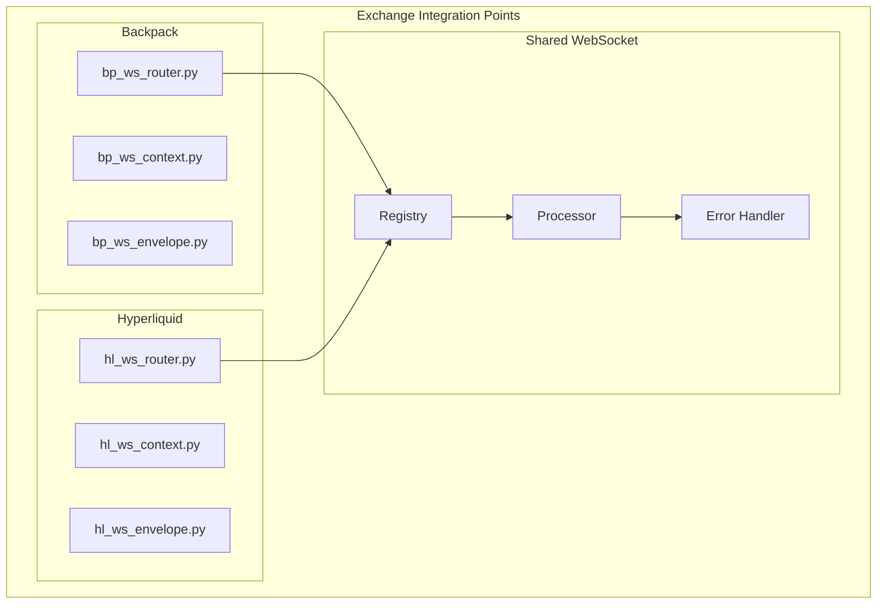

## Refactoring Roadmap

### Phase 1: Clean Up (1-2 days)
1. Remove deprecated ws_error_handler.py
2. Consolidate duplicate exception classes
3. Remove unused factory methods
4. Delete unused discriminated union code

### Phase 2: Consolidate (3-4 days)
1. Merge error handling modules
2. Unify metrics collection
3. Consolidate configuration
4. Simplify registry pattern

### Phase 3: Type Safety (2-3 days)
1. Replace all `Any` types
2. Create proper domain model types
3. Add runtime type validation
4. Improve generic constraints

### Phase 4: Restructure (1 week)
1. Create new module structure
2. Migrate code to new structure
3. Update imports across codebase
4. Comprehensive testing

## Metrics for Success

- **Code Reduction**: 30-40% fewer files
- **Type Coverage**: 100% typed (no `Any`)
- **Performance**: 20% faster message processing
- **Maintainability**: Clear module boundaries
- **Testing**: 90%+ coverage

## Conclusion

The current WebSocket architecture suffers from:
1. **Over-engineering**: Too many abstraction layers
2. **Redundancy**: Multiple implementations of same functionality
3. **Type Safety Loss**: Excessive use of `Any`
4. **Circular Dependencies**: Poor module boundaries
5. **Performance Issues**: Unnecessary computations

The proposed architecture would:
1. **Simplify**: Direct, clear data flow
2. **Consolidate**: Single implementation per concern
3. **Type Safe**: Full type coverage
4. **Clean Dependencies**: Hierarchical structure
5. **Performant**: Optimized hot paths

This refactoring would make the WebSocket module more maintainable, performant, and easier to extend for new exchanges.
