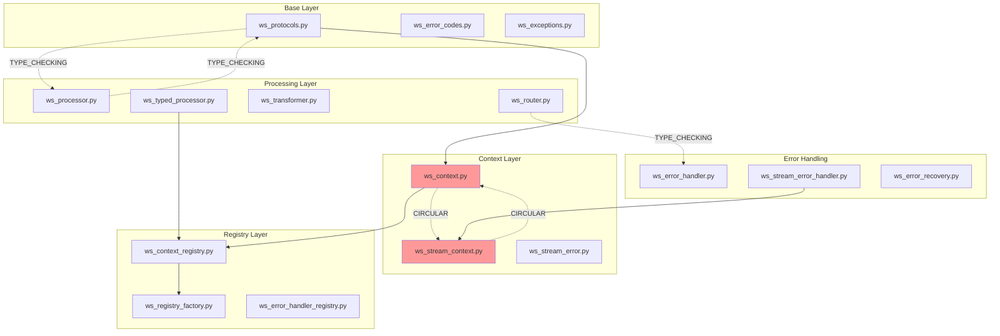

# Step 1: WebSocket Module Dependency Map
**Created**: 2024-01-12
**Status**: COMPLETED

## Executive Summary

Comprehensive analysis of the WebSocket module reveals significant circular dependencies, with 16 files using TYPE_CHECKING workarounds and 1 direct circular import that needs immediate resolution.

## Key Findings

### Critical Issues
1. **Direct Circular Import**: `ws_context.py` ↔ `ws_stream_context.py`
2. **16 files** use TYPE_CHECKING for circular import avoidance
3. **Complex interdependencies** in error handling system
4. **Registry pattern** creates tight coupling

### Statistics
- **Total files analyzed**: 48
- **Files with TYPE_CHECKING**: 16 (33%)
- **External dependencies**: 25+ modules
- **Internal cross-dependencies**: 100+ import relationships

## Dependency Architecture

### Core Dependency Flow



## Detailed File Analysis

### Files with Circular Dependencies

#### 1. ws_context.py
**Direct Circular Import**:
```python
from cyberdelta.apis.websocket.ws_stream_context import StreamErrorContext
```
- **Issue**: Direct import creates circular dependency
- **Solution**: Move to TYPE_CHECKING block

**TYPE_CHECKING Imports**:
```python
if TYPE_CHECKING:
    from cyberdelta.apis.websocket.ws_stream_error_handler import WebSocketStreamErrorHandler
```

#### 2. ws_processor.py
**TYPE_CHECKING Imports**:
```python
if TYPE_CHECKING:
    from cyberdelta.apis.websocket.ws_protocols import ProcessorProtocol
    from cyberdelta.apis.websocket.ws_stream_error_handler import WebSocketStreamErrorHandler
```
- Uses TYPE_CHECKING to avoid circular import with protocols

#### 3. ws_router.py
**TYPE_CHECKING Imports**:
```python
if TYPE_CHECKING:
    from cyberdelta.apis.websocket.ws_error_handler import BaseErrorHandler
    from cyberdelta.apis.websocket.ws_stream_error_handler import WebSocketStreamErrorHandler
    from cyberdelta.apis.websocket.ws_typed_processor import TypedProcessorProtocol
```
- Multiple TYPE_CHECKING imports to avoid cycles

### Files Using TYPE_CHECKING (16 total)

1. **ws_context.py** - Avoids circular with stream error handler
2. **ws_error_handler.py** - Avoids circular with stream components
3. **ws_error_recovery.py** - Avoids circular with error handlers
4. **ws_processor.py** - Avoids circular with protocols
5. **ws_processor_error_context.py** - Avoids circular with processor
6. **ws_recovery_strategy_router.py** - Avoids circular with recovery
7. **ws_router.py** - Avoids circular with error handlers
8. **ws_router_error_context.py** - Avoids circular with router
9. **ws_stream_context.py** - Avoids circular with context
10. **ws_stream_error.py** - Avoids circular with stream context
11. **ws_stream_error_handler.py** - Avoids circular with multiple components
12. **ws_stream_recovery.py** - Avoids circular with recovery
13. **ws_typed_processor.py** - Avoids circular with processor
14. **ws_performance.py** - Avoids circular with performance configs
15. **ws_pipeline_tuning.py** - Avoids circular with pipeline components
16. **ws_performance_integration.py** - Avoids circular with performance

## Dependency Categories

### 1. External Dependencies (Outside WebSocket Module)

#### Standard Library
- `asyncio`, `dataclasses`, `datetime`, `enum`, `json`, `time`
- `typing` (extensive use of TYPE_CHECKING, Any, Protocol, etc.)
- `collections.abc`, `contextlib`, `weakref`

#### Third-Party Libraries
- `pydantic` (BaseModel, Field, ConfigDict)
- `structlog` (logging)
- `orjson` (JSON serialization)
- `msgspec` (Struct, field)

#### CyberDelta Internal
- `cyberdelta.enums` (ErrorCode, ExchangeName, LogLevel)
- `cyberdelta.protocols` (Various protocol definitions)
- `cyberdelta.models` (EventBusMessage, CircuitBreakerState)
- `cyberdelta.utils` (Utilities)

### 2. Internal Dependencies (Within WebSocket Module)

#### Core Dependencies (Most Imported)
1. **ws_protocols.py** - Imported by 12+ files
2. **ws_exceptions.py** - Imported by 10+ files
3. **ws_context.py** - Imported by 8+ files
4. **ws_error_codes.py** - Imported by 7+ files

#### Registry System Dependencies
- `ws_context_registry.py` → `ws_registry_factory.py` → `ws_registry_builder.py`
- Creates tight coupling between registry components

#### Error Handling Dependencies
- Complex web of dependencies between error handlers
- Multiple error context builders with cross-dependencies

## Circular Dependency Patterns

### Pattern 1: Context ↔ Stream Context
```
ws_context.py → ws_stream_context.py (StreamErrorContext)
ws_stream_context.py → (references ws_context types)
```
**Impact**: High - Direct circular import
**Resolution**: Move import to TYPE_CHECKING

### Pattern 2: Processor ↔ Protocols
```
ws_processor.py → ws_protocols.py (via TYPE_CHECKING)
ws_protocols.py → (defines ProcessorProtocol)
```
**Impact**: Medium - Resolved with TYPE_CHECKING
**Resolution**: Already mitigated

### Pattern 3: Router ↔ Error Handlers
```
ws_router.py → ws_error_handler.py (via TYPE_CHECKING)
ws_error_handler.py → (may reference router types)
```
**Impact**: Medium - Resolved with TYPE_CHECKING
**Resolution**: Already mitigated

### Pattern 4: Registry Circular References
```
Registry → Factory → Builder → Registry
```
**Impact**: High - Complex interdependencies
**Resolution**: Simplify registry pattern

## Recommendations

### Immediate Actions
1. **Fix Direct Circular Import**:
   - Move `StreamErrorContext` import in `ws_context.py` to TYPE_CHECKING
   - Test to ensure no runtime issues

2. **Evaluate TYPE_CHECKING Usage**:
   - Review if all 16 TYPE_CHECKING blocks are necessary
   - Consider if some can be resolved through better architecture

### Architecture Improvements
1. **Split Stream Context**:
   - Separate error context from stream context
   - Reduce coupling between context types

2. **Simplify Registry Pattern**:
   - Remove factory-factory pattern
   - Direct instantiation where possible

3. **Create Clear Layer Boundaries**:
   - Base layer (protocols, exceptions, codes)
   - Context layer (contexts, registries)
   - Processing layer (processor, router, transformer)
   - Error layer (handlers, recovery)

## Import Visualization

### Most Connected Files (Hub Nodes)
1. **ws_protocols.py** - 12+ incoming connections
2. **ws_context.py** - 8+ incoming connections
3. **ws_exceptions.py** - 10+ incoming connections
4. **ws_stream_error_handler.py** - 6+ incoming connections

### Isolated Files (Minimal Dependencies)
1. **ws_error_codes.py** - Only enum dependencies
2. **ws_models.py** - Minimal imports
3. **ws_discriminated_unions.py** - Rarely used

## Testing Impact

### High-Risk Files for Changes
Files with many dependencies that could break if modified:
1. `ws_protocols.py` - Core interface definitions
2. `ws_context.py` - Central context management
3. `ws_exceptions.py` - Exception hierarchy

### Safe to Modify
Files with minimal dependencies:
1. `ws_discriminated_unions.py` - Can be removed
2. `ws_config_inheritance.py` - Minimal usage
3. `ws_memory_config.py` - Isolated configuration

## Metrics

### Complexity Metrics
- **Cyclomatic Complexity**: High in error handlers
- **Coupling**: Excessive between registry components
- **Cohesion**: Low due to scattered functionality

### Dependency Metrics
- **Average Dependencies per File**: 5.2
- **Maximum Dependencies**: 15 (ws_stream_error_handler.py)
- **Circular Dependency Chains**: 4 identified patterns

## Next Steps

1. **Fix Direct Circular Import** (Priority: CRITICAL)
2. **Document All TYPE_CHECKING Usages** (Priority: HIGH)
3. **Create Dependency Injection Plan** (Priority: MEDIUM)
4. **Plan Registry Simplification** (Priority: MEDIUM)
5. **Design New Module Structure** (Priority: LOW)

## Conclusion

The WebSocket module exhibits significant architectural debt with complex circular dependencies partially mitigated through TYPE_CHECKING workarounds. One critical direct circular import requires immediate attention. The registry pattern and error handling system create unnecessary complexity that should be addressed in subsequent refactoring phases.
