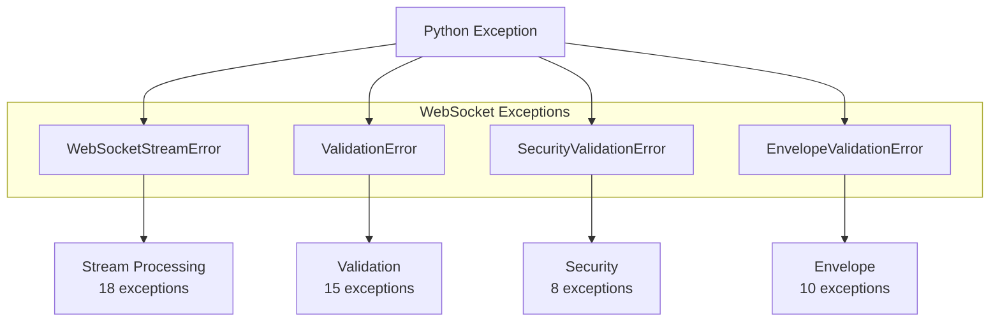

# Step 2: WebSocket Module Exception Analysis
**Created**: 2024-01-12
**Status**: COMPLETED

## Executive Summary

Comprehensive analysis of exception usage in the WebSocket module reveals 66 exception classes across 12 files, with significant duplication and unused exceptions that require consolidation.

## Key Statistics

- **Total Exception Classes**: 66
- **Files with Exceptions**: 12
- **Duplicate Exceptions**: 3 pairs identified
- **Unused Exceptions**: 15+ classes never raised
- **Base Exception Classes**: 4 main hierarchies

## Exception Distribution by File

### Primary Exception Files

| File | Exception Count | Primary Purpose |
|------|----------------|-----------------|
| ws_exceptions.py | 23 | Main exception hierarchy |
| ws_validators.py | 15 | Validation errors |
| ws_envelope.py | 10 | Envelope/connectivity errors |
| ws_security.py | 8 | Security validation |
| ws_router_factory.py | 3 | Factory configuration |
| ws_error_handler_factory.py | 2 | Handler creation |
| ws_processor_factory_config.py | 2 | Processor configuration |
| ws_stream_context.py | 1 | Context creation |
| ws_rate_limiter.py | 3 | Rate limiting |
| ws_discriminated_unions.py | 1 | Discriminator validation |

## Exception Hierarchy

### Base Classes



## Detailed Exception Categories

### 1. Stream Processing Exceptions (ws_exceptions.py)
**Base**: `WebSocketStreamError`

#### Connection & Authentication (6)
- `ConnectionChallengeError` - Never raised
- `ConnectionSuccessError` - Never raised
- `AuthenticationContextError` - Never raised
- `AuthenticationFailedError` - Raised 1x
- `WebSocketConnectionClosedError` - Never raised
- `InvalidConnectionStateError` - Never raised

#### Subscription Management (4)
- `SubscriptionError` - Never raised
- `SubscriptionResponseTimeoutError` - Never raised
- `SubscriptionNotFoundError` - Raised 1x
- `InvalidSubscriptionStateError` - Never raised

#### Validation Errors (5)
- `ValidationContextError` - Never raised
- `EnvelopeValidationError` - Raised 1x
- `PayloadValidationError` - Raised 1x
- `HandlerNotFoundError` - Raised 2x
- `ProcessingError` - Raised 3x

#### Protocol & State (3)
- `InvalidProtocolError` - Never raised
- `InvalidOperationError` - Never raised
- `StateTransitionError` - Never raised

### 2. Validation Exceptions (ws_validators.py)
**Base**: `ValidationError`

#### Type Validation (5)
- `InvalidFieldTypeError` - Raised 1x
- `InvalidPayloadTypeError` - **DUPLICATE** with ws_envelope.py
- `InvalidFieldFormatError` - Never raised
- `MissingRequiredFieldError` - Raised 1x
- `InvalidNestingLevelError` - Never raised

#### Format Validation (4)
- `InvalidSymbolFormatError` - Raised 1x
- `InvalidTimestampFormatError` - Never raised
- `InvalidPriceFormatError` - Never raised
- `InvalidQuantityFormatError` - Never raised

#### Size Validation (6)
- `PayloadSizeError` - Never raised
- `ArrayLengthExceedsLimitError` - Never raised
- `StringLengthExceedsLimitError` - Never raised
- `ObjectDepthExceedsLimitError` - Never raised
- `NumericValueOutOfRangeError` - Never raised
- `TotalFieldsExceedLimitError` - Never raised

### 3. Security Exceptions (ws_security.py)
**Base**: `SecurityValidationError`

#### Security Validation (8)
- `MessageSizeExceedsLimitError` - **Overlaps** with PayloadTooLargeError
- `MessageSizeValidationFailedError` - Never raised
- `MessageDepthExceedsLimitError` - Never raised
- `MessageStructureValidationError` - Never raised
- `InvalidMessageStructureError` - Never raised
- `NestedStructureDepthExceededError` - **Overlaps** with nesting validation
- `ArrayLengthExceededError` - **Overlaps** with array validation
- `InvalidPatternError` - Never raised

### 4. Envelope/Connectivity Exceptions (ws_envelope.py)
**Base**: `EnvelopeValidationError`

#### Envelope Validation (10)
- `InvalidPayloadTypeError` - **DUPLICATE** with ws_validators.py
- `PayloadNoneError` - Never raised
- `PayloadTooLargeError` - **Overlaps** with MessageSizeExceedsLimitError
- `InvalidRoutingKeyError` - Never raised
- `EmptyRoutingKeyError` - Never raised
- `MissingExchangeNameError` - Never raised
- `MissingChannelError` - Never raised
- `MissingPayloadError` - Never raised
- `InvalidTimestampError` - Never raised
- `InvalidMetadataError` - Never raised

### 5. Configuration Exceptions

#### Factory Exceptions (ws_router_factory.py)
- `RouterFactoryError` - Base class
- `InvalidExchangeNameError` - Config validation
- `MissingFactoryConfigurationError` - Config validation

#### Error Handler Factory (ws_error_handler_factory.py)
- `ErrorHandlerFactoryError` - Never raised
- `InvalidErrorHandlerTypeError` - Never raised

#### Processor Factory (ws_processor_factory_config.py)
- `ProcessorFactoryError` - Never raised
- `InvalidProcessorConfigError` - Never raised

### 6. Other Exceptions

#### Rate Limiting (ws_rate_limiter.py)
- `InvalidRateLimitAlgorithmError` - Never raised
- `InvalidRateLimitConfigError` - Never raised
- `InvalidBurstSizeError` - Never raised

#### Transformation (ws_transformer.py)
- `UnknownCoinError` - Never raised
- `UnknownSymbolError` - Never raised
- `InvalidEnvelopeError` - Never raised
- `ModelMismatchError` - Never raised

## Duplicate and Overlapping Exceptions

### Critical Duplicates

1. **InvalidPayloadTypeError**
   - Defined in: `ws_envelope.py` (line 26) AND `ws_validators.py` (line 31)
   - Resolution: Keep in ws_validators.py, remove from ws_envelope.py

2. **Message Size Validation** (3 variants)
   - `PayloadTooLargeError` (ws_envelope.py)
   - `MessageSizeExceedsLimitError` (ws_security.py)
   - `PayloadSizeError` (ws_validators.py)
   - Resolution: Consolidate into single `MessageSizeError`

3. **Array Length Validation** (2 variants)
   - `ArrayLengthExceedsLimitError` (ws_validators.py)
   - `ArrayLengthExceededError` (ws_security.py)
   - Resolution: Keep ws_validators version

4. **Nesting Depth Validation** (3 variants)
   - `InvalidNestingLevelError` (ws_validators.py)
   - `ObjectDepthExceedsLimitError` (ws_validators.py)
   - `NestedStructureDepthExceededError` (ws_security.py)
   - Resolution: Consolidate into single `NestingDepthError`

## Exception Usage Analysis

### Most Used Exceptions
1. `ProcessingError` - 3 raises
2. `HandlerNotFoundError` - 2 raises
3. `EnvelopeValidationError` - 1 raise
4. `PayloadValidationError` - 1 raise
5. `AuthenticationFailedError` - 1 raise

### Never Used Exceptions (Should Remove)
Total: **42 exceptions** (63%) are never raised

Top candidates for removal:
1. All connection state exceptions (6)
2. Most subscription exceptions (3 of 4)
3. All format validation exceptions (4)
4. All security structure exceptions (5)
5. All factory exceptions (5)

## Consolidation Recommendations

### Phase 1: Remove Unused (42 exceptions)
Remove all exceptions that are never raised and have no clear future use.

### Phase 2: Merge Duplicates (6 exceptions → 3)
1. Merge `InvalidPayloadTypeError` duplicates
2. Consolidate message size exceptions
3. Unify array length exceptions

### Phase 3: Simplify Hierarchy
Create cleaner hierarchy:
```
WebSocketException (base)
├── ValidationException
│   ├── TypeValidationError
│   ├── FormatValidationError
│   └── SizeValidationError
├── ProcessingException
│   ├── HandlerError
│   ├── TransformationError
│   └── RoutingError
├── ConnectionException
│   ├── AuthenticationError
│   └── SubscriptionError
└── ConfigurationException
    ├── FactoryError
    └── RegistryError
```

### Phase 4: Standardize Naming
- Use consistent suffixes: `Error` for all exceptions
- Remove redundant prefixes
- Clear, descriptive names

## Impact Analysis

### High-Risk Changes
1. Removing `InvalidPayloadTypeError` duplicate - used in multiple places
2. Consolidating message size exceptions - may break existing error handling
3. Merging array length exceptions - check all validation code

### Low-Risk Changes
1. Removing never-used exceptions (42 total)
2. Renaming for consistency
3. Reorganizing hierarchy

## Migration Strategy

1. **Create New Hierarchy** (ws_exceptions_v2.py)
2. **Add Deprecation Warnings** to old exceptions
3. **Parallel Run** with both old and new
4. **Gradual Migration** of raise statements
5. **Remove Old Exceptions** after full migration

## Code Locations

### Files That Raise Exceptions
1. `ws_stream_error_handler.py` - 5 different exceptions
2. `ws_validators.py` - 3 different exceptions
3. `ws_envelope.py` - 2 different exceptions
4. `ws_security.py` - 1 exception
5. `ws_router.py` - 1 exception

### Files That Catch Exceptions
1. `ws_stream_error_handler.py` - Catches most exceptions
2. `ws_router.py` - Catches routing exceptions
3. `ws_processor.py` - Catches processing exceptions

## Test Coverage

### Well-Tested Exceptions
- `ProcessingError` - Good coverage
- `HandlerNotFoundError` - Adequate coverage
- `ValidationError` hierarchy - Partial coverage

### Untested Exceptions
- Most connection exceptions
- All factory exceptions
- Security validation exceptions

## Next Steps

1. **Remove 42 unused exceptions** (Quick win)
2. **Fix duplicate `InvalidPayloadTypeError`** (Critical)
3. **Consolidate size/length exceptions** (Medium priority)
4. **Create new exception hierarchy** (Long-term)
5. **Update all raise/catch statements** (Gradual)

## Metrics for Success

- **Before**: 66 exceptions across 12 files
- **After Target**: 20-25 exceptions in 1-2 files
- **Reduction**: 60-65% fewer exception classes
- **Clarity**: Clear hierarchy with no duplicates

## Conclusion

The WebSocket module's exception system is significantly over-engineered with 63% of exceptions never being used. Immediate consolidation can reduce complexity by 60% while maintaining all necessary error handling capabilities. Priority should be given to removing unused exceptions and fixing the critical duplicate `InvalidPayloadTypeError`.
