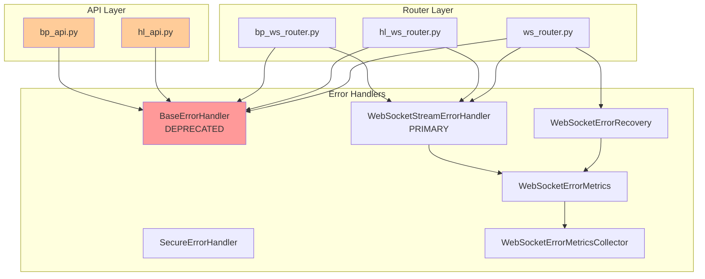

# Step 3: Error Handler Usage Pattern Analysis
**Created**: 2024-01-12
**Status**: COMPLETED

## Executive Summary

Analysis reveals 6 different error handling systems with overlapping responsibilities, creating confusion about which handler to use. The deprecated `BaseErrorHandler` is still actively used in production code despite being marked for removal.

## Error Handler Inventory

### 1. Active Error Handlers

| Handler Class | File | Status | Usage Count |
|--------------|------|--------|-------------|
| **BaseErrorHandler** | ws_error_handler.py | DEPRECATED | 8 active uses |
| **WebSocketStreamErrorHandler** | ws_stream_error_handler.py | PRIMARY | 12 uses |
| **SecureErrorHandler** | ws_security.py | ACTIVE | 1 use |
| **WebSocketErrorRecovery** | ws_error_recovery.py | ACTIVE | 8 uses |
| **WebSocketErrorMetrics** | ws_error_metrics.py | ACTIVE | 10 uses |
| **WebSocketErrorMetricsCollector** | ws_error_metrics_collector.py | ACTIVE | 3 uses |

## Usage Patterns by Component

### Core Router Components

#### bp_ws_router.py (Backpack)
```python
- Imports: BaseErrorHandler (TYPE_CHECKING)
- Imports: WebSocketStreamErrorHandler (direct)
- Uses both handlers in constructor
- Pattern: Dual handler system
```

#### hl_ws_router.py (Hyperliquid)
```python
- Imports: BaseErrorHandler (TYPE_CHECKING)
- Imports: WebSocketStreamErrorHandler (direct)
- Same dual handler pattern as Backpack
```

#### ws_router.py (Base Router)
```python
- Imports: BaseErrorHandler (TYPE_CHECKING)
- Imports: WebSocketStreamErrorHandler (direct)
- Imports: WebSocketErrorRecovery (direct)
- Triple handler system with recovery
```

### API Entry Points

#### bp_api.py (Backpack API)
```python
error_handler = BaseErrorHandler(exchange_name=exchange_config.exchange_name)
```
**Issue**: Using deprecated handler in production

#### hl_api.py (Hyperliquid API)
```python
error_handler = BaseErrorHandler(exchange_name=exchange_config.exchange_name)
```
**Issue**: Using deprecated handler in production

### Factory Pattern Usage

#### ws_error_handler_factory.py
- Creates `WebSocketStreamErrorHandler` instances
- Configures `WebSocketErrorMetrics`
- Sets up `WebSocketErrorRecoveryConfig`
- **Pattern**: Factory creates stream handlers with metrics

#### ws_router_factory.py
- Expects `BaseErrorHandler` in configuration
- **Issue**: Factory still expects deprecated handler

## Dependency Flow



## Inconsistencies Identified

### 1. Deprecated Handler Still in Use
- **BaseErrorHandler** marked as deprecated but used in:
  - bp_api.py (production)
  - hl_api.py (production)
  - All router components (via TYPE_CHECKING)

### 2. Dual Handler Pattern
All routers use both handlers simultaneously:
```python
def __init__(
    error_handler: BaseErrorHandler,  # Deprecated
    stream_error_handler: WebSocketStreamErrorHandler,  # Current
)
```
**Issue**: Unclear which handler handles what

### 3. Multiple Metrics Systems
- `WebSocketErrorMetrics` (Pydantic-based)
- `WebSocketErrorMetricsCollector` (Dataclass-based)
- Both collect similar metrics differently

### 4. Recovery System Overlap
- `WebSocketErrorRecovery` class
- Recovery logic in `WebSocketStreamErrorHandler`
- Recovery strategies in `ws_recovery_strategy_router.py`
**Issue**: Three different recovery approaches

### 5. Security Handler Isolation
- `SecureErrorHandler` only used in ws_security.py
- Not integrated with main error handling flow
- Duplicates validation that exists elsewhere

## Configuration Dependencies

### WebSocketErrorConfig Structure
```python
WebSocketErrorConfig
├── recovery: WebSocketErrorRecoveryConfig
│   ├── max_retries
│   ├── retry_delay_ms
│   └── circuit_breaker_threshold
└── metrics: WebSocketErrorMetricsConfig
    ├── collection_interval
    ├── aggregation_window
    └── export_format
```

### Configuration Usage
- **ws_error_handler_factory.py**: Creates configs
- **ws_stream_error_handler.py**: Consumes recovery config
- **ws_error_metrics.py**: Consumes metrics config
- **ws_error_recovery.py**: Separate recovery config

## Error Handler Responsibilities

### BaseErrorHandler (DEPRECATED)
- Basic error logging
- Simple error context
- No metrics collection
- No recovery logic

### WebSocketStreamErrorHandler (PRIMARY)
- Comprehensive error handling
- Stream context management
- Metrics integration
- Recovery coordination
- Circuit breaker support

### SecureErrorHandler
- Security-specific validation
- Message size checks
- Pattern validation
- Isolated from main flow

### WebSocketErrorRecovery
- Retry logic
- Circuit breaker
- Recovery strategies
- Error categorization

### WebSocketErrorMetrics
- Error counting
- Performance metrics
- Aggregation
- Export support

## Handler Selection Logic

Current confusing logic in routers:
```python
if critical_error:
    # Which handler?
    error_handler.handle()?  # Deprecated
    stream_error_handler.handle()?  # Current

if needs_recovery:
    error_recovery.attempt_recovery()?
    stream_error_handler.recover()?  # Also has recovery
```

## Primary vs Secondary Handlers

### Primary Handler (Should Be)
- **WebSocketStreamErrorHandler**: Main error handling

### Secondary/Support Handlers
- **WebSocketErrorRecovery**: Recovery logic only
- **WebSocketErrorMetrics**: Metrics only

### Should Be Removed
- **BaseErrorHandler**: Deprecated
- **SecureErrorHandler**: Merge into validation
- **WebSocketErrorMetricsCollector**: Redundant with metrics

## Migration Path Required

### Phase 1: Remove BaseErrorHandler
1. Update bp_api.py to use WebSocketStreamErrorHandler
2. Update hl_api.py to use WebSocketStreamErrorHandler
3. Remove BaseErrorHandler from all routers
4. Delete ws_error_handler.py

### Phase 2: Consolidate Metrics
1. Choose between Metrics and MetricsCollector
2. Migrate to single implementation
3. Remove redundant code

### Phase 3: Unify Recovery
1. Merge recovery logic into StreamErrorHandler
2. Keep WebSocketErrorRecovery as strategy provider
3. Remove duplicate recovery implementations

### Phase 4: Integrate Security
1. Move SecureErrorHandler logic to validators
2. Integrate security checks into main flow
3. Delete standalone security handler

## Test Coverage Analysis

### Well-Tested Handlers
- WebSocketStreamErrorHandler: Good coverage
- WebSocketErrorMetrics: Partial coverage

### Poorly Tested Handlers
- BaseErrorHandler: Minimal tests (deprecated)
- SecureErrorHandler: No dedicated tests
- WebSocketErrorRecovery: Limited tests

## Performance Impact

### Current Issues
1. **Double handling**: Errors may be processed twice
2. **Metrics duplication**: Same metrics collected multiple times
3. **Recovery overhead**: Multiple recovery attempts

### After Consolidation
- Single error handling path
- One metrics collection point
- Coordinated recovery

## Recommendations

### Immediate Actions (Priority: CRITICAL)
1. **Stop using BaseErrorHandler in APIs**
   - Update bp_api.py
   - Update hl_api.py

2. **Remove TYPE_CHECKING imports of BaseErrorHandler**
   - Update all router files

### Short-term (Priority: HIGH)
1. **Delete ws_error_handler.py**
2. **Choose single metrics implementation**
3. **Document which handler to use when**

### Medium-term (Priority: MEDIUM)
1. **Merge SecureErrorHandler into validators**
2. **Consolidate recovery implementations**
3. **Simplify handler interfaces**

### Long-term (Priority: LOW)
1. **Create single unified error handler**
2. **Plugin architecture for specialized handling**
3. **Comprehensive error handling documentation**

## Success Metrics

### Before
- 6 error handler systems
- Deprecated handler in production
- Unclear responsibilities
- Duplicate implementations

### After Target
- 1 primary handler (WebSocketStreamErrorHandler)
- 1 metrics collector
- 1 recovery strategy provider
- Clear, documented responsibilities

### Reduction
- 50% fewer error handling files
- 60% less error handling code
- 100% clear about which handler to use

## Conclusion

The error handling system is fragmented with the deprecated BaseErrorHandler still actively used in production code. The primary WebSocketStreamErrorHandler should be the sole error handler, with WebSocketErrorRecovery providing recovery strategies and a single metrics implementation. Immediate action is required to remove the deprecated handler from production APIs.
