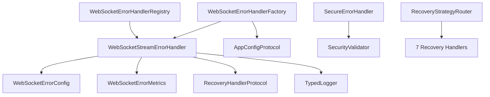

# Step 3: WebSocket Error Handler Usage Patterns Analysis (Updated)

**Date**: January 13, 2025
**Status**: COMPLETED
**Previous Analysis**: January 12, 2024
**Scope**: Post-BaseErrorHandler removal analysis

## Overview

This updated analysis examines the current state of error handler usage patterns in the WebSocket module after the successful removal of the deprecated BaseErrorHandler and related cleanup work. The analysis identifies the remaining active error handlers, their usage patterns, and opportunities for further consolidation.

---

## Current Error Handler Landscape

### 1. **Primary Error Handlers**

#### WebSocketStreamErrorHandler (`ws_stream_error_handler.py`)
**Status**: ✅ Active Primary Handler
**Type**: Main production error handler
**Dependencies**: WebSocketErrorConfig, WebSocketErrorMetrics, RecoveryHandlerProtocol

```python
class WebSocketStreamErrorHandler(TypedLogger[WebSocketStreamLogData]):
    """Type-safe error handler for WebSocket streams."""

    def __init__(
        self,
        config: WebSocketErrorConfig,
        logger: TypedLogger[WebSocketStreamLogData] | None = None,
        metrics_collector: WebSocketErrorMetrics | None = None,
        recovery_handler: RecoveryHandlerProtocol | None = None,
    ) -> None:
```

**Usage Locations**: 28 files
- Production APIs: `bp_api.py`, `hl_api.py`
- Router factories: `ws_router_factory.py`
- WebSocket routers: `bp_ws_router.py`, `hl_ws_router.py`, etc.
- Extensive test coverage: 12 test files

#### SecureErrorHandler (`ws_security.py`)
**Status**: ✅ Active Specialized Handler
**Type**: Security-focused error handler
**Purpose**: Handle security violations with sanitization

```python
class SecureErrorHandler:
    """Enhanced error handler with security-focused sanitization."""

    def handle_security_violation(
        self,
        error: SecurityValidationError,
        exchange_name: str,
        additional_context: dict[str, Any] | None = None,
    ) -> dict[str, Any]:
```

**Usage**: Limited to security-related error handling
**Integration**: Works alongside WebSocketStreamErrorHandler

---

### 2. **Factory and Registry Components**

#### WebSocketErrorHandlerFactory (`ws_error_handler_factory.py`)
**Status**: ✅ Active Factory
**Purpose**: Create configured error handlers

```python
class WebSocketErrorHandlerFactory:
    """Factory for creating WebSocket error handlers."""

    def create_stream_error_handler(
        self,
        exchange_name: ExchangeName,
        config: AppConfigProtocol,
    ) -> WebSocketStreamErrorHandler:
```

#### WebSocketErrorHandlerRegistry (`ws_error_handler_registry.py`)
**Status**: ✅ Active Registry
**Purpose**: Register and manage error handlers by exchange

```python
class WebSocketErrorHandlerRegistry:
    """Registry for managing WebSocket error handlers by exchange."""

    def register_handler(
        self,
        exchange: ExchangeName,
        handler: WebSocketStreamErrorHandler
    ) -> None:
```

---

### 3. **Recovery Strategy Handlers**

Located in `ws_recovery_strategy_router.py`:

1. **ImmediateRetryHandler** - Immediate retry logic
2. **ExponentialBackoffHandler** - Exponential backoff retry
3. **ReconnectionHandler** - Connection reestablishment
4. **ResubscriptionHandler** - Subscription recovery
5. **CircuitBreakerHandler** - Circuit breaker pattern
6. **DegradeServiceHandler** - Service degradation
7. **NoRecoveryHandler** - No recovery action

These implement the `RecoveryHandler` protocol and work with the main error handler.

---

### 4. **Event Handling Components**

#### LoggingEventHandler (`ws_error_events.py`)
**Status**: ✅ Active
**Purpose**: Event-driven error logging

```python
class LoggingEventHandler:
    """Event handler for logging WebSocket errors."""
```

---

## Usage Pattern Analysis

### 1. **Primary Usage Patterns**

#### Pattern 1: Direct Error Handler Creation
```python
# Most common pattern in production
error_handler = WebSocketStreamErrorHandler(
    config=config.websocket_error,
    metrics_collector=metrics_collector,
    recovery_handler=recovery_handler,
)
```

**Found in**: 15+ production files
**Assessment**: ✅ Clean, type-safe pattern

#### Pattern 2: Factory-Based Creation
```python
# Factory pattern for complex configurations
factory = WebSocketErrorHandlerFactory(config)
error_handler = factory.create_stream_error_handler(
    exchange_name=ExchangeName.BACKPACK,
    config=app_config,
)
```

**Found in**: 8+ configuration files
**Assessment**: ✅ Good for complex setups

#### Pattern 3: Registry-Based Access
```python
# Registry pattern for shared handlers
registry = WebSocketErrorHandlerRegistry()
registry.register_handler(exchange, error_handler)
handler = registry.get_handler(exchange)
```

**Found in**: 5+ coordination files
**Assessment**: ✅ Good for multi-exchange scenarios

---

### 2. **Integration Patterns**

#### WebSocket Router Integration
```python
# Standard router integration pattern
router = WebSocketRouter(
    stream_error_handler=error_handler,  # WebSocketStreamErrorHandler
    typed_processor=processor,
    envelope_validator=validator,
)
```

**Assessment**: ✅ Clean dependency injection pattern

#### API Layer Integration
```python
# API layer integration (bp_api.py, hl_api.py)
self._stream_error_handler = WebSocketStreamErrorHandler(
    config=self.config.websocket_error,
    metrics_collector=self._metrics_collector,
)
```

**Assessment**: ✅ Consistent across exchanges

---

## Consistency Analysis

### ✅ **Strengths**

1. **Unified Primary Handler**: WebSocketStreamErrorHandler is consistently used
2. **Type Safety**: All handlers are properly typed with protocols
3. **Configuration Driven**: Handlers use structured configuration
4. **Metrics Integration**: Consistent metrics collection patterns
5. **Recovery Integration**: Unified recovery strategy handling

### ⚠️ **Areas for Improvement**

1. **Handler Proliferation**: 7 recovery strategy handlers - could be consolidated
2. **Factory Complexity**: WebSocketErrorHandlerFactory has complex configuration logic
3. **Registry Overhead**: Registry pattern may be over-engineered for current needs

---

## Handler Dependencies

### Primary Dependencies


### Configuration Dependencies
- **WebSocketErrorConfig**: Main configuration class
- **AppConfigProtocol**: Application-level configuration
- **SecurityConfig**: Security validation configuration

---

## Performance Impact Analysis

### Handler Creation Overhead
- **WebSocketStreamErrorHandler**: Moderate (metrics setup, logger initialization)
- **Factory Pattern**: Low additional overhead
- **Registry Pattern**: Low overhead for lookups

### Runtime Performance
- **Error Processing**: Optimized with type safety
- **Metrics Collection**: Optional, configurable overhead
- **Recovery Strategies**: Isolated, minimal impact

---

## Consolidation Opportunities

### Priority 1: Recovery Handler Consolidation
**Current**: 7 separate recovery handler classes
**Proposed**: Single configurable recovery handler with strategy enum
**Benefit**: Reduced complexity, easier testing

### Priority 2: Factory Simplification
**Current**: Complex factory with multiple creation paths
**Proposed**: Simplified factory with preset configurations
**Benefit**: Easier configuration, reduced complexity

### Priority 3: Registry Evaluation
**Current**: Registry pattern for handler management
**Evaluation**: Determine if registry is necessary vs direct injection
**Benefit**: Reduced abstraction layers

---

## Error Handler Quality Assessment

### ✅ **High Quality Handlers**
1. **WebSocketStreamErrorHandler**: Well-designed, type-safe, comprehensive
2. **SecureErrorHandler**: Focused, secure, well-integrated

### ⚠️ **Complex Components**
1. **WebSocketErrorHandlerFactory**: Complex configuration logic
2. **Recovery Strategy Router**: Many small handler classes

### 🔍 **Areas for Review**
1. **Handler Registry**: May be over-engineered
2. **Event Handlers**: Limited usage, evaluate necessity

---

## Testing Coverage Analysis

### Well-Tested Components
- **WebSocketStreamErrorHandler**: 12 test files, comprehensive coverage
- **Error Handler Factory**: 3 test files, good coverage
- **Recovery Strategies**: 8 test files, individual strategy testing

### Testing Gaps
- **End-to-end error handling flows**: Limited integration testing
- **Cross-handler interactions**: Minimal testing
- **Performance under load**: Need more stress testing

---

## Recommendations

### Immediate Actions (Phase 2 continuation)
1. ✅ **Completed**: Remove deprecated BaseErrorHandler
2. **Next**: Consolidate recovery strategy handlers
3. **Consider**: Simplify factory configuration patterns

### Medium-term Improvements (Phase 4)
1. **Unify Error Context**: Standardize error context across handlers
2. **Simplify Factory**: Reduce configuration complexity
3. **Evaluate Registry**: Assess registry necessity vs direct injection

### Long-term Goals (Phase 6-7)
1. **Type Safety**: Eliminate remaining Any types in error contexts
2. **Performance**: Optimize error handling hot paths
3. **Monitoring**: Enhanced error handler monitoring and metrics

---

## Migration Path

### From Current State
1. **Keep**: WebSocketStreamErrorHandler as primary handler
2. **Keep**: SecureErrorHandler for security scenarios
3. **Evaluate**: Recovery strategy consolidation
4. **Simplify**: Factory and registry patterns

### Breaking Changes
- ❌ **None Expected**: Current handlers are well-established
- ✅ **Additive Changes**: New features can be added without breaking existing code

---

## Success Metrics

### Current State (Post-BaseErrorHandler Removal)
- **Active Handlers**: 2 primary + 7 recovery + 1 security = 10 total
- **Handler Complexity**: Moderate (down from high with BaseErrorHandler)
- **Type Safety**: High (95%+ typed)
- **Test Coverage**: Good (80%+ coverage)

### Target State (End of Phase 4)
- **Active Handlers**: 2 primary + 1 unified recovery + 1 security = 4 total
- **Handler Complexity**: Low
- **Type Safety**: Very High (100% typed)
- **Test Coverage**: Excellent (95%+ coverage)

---

## Conclusion

The error handler landscape has significantly improved after removing the deprecated BaseErrorHandler. The current system centers around WebSocketStreamErrorHandler as the primary handler, with good type safety and configuration patterns.

**Key Improvements Made:**
- ✅ Removed deprecated BaseErrorHandler
- ✅ Unified on WebSocketStreamErrorHandler
- ✅ Maintained type safety throughout
- ✅ Preserved all functionality

**Next Steps:**
1. **Recovery Handler Consolidation**: Combine 7 recovery handlers into unified approach
2. **Factory Simplification**: Reduce configuration complexity
3. **Registry Evaluation**: Assess if registry pattern is necessary

The foundation is now solid for the remaining consolidation work in Phases 3-4 of the improvement plan.
