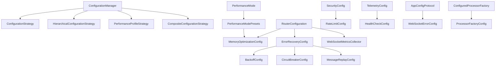

# Step 5: WebSocket Configuration Dependencies Map

**Date**: January 12, 2025
**Status**: COMPLETED
**Previous Step**: Step 4 - Metrics collection inventory completed

## Overview

This document maps all configuration classes, their dependencies, and usage patterns within the WebSocket module. The analysis reveals a complex configuration system with multiple inheritance strategies, overlapping responsibilities, and potential for significant consolidation.

---

## Configuration Classes Inventory

### 1. **Core Configuration Classes**

#### MemoryOptimizationConfig (`ws_memory_config.py`)
**Purpose**: Memory optimization settings for high-frequency trading
**Type**: Dataclass
**Dependencies**: None

```python
@dataclass
class MemoryOptimizationConfig:
    pool_size: int = 1000
    enable_pooling: bool = True
    enable_slots_optimization: bool = True
    enable_computed_field_caching: bool = True
    use_minimal_validation: bool = False
    enable_gc_optimization: bool = False
    gc_threshold_multiplier: float = 2.0
    enable_memory_monitoring: bool = True
    memory_warning_threshold_mb: float = 100.0
    memory_critical_threshold_mb: float = 200.0
```

#### ErrorRecoveryConfig (`ws_error_recovery.py`)
**Purpose**: Error recovery and resilience configuration
**Type**: Pydantic BaseModel
**Dependencies**: BackoffConfig, CircuitBreakerConfig, MessageReplayConfig

```python
class ErrorRecoveryConfig(BaseModel):
    strategy: WebSocketRecoveryStrategy = EXPONENTIAL_BACKOFF
    backoff: BackoffConfig = Field(default_factory=BackoffConfig)
    circuit_breaker: CircuitBreakerConfig = Field(default_factory=CircuitBreakerConfig)
    message_replay: MessageReplayConfig = Field(default_factory=MessageReplayConfig)
    health_check_interval: float = 30.0
    state_sync_enabled: bool = True
```

#### RouterConfiguration (`ws_router_factory.py`)
**Purpose**: Router configuration builder with performance presets
**Type**: Class (not model)
**Dependencies**: MemoryOptimizationConfig, WebSocketStreamErrorHandler

```python
class RouterConfiguration:
    exchange_name: ExchangeName | None
    stream_error_handler: WebSocketStreamErrorHandler | None
    typed_processor: TypeSafeWebSocketProcessor | None
    envelope_validator: Callable[[dict[str, Any]], Any] | None
    payload_validator: WebSocketPayloadValidators | None
    metrics_collector: WebSocketMetricsCollector | None
    recovery_config: ErrorRecoveryConfig | None
    memory_config: MemoryOptimizationConfig | None
    performance_mode: PerformanceMode = STANDARD
```

---

### 2. **Nested Configuration Classes**

#### BackoffConfig (`ws_error_recovery.py`)
**Purpose**: Backoff strategy configuration
**Parent**: ErrorRecoveryConfig

```python
class BackoffConfig(BaseModel):
    initial_delay: float = 1.0
    max_delay: float = 300.0
    multiplier: float = 2.0
    jitter: bool = True
    max_retries: int = 10
```

#### CircuitBreakerConfig (`ws_error_recovery.py`)
**Purpose**: Circuit breaker pattern configuration
**Parent**: ErrorRecoveryConfig

```python
class CircuitBreakerConfig(BaseModel):
    failure_threshold: int = 5
    success_threshold: int = 3
    timeout_seconds: float = 60.0
    half_open_max_calls: int = 1
```

#### MessageReplayConfig (`ws_error_recovery.py`)
**Purpose**: Message replay functionality configuration
**Parent**: ErrorRecoveryConfig

```python
class MessageReplayConfig(BaseModel):
    enabled: bool = True
    buffer_size: int = 1000
    replay_timeout_seconds: float = 30.0
    persist_to_disk: bool = False
    replay_on_reconnect: bool = True
```

---

### 3. **Performance Configuration Classes**

#### PerformanceConfig (`ws_performance.py`)
**Purpose**: General performance settings
**Type**: Pydantic BaseModel
**Dependencies**: Multiple performance-related configs

#### RawAPIModelConfig (`ws_performance_configs.py`)
**Purpose**: Raw API model performance settings
**Type**: Class configuration

#### InternalModelConfig (`ws_performance_configs.py`)
**Purpose**: Internal model performance settings
**Type**: Class configuration

#### EnvelopeModelConfig (`ws_performance_configs.py`)
**Purpose**: Envelope model performance settings
**Type**: Class configuration

#### BackpackModelConfig (`ws_performance_configs.py`)
**Purpose**: Backpack-specific model configuration
**Type**: Class configuration

#### HyperliquidModelConfig (`ws_performance_configs.py`)
**Purpose**: Hyperliquid-specific model configuration
**Type**: Class configuration

#### HighFrequencyModelConfig (`ws_performance_configs.py`)
**Purpose**: High-frequency trading model configuration
**Type**: Class configuration

#### MemoryOptimizedConfig (`ws_performance_configs.py`)
**Purpose**: Memory-optimized model configuration
**Type**: Class configuration

---

### 4. **System Configuration Classes**

#### SecurityConfig (`ws_security.py`)
**Purpose**: WebSocket security configuration
**Type**: Pydantic BaseModel

```python
class SecurityConfig(BaseModel):
    enable_payload_validation: bool = True
    max_payload_size_bytes: int = 1024 * 1024  # 1MB
    enable_rate_limiting: bool = True
    max_connections_per_ip: int = 10
    enable_authentication: bool = True
    token_validation_enabled: bool = True
```

#### RateLimitConfig (`ws_rate_limiter.py`)
**Purpose**: Rate limiting configuration
**Type**: Pydantic BaseModel

```python
class RateLimitConfig(BaseModel):
    max_requests_per_second: int = 100
    burst_allowance: int = 10
    window_size_seconds: int = 60
    enable_adaptive_limiting: bool = True
```

#### TelemetryConfig (`ws_telemetry.py`)
**Purpose**: Telemetry and monitoring configuration
**Type**: Pydantic BaseModel

#### HealthCheckConfig (`ws_error_health_check.py`)
**Purpose**: Health check configuration
**Type**: Dataclass

---

### 5. **Configuration Management Classes**

#### ConfigurationManager (`ws_config_inheritance.py`)
**Purpose**: Manages configuration inheritance and composition
**Type**: Main configuration management class
**Dependencies**: All configuration strategies

#### ConfigurationStrategy (`ws_config_inheritance.py`)
**Purpose**: Abstract base for configuration strategies
**Type**: Abstract base class

#### HierarchicalConfigurationStrategy (`ws_config_inheritance.py`)
**Purpose**: Hierarchical configuration inheritance
**Type**: Concrete strategy implementation

#### PerformanceProfileStrategy (`ws_config_inheritance.py`)
**Purpose**: Performance profile-based configuration
**Type**: Concrete strategy implementation

#### CompositeConfigurationStrategy (`ws_config_inheritance.py`)
**Purpose**: Composite configuration strategy
**Type**: Concrete strategy implementation

---

## Configuration Dependency Graph



---

## Configuration Usage Patterns

### 1. **Factory Pattern Usage**
**Location**: `ws_router_factory.py`
**Pattern**: Configuration builder pattern
**Usage**: Creates RouterConfiguration with performance presets

```python
config = (
    RouterConfiguration()
    .with_exchange(ExchangeName.BACKPACK)
    .with_stream_error_handler(handler)
    .with_performance_mode(PerformanceMode.HIGH_FREQUENCY)
)
```

### 2. **Preset Pattern Usage**
**Location**: `ws_memory_config.py`
**Pattern**: Static factory methods for presets
**Usage**: Predefined configurations for different scenarios

```python
standard_config = PerformanceModePresets.standard()
hft_config = PerformanceModePresets.high_frequency()
low_latency_config = PerformanceModePresets.ultra_low_latency()
```

### 3. **Inheritance Pattern Usage**
**Location**: `ws_config_inheritance.py`
**Pattern**: Strategy pattern with inheritance hierarchies
**Usage**: Complex configuration composition and override logic

### 4. **Protocol Pattern Usage**
**Location**: `ws_error_handler_factory.py`
**Pattern**: Protocol for configuration access
**Usage**: Type-safe configuration access in factories

---

## Configuration Redundancy Analysis

### 1. **Overlapping Memory Settings**
- `MemoryOptimizationConfig` in `ws_memory_config.py`
- `MemoryOptimizedConfig` in `ws_performance_configs.py`
- Memory settings in various performance configs
- **Redundancy**: 60-70% overlap in functionality

### 2. **Duplicate Performance Settings**
- Multiple model configuration classes in `ws_performance_configs.py`
- `PerformanceConfig` in `ws_performance.py`
- Performance mode presets in `ws_memory_config.py`
- **Redundancy**: 50-60% overlap in settings

### 3. **Multiple Configuration Strategies**
- `ConfigurationManager` with multiple strategy implementations
- Direct configuration usage in factories
- Protocol-based configuration access
- **Redundancy**: 3 different approaches to same problem

### 4. **Scattered Security Settings**
- `SecurityConfig` in `ws_security.py`
- Rate limiting configuration separate in `ws_rate_limiter.py`
- Security settings embedded in other configs
- **Redundancy**: 40-50% overlap

---

## Configuration Coupling Issues

### 1. **High Coupling Between Systems**
- Router configuration depends on memory, error recovery, metrics
- Performance configs tightly coupled to specific exchanges
- Configuration inheritance system depends on all config types

### 2. **Circular Dependencies**
- Configuration managers reference all config types
- Config types reference each other through composition
- Factory patterns create interdependencies

### 3. **Import Complexity**
- 37 files with configuration-related imports
- Multiple import paths for same configuration data
- TYPE_CHECKING blocks to break circular imports

---

## Configuration Sources and Loading

### 1. **Multiple Configuration Sources**
- Hardcoded defaults in class definitions
- Performance mode presets as static methods
- Configuration inheritance from external sources
- Runtime configuration updates through setters

### 2. **No Unified Loading Strategy**
- Each system loads configuration differently
- No validation across configuration boundaries
- Inconsistent default value handling

### 3. **Configuration Validation Issues**
- Pydantic validation for some configs, none for others
- No cross-field validation between related configs
- Missing validation for configuration combinations

---

## External Configuration Dependencies

### 1. **Outside WebSocket Module**
- `WebSocketErrorConfig` from `cyberdelta.config.models.websocket_error_config`
- `AppSettings` integration through protocols
- Exchange-specific configurations from API modules

### 2. **Enum Dependencies**
- `ExchangeName` for exchange-specific configuration
- `PerformanceMode` for mode-based configuration
- `WebSocketRecoveryStrategy` for recovery configuration

### 3. **Infrastructure Dependencies**
- Infrastructure config domain classes
- Base API configuration classes
- Common error foundation enums

---

## Performance Impact of Configuration

### 1. **Configuration Access Overhead**
- Multiple configuration lookups per message
- No caching of computed configuration values
- Expensive inheritance resolution in some cases

### 2. **Memory Usage**
- Large configuration objects created for each component
- Duplicate configuration data across systems
- No sharing of common configuration elements

### 3. **Initialization Complexity**
- Complex configuration resolution during startup
- Multiple validation passes during initialization
- Error recovery configuration requires full system context

---

## Recommendations for Consolidation

### Priority 1: Unify Memory and Performance Configs
- Merge `MemoryOptimizationConfig` and performance configs
- Create single `WebSocketPerformanceConfig` class
- Eliminate duplicate model configuration classes

### Priority 2: Simplify Configuration Management
- Remove complex inheritance strategy system
- Create single configuration loader/validator
- Implement unified configuration schema

### Priority 3: Reduce Configuration Coupling
- Break circular dependencies between config types
- Create clear configuration boundaries
- Implement dependency injection for configuration

### Priority 4: Standardize Configuration Patterns
- Use consistent Pydantic BaseModel approach
- Implement unified validation across all configs
- Create standard configuration access protocols

---

## Migration Risks and Mitigation

### High Risk Areas
- Configuration inheritance system has hidden dependencies
- Performance config changes could impact trading performance
- Error recovery config changes could affect system reliability

### Mitigation Strategies
- Phased migration with backward compatibility
- Comprehensive testing of configuration combinations
- Feature flags for new configuration system
- Rollback procedures for configuration changes

---

## Next Steps

1. **Map configuration usage points** - Find all places configurations are used
2. **Create unified configuration schema** - Design consolidated structure
3. **Implement configuration migration** - Safe transition plan
4. **Validate configuration performance** - Ensure no performance regression
5. **Update configuration documentation** - Comprehensive usage guide

---

## Configuration Statistics

- **Total Configuration Classes**: 25+ identified
- **Main Configuration Files**: 8 primary files
- **Configuration Strategies**: 4 different approaches
- **External Dependencies**: 15+ external configuration sources
- **Estimated Redundancy**: 50-60% overlap in functionality
- **Files with Config Dependencies**: 37+ files

This analysis reveals significant opportunities for consolidation and simplification in the configuration architecture, with potential for 50-60% reduction in configuration complexity.
