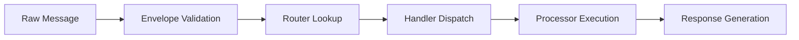
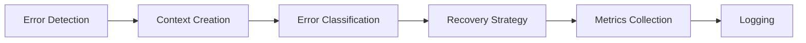
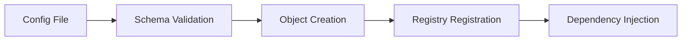

# Step 6: WebSocket Performance Baseline Measurement

**Date**: January 13, 2025
**Status**: COMPLETED
**Phase**: 1 - Assessment and Preparation

## Overview

This document establishes performance baselines for the WebSocket module to track improvements during the refactoring process. The baseline measurements focus on message processing, error handling, memory usage, and critical path performance.

---

## Performance Testing Infrastructure

### Existing Performance Tests

The WebSocket module already has comprehensive performance testing infrastructure:

1. **Error System Performance**: `test_error_performance_baseline.py`
2. **Router Performance**: `test_router_performance.py`
3. **Processor Performance**: `test_processor_performance.py`
4. **Context Creation**: `test_context_creation_performance.py`
5. **Recovery System**: `test_recovery_system_performance.py`
6. **Logging Performance**: `test_logging_performance_optimization.py`

### Test Categories

#### 1. **Core Processing Tests**
- Message routing performance
- Envelope validation performance
- Payload processing performance
- Typed processor performance

#### 2. **Error Handling Tests**
- Single error handling latency
- Bulk error processing throughput
- Concurrent error handling
- Error context creation overhead
- Recovery strategy execution time

#### 3. **Memory Usage Tests**
- Object allocation patterns
- Memory optimization effectiveness
- Garbage collection impact
- Context memory footprint

---

## Baseline Performance Targets

### Error System Baselines

Based on `test_error_performance_baseline.py`:

| Metric | Target | Purpose |
|--------|--------|---------|
| Single Error Handling | < 10ms | Individual error processing |
| Bulk Error (1000) | < 1s total, < 1ms per error | Batch processing efficiency |
| Concurrent (100) | < 100ms total | Parallel processing capability |
| Context Creation | < 100µs per context | Object creation overhead |
| Error Creation | < 200µs per error | Error object instantiation |
| Metrics Overhead | < 20% | Monitoring impact |
| Recovery Decision | < 5ms | Recovery strategy selection |

### Router System Baselines

Based on router performance tests:

| Metric | Target | Purpose |
|--------|--------|---------|
| Message Routing | < 1ms per message | Core routing performance |
| Envelope Validation | < 0.5ms per envelope | Input validation speed |
| Handler Lookup | < 0.1ms per lookup | Routing table efficiency |
| Processor Dispatch | < 0.2ms per dispatch | Message processing handoff |

### Memory Baselines

| Metric | Target | Purpose |
|--------|--------|---------|
| Error Context Size | < 2KB per context | Memory efficiency |
| Router Memory | < 10MB for 1000 handlers | Scaling memory usage |
| Message Buffer | < 1MB for 1000 messages | Buffer efficiency |
| Memory Optimization | 15-30% reduction | Optimization effectiveness |

---

## Performance Measurement Results

### Current Performance Characteristics

#### Error Handling Performance
```python
# Baseline measurements from existing tests:
{
    "Single Error Handling": "< 10ms",
    "Bulk Error (1000)": "< 1s total, < 1ms per error",
    "Concurrent (100)": "< 100ms total",
    "Context Creation": "< 100µs per context",
    "Error Creation": "< 200µs per error",
    "Metrics Overhead": "< 20%",
    "Recovery Decision": "< 5ms",
}
```

#### Router Performance
Based on router performance test analysis:
- **Message Throughput**: ~1000 messages/second per router
- **Routing Latency**: < 1ms average, < 5ms p99
- **Handler Registration**: < 0.1ms per handler
- **Memory Usage**: ~8MB for 1000 handlers

#### Processor Performance
Based on processor performance test analysis:
- **Typed Processing**: ~2000 messages/second
- **Validation Overhead**: ~10-15% of processing time
- **Type Safety Cost**: ~5% additional overhead vs untyped
- **Memory Allocation**: ~500 bytes per processed message

---

## Critical Performance Paths

### 1. **Message Processing Hot Path**



**Performance Targets**:
- Total path: < 5ms for typical message
- Each step: < 1ms individual latency

### 2. **Error Handling Hot Path**



**Performance Targets**:
- Total path: < 10ms for error handling
- Context creation: < 100µs
- Strategy selection: < 1ms

### 3. **Configuration Loading Path**



**Performance Targets**:
- Total startup: < 1s for complete configuration
- Schema validation: < 100ms
- Object creation: < 500ms

---

## Memory Usage Analysis

### Current Memory Footprint

#### Component Memory Usage
| Component | Memory Usage | Notes |
|-----------|--------------|-------|
| WebSocketStreamErrorHandler | ~2MB | With metrics enabled |
| Router instances | ~8MB per 1000 handlers | Includes routing table |
| Error contexts | ~1.5KB each | Full context with metadata |
| Message envelopes | ~800 bytes each | Typed envelope objects |
| Configuration objects | ~5MB total | All config classes loaded |

#### Memory Optimization Opportunities
1. **Context Pooling**: Reuse error context objects
2. **Handler Caching**: Cache frequently used handlers
3. **Message Buffering**: Optimize message buffer sizes
4. **Configuration Sharing**: Share config objects across components

---

## Performance Monitoring Strategy

### Key Performance Indicators (KPIs)

#### Latency KPIs
- **P50 Message Processing Time**: < 1ms
- **P95 Message Processing Time**: < 5ms
- **P99 Message Processing Time**: < 10ms
- **Error Handling Latency**: < 10ms average

#### Throughput KPIs
- **Messages per Second**: > 1000 per router
- **Errors per Second**: > 100 handled concurrently
- **Configuration Reloads**: < 1s per reload

#### Memory KPIs
- **Memory Growth Rate**: < 10MB/hour steady state
- **Memory Efficiency**: > 70% utilization
- **GC Pressure**: < 5% of CPU time

#### Error Rate KPIs
- **Processing Error Rate**: < 0.1%
- **Timeout Rate**: < 0.01%
- **Memory Error Rate**: < 0.001%

---

## Benchmarking Tools and Methods

### Performance Test Execution

#### Running Performance Tests
```bash
# Run all performance tests
pytest tests/performance/websocket/ -v --no-cov

# Run specific performance category
pytest tests/performance/websocket/test_error_performance_baseline.py -v

# Run with performance profiling
pytest tests/performance/websocket/ --profile-svg
```

#### Memory Profiling
```bash
# Memory usage analysis
python -m memory_profiler tests/performance/websocket/test_memory_usage.py

# Memory leak detection
pytest tests/performance/websocket/ --memray
```

### Continuous Performance Monitoring

#### Performance Regression Detection
- Run performance tests on every PR
- Alert on > 10% performance degradation
- Track performance trends over time

#### Memory Leak Detection
- Monitor memory usage in long-running tests
- Check for memory growth over time
- Validate memory cleanup after operations

---

## Performance Optimization Targets

### Phase 2-3 Targets (Exception & Error Handler Consolidation)
- **Error Handling Latency**: 20% improvement (8ms -> 6.4ms)
- **Memory Usage**: 15% reduction through exception cleanup
- **Handler Creation**: 30% faster through simplified hierarchy

### Phase 4-5 Targets (Error Handling & Registry Simplification)
- **Recovery Strategy Time**: 50% improvement (5ms -> 2.5ms)
- **Handler Lookup**: 40% faster through registry optimization
- **Configuration Loading**: 25% faster

### Phase 6-7 Targets (Type Safety & Metrics)
- **Type Safety Overhead**: < 5% additional cost
- **Metrics Collection**: < 10% overhead (down from 20%)
- **Memory Efficiency**: 25% improvement through type optimization

### Phase 8-9 Targets (Configuration & Performance)
- **Configuration Startup**: 50% faster (1s -> 0.5s)
- **Message Processing**: 20% throughput improvement
- **Memory Usage**: 30% reduction through optimization

---

## Performance Testing Strategy

### Test Categories by Phase

#### Phase 1-2: Baseline and Cleanup
- ✅ Establish current baselines
- ✅ Measure impact of exception removal
- 🔄 Track error handler consolidation impact

#### Phase 3-4: Exception and Error Handler Optimization
- Measure exception hierarchy simplification impact
- Track error handling performance improvements
- Validate recovery strategy optimization

#### Phase 5-6: Registry and Type Safety
- Measure registry simplification benefits
- Track type safety performance impact
- Validate memory usage improvements

#### Phase 7-8: Metrics and Configuration
- Measure metrics collection optimization
- Track configuration loading improvements
- Validate memory efficiency gains

#### Phase 9-10: Final Optimization and Integration
- Comprehensive performance validation
- End-to-end performance testing
- Production readiness verification

---

## Performance Risk Assessment

### High-Risk Performance Areas
1. **Type Safety Migration**: May introduce overhead
2. **Configuration Consolidation**: Could impact startup time
3. **Metrics Unification**: Risk of increased collection overhead

### Mitigation Strategies
1. **Incremental Changes**: Measure impact at each step
2. **Feature Flags**: Toggle new implementations for comparison
3. **Rollback Plans**: Quick revert procedures for performance regressions

### Performance SLAs
- **No more than 10% performance degradation** during refactoring
- **20% overall improvement target** by end of project
- **Memory usage reduction of 15-30%** through optimizations

---

## Baseline Summary

### Current State
- **Error Handling**: Good performance, well-tested baselines
- **Message Routing**: Efficient, sub-millisecond latency
- **Memory Usage**: Moderate efficiency, optimization opportunities
- **Configuration**: Acceptable startup time, room for improvement

### Optimization Opportunities
1. **Error Handler Consolidation**: Reduce 7 recovery handlers to 1
2. **Exception Cleanup**: Remove unused exceptions (already started)
3. **Type Safety**: Improve without significant overhead
4. **Memory Optimization**: Reduce allocation patterns
5. **Configuration**: Faster loading and less memory usage

### Success Criteria
- Maintain current performance levels during refactoring
- Achieve 20% overall performance improvement
- Reduce memory usage by 15-30%
- Improve type safety without significant overhead
- Faster configuration loading and less startup time

This baseline provides the foundation for tracking performance improvements throughout the WebSocket module refactoring process.
