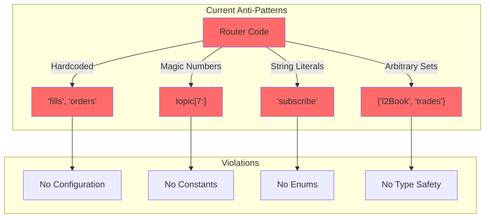
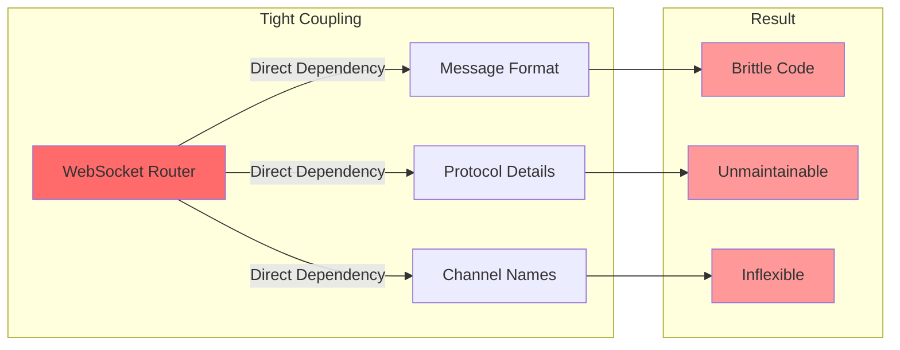
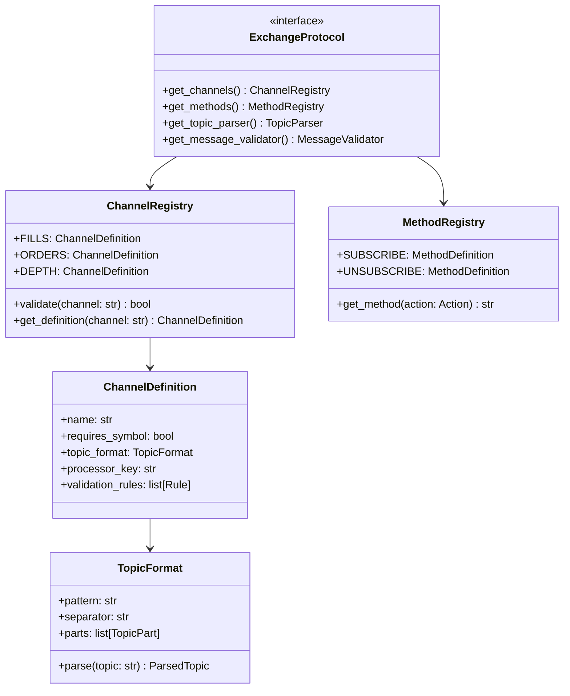
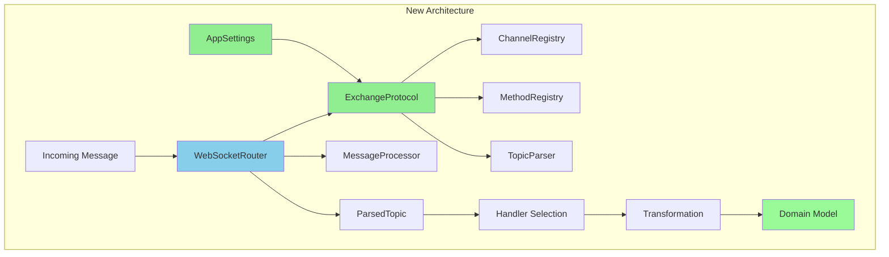
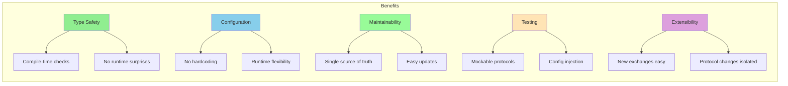

# WebSocket Router Architecture Improvements Research

## Executive Summary

Current WebSocket router implementations (`bp_ws_router.py`, `hl_ws_router.py`) violate CODING_STANDARDS.md through extensive hardcoding of protocol elements, magic strings, and arbitrary offsets. This research proposes a type-safe, configuration-driven architecture that eliminates these violations while maintaining full functionality.

## Current Architecture Problems

### 1. Hardcoded Protocol Elements



### 2. Specific Violations Found

#### Backpack Router (`bp_ws_router.py`)
- **Lines 263, 347**: Hardcoded channel sets `{"fills", "orders", "liquidation"}`
- **Lines 397, 439**: Hardcoded methods `"SUBSCRIBE"`, `"UNSUBSCRIBE"`
- **Line 527**: String manipulation `routing_key.split(".")[0]`

#### Hyperliquid Router (`hl_ws_router.py`)
- **Line 101**: Magic number `CANDLE_TOPIC_PARTS_COUNT = 3`
- **Lines 330, 338, 371**: Hardcoded channel sets
- **Lines 808, 817, 840**: Hardcoded string offsets (`topic[7:]`, `topic[11:]`)
- **Line 671, 704**: Hardcoded method `"subscribe"`

### 3. Architecture Coupling Issues



## Proposed Architecture

### 1. Type-Safe Protocol Definition System



### 2. Configuration-Driven Channel System

```python
# protocols/websocket/channel_protocol.py
from typing import Protocol, runtime_checkable
from dataclasses import dataclass
from enum import Enum

class ChannelType(Enum):
    """Base class for exchange-specific channel types."""
    pass

class BackpackChannelType(ChannelType):
    FILLS = "fills"
    ORDERS = "orders"
    DEPTH = "depth"
    TICKER = "ticker"
    POSITION_UPDATE = "positionUpdate"
    SUBSCRIPTION_RESPONSE = "subscriptionResponse"

class HyperliquidChannelType(ChannelType):
    L2_BOOK = "l2Book"
    TRADES = "trades"
    USER_EVENTS = "userEvents"
    ALL_MIDS = "allMids"
    CANDLE = "candle"
    NOTIFICATION = "notification"

@dataclass
class ChannelConfig:
    """Configuration for a WebSocket channel."""
    channel_type: ChannelType
    requires_symbol: bool
    topic_separator: str = "."
    processor_key: str | None = None

    @property
    def name(self) -> str:
        return self.channel_type.value

    def get_processor_key(self) -> str:
        return self.processor_key or self.name

@runtime_checkable
class ChannelRegistryProtocol(Protocol):
    """Protocol for channel registry implementations."""

    def get_channel(self, name: str) -> ChannelConfig:
        """Get channel configuration by name."""
        ...

    def is_valid_channel(self, name: str) -> bool:
        """Check if channel name is valid."""
        ...

    def get_all_channels(self) -> list[ChannelConfig]:
        """Get all registered channels."""
        ...
```

### 3. Topic Parser System

```python
# protocols/websocket/topic_parser.py
from dataclasses import dataclass
from typing import Protocol, runtime_checkable
from abc import abstractmethod

@dataclass
class ParsedTopic:
    """Result of parsing a WebSocket topic."""
    channel: str
    symbol: str | None = None
    extra_parts: dict[str, str] | None = None
    raw_topic: str | None = None

@runtime_checkable
class TopicParserProtocol(Protocol):
    """Protocol for topic parsing implementations."""

    @abstractmethod
    def parse(self, topic: str) -> ParsedTopic:
        """Parse a topic string into components."""
        ...

    @abstractmethod
    def construct(self, channel: str, symbol: str | None = None, **kwargs) -> str:
        """Construct a topic string from components."""
        ...

class BackpackTopicParser:
    """Backpack-specific topic parser."""

    def __init__(self, config: TopicParserConfig):
        self.config = config
        self.separator = config.separator  # From config, not hardcoded!

    def parse(self, topic: str) -> ParsedTopic:
        if self.separator not in topic:
            return ParsedTopic(channel=topic)

        parts = topic.split(self.separator, maxsplit=1)
        return ParsedTopic(
            channel=parts[0],
            symbol=parts[1] if len(parts) > 1 else None,
            raw_topic=topic
        )

    def construct(self, channel: str, symbol: str | None = None, **kwargs) -> str:
        if symbol:
            return f"{channel}{self.separator}{symbol}"
        return channel

class HyperliquidTopicParser:
    """Hyperliquid-specific topic parser."""

    def __init__(self, config: TopicParserConfig):
        self.config = config
        self.separator = config.separator  # From config!
        self.prefix_lengths = config.prefix_lengths  # From config!

    def parse(self, topic: str) -> ParsedTopic:
        # Special handling for candles
        if topic.startswith("candle:"):
            parts = topic.split(self.separator)
            if len(parts) == self.config.candle_parts_count:  # From config!
                return ParsedTopic(
                    channel="candle",
                    symbol=parts[1],
                    extra_parts={"interval": parts[2]},
                    raw_topic=topic
                )

        # Standard parsing
        if self.separator in topic:
            channel, remainder = topic.split(self.separator, maxsplit=1)
            return ParsedTopic(channel=channel, symbol=remainder, raw_topic=topic)

        return ParsedTopic(channel=topic, raw_topic=topic)
```

### 4. Method Registry System

```python
# protocols/websocket/method_registry.py
from enum import Enum
from typing import Protocol, runtime_checkable

class WebSocketAction(Enum):
    """Standard WebSocket actions."""
    SUBSCRIBE = "subscribe"
    UNSUBSCRIBE = "unsubscribe"
    PING = "ping"
    PONG = "pong"

@runtime_checkable
class MethodRegistryProtocol(Protocol):
    """Protocol for method registry implementations."""

    def get_method_name(self, action: WebSocketAction) -> str:
        """Get the exchange-specific method name for an action."""
        ...

class BackpackMethodRegistry:
    """Backpack-specific method registry."""

    def __init__(self, config: MethodConfig):
        self.config = config
        # Method names from config, not hardcoded!
        self.methods = {
            WebSocketAction.SUBSCRIBE: config.subscribe_method,
            WebSocketAction.UNSUBSCRIBE: config.unsubscribe_method,
        }

    def get_method_name(self, action: WebSocketAction) -> str:
        if action not in self.methods:
            raise ValueError(f"Unsupported action: {action}")
        return self.methods[action]

class HyperliquidMethodRegistry:
    """Hyperliquid-specific method registry."""

    def __init__(self, config: MethodConfig):
        self.config = config
        self.methods = {
            WebSocketAction.SUBSCRIBE: config.subscribe_method,
            WebSocketAction.UNSUBSCRIBE: config.unsubscribe_method,
        }

    def get_method_name(self, action: WebSocketAction) -> str:
        return self.methods.get(action, action.value)
```

### 5. Improved Router Architecture



### 6. Refactored Router Implementation

```python
# apis/websocket/ws_router_v3.py
from typing import Generic, TypeVar
from cyberdelta.config import AppSettings

TEnvelope = TypeVar("TEnvelope")

class ConfigurableWebSocketRouter(Generic[TEnvelope]):
    """Configuration-driven WebSocket router with zero hardcoding."""

    def __init__(
        self,
        config: AppSettings,
        exchange_protocol: ExchangeProtocolProtocol,
        error_handler: BaseErrorHandler,
        stream_error_handler: WebSocketStreamErrorHandler,
        typed_processor: TypeSafeWebSocketProcessor,
    ):
        self.config = config
        self.protocol = exchange_protocol
        self.channel_registry = exchange_protocol.get_channel_registry()
        self.method_registry = exchange_protocol.get_method_registry()
        self.topic_parser = exchange_protocol.get_topic_parser()

        # No hardcoded values!
        self.error_handler = error_handler
        self.stream_error_handler = stream_error_handler
        self.typed_processor = typed_processor

        super().__init__(
            exchange_name=config.exchange_name,
            error_handler=error_handler,
            typed_processor=typed_processor,
            stream_error_handler=stream_error_handler,
            envelope_validator=exchange_protocol.get_envelope_validator(),
        )

    def _extract_routing_key_from_envelope(
        self,
        envelope: TEnvelope,
    ) -> str | None:
        """Extract routing key using configured parser."""
        # Get raw topic from envelope (exchange-specific)
        raw_topic = self.protocol.extract_topic(envelope)
        if not raw_topic:
            return None

        # Parse using configured parser
        parsed = self.topic_parser.parse(raw_topic)

        # Validate channel
        if not self.channel_registry.is_valid_channel(parsed.channel):
            self.logger.warning(
                "invalid_channel",
                channel=parsed.channel,
                exchange=self.config.exchange_name,
            )
            return None

        # Build routing key based on channel config
        channel_config = self.channel_registry.get_channel(parsed.channel)
        if channel_config.requires_symbol and parsed.symbol:
            return self.topic_parser.construct(parsed.channel, parsed.symbol)

        return parsed.channel

    def construct_subscription_payload(
        self,
        topic: str,
        auth: AuthenticationData | None = None,
    ) -> SubscriptionRequest:
        """Construct subscription using configured protocol."""
        # Parse topic
        parsed = self.topic_parser.parse(topic)

        # Validate channel
        if not self.channel_registry.is_valid_channel(parsed.channel):
            raise InvalidChannelError(parsed.channel)

        # Get method name from registry
        method = self.method_registry.get_method_name(WebSocketAction.SUBSCRIBE)

        # Build payload using protocol
        return self.protocol.build_subscription(
            method=method,
            channel=parsed.channel,
            symbol=parsed.symbol,
            auth=auth,
        )
```

### 7. Configuration Structure

```yaml
# config/websocket/backpack.yaml
websocket:
  backpack:
    channels:
      - type: "fills"
        requires_symbol: false
        processor_key: "fills"
      - type: "orders"
        requires_symbol: false
        processor_key: "orders"
      - type: "depth"
        requires_symbol: true
        processor_key: "depth"
      - type: "ticker"
        requires_symbol: true
        processor_key: "ticker"

    topic:
      separator: "."
      format: "{channel}.{symbol}"

    methods:
      subscribe: "SUBSCRIBE"
      unsubscribe: "UNSUBSCRIBE"

    validation:
      max_topic_length: 64
      allowed_symbol_pattern: "^[A-Z]+_[A-Z]+$"

# config/websocket/hyperliquid.yaml
websocket:
  hyperliquid:
    channels:
      - type: "l2Book"
        requires_symbol: true
        processor_key: "l2Book"
      - type: "trades"
        requires_symbol: true
        processor_key: "trades"
      - type: "userEvents"
        requires_symbol: false
        processor_key: "userEvents"
      - type: "candle"
        requires_symbol: true
        processor_key: "candle"
        extra_fields: ["interval"]

    topic:
      separator: ":"
      format: "{channel}:{symbol}"
      candle_format: "{channel}:{symbol}:{interval}"
      candle_parts_count: 3

    methods:
      subscribe: "subscribe"
      unsubscribe: "unsubscribe"

    prefix_lengths:
      l2Book: 7
      trades: 7
      userEvents: 11
```

### 8. Benefits of New Architecture



## Implementation Strategy

### Phase 1: Protocol Definition (Week 1)
1. Define base protocols and interfaces
2. Create exchange-specific protocol implementations
3. Build configuration schemas

### Phase 2: Parser Implementation (Week 2)
1. Implement topic parsers for each exchange
2. Create method registries
3. Build channel registries

### Phase 3: Router Refactoring (Week 3-4)
1. Create new base router with protocol support
2. Migrate Backpack router to new architecture
3. Migrate Hyperliquid router to new architecture

### Phase 4: Testing & Validation (Week 5)
1. Unit tests for all protocol components
2. Integration tests with real WebSocket data
3. Performance benchmarking

### Phase 5: Migration (Week 6)
1. Parallel run of old and new routers
2. Gradual migration of handlers
3. Deprecation of old routers

## Risk Analysis

### Risks
1. **Complexity**: More abstractions may increase initial complexity
2. **Performance**: Additional layers might impact latency
3. **Migration**: Existing code depends on current router structure

### Mitigations
1. **Complexity**: Comprehensive documentation and examples
2. **Performance**: Benchmark and optimize hot paths
3. **Migration**: Phased approach with backward compatibility

## Type Safety Improvements

### Current Type Issues
```python
# Current: Loose typing
def construct_subscription_payload(
    topic: str,  # What format?
    signature_components: Any | None = None,  # What structure?
) -> dict[str, Any]:  # What schema?
    pass
```

### Improved Type Safety
```python
# New: Strong typing
def construct_subscription_payload(
    topic: Topic,  # Validated topic type
    auth: AuthenticationData | None = None,  # Structured auth
) -> SubscriptionRequest:  # Typed response
    pass

@dataclass
class Topic:
    channel: ChannelType
    symbol: Symbol | None
    extra: dict[str, str] | None

    def __str__(self) -> str:
        # Format based on configuration
        pass

@dataclass
class SubscriptionRequest:
    method: str
    params: list[str]
    auth: AuthenticationTuple | None
```

## Performance Considerations

### Optimization Strategies

1. **Lazy Loading**: Load protocol components on demand
2. **Caching**: Cache parsed topics and channel configurations
3. **Fast Path**: Direct routing for common channels
4. **Compiled Patterns**: Pre-compile regex patterns

```python
class OptimizedTopicParser:
    def __init__(self, config: TopicParserConfig):
        self.config = config
        # Pre-compile patterns
        self._pattern_cache = {}
        self._parse_cache = LRUCache(maxsize=1000)

    def parse(self, topic: str) -> ParsedTopic:
        # Check cache first
        if topic in self._parse_cache:
            return self._parse_cache[topic]

        # Parse and cache
        result = self._parse_topic(topic)
        self._parse_cache[topic] = result
        return result
```

## Testing Strategy

### Unit Tests
```python
class TestChannelRegistry:
    def test_channel_validation(self, config):
        registry = BackpackChannelRegistry(config)
        assert registry.is_valid_channel("fills")
        assert not registry.is_valid_channel("invalid_channel")

    def test_channel_config_retrieval(self, config):
        registry = BackpackChannelRegistry(config)
        channel = registry.get_channel("depth")
        assert channel.requires_symbol
        assert channel.processor_key == "depth"

class TestTopicParser:
    @pytest.mark.parametrize("topic,expected", [
        ("depth.BTC_USDC", ParsedTopic("depth", "BTC_USDC")),
        ("fills", ParsedTopic("fills", None)),
        ("candle:BTC:1h", ParsedTopic("candle", "BTC", {"interval": "1h"})),
    ])
    def test_topic_parsing(self, parser, topic, expected):
        result = parser.parse(topic)
        assert result == expected
```

### Integration Tests
```python
class TestWebSocketRouterIntegration:
    async def test_message_routing_with_protocol(self, router, message):
        # Test that messages are routed correctly using protocol
        handlers = {"depth.BTC_USDC": mock_handler}
        await router.route_message(message, handlers)
        mock_handler.assert_called_once()

    async def test_subscription_construction(self, router):
        # Test subscription payload construction
        payload = router.construct_subscription_payload("l2Book:SOL")
        assert payload.method == "subscribe"  # From config!
        assert "SOL" in payload.params
```

## Monitoring and Observability

### Metrics to Track
1. **Parser Performance**: Time to parse topics
2. **Cache Hit Rates**: Topic and config cache efficiency
3. **Channel Distribution**: Which channels are most used
4. **Error Rates**: Invalid channels, parsing failures

```python
class InstrumentedTopicParser:
    def __init__(self, parser: TopicParserProtocol, metrics: MetricsCollector):
        self.parser = parser
        self.metrics = metrics

    def parse(self, topic: str) -> ParsedTopic:
        with self.metrics.timer("topic_parser.parse_time"):
            try:
                result = self.parser.parse(topic)
                self.metrics.increment("topic_parser.success")
                return result
            except Exception as e:
                self.metrics.increment("topic_parser.error")
                raise
```

## Conclusion

The proposed architecture eliminates all hardcoding violations while providing:
1. **Full Type Safety**: Strong typing throughout the system
2. **Configuration-Driven**: All values from configuration
3. **Protocol Abstraction**: Exchange differences isolated
4. **Testability**: Mockable interfaces and dependency injection
5. **Maintainability**: Single source of truth for protocol rules
6. **Extensibility**: Easy to add new exchanges or modify existing ones

This approach aligns with CODING_STANDARDS.md requirements:
- ✅ No hardcoded values
- ✅ No magic strings or numbers
- ✅ Configuration-first development
- ✅ Explicit over implicit
- ✅ Type safety throughout
- ✅ Fail-fast philosophy

The investment in this refactoring will pay dividends in:
- Reduced bugs from protocol changes
- Faster onboarding of new exchanges
- Easier maintenance and updates
- Better testing coverage
- Compliance with coding standards
