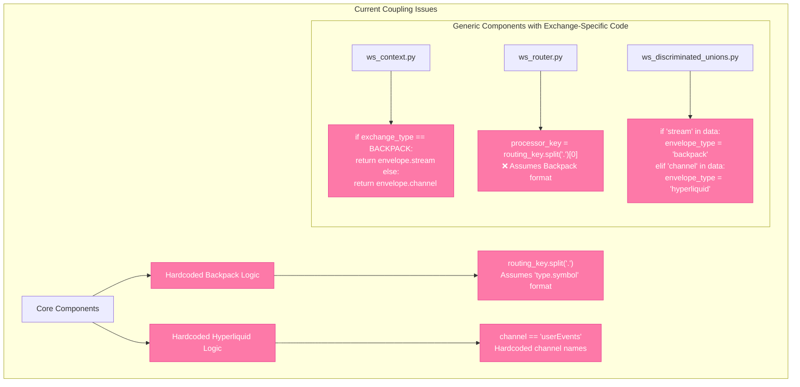
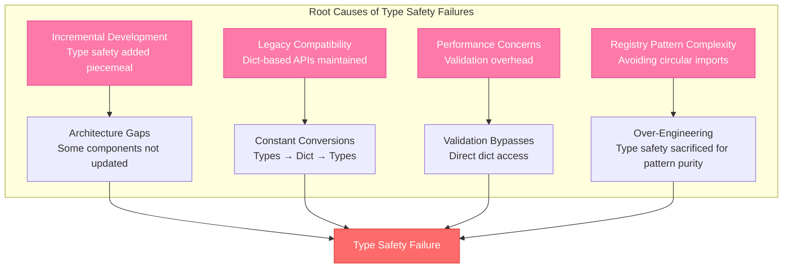

# WebSocket Type Safety Analysis: Critical Findings

## Executive Summary

**🚨 CRITICAL DISCOVERY**: The WebSocket infrastructure has sophisticated type safety architecture but **incomplete implementation** creates dangerous gaps between intended Pydantic validation and actual runtime behavior.

### Key Issues Identified:
1. **Type Safety Theater**: Advanced type infrastructure exists but `dict[str, Any]` still dominates critical paths
2. **Exchange Coupling**: Core components hardcode Hyperliquid/Backpack specifics despite abstraction layers
3. **Pydantic Bypass**: Validation models exist but are converted back to raw dicts for error handling
4. **Architecture Inconsistency**: Type guards and security validators don't integrate properly

---

## Current Architecture Analysis

```mermaid
graph TB
    subgraph "WebSocket Message Flow"
        Raw[Raw WebSocket Message<br/>dict[str, Any]] --> Security[Security Validation<br/>ws_security.py]
        Security --> TypeGuard[Type Guards<br/>ws_type_guards.py]
        TypeGuard --> Discriminate[Discriminated Unions<br/>ws_discriminated_unions.py]
        Discriminate --> Pydantic[Pydantic Models<br/>ws_models.py]
        Pydantic --> Context[Typed Context<br/>ws_context.py]
        Context --> Router[Router<br/>ws_router.py]
        Router --> Processor[Processor<br/>ws_processor.py]

        %% The problematic conversion back to dict
        Processor -.->|"ERROR HANDLING<br/>Converts back to dict[str, Any]"| ErrorDict[Error Handler<br/>dict[str, Any]]
        Context -.->|"METRICS<br/>model_dump(mode='python')"| MetricsDict[Metrics Dict<br/>dict[str, Any]]

        %% Style problematic paths in red
        Processor -.->|"LOSES TYPE SAFETY"| ErrorDict
        Context -.->|"LOSES TYPE SAFETY"| MetricsDict
    end

    classDef problem fill:#ff6b6b,stroke:#d63031,color:#fff
    classDef good fill:#51cf66,stroke:#2d8f47,color:#fff
    classDef partial fill:#ffd43b,stroke:#fab005,color:#000

    class Raw,ErrorDict,MetricsDict problem
    class Pydantic,Context good
    class Security,TypeGuard,Router,Processor partial
```

### Architecture Problems Discovered

#### 1. **Type Safety Theater**
The system has sophisticated type infrastructure but **critical paths still use `dict[str, Any]`**:

```python
# ws_router.py:351 - Error handling bypasses type safety
async def _handle_missing_processor(
    self,
    routing_key: str,
    payload: dict[str, Any] | list[Any],  # ❌ Still using Any!
    context: WebSocketContextProtocol,
) -> None:
    payload_dict = payload if isinstance(payload, dict) else {"data": payload}
    context_dict = context.model_dump(mode="python")  # ❌ Converting typed context back to dict!
```

#### 2. **Pydantic Validation Bypass**
**CRITICAL**: Typed contexts are created but immediately converted back to dicts:

```python
# ws_processor.py:264 - Losing type safety in error handling
context_dict = context.model_dump(mode="python")
payload_dict = payload if isinstance(payload, dict) else {"data": payload}
await self.error_handler.handle_validation_error(
    error=e,
    payload=payload_dict,  # ❌ Back to dict[str, Any]!
    context=context_dict,  # ❌ Back to dict[str, Any]!
)
```

---

## Exchange Coupling Analysis



### Exchange Coupling Evidence

#### 1. **Generic Context with Exchange-Specific Logic**
```python
# ws_context.py:72-75 - Exchange specifics in generic component
@computed_field
def topic(self) -> str | None:
    if self.exchange_type == ExchangeType.BACKPACK:
        return getattr(self.validated_envelope, "stream", None)
    # HYPERLIQUID
    return getattr(self.validated_envelope, "channel", None)
```

#### 2. **Router Hardcodes Backpack Format**
```python
# ws_router.py:498-500 - Assumes Backpack's "type.symbol" format
processor_key = routing_key.split(".")[0] if "." in routing_key else routing_key
processor = self.processors.get(processor_key)
```

**Impact**: Adding new exchanges with different formats (e.g., `:` separator) would **break core routing logic**.

---

## Missing Pydantic Validation Layers

```mermaid
graph LR
    subgraph "Current State: Raw Dicts"
        ErrorDict[Error Context<br/>dict[str, Any]]
        MetricsDict[Metrics Data<br/>dict[str, Any]]
        ConfigDict[Configuration<br/>dict[str, Any]]
        LogDict[Log Context<br/>dict[str, Any]]
    end

    subgraph "Should Be: Typed Models"
        ErrorModel[SecurityValidationError<br/>Pydantic Model]
        MetricsModel[ProcessingMetrics<br/>Pydantic Model]
        ConfigModel[ProcessorConfig<br/>Pydantic Model]
        LogModel[StructuredLogContext<br/>Pydantic Model]
    end

    ErrorDict -.->|"Missing Conversion"| ErrorModel
    MetricsDict -.->|"Missing Conversion"| MetricsModel
    ConfigDict -.->|"Missing Conversion"| ConfigModel
    LogDict -.->|"Missing Conversion"| LogModel

    classDef current fill:#ff6b6b,stroke:#d63031,color:#fff
    classDef target fill:#51cf66,stroke:#2d8f47,color:#fff

    class ErrorDict,MetricsDict,ConfigDict,LogDict current
    class ErrorModel,MetricsModel,ConfigModel,LogModel target
```

### Critical Missing Models

#### 1. **Error Context Models**
```python
# Current: ws_security.py
security_context: dict[str, Any] | None = None

# Should be:
class SecurityValidationError(BaseModel):
    violation_type: SecurityViolationType
    message_data: ValidationErrorContext | None = None
    security_context: SecurityContext | None = None
```

#### 2. **Metrics Models**
```python
# Current: ws_processor.py:106
def get_stats(self) -> dict[str, Any]:  # ❌ Raw dict
    return {
        "total_processed": self.total_processed,
        "validation_errors": self.validation_errors,
    }

# Should be:
class ProcessingMetrics(BaseModel):
    total_processed: int
    validation_errors: int
    average_processing_time_ms: float
    error_rate: float
```

---

## Type Guards vs Security Integration Issues

```mermaid
graph TB
    subgraph "Current Integration Problems"
        TypeGuards[ws_type_guards.py<br/>Runtime Type Narrowing]
        Security[ws_security.py<br/>Validation Framework]

        TypeGuards -.->|"❌ Not Used"| Security
        Security -.->|"Uses basic isinstance"| BasicCheck[isinstance(obj, dict)]

        subgraph "What Should Happen"
            TypeGuards -->|"Should Use"| SecureGuards[is_secure_dict()<br/>is_secure_list()]
            SecureGuards --> Security
            Security --> TypedValidation[Type-Safe Validation<br/>with Better Error Messages]
        end
    end

    classDef problem fill:#ff6b6b,stroke:#d63031,color:#fff
    classDef good fill:#51cf66,stroke:#2d8f47,color:#fff
    classDef missing fill:#ffd43b,stroke:#fab005,color:#000

    class BasicCheck problem
    class TypedValidation good
    class SecureGuards missing
```

### Integration Problems

#### 1. **Type Guards Defined But Not Used**
```python
# ws_type_guards.py:79 - Sophisticated type guard defined
def is_secure_dict(obj: object) -> TypeGuard[SecureDict]:
    if not isinstance(obj, dict):
        return False
    valid_keys = all(isinstance(k, str) for k in obj)
    valid_values = all(isinstance(v, (str, int, float, bool, type(None))) for v in obj.values())
    return valid_keys and valid_values

# ws_security.py:338 - But security uses basic isinstance instead
if isinstance(obj, dict):  # ❌ Should use is_secure_dict(obj)
    if len(obj) > self.config.max_object_keys:
        # ...
```

#### 2. **Inconsistent Type Guard Usage**
```python
# ws_typed_processor.py:67-73 - Uses type guards for detection
if self.type_guards.is_backpack_message(raw_data):
    exchange_type = ExchangeType.BACKPACK
elif self.type_guards.is_hyperliquid_message(raw_data):
    exchange_type = ExchangeType.HYPERLIQUID
else:
    msg = f"Unknown message format: {list(raw_data.keys())}"  # ❌ Still uses raw dict!
    raise ValueError(msg)
```

---

## Critical Findings: Why Type Safety Fails

### 1. **Legacy Bridge Pattern**
**Problem**: System maintains backward compatibility with dict-based APIs, creating conversion bottlenecks.


### 2. **Error Handling System Lag**
**CRITICAL**: Error handlers weren't updated when typed contexts were introduced.

All error handlers expect `dict[str, Any]` contexts, **forcing conversions that lose type safety**.

### 3. **Performance vs Type Safety Trade-offs**
```python
# ws_discriminated_unions.py:121 - Performance cost forces dict copying
data = raw_data.copy()  # ❌ Performance cost for type safety
# This suggests the architecture has fundamental performance/safety tension
```

---

## Root Cause Analysis



---

## Recommendations: Critical Actions Required

### 🚨 **IMMEDIATE (P0 - Trading Safety)**

1. **Eliminate Dict Conversions in Error Handling**
   ```python
   # BEFORE: ws_processor.py:264
   context_dict = context.model_dump(mode="python")  # ❌ Loses types

   # AFTER: Create typed error handlers
   await self.typed_error_handler.handle_validation_error(
       error=e,
       context=context,  # ✅ Keep types
       payload=typed_payload,  # ✅ Keep types
   )
   ```

2. **Fix Exchange Coupling in Core Components**
   ```python
   # BEFORE: ws_context.py hardcodes exchange logic
   if self.exchange_type == ExchangeType.BACKPACK:
       return getattr(self.validated_envelope, "stream", None)

   # AFTER: Use protocol-based approach
   return self.validated_envelope.get_topic()  # ✅ Exchange implements protocol
   ```

3. **Use Type Guards Consistently**
   ```python
   # BEFORE: ws_security.py
   if isinstance(obj, dict):  # ❌ Basic check

   # AFTER:
   if is_secure_dict(obj):  # ✅ Type-safe with narrowing
   ```

### ⚠️ **HIGH PRIORITY (P1 - Architecture Integrity)**

4. **Create Missing Pydantic Models**
   - `SecurityValidationError` model
   - `ProcessingMetrics` model
   - `ErrorContext` models
   - `LogContext` models

5. **Eliminate `dict[str, Any]` from Internal APIs**
   - Update all error handlers to accept typed contexts
   - Remove `model_dump(mode="python")` conversions
   - Create typed interfaces for all inter-component communication

6. **Fix Exchange Detection Logic**
   ```python
   # BEFORE: Hardcoded in discriminated unions
   if "stream" in data:
       envelope_type = "backpack"

   # AFTER: Plugin-based detection
   envelope_type = self.exchange_detector.detect_exchange(data)
   ```

### 📊 **MEDIUM PRIORITY (P2 - Code Quality)**

7. **Simplify Registry Pattern**
   - Reduce complexity where not needed
   - Accept some TYPE_CHECKING imports vs losing type safety
   - Consolidate similar validation logic

8. **Performance Optimization Without Type Loss**
   - Profile actual performance impact of validation
   - Use discriminated unions more effectively
   - Cache validated objects when appropriate

---

## Security Implications

**🚨 CRITICAL SECURITY RISK**: Type safety failures in financial systems can lead to:

1. **Data Corruption**: Incorrect type assumptions in price/quantity fields
2. **Injection Attacks**: Bypassed validation allows malicious payloads
3. **Exchange Confusion**: Wrong exchange-specific logic applied to messages
4. **Memory Exhaustion**: Security limits bypassed through type conversions

The current architecture has the **foundation for security** but **implementation gaps create vulnerabilities**.

---

## Conclusion

The WebSocket infrastructure represents **sophisticated architecture with incomplete implementation**. The type safety vision is sound, but execution has created a system that:

1. **Appears type-safe** but has critical `dict[str, Any]` escape hatches
2. **Has comprehensive validation** that gets bypassed for error handling
3. **Implements abstraction layers** that contain exchange-specific logic
4. **Uses advanced patterns** (registry, discriminated unions) but sacrifices simplicity

**The core issue**: Incremental development and legacy compatibility have prevented full realization of the type-safe architecture. The infrastructure exists to fix these problems, but requires **coordinated refactoring** across multiple components.

**Recommendation**: Prioritize the P0 items immediately as they represent **trading safety risks**, then systematically address the architectural inconsistencies to achieve the original type safety vision.
