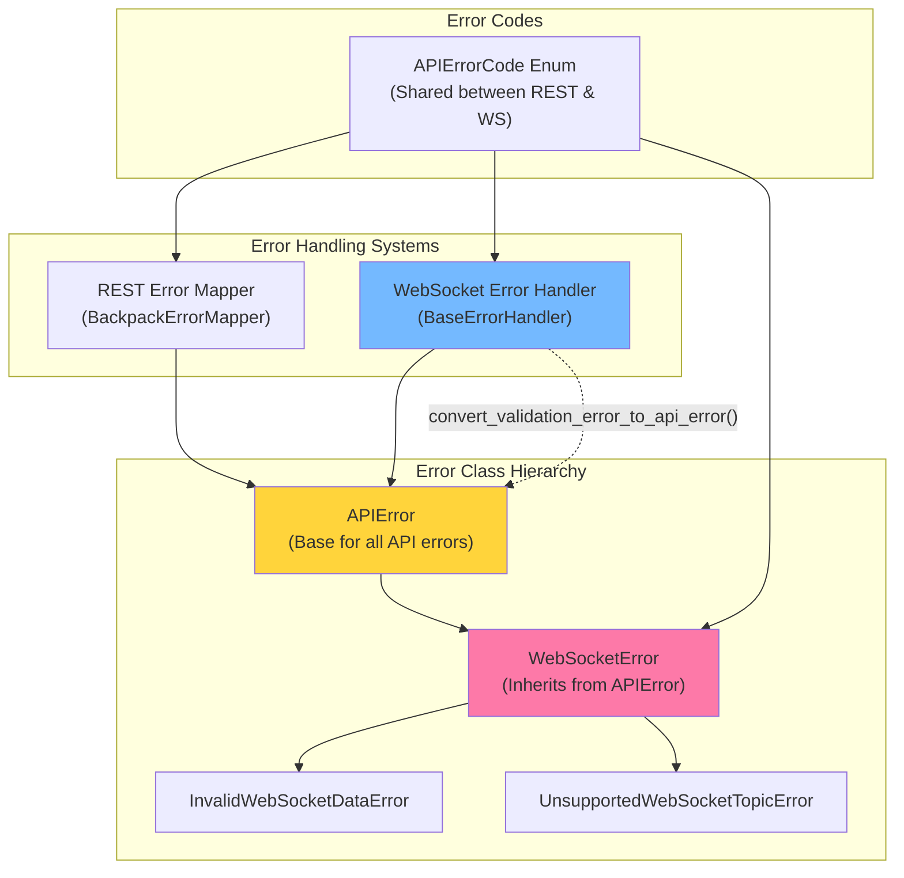
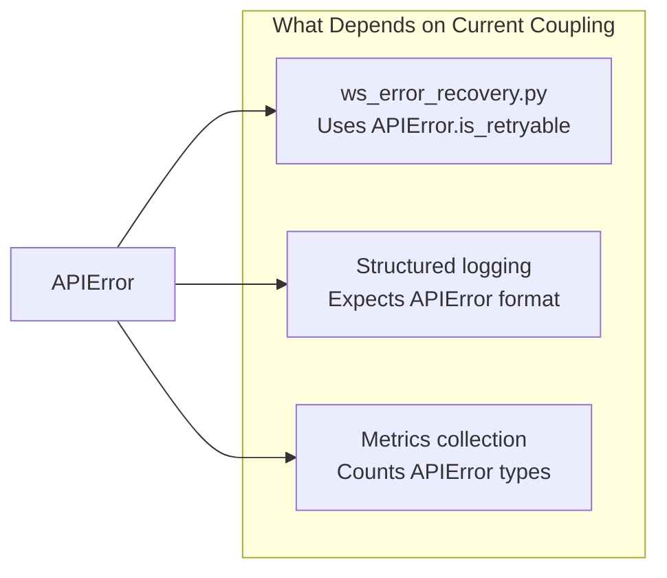
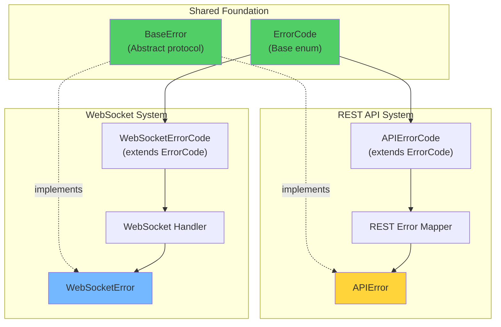

# WebSocket vs API Error System: Deep Analysis

## Executive Summary

The WebSocket error system **IS connected** to the API error system through inheritance and shared infrastructure, but this connection is **problematic** and creates unnecessary coupling. The WebSocket system has unique requirements that don't align well with REST API error patterns.

---

## Current Architecture



## Key Findings

### 1. **WebSocketError Inherits from APIError**

```python
# cyberdelta/apis/exceptions/websocket.py
class WebSocketError(APIError):
    """Base class for WebSocket-related errors."""
    
    def __init__(self, message: str, *, 
                 channel: str | None = None,
                 topic: str | None = None,
                 ...):
        # Adds WebSocket-specific metadata to APIError
        full_metadata = metadata or {}
        if channel:
            full_metadata["channel"] = channel
        if topic:
            full_metadata["topic"] = topic
        
        super().__init__(message=message, code=code, ...)
```

**Problem**: WebSocket errors are forced to fit the REST API error model, even though they have different semantics.

### 2. **Shared Error Codes**

Both systems use the same `APIErrorCode` enum:

```python
# REST API usage
APIErrorCode.AUTHENTICATION_FAILED  # HTTP 401
APIErrorCode.RATE_LIMITED           # HTTP 429

# WebSocket usage (semantically different!)
APIErrorCode.INVALID_RESPONSE       # Malformed WebSocket frame
APIErrorCode.NETWORK_ISSUE          # WebSocket disconnection
```

**Problem**: Same error code means different things in different contexts:
- `NETWORK_ISSUE` in REST = HTTP connection failed
- `NETWORK_ISSUE` in WebSocket = Real-time stream interrupted

### 3. **Error Handler Connection**

The WebSocket error handler has a method to convert to APIError:

```python
# ws_error_handler.py:379
def convert_validation_error_to_api_error(
    self, error: ValidationError, context: str
) -> APIError:
    """Convert Pydantic validation error to APIError."""
    return APIError(
        code=APIErrorCode.INVALID_RESPONSE.value,
        message=f"Invalid WebSocket {context}: {error}",
        original_exception=error,
        http_status=None,  # ❌ WebSocket has no HTTP status!
    )
```

**Problem**: WebSocket errors don't have HTTP status codes, but APIError expects them.

---

## Architecture Problems

### 1. **Semantic Mismatch**

| Aspect | REST API | WebSocket |
|--------|----------|-----------|
| **Error Trigger** | Request/Response | Stream/Event |
| **Recovery** | Retry request | Reconnect stream |
| **Context** | HTTP status, headers | Channel, topic, sequence |
| **Lifecycle** | Stateless | Stateful connection |
| **Error Frequency** | Per request | Continuous stream |

### 2. **Forced Coupling Examples**

```python
# WebSocket error forced to use HTTP concepts
class InvalidWebSocketDataError(WebSocketError):
    def __init__(self, channel: str, ...):
        super().__init__(
            message=message,
            code=APIErrorCode.INVALID_RESPONSE.value,  # ❌ Not a "response"!
            http_status=None,  # ❌ Always None for WebSocket
        )
```

### 3. **Error Recovery Differences**

```python
# REST API retry logic
if isinstance(error, APIError) and error.is_retryable:
    # Retry the HTTP request
    retry_after = error.retry_after or calculate_backoff()
    
# WebSocket retry logic (different!)
if isinstance(error, APIError) and error.is_retryable:
    # But WebSocket needs to:
    # 1. Reconnect the stream
    # 2. Resubscribe to channels
    # 3. Handle missed messages
    # APIError.is_retryable doesn't capture this complexity!
```

---

## Why This Coupling Exists

### Historical Reasons

1. **Code Reuse**: Initial WebSocket implementation reused REST error infrastructure
2. **Consistency Goal**: Attempt to have "one error system to rule them all"
3. **Incremental Development**: WebSocket added after REST API was established

### Current Dependencies



---

## Should They Be Connected?

### Arguments FOR Connection

1. **Unified Error Handling**: Single error type for all exchange communication
2. **Code Reuse**: Shared error codes, retry logic, logging
3. **Consistency**: Developers learn one error system
4. **Monitoring**: Single dashboard for all errors

### Arguments AGAINST Connection (Stronger)

1. **Semantic Differences**: WebSocket errors fundamentally different from REST
2. **Unnecessary Fields**: `http_status` always None in WebSocket
3. **Type Safety Issues**: Forces dict conversions to fit APIError model
4. **Complex Recovery**: WebSocket recovery != REST retry
5. **Evolution Constraints**: Can't optimize WebSocket errors without breaking REST

---

## Impact on Type Safety

### Current Type Safety Problems

```python
# ws_error_handler.py - Multiple dict conversions
async def handle_validation_error(
    self,
    error: ValidationError,
    payload: dict[str, Any],  # ❌ Should be typed!
    context: dict[str, Any] | None = None,  # ❌ Should be typed!
) -> None:
    # Converts to APIError, losing WebSocket-specific types
    api_error = self.convert_validation_error_to_api_error(error, "message")
```

### If Separated

```python
# Hypothetical separated system
async def handle_validation_error(
    self,
    error: ValidationError,
    payload: WebSocketPayload,  # ✅ Typed!
    context: WebSocketContext,  # ✅ Typed!
) -> None:
    # Create WebSocket-specific error with proper types
    ws_error = WebSocketValidationError(
        error=error,
        channel=context.channel,
        sequence=context.sequence,
        # No http_status field needed!
    )
```

---

## Recommendation: Separate But Aligned

### Proposed Architecture



### Implementation Plan

#### Step 1: Create Shared Protocol
```python
# cyberdelta/apis/common/error_protocol.py
from typing import Protocol

class ErrorProtocol(Protocol):
    """Base protocol for all errors."""
    message: str
    code: int | str
    is_retryable: bool
    metadata: dict[str, Any] | None
```

#### Step 2: Separate Error Classes
```python
# Keep APIError for REST
class APIError(Exception):
    http_status: int | None
    retry_after: float | None
    
# New WebSocket-specific error
class WebSocketStreamError(Exception):
    channel: str | None
    topic: str | None
    sequence: int | None
    reconnect_required: bool
    missed_messages: bool
```

#### Step 3: Separate Error Codes
```python
# Common codes
class CommonErrorCode(Enum):
    NETWORK_ISSUE = 2
    AUTHENTICATION_FAILED = 100
    
# REST-specific
class APIErrorCode(CommonErrorCode):
    TIMEOUT = 1  # HTTP timeout
    SERVER_ERROR = 4  # HTTP 5xx
    
# WebSocket-specific  
class WebSocketErrorCode(CommonErrorCode):
    STREAM_INTERRUPTED = 1001
    SUBSCRIPTION_FAILED = 1002
    HEARTBEAT_TIMEOUT = 1003
```

---

## Migration Strategy

### Phase 1: Add WebSocket-Specific System (Parallel)
- Create new WebSocketStreamError alongside existing system
- New errors use new system, old code still works
- No breaking changes

### Phase 2: Migrate Error Handlers
- Update ws_error_handler.py to use new types
- Remove dict conversions
- Add proper type safety

### Phase 3: Deprecate Coupling
- Mark convert_validation_error_to_api_error as deprecated
- Update all WebSocket code to new system
- Remove inheritance from APIError

### Phase 4: Clean Separation
- WebSocket and REST API errors completely separate
- Shared only at protocol level
- Full type safety restored

---

## Benefits of Separation

### 1. **Type Safety**
- No more dict[str, Any] conversions
- WebSocket-specific types preserved
- Proper error context typing

### 2. **Semantic Clarity**
- WebSocket errors describe stream issues
- REST errors describe request/response issues
- No conceptual confusion

### 3. **Evolution Freedom**
- WebSocket can add stream-specific fields
- REST can add HTTP-specific fields
- No cross-contamination

### 4. **Better Recovery**
- WebSocket-specific recovery logic
- Stream reconnection vs request retry
- Proper handling of missed messages

---

## Conclusion

The WebSocket error system **is currently connected** to the API error system through inheritance and shared infrastructure. This connection:

1. **Exists for historical reasons** (code reuse, consistency)
2. **Creates type safety problems** (dict conversions, missing types)
3. **Forces semantic mismatches** (HTTP concepts in WebSocket)
4. **Should be separated** for better type safety and clarity

**Recommendation**: 
- **Short term**: Fix type safety issues within current coupled system
- **Medium term**: Create parallel WebSocket-specific error system
- **Long term**: Complete separation with shared protocol interface

This separation would:
- ✅ Restore full type safety
- ✅ Enable WebSocket-specific optimizations
- ✅ Clarify error semantics
- ✅ Improve error recovery strategies
- ✅ Reduce architectural debt