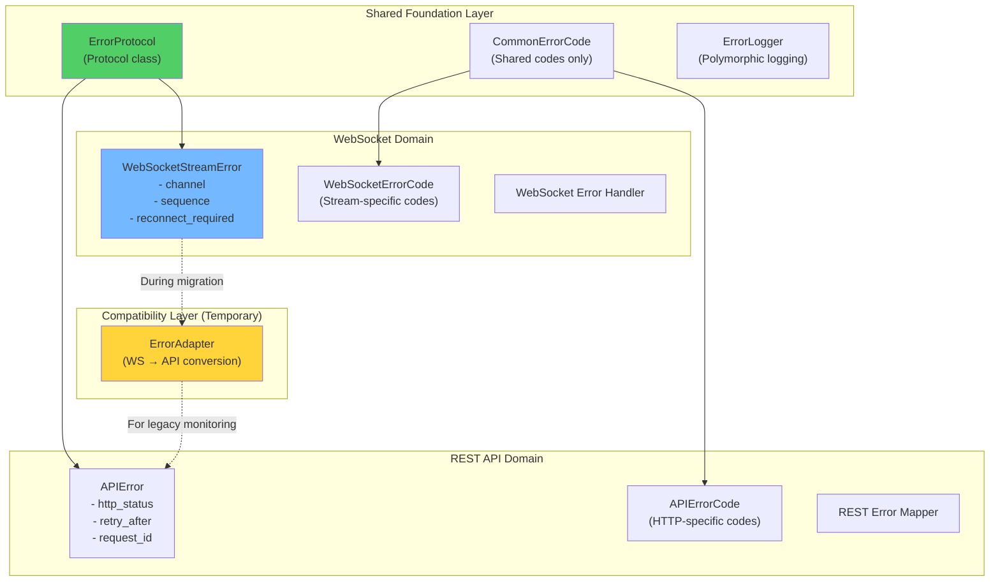

# WebSocket Error System: Decoupled Architecture Design

## Executive Summary

Instead of fixing type safety issues within the flawed WebSocket-APIError coupling, we should first design and implement a properly decoupled architecture. This document outlines the complete design.

---

## Design Principles

1. **Separation of Concerns**: WebSocket errors are fundamentally different from REST API errors
2. **Type Safety First**: No dict[str, Any] conversions in the error path
3. **Minimal Breaking Changes**: Gradual migration with compatibility layer
4. **Domain-Driven**: Errors reflect the domain (streaming vs request/response)

---

## Proposed Architecture



---

## Implementation Details

### 1. Shared Foundation

```python
# cyberdelta/apis/common/error_protocol.py
from typing import Protocol, Any
from abc import abstractmethod

class ErrorProtocol(Protocol):
    """Base protocol that both error systems implement."""
    
    @property
    @abstractmethod
    def message(self) -> str:
        """Human-readable error message."""
        ...
    
    @property
    @abstractmethod
    def code(self) -> int | str:
        """Error code for categorization."""
        ...
    
    @property
    @abstractmethod
    def is_retryable(self) -> bool:
        """Whether the operation can be retried."""
        ...
    
    @property
    @abstractmethod
    def metadata(self) -> dict[str, Any] | None:
        """Additional error context."""
        ...
    
    @abstractmethod
    def to_log_dict(self) -> dict[str, Any]:
        """Convert to dict for structured logging."""
        ...
```

### 2. WebSocket-Specific Error System

```python
# cyberdelta/apis/websocket/ws_stream_error.py
from enum import Enum
from typing import Any
from datetime import datetime
from pydantic import BaseModel, Field

class WebSocketErrorCode(Enum):
    """WebSocket-specific error codes."""
    # Connection errors (1000-1099)
    CONNECTION_CLOSED = 1000
    CONNECTION_LOST = 1001
    RECONNECTION_FAILED = 1002
    HANDSHAKE_FAILED = 1003
    
    # Stream errors (1100-1199)
    STREAM_INTERRUPTED = 1100
    SUBSCRIPTION_FAILED = 1101
    SUBSCRIPTION_REJECTED = 1102
    CHANNEL_NOT_FOUND = 1103
    
    # Message errors (1200-1299)
    INVALID_MESSAGE_FORMAT = 1200
    MESSAGE_VALIDATION_FAILED = 1201
    SEQUENCE_GAP_DETECTED = 1202
    DUPLICATE_MESSAGE = 1203
    
    # Rate limiting (1300-1399)
    MESSAGE_RATE_LIMITED = 1300
    SUBSCRIPTION_LIMIT_EXCEEDED = 1301
    
    # Authentication (1400-1499)
    AUTH_REQUIRED = 1400
    AUTH_FAILED = 1401
    AUTH_EXPIRED = 1402

class StreamContext(BaseModel):
    """Context for stream-related errors."""
    channel: str | None = None
    topic: str | None = None
    subscription_id: str | None = None
    sequence_number: int | None = None
    last_good_sequence: int | None = None
    messages_missed: int | None = None
    connection_id: str | None = None
    timestamp: datetime = Field(default_factory=datetime.utcnow)

class WebSocketStreamError(Exception):
    """WebSocket-specific error with streaming context."""
    
    def __init__(
        self,
        message: str,
        code: WebSocketErrorCode,
        context: StreamContext | None = None,
        reconnect_required: bool = False,
        resubscribe_required: bool = False,
        can_resume: bool = True,
        original_exception: Exception | None = None,
    ):
        self.message = message
        self.code = code
        self.context = context or StreamContext()
        self.reconnect_required = reconnect_required
        self.resubscribe_required = resubscribe_required
        self.can_resume = can_resume
        self.original_exception = original_exception
        super().__init__(message)
    
    @property
    def is_retryable(self) -> bool:
        """Determine if reconnection should be attempted."""
        return self.code not in {
            WebSocketErrorCode.AUTH_FAILED,
            WebSocketErrorCode.SUBSCRIPTION_REJECTED,
        }
    
    def to_log_dict(self) -> dict[str, Any]:
        """Convert to structured log format."""
        return {
            "error_type": "websocket_stream",
            "message": self.message,
            "code": self.code.name,
            "code_value": self.code.value,
            "channel": self.context.channel,
            "topic": self.context.topic,
            "sequence": self.context.sequence_number,
            "reconnect_required": self.reconnect_required,
            "can_resume": self.can_resume,
            "timestamp": self.context.timestamp.isoformat(),
        }
```

### 3. New Error Handler

```python
# cyberdelta/apis/websocket/ws_stream_error_handler.py
from typing import Any
from pydantic import ValidationError
from .ws_stream_error import WebSocketStreamError, WebSocketErrorCode, StreamContext

class WebSocketStreamErrorHandler:
    """Type-safe error handler for WebSocket streams."""
    
    async def handle_validation_error(
        self,
        error: ValidationError,
        context: StreamContext,
        payload: BaseModel,  # ✅ Typed!
    ) -> None:
        """Handle validation errors with full type safety."""
        ws_error = WebSocketStreamError(
            message=f"Message validation failed: {error}",
            code=WebSocketErrorCode.MESSAGE_VALIDATION_FAILED,
            context=context,
            reconnect_required=False,
            original_exception=error,
        )
        
        # Log with full context (no dict conversion needed!)
        await self.log_error(ws_error)
        
        # Notify recovery system
        await self.recovery_system.handle_stream_error(ws_error)
    
    async def handle_stream_interruption(
        self,
        context: StreamContext,
        reason: str,
    ) -> None:
        """Handle stream interruption with proper context."""
        ws_error = WebSocketStreamError(
            message=f"Stream interrupted: {reason}",
            code=WebSocketErrorCode.STREAM_INTERRUPTED,
            context=context,
            reconnect_required=True,
            resubscribe_required=True,
        )
        
        await self.recovery_system.initiate_reconnection(ws_error)
```

### 4. Compatibility Adapter (Temporary)

```python
# cyberdelta/apis/websocket/ws_error_adapter.py
from cyberdelta.apis.common.api_error import APIError, APIErrorCode

class WebSocketErrorAdapter:
    """Temporary adapter for legacy monitoring systems."""
    
    @staticmethod
    def to_api_error(ws_error: WebSocketStreamError) -> APIError:
        """Convert WebSocket error to APIError for legacy systems."""
        # Map WebSocket codes to closest API codes
        code_mapping = {
            WebSocketErrorCode.CONNECTION_LOST: APIErrorCode.NETWORK_ISSUE,
            WebSocketErrorCode.AUTH_FAILED: APIErrorCode.AUTHENTICATION_FAILED,
            WebSocketErrorCode.MESSAGE_RATE_LIMITED: APIErrorCode.RATE_LIMITED,
            # ... more mappings
        }
        
        api_code = code_mapping.get(
            ws_error.code, 
            APIErrorCode.EXCHANGE_SPECIFIC
        )
        
        return APIError(
            message=ws_error.message,
            code=api_code.value,
            http_status=None,  # Always None for WebSocket
            metadata={
                "ws_code": ws_error.code.name,
                "channel": ws_error.context.channel,
                "reconnect_required": ws_error.reconnect_required,
            },
            original_exception=ws_error.original_exception,
        )
```

---

## Migration Strategy

### Phase 1: Parallel Implementation (Week 1)
1. Implement new WebSocket error system alongside existing
2. Create compatibility adapter
3. Add feature flag for gradual rollout

### Phase 2: Component Migration (Week 2)
1. Update ws_error_handler.py to use new system internally
2. Update ws_router.py error handling
3. Update ws_processor.py error handling
4. Keep adapter for external interfaces

### Phase 3: Monitoring Migration (Week 3)
1. Update logging to handle both error types
2. Update metrics collection
3. Update dashboards to show WebSocket-specific metrics

### Phase 4: Cleanup (Week 4)
1. Remove WebSocketError inheritance from APIError
2. Remove compatibility adapter
3. Full type safety achieved!

---

## Benefits of This Architecture

### 1. **True Type Safety**
```python
# Before: Loses types
context_dict = context.model_dump()  # dict[str, Any]
api_error = APIError(...)

# After: Preserves types
stream_context = StreamContext(...)  # Fully typed
ws_error = WebSocketStreamError(context=stream_context)
```

### 2. **Domain-Appropriate Errors**
```python
# WebSocket-specific recovery
if ws_error.reconnect_required:
    await reconnect_stream()
if ws_error.resubscribe_required:
    await resubscribe_channels()
if ws_error.context.messages_missed:
    await request_replay(ws_error.context.last_good_sequence)
```

### 3. **Clean Separation**
- REST API errors for request/response patterns
- WebSocket errors for streaming patterns
- No forced conversions or semantic mismatches

### 4. **Better Monitoring**
```python
# WebSocket-specific metrics
metrics.record_stream_error(
    channel=ws_error.context.channel,
    error_code=ws_error.code,
    sequence_gap=ws_error.context.messages_missed,
)
```

---

## Implementation Timeline

### Week 1: Foundation
- [ ] Create error protocol
- [ ] Implement WebSocketStreamError
- [ ] Implement StreamContext
- [ ] Create compatibility adapter

### Week 2: Core Integration
- [ ] Update error handlers
- [ ] Update router error handling
- [ ] Update processor error handling
- [ ] Add comprehensive tests

### Week 3: Migration
- [ ] Deploy with feature flag
- [ ] Monitor both error paths
- [ ] Gradual rollout
- [ ] Update monitoring

### Week 4: Completion
- [ ] Remove old WebSocketError
- [ ] Remove adapter
- [ ] Documentation
- [ ] Team training

---

## Decision Points

1. **Should we keep any shared error codes?**
   - Recommendation: Only truly common ones (AUTH_FAILED, RATE_LIMITED)

2. **How long to maintain compatibility adapter?**
   - Recommendation: 1-2 months for monitoring migration

3. **Should we version the error protocol?**
   - Recommendation: Yes, for future evolution

---

## Conclusion

This decoupled architecture provides:
- ✅ Full type safety (no dict conversions)
- ✅ Domain-appropriate error modeling
- ✅ Clean separation of concerns
- ✅ Gradual migration path
- ✅ Better monitoring and recovery

The investment in proper architecture now will pay dividends in:
- Reduced debugging time
- Clearer error handling
- Better recovery strategies
- Easier maintenance

**Recommendation**: Implement this architecture before attempting type safety fixes.