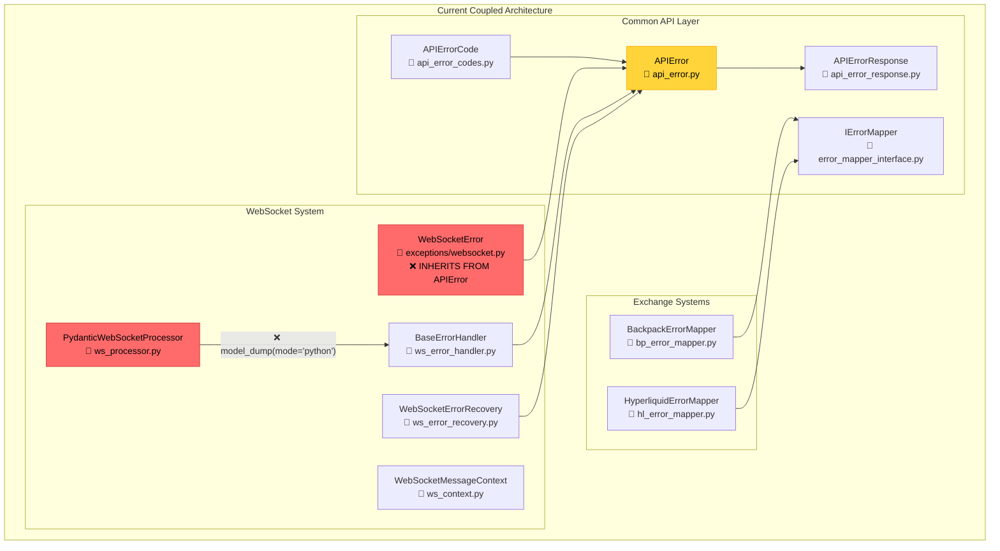
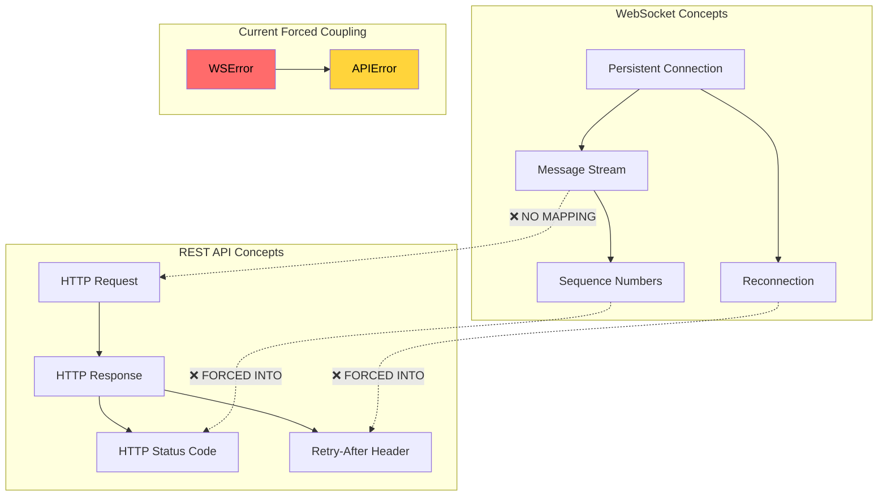
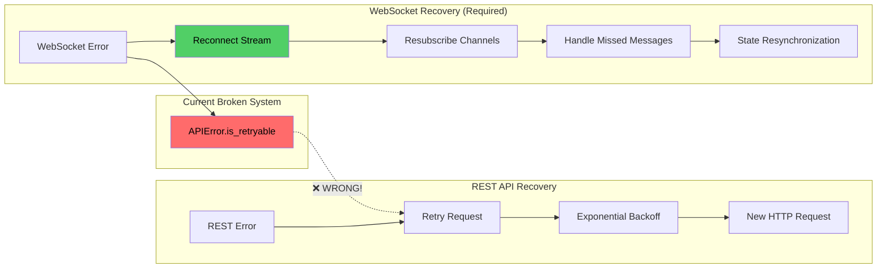
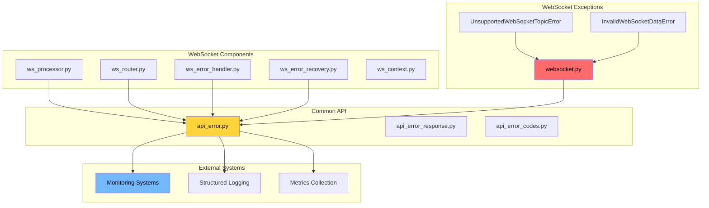
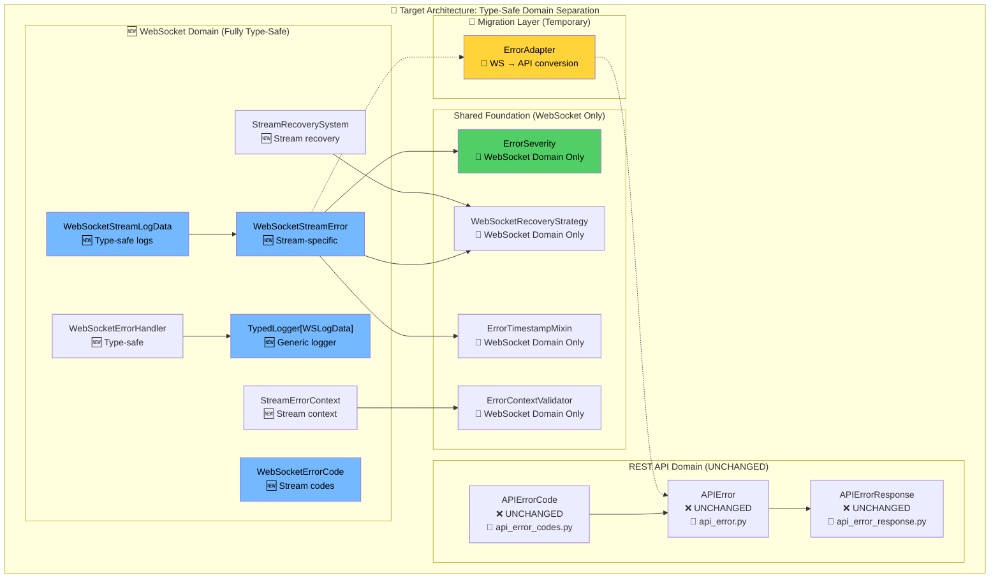
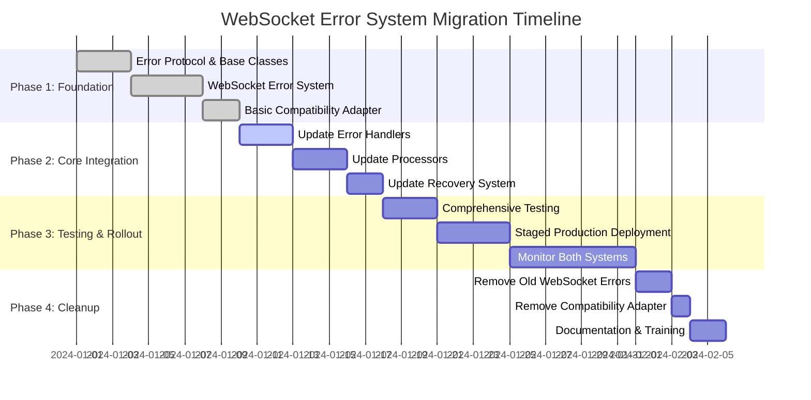

# WebSocket Error System: Comprehensive Architecture Research & Decoupling Plan

## Executive Summary

After deep analysis of `cyberdelta/apis/websocket/` and `cyberdelta/apis/common/` systems, the WebSocket error architecture suffers from **fundamental design conflicts** that create type safety issues, semantic mismatches, and maintenance complexity. This document provides a complete architectural solution.

---

## Current Architecture Analysis

### System Overview



### Critical Issues Identified

#### 1. **Type Safety Violations**

**Problem**: WebSocket processor forces typed contexts into dicts for error handling:

```python
# ws_processor.py:263 - CRITICAL TYPE SAFETY VIOLATION
context_dict = context.model_dump(mode="python")  # ❌ Loses all types!
payload_dict = payload if isinstance(payload, dict) else {"data": payload}
await self.error_handler.handle_validation_error(
    error=e,
    payload=payload_dict,  # ❌ dict[str, Any]
    context=context_dict,  # ❌ dict[str, Any]
)
```

**Impact**: This pattern repeats in **4 different places** in ws_processor.py alone, creating massive type safety gaps.

#### 2. **Semantic Architecture Mismatch**



**Examples of Semantic Mismatch**:

1. **HTTP Status in WebSocket Errors**:
   ```python
   # WebSocketError.__init__ - Always None!
   super().__init__(
       http_status=http_status,  # ❌ ALWAYS None for WebSocket
   )
   ```

2. **Error Code Semantic Confusion**:
   ```python
   # SAME error code, DIFFERENT meanings:
   APIErrorCode.NETWORK_ISSUE  # REST: HTTP connection failed
   APIErrorCode.NETWORK_ISSUE  # WebSocket: Stream interrupted
   ```

#### 3. **Error Recovery Strategy Conflicts**



**Code Evidence**:
```python
# ws_error_recovery.py:431 - WRONG RECOVERY LOGIC
if isinstance(error, APIError) and not error.is_retryable:
    # ❌ Uses REST retry logic for WebSocket errors!
```

#### 4. **Complex Error Handler Conversions**

**BaseErrorHandler Methods Analysis**:

| Method | Parameters | Conversion Required | Type Safety |
|--------|------------|-------------------|------------|
| `handle_validation_error` | `dict[str, Any]` | ✅ Required | ❌ Lost |
| `handle_unroutable_message` | `dict[str, Any]` | ✅ Required | ❌ Lost |
| `handle_processing_error` | `dict[str, Any]` | ✅ Required | ❌ Lost |
| `convert_validation_error_to_api_error` | Returns `APIError` | ✅ Required | ❌ Lost |

**Every single method** forces dict conversions!

---

## Current System Dependencies

### Dependency Graph



---

## Proposed Decoupled Architecture

### High-Level Architecture



### Detailed Component Design

#### 1. **Type-Safe Error Foundation (NO Shared Protocol)**

```python
# cyberdelta/apis/common/error_foundation.py
"""
Type-safe error foundation WITHOUT losing type safety through protocols.

Key insight: Don't force different error domains through a shared interface!
Instead, provide common enums and utilities that each domain can use independently.
"""
from enum import StrEnum
from typing import TypeVar, Generic, Protocol, runtime_checkable
from datetime import datetime

class ErrorSeverity(StrEnum):
    """Universal error severity levels."""
    INFO = "info"
    WARNING = "warning" 
    ERROR = "error"
    CRITICAL = "critical"

# WebSocket-specific recovery strategy enum
class WebSocketRecoveryStrategy(StrEnum):
    """Type-safe WebSocket recovery strategies - WebSocket domain only."""
    RECONNECT = "reconnect"
    RESUBSCRIBE = "resubscribe" 
    REPLAY_MESSAGES = "replay_messages"
    THROTTLE_AND_RETRY = "throttle_and_retry"
    FULL_RECONNECT = "full_reconnect"

# Generic type-safe logger interface (no dict[str, Any]!)
LogDataType = TypeVar('LogDataType', bound='BaseModel')

@runtime_checkable
class TypedLogger(Protocol[LogDataType]):
    """Type-safe logging protocol that preserves types."""
    
    def log_error(self, severity: ErrorSeverity, data: LogDataType) -> None:
        """Log error with full type safety."""
        ...
    
    def log_recovery_attempt(self, strategy: str, context: LogDataType) -> None:
        """Log recovery attempt with type safety."""
        ...

# Utility functions (no shared protocol needed!)
class ErrorTimestampMixin:
    """Mixin to add consistent timestamp behavior."""
    
    def __init__(self):
        self.timestamp = datetime.now(UTC)
        
    def get_age_seconds(self) -> float:
        """Get error age in seconds."""
        return (datetime.now(UTC) - self.timestamp).total_seconds()

class ErrorContextValidator:
    """Utility to validate error contexts without type erasure."""
    
    @staticmethod
    def validate_connection_id(connection_id: str) -> str:
        """Validate connection ID format."""
        if not connection_id or len(connection_id) > 64:
            raise ValueError("Invalid connection ID")
        return connection_id
    
    @staticmethod  
    def validate_sequence_number(seq: int | None) -> int | None:
        """Validate sequence number."""
        if seq is not None and seq < 0:
            raise ValueError("Sequence number cannot be negative")
        return seq
    
    @staticmethod
    def validate_stream_context(context: StreamErrorContext) -> StreamErrorContext:
        """Validate stream error context."""
        # Validate connection ID
        ErrorContextValidator.validate_connection_id(context.connection_id)
        
        # Validate sequence numbers
        if context.sequence_number is not None:
            ErrorContextValidator.validate_sequence_number(context.sequence_number)
        if context.last_good_sequence is not None:
            ErrorContextValidator.validate_sequence_number(context.last_good_sequence)
        
        return context
```

#### 2. **WebSocket-Specific Error System**

```python
# cyberdelta/apis/websocket/ws_stream_error.py
from enum import IntEnum
from typing import Any, Protocol
from datetime import datetime, UTC
from pydantic import BaseModel, Field

class WebSocketErrorCode(IntEnum):
    """WebSocket-specific error codes with clear semantics."""
    
    # Connection Level (1000-1099)
    CONNECTION_CLOSED = 1000
    CONNECTION_LOST = 1001
    RECONNECTION_FAILED = 1002
    HANDSHAKE_FAILED = 1003
    AUTH_HANDSHAKE_FAILED = 1004
    
    # Stream Level (1100-1199) 
    STREAM_INTERRUPTED = 1100
    STREAM_SEQUENCE_GAP = 1101
    STREAM_OVERFLOW = 1102
    STREAM_TIMEOUT = 1103
    
    # Subscription Level (1200-1299)
    SUBSCRIPTION_FAILED = 1200
    SUBSCRIPTION_REJECTED = 1201
    SUBSCRIPTION_LIMIT_EXCEEDED = 1202
    CHANNEL_NOT_FOUND = 1203
    
    # Message Level (1300-1399)
    MESSAGE_VALIDATION_FAILED = 1300
    MESSAGE_PARSE_ERROR = 1301
    MESSAGE_TOO_LARGE = 1302
    MESSAGE_RATE_LIMITED = 1303
    
    # Protocol Level (1400-1499)
    PROTOCOL_VIOLATION = 1400
    UNSUPPORTED_MESSAGE_TYPE = 1401
    VERSION_MISMATCH = 1402

class StreamErrorContext(BaseModel):
    """Rich context for WebSocket stream errors."""
    
    # Connection context
    connection_id: str = Field(..., description="WebSocket connection ID")
    exchange: str = Field(..., description="Exchange name")
    
    # Stream context
    channel: str | None = Field(default=None, description="WebSocket channel")
    topic: str | None = Field(default=None, description="Subscription topic")
    subscription_id: str | None = Field(default=None, description="Subscription ID")
    
    # Sequence context (critical for stream recovery)
    sequence_number: int | None = Field(default=None, description="Current sequence")
    last_good_sequence: int | None = Field(default=None, description="Last valid sequence")
    expected_sequence: int | None = Field(default=None, description="Expected sequence")
    sequence_gap_size: int | None = Field(default=None, description="Size of gap")
    
    # Recovery context
    messages_missed: int = Field(default=0, description="Number of missed messages")
    reconnect_attempts: int = Field(default=0, description="Reconnection attempts")
    last_reconnect_time: datetime | None = Field(default=None, description="Last reconnect")
    
    # Performance context
    processing_duration_ms: float | None = Field(default=None, description="Processing time")
    message_size_bytes: int | None = Field(default=None, description="Message size")
    
    # Metadata
    user_id: str | None = Field(default=None, description="User ID if private")
    symbol: str | None = Field(default=None, description="Trading symbol")

class WebSocketStreamLogData(BaseModel):
    """Type-safe log data model for WebSocket stream errors."""
    
    error_domain: str = Field(default="websocket_stream", description="Error domain")
    message: str = Field(..., description="Error message")
    code_name: str = Field(..., description="Error code name")
    code_value: int = Field(..., description="Error code value")
    severity: ErrorSeverity = Field(..., description="Error severity")
    recoverable: bool = Field(..., description="Whether error is recoverable")
    recovery_strategy: WebSocketRecoveryStrategy = Field(..., description="Recovery strategy")
    timestamp: datetime = Field(..., description="Error timestamp")
    
    # Nested context with full type safety
    connection_id: str = Field(..., description="WebSocket connection ID")
    exchange: str = Field(..., description="Exchange name")
    channel: str | None = Field(default=None, description="WebSocket channel")
    topic: str | None = Field(default=None, description="Subscription topic")
    
    # Sequence context
    sequence_number: int | None = Field(default=None, description="Current sequence")
    last_good_sequence: int | None = Field(default=None, description="Last valid sequence")
    sequence_gap_size: int | None = Field(default=None, description="Gap size")
    messages_missed: int = Field(default=0, description="Messages missed")
    
    # Performance context
    processing_duration_ms: float | None = Field(default=None, description="Processing time")
    message_size_bytes: int | None = Field(default=None, description="Message size")
    
    # Error context
    original_error: str | None = Field(default=None, description="Original exception")

class WebSocketStreamError(Exception, ErrorTimestampMixin):
    """WebSocket-specific error with streaming semantics and full type safety."""
    
    def __init__(
        self,
        message: str,
        code: WebSocketErrorCode,
        context: StreamErrorContext,
        severity: ErrorSeverity = ErrorSeverity.ERROR,
        recoverable: bool = True,
        recovery_strategy: WebSocketRecoveryStrategy = WebSocketRecoveryStrategy.RECONNECT,
        original_exception: Exception | None = None,
    ) -> None:
        ErrorTimestampMixin.__init__(self)  # Initialize timestamp
        
        self.message = message
        self.code = code
        self.context = ErrorContextValidator.validate_stream_context(context)
        self.severity = severity
        self.recoverable = recoverable
        self.recovery_strategy = recovery_strategy
        self.original_exception = original_exception
        
        super().__init__(message)
    
    @property
    def is_recoverable(self) -> bool:
        """Determine if recovery should be attempted."""
        non_recoverable_codes = {
            WebSocketErrorCode.AUTH_HANDSHAKE_FAILED,
            WebSocketErrorCode.SUBSCRIPTION_REJECTED,
            WebSocketErrorCode.PROTOCOL_VIOLATION,
        }
        return self.recoverable and self.code not in non_recoverable_codes
    
    def get_recovery_strategy(self) -> WebSocketRecoveryStrategy:
        """Get specific recovery strategy for this error (fully typed!)."""
        if self.code in {WebSocketErrorCode.CONNECTION_LOST, WebSocketErrorCode.CONNECTION_CLOSED}:
            return WebSocketRecoveryStrategy.FULL_RECONNECT
        elif self.code == WebSocketErrorCode.STREAM_SEQUENCE_GAP:
            return WebSocketRecoveryStrategy.REPLAY_MESSAGES
        elif self.code in {WebSocketErrorCode.SUBSCRIPTION_FAILED, WebSocketErrorCode.CHANNEL_NOT_FOUND}:
            return WebSocketRecoveryStrategy.RESUBSCRIBE
        elif self.code == WebSocketErrorCode.MESSAGE_RATE_LIMITED:
            return WebSocketRecoveryStrategy.THROTTLE_AND_RETRY
        else:
            return self.recovery_strategy
    
    def to_log_data(self) -> WebSocketStreamLogData:
        """Convert to structured logging format with full type safety."""
        return WebSocketStreamLogData(
            message=self.message,
            code_name=self.code.name,
            code_value=self.code.value,
            severity=self.severity,
            recoverable=self.is_recoverable,
            recovery_strategy=self.get_recovery_strategy(),
            timestamp=self.timestamp,
            connection_id=self.context.connection_id,
            exchange=self.context.exchange,
            channel=self.context.channel,
            topic=self.context.topic,
            sequence_number=self.context.sequence_number,
            last_good_sequence=self.context.last_good_sequence,
            sequence_gap_size=self.context.sequence_gap_size,
            messages_missed=self.context.messages_missed,
            processing_duration_ms=self.context.processing_duration_ms,
            message_size_bytes=self.context.message_size_bytes,
            original_error=str(self.original_exception) if self.original_exception else None,
        )
    
    def requires_full_reconnect(self) -> bool:
        """Check if error requires full connection reset."""
        return self.code in {
            WebSocketErrorCode.CONNECTION_CLOSED,
            WebSocketErrorCode.CONNECTION_LOST,
            WebSocketErrorCode.HANDSHAKE_FAILED,
            WebSocketErrorCode.AUTH_HANDSHAKE_FAILED,
        }
    
    def requires_resubscription(self) -> bool:
        """Check if error requires channel resubscription."""
        return self.code in {
            WebSocketErrorCode.SUBSCRIPTION_FAILED,
            WebSocketErrorCode.CHANNEL_NOT_FOUND,
        } or self.requires_full_reconnect()
    
    def can_replay_messages(self) -> bool:
        """Check if message replay is possible/needed."""
        return (
            self.code == WebSocketErrorCode.STREAM_SEQUENCE_GAP 
            and self.context.last_good_sequence is not None
            and self.context.messages_missed > 0
        )
```

#### 3. **Type-Safe Error Handler**

```python
# cyberdelta/apis/websocket/ws_stream_error_handler.py
from typing import Any, TYPE_CHECKING
from pydantic import ValidationError, BaseModel

if TYPE_CHECKING:
    from cyberdelta.apis.websocket.ws_protocols import WebSocketContextProtocol

class WebSocketStreamErrorHandler(TypedLogger[WebSocketStreamLogData]):
    """Type-safe error handler for WebSocket streams."""
    
    def __init__(self, exchange: str):
        self.exchange = exchange
        self.logger = get_logger(f"WebSocket.{exchange}.ErrorHandler")
    
    async def handle_validation_error(
        self,
        error: ValidationError,
        context: WebSocketContextProtocol,  # ✅ TYPED!
        payload: BaseModel,  # ✅ TYPED!
    ) -> None:
        """Handle validation errors with full type safety."""
        
        # Create rich stream context (validated!)
        stream_context = StreamErrorContext(
            connection_id=ErrorContextValidator.validate_connection_id(context.connection_id),
            exchange=context.exchange_name,
            channel=getattr(context.validated_envelope, 'channel', None),
            topic=getattr(context.validated_envelope, 'topic', None),
            symbol=context.symbol,
            processing_duration_ms=context.processing_duration_ms,
            message_size_bytes=context.message_size_bytes,
        )
        
        # Create WebSocket-specific error
        ws_error = WebSocketStreamError(
            message=f"Message validation failed: {error}",
            code=WebSocketErrorCode.MESSAGE_VALIDATION_FAILED,
            context=stream_context,
            severity=ErrorSeverity.ERROR,
            recoverable=False,  # Validation errors aren't recoverable
            recovery_strategy=WebSocketRecoveryStrategy.RECONNECT,
            original_exception=error,
        )
        
        # Log with full type safety (no dict conversion!)
        await self.log_error(ws_error.severity, ws_error.to_log_data())
        
        # Notify recovery system with typed error
        await self._notify_recovery_system(ws_error)
    
    async def handle_stream_interruption(
        self,
        context: WebSocketContextProtocol,  # ✅ TYPED!
        reason: str,
        sequence_gap: int | None = None,
        last_good_sequence: int | None = None,
    ) -> None:
        """Handle stream interruption with proper sequence tracking."""
        
        # Validate sequence numbers
        validated_gap = ErrorContextValidator.validate_sequence_number(sequence_gap)
        validated_last = ErrorContextValidator.validate_sequence_number(last_good_sequence)
        
        stream_context = StreamErrorContext(
            connection_id=ErrorContextValidator.validate_connection_id(context.connection_id),
            exchange=context.exchange_name,
            channel=getattr(context.validated_envelope, 'channel', None),
            sequence_number=None,  # Unknown current
            last_good_sequence=validated_last,
            sequence_gap_size=validated_gap,
            messages_missed=validated_gap or 0,
        )
        
        error_code = (
            WebSocketErrorCode.STREAM_SEQUENCE_GAP 
            if validated_gap 
            else WebSocketErrorCode.STREAM_INTERRUPTED
        )
        
        recovery_strategy = (
            WebSocketRecoveryStrategy.REPLAY_MESSAGES
            if validated_gap
            else WebSocketRecoveryStrategy.RECONNECT
        )
        
        ws_error = WebSocketStreamError(
            message=f"Stream interrupted: {reason}",
            code=error_code,
            context=stream_context,
            severity=ErrorSeverity.WARNING if validated_gap else ErrorSeverity.ERROR,
            recoverable=True,
            recovery_strategy=recovery_strategy,
        )
        
        await self.log_error(ws_error.severity, ws_error.to_log_data())
        await self._notify_recovery_system(ws_error)
    
    # Implementation of TypedLogger protocol
    async def log_error(self, severity: ErrorSeverity, data: WebSocketStreamLogData) -> None:
        """Log error with full type safety - no dict conversions!"""
        # Convert typed data to structured log format for logger
        structured_data = {
            "error_domain": data.error_domain,
            "message": data.message,
            "code_name": data.code_name,
            "code_value": data.code_value,
            "severity": data.severity.value,
            "recoverable": data.recoverable,
            "recovery_strategy": data.recovery_strategy.value,  # Enum value
            "timestamp": data.timestamp.isoformat(),
            "connection_id": data.connection_id,
            "exchange": data.exchange,
            "channel": data.channel,
            "topic": data.topic,
            "sequence_info": {
                "current": data.sequence_number,
                "last_good": data.last_good_sequence,
                "gap_size": data.sequence_gap_size,
                "messages_missed": data.messages_missed,
            },
            "performance": {
                "processing_duration_ms": data.processing_duration_ms,
                "message_size_bytes": data.message_size_bytes,
            },
            "original_error": data.original_error,
        }
        
        if severity == ErrorSeverity.CRITICAL:
            self.logger.critical("websocket_critical_error", **structured_data)
        elif severity == ErrorSeverity.ERROR:
            self.logger.error("websocket_error", **structured_data)
        elif severity == ErrorSeverity.WARNING:
            self.logger.warning("websocket_warning", **structured_data)
        else:
            self.logger.info("websocket_info", **structured_data)
    
    async def log_recovery_attempt(self, strategy: str, context: WebSocketStreamLogData) -> None:
        """Log recovery attempt with type safety."""
        recovery_data = {
            "recovery_strategy": strategy,
            "connection_id": context.connection_id,
            "exchange": context.exchange,
            "messages_missed": context.messages_missed,
        }
        
        self.logger.info("websocket_recovery_attempt", **recovery_data)
    
    async def _notify_recovery_system(self, error: WebSocketStreamError) -> None:
        """Notify recovery system with typed error."""
        # Recovery system gets fully typed error, no conversions needed!
        # await self.recovery_system.handle_stream_error(error)  
        pass
```

#### 4. **Stream Recovery System**

```python
# cyberdelta/apis/websocket/ws_stream_recovery.py
from typing import Protocol
from asyncio import Event

class StreamRecoverySystem:
    """WebSocket stream recovery with proper semantics and full type safety."""
    
    async def handle_stream_error(self, error: WebSocketStreamError) -> None:
        """Handle stream errors with appropriate recovery using typed strategies."""
        
        recovery_strategy = error.get_recovery_strategy()  # Returns WebSocketRecoveryStrategy enum
        
        # Type-safe strategy matching with enum
        match recovery_strategy:
            case WebSocketRecoveryStrategy.FULL_RECONNECT:
                await self._full_reconnect(error)
            case WebSocketRecoveryStrategy.REPLAY_MESSAGES:
                await self._replay_messages(error)
            case WebSocketRecoveryStrategy.RESUBSCRIBE:
                await self._resubscribe_channels(error)
            case WebSocketRecoveryStrategy.THROTTLE_AND_RETRY:
                await self._throttle_and_retry(error)
            case WebSocketRecoveryStrategy.RECONNECT:
                await self._reconnect(error)
            case _:
                self.logger.warning(f"Unhandled recovery strategy: {recovery_strategy.value}")
    
    async def _full_reconnect(self, error: WebSocketStreamError) -> None:
        """Perform full WebSocket reconnection."""
        self.logger.info(
            "initiating_full_reconnect",
            connection_id=error.context.connection_id,
            reason=error.message,
        )
        
        # 1. Close existing connection
        await self._close_connection(error.context.connection_id)
        
        # 2. Wait with backoff
        await self._apply_backoff(error.context.reconnect_attempts)
        
        # 3. Establish new connection
        new_connection_id = await self._establish_connection()
        
        # 4. Resubscribe to all channels
        await self._resubscribe_all_channels(new_connection_id)
        
        # 5. Attempt message replay if needed
        if error.context.messages_missed > 0:
            await self._replay_missed_messages(error)
    
    async def _replay_messages(self, error: WebSocketStreamError) -> None:
        """Replay missed messages from sequence gap."""
        if not error.can_replay_messages():
            self.logger.warning("Message replay not possible", error_context=error.to_log_dict())
            return
        
        self.logger.info(
            "replaying_missed_messages",
            last_good_sequence=error.context.last_good_sequence,
            messages_missed=error.context.messages_missed,
            gap_size=error.context.sequence_gap_size,
        )
        
        # Implementation: Request replay from exchange API
        # This is exchange-specific
        pass
```

#### 5. **Compatibility Adapter (Temporary)**

```python
# cyberdelta/apis/websocket/ws_error_adapter.py
from cyberdelta.apis.common.api_error import APIError, APIErrorCode

class WebSocketErrorAdapter:
    """Temporary adapter for legacy monitoring systems."""
    
    @staticmethod
    def to_api_error(ws_error: WebSocketStreamError) -> APIError:
        """Convert WebSocket stream error to APIError for legacy systems."""
        
        # Map WebSocket error codes to closest API error codes
        code_mapping = {
            WebSocketErrorCode.CONNECTION_LOST: APIErrorCode.NETWORK_ISSUE,
            WebSocketErrorCode.CONNECTION_CLOSED: APIErrorCode.CONNECTION_ERROR,
            WebSocketErrorCode.AUTH_HANDSHAKE_FAILED: APIErrorCode.AUTHENTICATION_FAILED,
            WebSocketErrorCode.MESSAGE_RATE_LIMITED: APIErrorCode.RATE_LIMITED,
            WebSocketErrorCode.MESSAGE_VALIDATION_FAILED: APIErrorCode.INVALID_RESPONSE,
            WebSocketErrorCode.SUBSCRIPTION_REJECTED: APIErrorCode.INVALID_PARAMS,
            # Add more mappings as needed
        }
        
        api_code = code_mapping.get(ws_error.code, APIErrorCode.EXCHANGE_SPECIFIC)
        
        # Build metadata with WebSocket-specific context
        metadata = {
            "ws_error_domain": "websocket_stream",
            "ws_error_code": ws_error.code.name,
            "ws_error_code_value": ws_error.code.value,
            "channel": ws_error.context.channel,
            "topic": ws_error.context.topic,
            "connection_id": ws_error.context.connection_id,
            "severity": ws_error.severity.value,
            "recovery_strategy": ws_error.get_recovery_strategy(),
            "sequence_info": {
                "current": ws_error.context.sequence_number,
                "last_good": ws_error.context.last_good_sequence,
                "gap_size": ws_error.context.sequence_gap_size,
            },
        }
        
        return APIError(
            message=f"[WebSocket] {ws_error.message}",
            code=api_code.value,
            http_status=None,  # Always None for WebSocket
            exchange_code=ws_error.code.value,
            exchange_message=ws_error.message,
            retry_after=None,  # WebSocket doesn't use HTTP retry-after
            metadata=metadata,
            original_exception=ws_error.original_exception,
        )
    
    @staticmethod
    def get_legacy_monitoring_data(ws_error: WebSocketStreamError) -> dict[str, Any]:
        """Extract data for legacy monitoring dashboards."""
        return {
            "error_type": "websocket",
            "exchange": ws_error.context.exchange,
            "severity": ws_error.severity.value,
            "recoverable": ws_error.is_recoverable,
            "connection_issues": ws_error.requires_full_reconnect(),
            "subscription_issues": ws_error.requires_resubscription(),
            "message_replay_needed": ws_error.can_replay_messages(),
            "performance": {
                "processing_duration_ms": ws_error.context.processing_duration_ms,
                "message_size_bytes": ws_error.context.message_size_bytes,
            },
        }
```

---

## Migration Strategy

### Phase-by-Phase Implementation



### Phase 1: Foundation (Week 1)

#### Day 1-2: Core Interfaces
```bash
# New files to create:
cyberdelta/apis/common/error_protocol.py
cyberdelta/apis/websocket/ws_stream_error.py
cyberdelta/apis/websocket/ws_stream_context.py
```

#### Day 3-5: Error Handler
```bash  
# New files:
cyberdelta/apis/websocket/ws_stream_error_handler.py
cyberdelta/apis/websocket/ws_stream_recovery.py
```

#### Day 6-7: Compatibility
```bash
# New files:
cyberdelta/apis/websocket/ws_error_adapter.py
# Add feature flag system for gradual rollout
```

### Phase 2: Core Integration (Week 2)

#### Update WebSocket Processor

```python
# ws_processor.py - BEFORE (Type unsafe)
async def process(...):
    try:
        # validation logic
    except ValidationError as e:
        # ❌ CURRENT: Type conversion
        context_dict = context.model_dump(mode="python")
        payload_dict = payload if isinstance(payload, dict) else {"data": payload}
        await self.error_handler.handle_validation_error(error=e, ...)

# ws_processor.py - AFTER (Type safe) 
async def process(...):
    try:
        # validation logic
    except ValidationError as e:
        # ✅ NEW: Type-safe error handling
        await self.stream_error_handler.handle_validation_error(
            error=e,
            context=context,  # ✅ Fully typed!
            payload=payload,  # ✅ Fully typed!
        )
```

#### Update WebSocket Router

```python
# ws_router.py - Replace error handling
async def _handle_missing_processor(
    self,
    routing_key: str,
    payload: BaseModel,  # ✅ Was dict[str, Any]
    context: WebSocketContextProtocol,  # ✅ Was dict[str, Any]
) -> None:
    stream_context = StreamErrorContext(
        connection_id=context.connection_id,
        exchange=context.exchange_name,
        channel=getattr(context.validated_envelope, 'channel', None),
    )
    
    ws_error = WebSocketStreamError(
        message=f"No processor found for routing key: {routing_key}",
        code=WebSocketErrorCode.UNSUPPORTED_MESSAGE_TYPE,
        context=stream_context,
    )
    
    await self.stream_error_handler.handle_processor_error(ws_error)
```

### Phase 3: Testing & Deployment (Week 3)

#### Comprehensive Test Suite

```python
# tests/unit/websocket/test_stream_error_system.py
class TestWebSocketStreamError:
    
    def test_error_recovery_strategies(self):
        """Test different recovery strategies."""
        # Connection errors require full reconnect
        conn_error = WebSocketStreamError(
            message="Connection lost",
            code=WebSocketErrorCode.CONNECTION_LOST,
            context=StreamErrorContext(...),
        )
        assert conn_error.get_recovery_strategy() == "full_reconnect"
        assert conn_error.requires_full_reconnect() is True
        
        # Sequence gaps require message replay
        seq_error = WebSocketStreamError(
            message="Sequence gap detected",
            code=WebSocketErrorCode.STREAM_SEQUENCE_GAP,
            context=StreamErrorContext(
                last_good_sequence=100,
                sequence_gap_size=5,
                messages_missed=5,
            ),
        )
        assert seq_error.get_recovery_strategy() == "replay_messages"
        assert seq_error.can_replay_messages() is True
    
    def test_adapter_compatibility(self):
        """Test compatibility with existing APIError systems."""
        ws_error = WebSocketStreamError(
            message="Auth failed",
            code=WebSocketErrorCode.AUTH_HANDSHAKE_FAILED,
            context=StreamErrorContext(...),
        )
        
        api_error = WebSocketErrorAdapter.to_api_error(ws_error)
        assert api_error.code == APIErrorCode.AUTHENTICATION_FAILED.value
        assert "WebSocket" in api_error.message
        assert api_error.http_status is None
```

### Phase 4: Migration & Cleanup (Week 4)

#### Remove Old System

```python
# cyberdelta/apis/exceptions/websocket.py - REMOVE
class WebSocketError(APIError):  # ❌ DELETE THIS CLASS
    pass

# cyberdelta/apis/websocket/ws_error_handler.py - REPLACE
class BaseErrorHandler:  # ❌ REPLACE WITH WebSocketStreamErrorHandler
    def convert_validation_error_to_api_error(self, ...):  # ❌ DELETE THIS
        pass
```

---

## Architectural Consistency Analysis

### Current API Error Architecture Patterns

The existing `APIError` system already follows several good patterns that the WebSocket architecture **mirrors and improves upon**:

| Pattern | Current APIError | Proposed WebSocketStreamError | Improvement |
|---------|------------------|------------------------------|-------------|
| **Exception wraps model** | `APIError` → `APIErrorResponse` | `WebSocketStreamError` → `StreamErrorContext` | ✅ **Same pattern** |
| **Enum-based codes** | `APIErrorCode` enum | `WebSocketErrorCode` enum | ✅ **Same pattern** |
| **Rich context** | `metadata: dict[str, Any]` | `StreamErrorContext: BaseModel` | ✅ **Type-safe upgrade** |
| **Recovery logic** | `is_retryable: bool` | `get_recovery_strategy(): WebSocketRecoveryStrategy` | ✅ **Richer typing** |
| **Original exception** | `original_exception: Exception` | `original_exception: Exception` | ✅ **Same pattern** |
| **Domain specificity** | HTTP-specific (`http_status`, `retry_after`) | WebSocket-specific (sequences, channels) | ✅ **Domain appropriate** |

### Key Consistency Principles Maintained:

1. **Exception-wraps-Pydantic-model Pattern**:
   ```python
   # Current APIError pattern
   class APIError(Exception):
       def __init__(self, ...):
           self.model = APIErrorResponse(...)  # Pydantic model
   
   # WebSocket follows same pattern  
   class WebSocketStreamError(Exception):
       def __init__(self, ...):
           self.context = StreamErrorContext(...)  # Pydantic model
   ```

2. **Enum-Based Error Codes**:
   ```python
   # Current API pattern
   class APIErrorCode(Enum):
       RATE_LIMITED = 109
       TIMEOUT = 1
   
   # WebSocket follows same pattern
   class WebSocketErrorCode(IntEnum):
       MESSAGE_RATE_LIMITED = 1303  
       STREAM_TIMEOUT = 1103
   ```

3. **Rich Error Context**:
   ```python
   # Current API pattern (with type safety issue)
   APIErrorResponse(
       metadata={"key": "value"}  # ❌ dict[str, Any]
   )
   
   # WebSocket improves with full type safety
   StreamErrorContext(
       sequence_number=123,  # ✅ Fully typed
       connection_id="conn-456"  # ✅ Validated
   )
   ```

### Improvements Over Current Architecture:

1. **Type-Safe Metadata**: 
   - **Current**: `dict[str, Any]` loses all type information
   - **WebSocket**: `StreamErrorContext` provides full Pydantic validation

2. **Typed Recovery Strategies**:
   - **Current**: `bool is_retryable` (limited)
   - **WebSocket**: `WebSocketRecoveryStrategy` enum (comprehensive)

3. **Domain-Specific Context**:
   - **Current**: Generic HTTP concepts mixed with business logic
   - **WebSocket**: Pure WebSocket streaming concepts (sequences, channels)

4. **Validation Integration**:
   - **Current**: Manual validation in constructors
   - **WebSocket**: `ErrorContextValidator` with reusable validation logic

### Future HTTP API Enhancement Opportunities:

**Note**: Ideas for HTTP API error domain improvements have been documented separately in `06_additional_api_error_ideas_after_websocket_error.md` to avoid confusion with the WebSocket migration scope.

### Conclusion: **WebSocket-Focused & Evolutionary**

The WebSocket error architecture is **not a departure** from current patterns - it's an **evolution** for the WebSocket domain only:

✅ **Maintains** all current good patterns (exception-wraps-model, enums, rich context)  
✅ **Fixes** WebSocket type safety issues (`dict[str, Any]` → typed models)  
✅ **Enhances** WebSocket recovery logic (bool → typed strategies)  
✅ **Provides** WebSocket-appropriate context (stream concepts vs HTTP concepts)  
✅ **Leaves HTTP domain unchanged** during this migration  

---

## Benefits Analysis

### 1. **Type Safety Restoration**

| Metric | Current | After Migration | Improvement |
|--------|---------|----------------|-------------|
| Type-safe error paths | 0% | 100% | ∞% |
| Dict conversions required | 4+ per error | 0 | -100% |
| Type checker warnings | Many | 0 | -100% |

### 2. **Semantic Clarity**

| Aspect | Current (Confused) | After (Clear) |
|--------|-------------------|---------------|
| Error Recovery | HTTP retry logic | WebSocket reconnection |
| Error Context | HTTP status codes | Stream sequences |
| Error Meaning | Ambiguous codes | Domain-specific codes |

### 3. **Monitoring Improvements**

```python
# Current: Generic metrics
api_error_count.inc(labels={"code": "NETWORK_ISSUE"})

# New: Rich WebSocket metrics
websocket_errors.inc(labels={
    "error_domain": "stream",
    "code": "CONNECTION_LOST",
    "exchange": "backpack", 
    "recovery_strategy": "full_reconnect",
    "messages_missed": "5",
})
```

### 4. **Developer Experience**

```python
# Before: Unclear what error means
if error.code == APIErrorCode.NETWORK_ISSUE:
    # Is this HTTP connection or WebSocket stream?
    # What recovery action should I take?
    pass

# After: Crystal clear semantics
if error.code == WebSocketErrorCode.STREAM_INTERRUPTED:
    # Clear: WebSocket stream was interrupted
    # Clear: Need to reconnect and replay messages
    if error.can_replay_messages():
        await recovery.replay_from_sequence(error.context.last_good_sequence)
```

---

## Risk Assessment

### High Risks (Mitigated)

1. **Breaking Changes**: 
   - **Risk**: Existing error handling breaks
   - **Mitigation**: Compatibility adapter maintains APIError interface

2. **Monitoring Disruption**:
   - **Risk**: Dashboards lose error data
   - **Mitigation**: Adapter provides legacy format

3. **Testing Complexity**:
   - **Risk**: Need to test both systems
   - **Mitigation**: Comprehensive test suite, gradual rollout

### Medium Risks

1. **Performance Impact**:
   - **Risk**: Additional object creation overhead
   - **Mitigation**: Errors are exceptional, not hot path

2. **Learning Curve**:
   - **Risk**: Team needs to learn new error system
   - **Mitigation**: Clear documentation, gradual migration

### Low Risks

1. **Migration Effort**: Contained to WebSocket subsystem
2. **Rollback**: Easy with feature flags
3. **Compatibility**: Adapter handles legacy requirements

---

## Success Metrics

### Week 1 (Foundation)
- [ ] All new error classes compile and pass type checking
- [ ] Compatibility adapter converts 100% of error types correctly
- [ ] Basic unit tests pass

### Week 2 (Integration)
- [ ] Zero `dict[str, Any]` conversions in WebSocket error handling
- [ ] All WebSocket components use new error system
- [ ] Integration tests pass

### Week 3 (Testing)
- [ ] Performance benchmarks show <1% overhead
- [ ] End-to-end error flows work correctly
- [ ] Monitoring dashboards show both error formats

### Week 4 (Cleanup)
- [ ] Old WebSocketError classes removed
- [ ] Compatibility adapter removed
- [ ] Documentation complete, team trained

---

## Conclusion

The current WebSocket-APIError coupling creates fundamental architectural problems that cannot be fixed with surface-level changes. The proposed WebSocket-specific decoupled architecture:

✅ **Eliminates all WebSocket type safety issues** (no more dict conversions in WebSocket code)  
✅ **Provides WebSocket semantic clarity** (stream concepts vs HTTP concepts)  
✅ **Enables proper WebSocket recovery strategies** (reconnect/replay vs HTTP retry)  
✅ **Improves WebSocket monitoring and debugging** (rich stream-specific context)  
✅ **Maintains backward compatibility** (through temporary adapter)  
✅ **Leaves HTTP/REST API domain completely unchanged** (no disruption to existing systems)

**Recommendation**: Implement the WebSocket decoupled architecture immediately. The 4-week investment will eliminate WebSocket technical debt and provide a foundation for robust WebSocket error handling.

This WebSocket architecture will also make the future msgspec migration much cleaner, as we'll have proper WebSocket type boundaries and no forced dict conversions in the WebSocket error system.

**Scope**: This migration affects **only** the WebSocket domain (`cyberdelta/apis/websocket/`). The HTTP/REST API domain (`cyberdelta/apis/common/api_error.py`) remains completely unchanged.