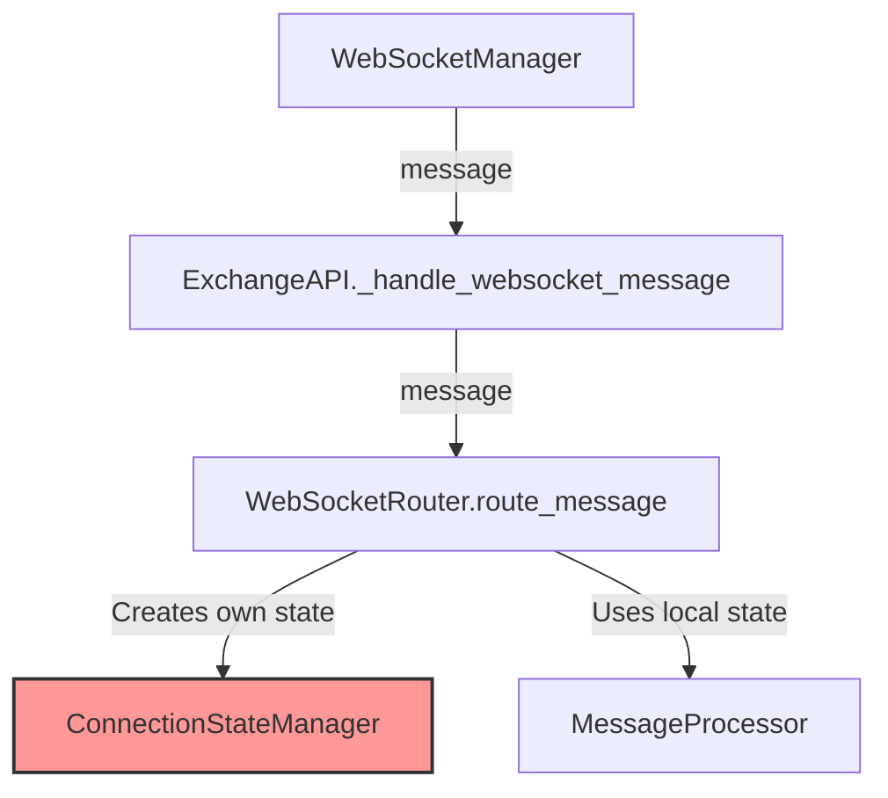
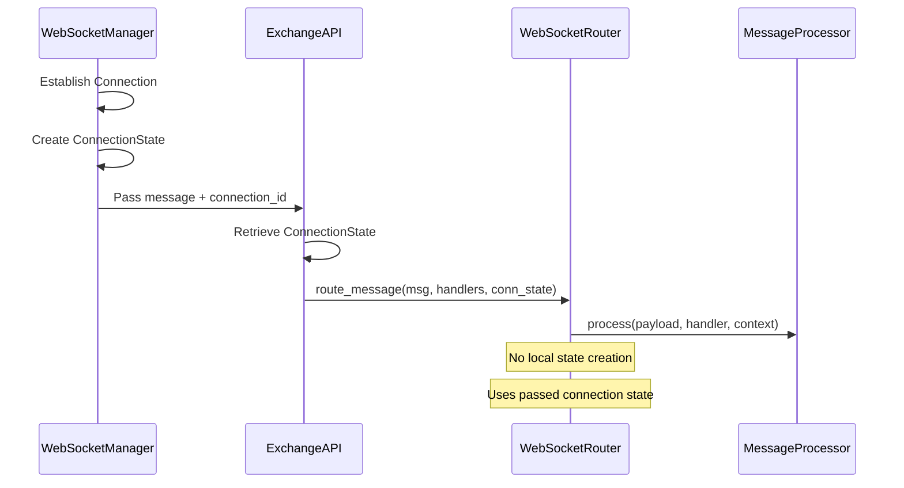
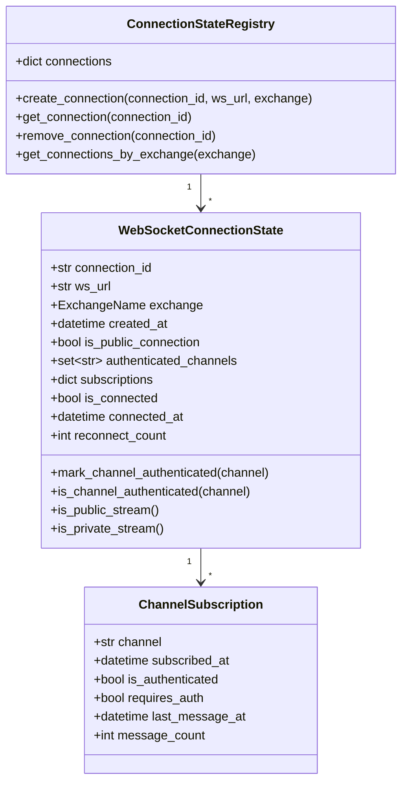
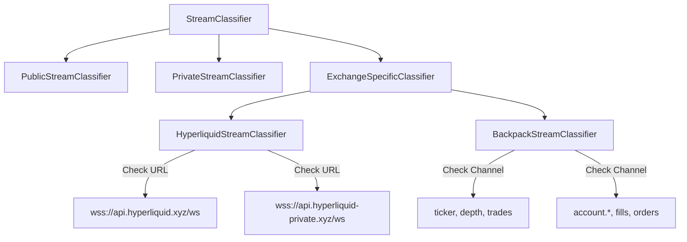
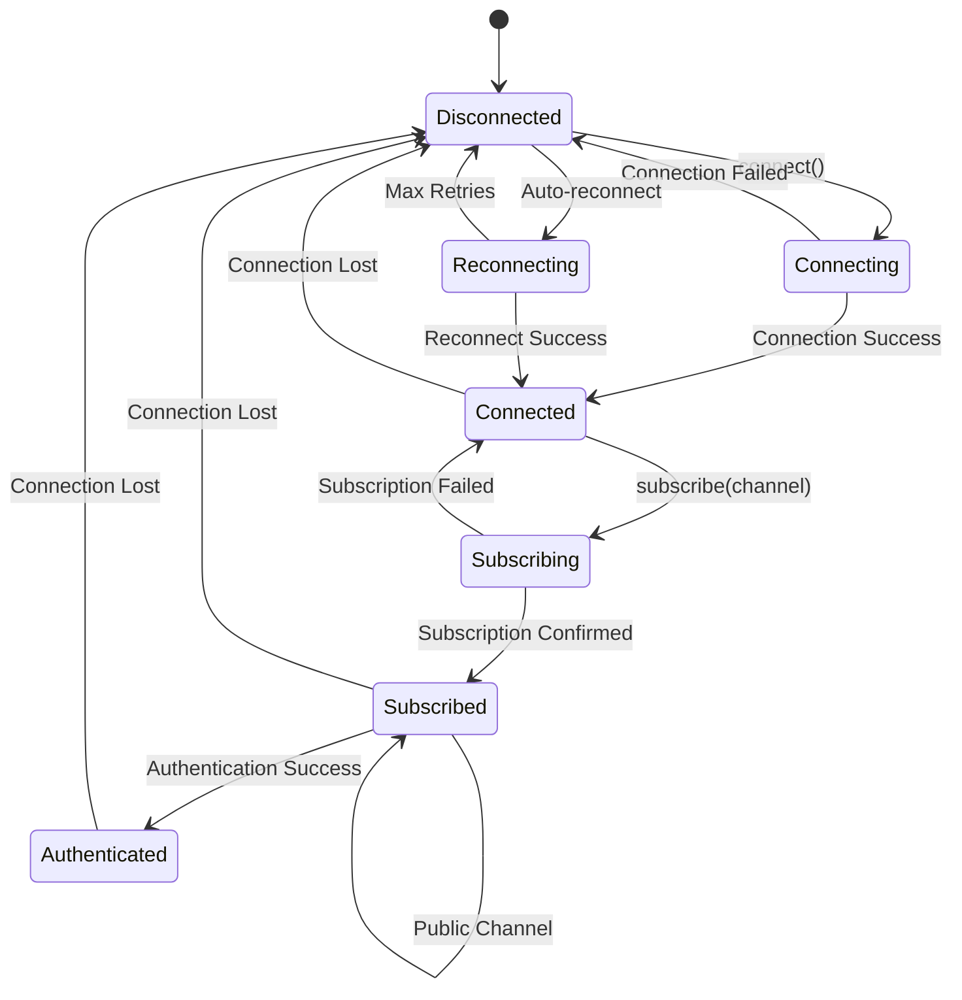

# WebSocket Connection State Architecture

## Executive Summary

This document outlines a comprehensive architecture for proper WebSocket connection state management in CyberDeltaEngine, ensuring exchange-agnostic tracking of connection state, public/private stream classification, and authentication status.

## Current State Analysis

### Problems Identified

1. **Global State Anti-Pattern**: Current implementation has connection state created at router initialization, not properly passed from upstream
2. **Authentication Tracking Issues**:
   - Hyperliquid: Wallet address presence doesn't prove authentication
   - Backpack: Signature presence indicates channel authentication
3. **Disconnected State Tracking**: Router creates ConnectionStateManager but doesn't know actual connection it's tracking
4. **Missing Connection Context**: No proper way to pass connection state from WebSocketManager down to routers

### Current Flow



## Proposed Architecture

### Design Principles

1. **Explicit State Passing**: Connection state must be created at connection establishment and passed downstream
2. **Exchange Agnosticism**: Each exchange can have its own public/private stream logic
3. **Channel-Level Authentication**: Track authentication per channel, not per connection
4. **Type Safety**: Use Pydantic dataclasses with proper validation

### Connection State Lifecycle



### Connection State Model



## Implementation Details

### 1. WebSocketManager Enhancement

```python
class WebSocketManager:
    def __init__(self, ...):
        self.connection_state = None

    async def _establish_connection(self):
        # After successful connection
        self.connection_state = WebSocketConnectionState(
            connection_id=generate_connection_id(),
            ws_url=self._ws_url,
            exchange=self.exchange_name,
            is_public_connection=self._determine_if_public()
        )
        self.connection_state.mark_connected()

    async def _handle_text_message(self, msg):
        # Pass connection_id with message
        message_with_context = {
            **data,
            '_connection_context': {
                'connection_id': self.connection_state.connection_id,
                'is_public': self.connection_state.is_public_connection
            }
        }
        await self._message_handler(message_with_context)
```

### 2. ExchangeAPI Layer

```python
class ExchangeAPI:
    def __init__(self, ...):
        self.connection_registry = ConnectionStateRegistry()

    async def _handle_websocket_message(self, message: dict[str, Any]):
        # Extract connection context
        conn_context = message.pop('_connection_context', None)
        if conn_context:
            conn_state = self.connection_registry.get_connection(
                conn_context['connection_id']
            )
        else:
            # Fallback for backwards compatibility
            conn_state = self._create_fallback_connection_state()

        await self._route_ws_message(message, conn_state)

    async def _route_ws_message(self, message: dict[str, Any],
                               conn_state: WebSocketConnectionState):
        # Pass to router with connection state
        await self._ws_router.route_message(message, self._ws_handlers, conn_state)
```

### 3. Router Updates

```python
class WebSocketMessageRouter:
    def __init__(self, ...):
        # No more local ConnectionStateManager
        pass

    async def route_message(
        self,
        message: dict[str, Any],
        handlers: dict[str, MessageHandler],
        connection_state: WebSocketConnectionState,  # Required parameter
    ) -> None:
        # Use passed connection state
        routing_key = self._extract_routing_key_from_envelope(validated_envelope)

        # Update connection state based on message
        if self._is_authentication_response(validated_envelope):
            connection_state.mark_channel_authenticated(routing_key)

        # Create context with connection state
        typed_context = self._create_typed_context(
            validated_envelope,
            routing_key,
            message_id,
            connection_state
        )
```

### 4. Exchange-Specific Authentication Logic

#### Hyperliquid

```python
class HyperliquidWebSocketRouter:
    def _handle_authentication(self, envelope, connection_state):
        # Hyperliquid: Check subscription response for success
        if envelope.channel == "subscriptionResponse":
            if envelope.is_successful and envelope.subscription_type == "userEvents":
                # NOW we're authenticated for userEvents
                connection_state.mark_channel_authenticated("userEvents")
```

#### Backpack

```python
class BackpackWebSocketRouter:
    def _handle_authentication(self, envelope, connection_state):
        # Backpack: Signature in subscription indicates authentication
        if self._has_valid_signature(envelope):
            channel = self._extract_channel(envelope)
            connection_state.mark_channel_authenticated(channel)
```

## Public vs Private Stream Determination

### Strategy Pattern for Stream Classification



### Implementation

```python
class StreamClassifier(Protocol):
    def classify_connection(self, ws_url: str, headers: dict) -> bool:
        """Determine if connection is for public streams."""
        ...

    def classify_channel(self, channel: str) -> bool:
        """Determine if channel is public."""
        ...

class HyperliquidStreamClassifier:
    def classify_connection(self, ws_url: str, headers: dict) -> bool:
        # Hyperliquid uses same endpoint for both
        return True  # All connections can be public or private

    def classify_channel(self, channel: str) -> bool:
        public_channels = {"l2Book", "trades", "allMids", "candle"}
        return any(channel.startswith(p) for p in public_channels)

class BackpackStreamClassifier:
    def classify_connection(self, ws_url: str, headers: dict) -> bool:
        # Backpack uses same endpoint
        return True

    def classify_channel(self, channel: str) -> bool:
        return not channel.startswith("account.")
```

## Connection State Flow



## Benefits of Proposed Architecture

1. **Proper State Management**: No global state, explicit passing of connection context
2. **Exchange Agnosticism**: Each exchange can implement its own authentication logic
3. **Type Safety**: Strong typing with Pydantic dataclasses
4. **Testability**: Connection state can be easily mocked for testing
5. **Observability**: Clear tracking of connection lifecycle and authentication status
6. **Scalability**: Support for multiple simultaneous connections per exchange

## Migration Strategy

### Phase 1: Add Connection State Infrastructure
- Implement ConnectionStateRegistry
- Add connection_state parameter to route_message (optional initially)
- Update WebSocketManager to create connection state

### Phase 2: Update Routers
- Make connection_state required in route_message
- Remove local ConnectionStateManager from routers
- Update all tests to provide connection state

### Phase 3: Enhance Authentication
- Implement exchange-specific authentication logic
- Add stream classification
- Update monitoring and logging

## Testing Strategy

See [02_integration_test_design.md](./02_integration_test_design.md) for detailed testing approach.

## Security Considerations

1. **No Sensitive Data in State**: Connection state should not store credentials
2. **Channel Isolation**: Authentication for one channel doesn't grant access to others
3. **State Validation**: Validate connection state consistency
4. **Audit Trail**: Log all authentication state changes

## Monitoring and Observability

```python
class ConnectionStateMetrics:
    def get_metrics(self):
        return {
            "total_connections": len(self.registry.connections),
            "authenticated_channels": sum(
                len(conn.authenticated_channels)
                for conn in self.registry.connections.values()
            ),
            "public_connections": sum(
                1 for conn in self.registry.connections.values()
                if conn.is_public_connection
            ),
            "connection_health": {
                conn_id: conn.is_healthy()
                for conn_id, conn in self.registry.connections.items()
            }
        }
```
