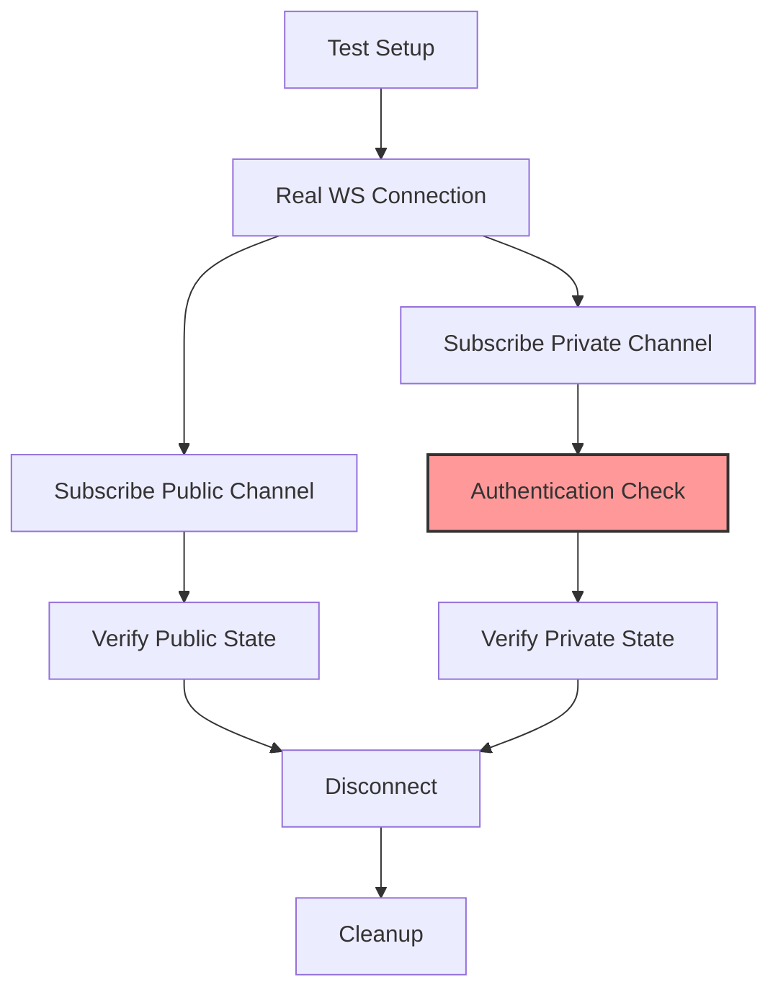

# WebSocket Connection State Integration Test Design

## Test Philosophy

Following `TESTING_SECURITY_RULES.md`, all integration tests for connection state must:
- Use real API connections (no mocking of critical operations)
- Fail fast on errors (no graceful degradation)
- Use real market data
- Track authentication state accurately

## Test Structure



## Test Categories

### 1. Connection Lifecycle Tests

```python
@pytest.mark.integration
class TestWebSocketConnectionLifecycle:
    """Test WebSocket connection state lifecycle with real connections."""

    async def test_connection_state_creation(self, real_api):
        """Test that connection state is properly created on connection."""
        # NO MOCKING - use real API
        api = real_api  # Fixture provides configured API instance

        # Connect to real WebSocket
        await api.connect_websocket()

        # Verify connection state exists
        assert api._ws_manager.connection_state is not None
        assert api._ws_manager.connection_state.is_connected
        assert api._ws_manager.connection_state.connection_id

        # FAIL FAST - no fallbacks
        if not api._ws_manager.connection_state.is_connected:
            pytest.fail("Connection state not properly initialized")

    async def test_reconnection_state_tracking(self, real_api):
        """Test that reconnections are properly tracked."""
        api = real_api

        # Initial connection
        await api.connect_websocket()
        initial_id = api._ws_manager.connection_state.connection_id

        # Force disconnection (simulate network issue)
        await api._ws_manager._ws_connection.close()

        # Wait for reconnection with timeout
        await wait_for_condition(
            lambda: api._ws_manager.is_connected,
            timeout=30,
            error_msg="Failed to reconnect within timeout"
        )

        # Verify reconnection tracked
        assert api._ws_manager.connection_state.reconnect_count > 0
        assert api._ws_manager.connection_state.connection_id == initial_id
```

### 2. Public/Private Stream Classification Tests

```python
@pytest.mark.integration
class TestStreamClassification:
    """Test public vs private stream classification with real channels."""

    @pytest.mark.parametrize("exchange", [ExchangeName.HYPERLIQUID, ExchangeName.BACKPACK])
    async def test_public_channel_classification(self, exchange, exchange_api_factory):
        """Test that public channels are correctly classified."""
        api = await exchange_api_factory(exchange)
        await api.connect_websocket()

        # Subscribe to public channel with real data
        symbol = await get_tradable_symbol(api)  # Get real symbol

        if exchange == ExchangeName.HYPERLIQUID:
            topic = f"l2Book:{symbol.value}"
        else:  # BACKPACK
            topic = f"depth.{symbol.value}"

        # Track state before subscription
        await api.subscribe(topic, lambda ctx: None)

        # Wait for subscription confirmation
        await wait_for_subscription_confirmation(api, topic)

        # Verify classification
        conn_state = api._ws_manager.connection_state
        subscription = conn_state.subscriptions.get(topic)

        assert subscription is not None
        assert not subscription.requires_auth
        assert topic not in conn_state.authenticated_channels

    async def test_private_channel_classification(self, exchange, exchange_api_factory):
        """Test that private channels are correctly classified."""
        api = await exchange_api_factory(exchange)
        await api.connect_websocket()

        # Subscribe to private channel
        if exchange == ExchangeName.HYPERLIQUID:
            topic = "userEvents"
        else:  # BACKPACK
            topic = "account.orders"

        # This should require authentication
        await api.subscribe(topic, lambda ctx: None)

        # Wait for response
        await wait_for_subscription_response(api, topic)

        # Verify classification
        conn_state = api._ws_manager.connection_state
        subscription = conn_state.subscriptions.get(topic)

        assert subscription is not None
        assert subscription.requires_auth
```

### 3. Authentication State Tests

```python
@pytest.mark.integration
class TestAuthenticationState:
    """Test authentication state tracking with real authentication flows."""

    async def test_hyperliquid_authentication_flow(self, hl_api_with_auth):
        """Test Hyperliquid authentication via subscription response."""
        api = hl_api_with_auth  # Has valid wallet credentials
        await api.connect_websocket()

        conn_state = api._ws_manager.connection_state

        # Before authentication
        assert "userEvents" not in conn_state.authenticated_channels

        # Subscribe to userEvents (requires authentication)
        received_messages = []
        await api.subscribe("userEvents", lambda ctx: received_messages.append(ctx))

        # Wait for subscription response
        await wait_for_condition(
            lambda: any(
                msg.channel == "subscriptionResponse"
                for msg in received_messages
            ),
            timeout=10,
            error_msg="No subscription response received"
        )

        # Verify authentication state updated
        subscription_response = next(
            msg for msg in received_messages
            if msg.channel == "subscriptionResponse"
        )

        if subscription_response.is_successful:
            assert "userEvents" in conn_state.authenticated_channels
        else:
            # FAIL FAST - no graceful handling
            pytest.fail(f"Authentication failed: {subscription_response.message}")

    async def test_backpack_authentication_flow(self, bp_api_with_auth):
        """Test Backpack authentication via signature."""
        api = bp_api_with_auth  # Has valid API keys
        await api.connect_websocket()

        conn_state = api._ws_manager.connection_state

        # Subscribe to private channel
        topic = "account.balances"
        await api.subscribe(topic, lambda ctx: None)

        # Wait for first message on channel
        await wait_for_channel_message(api, topic)

        # Verify authentication tracked
        assert topic in conn_state.authenticated_channels
```

### 4. State Consistency Tests

```python
@pytest.mark.integration
class TestConnectionStateConsistency:
    """Test connection state remains consistent across operations."""

    async def test_state_consistency_across_subscriptions(self, real_api):
        """Test state remains consistent when adding/removing subscriptions."""
        api = real_api
        await api.connect_websocket()

        conn_state = api._ws_manager.connection_state
        initial_count = len(conn_state.subscriptions)

        # Add multiple subscriptions
        symbols = await get_multiple_tradable_symbols(api, count=3)
        topics = []

        for symbol in symbols:
            topic = f"ticker.{symbol.value}"
            topics.append(topic)
            await api.subscribe(topic, lambda ctx: None)

        # Verify all tracked
        assert len(conn_state.subscriptions) == initial_count + 3

        for topic in topics:
            assert topic in conn_state.subscriptions

        # Unsubscribe from one
        await api.unsubscribe(topics[0])

        # Verify state updated
        assert len(conn_state.subscriptions) == initial_count + 2
        assert topics[0] not in conn_state.subscriptions

    async def test_message_counting(self, real_api):
        """Test that message statistics are properly tracked."""
        api = real_api
        await api.connect_websocket()

        conn_state = api._ws_manager.connection_state
        initial_received = conn_state.total_messages_received

        # Subscribe to active channel
        symbol = await get_most_liquid_symbol(api)
        topic = f"trades.{symbol.value}"

        messages_received = []
        await api.subscribe(topic, lambda ctx: messages_received.append(ctx))

        # Wait for some messages
        await wait_for_condition(
            lambda: len(messages_received) >= 5,
            timeout=30,
            error_msg="Not enough trade messages received"
        )

        # Verify counts updated
        assert conn_state.total_messages_received > initial_received
        subscription = conn_state.subscriptions[topic]
        assert subscription.message_count == len(messages_received)
```

### 5. Error Handling Tests

```python
@pytest.mark.integration
class TestConnectionStateErrors:
    """Test connection state error tracking with real errors."""

    async def test_authentication_failure_tracking(self, api_with_invalid_auth):
        """Test that authentication failures are properly tracked."""
        api = api_with_invalid_auth  # Has invalid credentials
        await api.connect_websocket()

        conn_state = api._ws_manager.connection_state
        initial_errors = conn_state.error_count

        # Try to subscribe to private channel (will fail)
        topic = "account.positions"

        with pytest.raises(APIError) as exc_info:
            await api.subscribe(topic, lambda ctx: None)
            # Wait for error response
            await asyncio.sleep(2)

        # Verify error tracked
        assert conn_state.error_count > initial_errors
        assert conn_state.last_error is not None

        # Verify channel NOT marked as authenticated
        assert topic not in conn_state.authenticated_channels

    async def test_connection_health_monitoring(self, real_api):
        """Test connection health monitoring with real connection."""
        api = real_api
        await api.connect_websocket()

        conn_state = api._ws_manager.connection_state

        # Initially healthy
        assert conn_state.is_healthy()

        # Simulate stale connection (no heartbeat)
        conn_state.last_heartbeat = datetime.now(UTC) - timedelta(minutes=5)

        # Should be unhealthy
        assert not conn_state.is_healthy(max_heartbeat_age_seconds=60)
```

## Test Fixtures

```python
@pytest.fixture
async def real_api(exchange_config, exchange_secrets):
    """Provide real API instance with actual credentials."""
    # NO MOCKING - real API instance
    api = BackpackAPI(exchange_config, exchange_secrets)
    yield api
    await api.close()

@pytest.fixture
async def wait_for_condition():
    """Helper to wait for conditions with timeout."""
    async def _wait(condition_fn, timeout=10, error_msg="Condition not met"):
        start = time.time()
        while time.time() - start < timeout:
            if condition_fn():
                return True
            await asyncio.sleep(0.1)
        pytest.fail(f"{error_msg} after {timeout}s")
    return _wait

@pytest.fixture
async def get_tradable_symbol(api):
    """Get real tradable symbol from exchange."""
    markets = await api.get_markets(GetMarketsArgs())
    # Find liquid market
    for market in markets:
        if market.is_active and market.symbol.base in ["SOL", "BTC", "ETH"]:
            return market.symbol
    pytest.fail("No suitable trading symbol found")
```

## Security Compliance

### No Hardcoded Values
```python
# ❌ NEVER
test_symbol = Symbol("BTC-USDC")  # Hardcoded
timeout = 30  # Magic number

# ✅ ALWAYS
test_symbol = await get_tradable_symbol(api)  # From real market
timeout = config.test_timeout_seconds  # From config
```

### No Graceful Error Handling
```python
# ❌ NEVER
try:
    await api.subscribe(topic, handler)
except Exception as e:
    logger.warning(f"Subscription failed: {e}")
    # Test continues

# ✅ ALWAYS
try:
    await api.subscribe(topic, handler)
except Exception as e:
    pytest.fail(f"Subscription must succeed: {e}")
```

### Real Data Only
```python
# ❌ NEVER
mock_connection_state = Mock(spec=WebSocketConnectionState)
mock_connection_state.is_connected = True

# ✅ ALWAYS
await api.connect_websocket()
real_connection_state = api._ws_manager.connection_state
assert real_connection_state.is_connected
```

## Test Execution Strategy

### Environment Setup
```yaml
# pytest.ini
[pytest]
markers =
    integration: Integration tests with real API
    websocket: WebSocket specific tests
    authentication: Authentication flow tests

testpaths = tests/integration/websocket
python_files = test_*.py
python_classes = Test*
python_functions = test_*
```

### CI/CD Integration
```yaml
# .github/workflows/websocket-tests.yml
name: WebSocket Integration Tests
on:
  pull_request:
    paths:
      - 'cyberdelta/apis/websocket/**'
      - 'cyberdelta/apis/connectivity/**'

jobs:
  test:
    runs-on: ubuntu-latest
    steps:
      - name: Run WebSocket Tests
        run: |
          pytest tests/integration/websocket \
            -m "websocket" \
            --tb=short \
            --strict-markers \
            --fail-on-warnings
```

## Monitoring Test Results

```python
class TestMetrics:
    """Track test execution metrics."""

    @pytest.fixture(autouse=True)
    def track_test_metrics(self, request):
        """Track each test's performance."""
        start = time.time()
        yield
        duration = time.time() - start

        # Log to monitoring system
        logger.info(
            "test_completed",
            test_name=request.node.name,
            duration_seconds=duration,
            outcome=request.node.rep_call.outcome if hasattr(request.node, 'rep_call') else 'unknown'
        )
```
