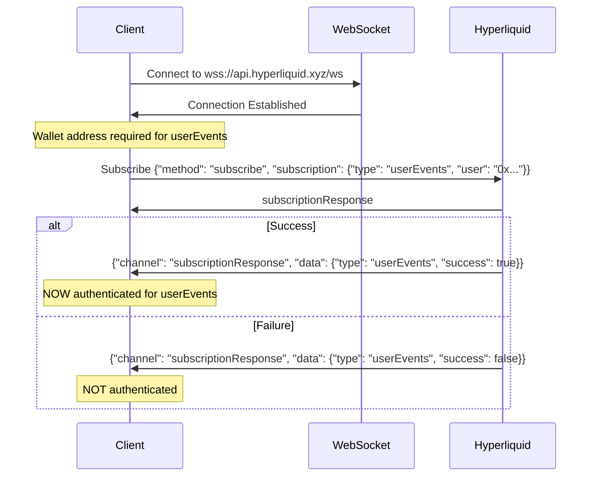
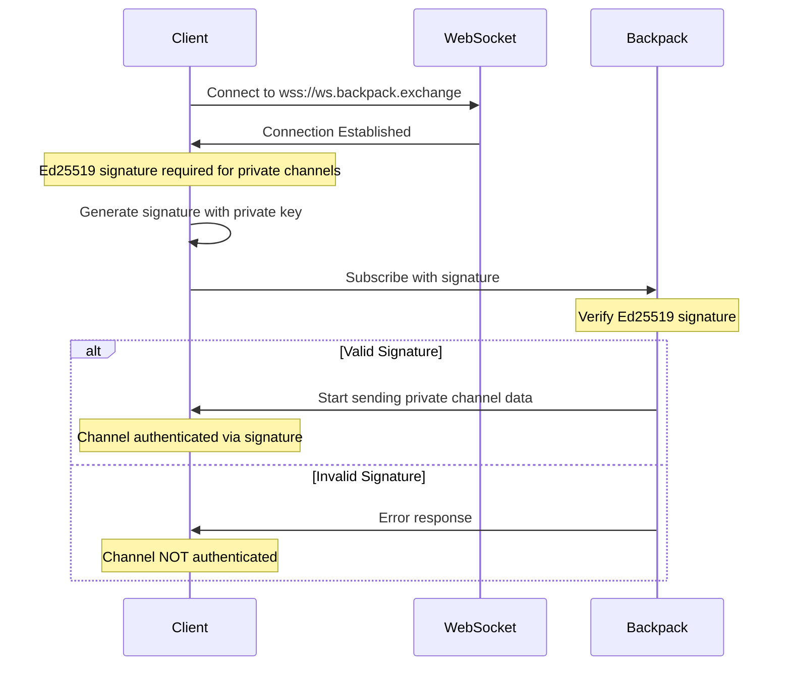

# Exchange-Specific Authentication Patterns

## Overview

This document details how each exchange handles WebSocket authentication differently, demonstrating why the connection state architecture must be exchange-agnostic.

## Hyperliquid Authentication

### Authentication Flow



### Key Points

1. **Wallet Address ≠ Authentication**: Having a wallet address in the subscription request does NOT prove authentication
2. **Subscription Response Confirms Auth**: Only when `subscriptionResponse` returns with `success: true` is the channel authenticated
3. **Per-Channel Authentication**: Each private channel (like userEvents) requires separate authentication confirmation

### Implementation

```python
class HyperliquidAuthHandler:
    def handle_subscription_response(
        self,
        response: HyperliquidSubscriptionResponse,
        connection_state: WebSocketConnectionState
    ):
        """Handle Hyperliquid subscription response for authentication."""
        if response.channel == "subscriptionResponse":
            if response.is_successful:
                if response.subscription_type == "userEvents":
                    # Authentication confirmed for userEvents
                    connection_state.mark_channel_authenticated("userEvents")
                    logger.info(
                        "hyperliquid_auth_confirmed",
                        channel="userEvents",
                        user=response.user,
                        message="UserEvents channel authenticated"
                    )
            else:
                # Authentication failed
                logger.warning(
                    "hyperliquid_auth_failed",
                    channel=response.subscription_type,
                    reason=response.error_message,
                    message="Channel authentication failed"
                )
```

## Backpack Authentication

### Authentication Flow



### Key Points

1. **Signature = Authentication**: Presence of a valid Ed25519 signature in the subscription indicates authentication
2. **Immediate Authentication**: No separate confirmation message - signature presence is the authentication
3. **Channel Prefix Pattern**: Private channels start with "account." prefix

### Implementation

```python
class BackpackAuthHandler:
    def handle_subscription(
        self,
        topic: str,
        signature_components: dict[str, Any] | None,
        connection_state: WebSocketConnectionState
    ):
        """Handle Backpack subscription authentication."""
        # Check if this is a private channel
        if topic.startswith("account."):
            if signature_components:
                # Signature provided = authenticated
                connection_state.mark_channel_authenticated(topic)
                logger.info(
                    "backpack_auth_via_signature",
                    channel=topic,
                    has_signature=True,
                    message="Channel authenticated via Ed25519 signature"
                )
            else:
                # No signature = not authenticated
                logger.warning(
                    "backpack_private_channel_no_auth",
                    channel=topic,
                    message="Private channel subscription without signature"
                )
```

## Authentication State Comparison

| Aspect | Hyperliquid | Backpack |
|--------|-------------|----------|
| **Auth Method** | Subscription Response | Ed25519 Signature |
| **Auth Timing** | After subscription request | During subscription |
| **Auth Indicator** | `subscriptionResponse.success` | Signature presence |
| **Private Channels** | `userEvents`, etc. | `account.*` prefix |
| **Public Channels** | `l2Book`, `trades`, `allMids` | `ticker`, `depth`, `trade` |
| **Auth Persistence** | Per channel per connection | Per channel per connection |

## Connection State Updates

### Hyperliquid Connection State Flow

```python
# Initial state
connection_state = WebSocketConnectionState(
    connection_id="abc123",
    exchange=ExchangeName.HYPERLIQUID,
    authenticated_channels=set()  # Empty initially
)

# Subscribe to userEvents
await subscribe("userEvents", wallet_address)
# State: authenticated_channels = set() (still empty)

# Receive subscription response
handle_subscription_response(response)
# If successful:
# State: authenticated_channels = {"userEvents"}
```

### Backpack Connection State Flow

```python
# Initial state
connection_state = WebSocketConnectionState(
    connection_id="def456",
    exchange=ExchangeName.BACKPACK,
    authenticated_channels=set()  # Empty initially
)

# Subscribe with signature
await subscribe_with_signature("account.balances", signature)
# State: authenticated_channels = {"account.balances"} (immediate)

# Subscribe without signature (public)
await subscribe("ticker.SOL-USDC")
# State: authenticated_channels = {"account.balances"} (unchanged)
```

## Testing Authentication

### Hyperliquid Test

```python
async def test_hyperliquid_authentication_flow():
    """Test Hyperliquid's subscription response authentication."""
    api = await create_hyperliquid_api()
    await api.connect_websocket()

    conn_state = api._ws_manager.connection_state
    assert "userEvents" not in conn_state.authenticated_channels

    # Subscribe and wait for response
    responses = []
    await api.subscribe("userEvents", lambda ctx: responses.append(ctx))

    # Wait for subscription response
    await wait_for_condition(
        lambda: any(r.channel == "subscriptionResponse" for r in responses),
        timeout=10
    )

    # Check authentication state
    sub_response = next(r for r in responses if r.channel == "subscriptionResponse")
    if sub_response.is_successful:
        assert "userEvents" in conn_state.authenticated_channels
    else:
        assert "userEvents" not in conn_state.authenticated_channels
```

### Backpack Test

```python
async def test_backpack_authentication_flow():
    """Test Backpack's signature-based authentication."""
    api = await create_backpack_api()
    await api.connect_websocket()

    conn_state = api._ws_manager.connection_state

    # Subscribe to private channel with signature
    await api.subscribe("account.orders", lambda ctx: None)

    # Should be immediately authenticated
    assert "account.orders" in conn_state.authenticated_channels

    # Subscribe to public channel
    await api.subscribe("ticker.BTC-USDC", lambda ctx: None)

    # Should not affect authentication
    assert "ticker.BTC-USDC" not in conn_state.authenticated_channels
```

## Edge Cases and Considerations

### 1. Reconnection Handling

```python
class ReconnectionAuthHandler:
    async def handle_reconnection(self, connection_state: WebSocketConnectionState):
        """Handle authentication state after reconnection."""
        # Clear authenticated channels - must re-authenticate
        old_authenticated = connection_state.authenticated_channels.copy()
        connection_state.authenticated_channels.clear()

        logger.info(
            "reconnection_auth_reset",
            cleared_channels=list(old_authenticated),
            message="Cleared authentication state after reconnection"
        )

        # Resubscription will re-authenticate as needed
```

### 2. Authentication Expiry

```python
class AuthExpiryHandler:
    def check_auth_expiry(self, connection_state: WebSocketConnectionState):
        """Check if authentication has expired."""
        for channel in connection_state.authenticated_channels:
            subscription = connection_state.subscriptions.get(channel)
            if subscription:
                # Check if too old (exchange-specific)
                age = datetime.now(UTC) - subscription.subscribed_at
                if age > timedelta(hours=24):  # Example expiry
                    logger.warning(
                        "auth_possibly_expired",
                        channel=channel,
                        age_hours=age.total_seconds() / 3600,
                        message="Authentication may have expired"
                    )
```

### 3. Multi-Account Handling

```python
class MultiAccountHandler:
    def track_account_channels(
        self,
        connection_state: WebSocketConnectionState,
        account_id: str,
        channel: str
    ):
        """Track which account each authenticated channel belongs to."""
        # Extended tracking for multi-account scenarios
        if not hasattr(connection_state, 'account_channels'):
            connection_state.account_channels = {}

        if account_id not in connection_state.account_channels:
            connection_state.account_channels[account_id] = set()

        connection_state.account_channels[account_id].add(channel)
```

## Summary

The key insight is that authentication patterns vary significantly between exchanges:

1. **Hyperliquid**: Requires waiting for subscription response to confirm authentication
2. **Backpack**: Signature presence immediately indicates authentication

This variance demonstrates why:
- Connection state must be passed explicitly (not created locally)
- Authentication logic must be exchange-specific
- The architecture must be flexible enough to handle different patterns

The proposed connection state architecture handles these differences by:
- Allowing each exchange to implement its own authentication logic
- Tracking authentication at the channel level
- Providing a consistent interface for querying authentication state
