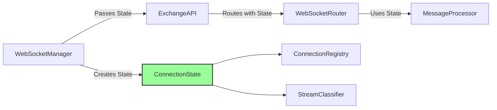

# WebSocket Connection State Management Documentation

## Overview

This directory contains the comprehensive design documentation for refactoring WebSocket connection state management in CyberDeltaEngine to achieve proper, exchange-agnostic tracking of connection state, authentication, and stream classification.

## Documents

1. **[01_connection_state_architecture.md](./01_connection_state_architecture.md)**
   - Complete architectural design with mermaid diagrams
   - Current state analysis and problems identified
   - Proposed solutions with detailed component design
   - Benefits and migration strategy

2. **[02_integration_test_design.md](./02_integration_test_design.md)**
   - Comprehensive integration test strategy
   - Security-compliant test patterns following TESTING_SECURITY_RULES.md
   - Test categories covering all aspects of connection state
   - Real API testing approach (no mocking)

3. **[03_implementation_roadmap.md](./03_implementation_roadmap.md)**
   - Concrete implementation plan with 6 phases
   - Code examples for each component
   - Timeline and success criteria
   - Risk mitigation strategies

## Key Problems Solved

### 1. Global State Anti-Pattern
**Problem**: Connection state created at router initialization, not passed from upstream
**Solution**: Explicit passing of connection state from WebSocketManager through ExchangeAPI to routers

### 2. Authentication Tracking
**Problem**: Incorrect assumptions about authentication (e.g., wallet address = authenticated)
**Solution**: Channel-level authentication tracking with exchange-specific logic

### 3. Public vs Private Stream Classification
**Problem**: No clear distinction between public and private data streams
**Solution**: Stream classifier protocol with exchange-specific implementations

## Architecture Summary



## Key Design Decisions

1. **Pydantic Dataclasses**: Using `@dataclass` decorator for type safety and validation
2. **No Global State**: All state explicitly passed through the call chain
3. **Exchange Agnostic**: Each exchange implements its own authentication logic
4. **Channel-Level Auth**: Authentication tracked per channel, not per connection
5. **Fail Fast**: No graceful degradation or fallbacks in critical paths

## Implementation Phases

| Phase | Focus | Duration |
|-------|-------|----------|
| 1 | Core Infrastructure | 2 days |
| 2 | WebSocketManager Integration | 1 day |
| 3 | ExchangeAPI Layer | 2 days |
| 4 | Router Updates | 2 days |
| 5 | Integration Tests | 3 days |
| 6 | Migration & Cleanup | 2 days |

**Total Timeline: ~12 days**

## Testing Strategy

- **Real API Connections**: No mocking of WebSocket connections
- **Real Market Data**: Use actual symbols and market data
- **Fail Fast**: Tests fail immediately on errors
- **Security Compliance**: Follows TESTING_SECURITY_RULES.md

## Benefits

1. **Proper State Management**: Eliminates global state anti-pattern
2. **Type Safety**: Strong typing throughout with Pydantic
3. **Testability**: Easy to test with explicit dependencies
4. **Observability**: Clear tracking of connection lifecycle
5. **Scalability**: Support for multiple connections per exchange
6. **Security**: Proper authentication tracking per channel

## Migration Approach

### Phase 1: Backwards Compatible
- Add connection_state as optional parameter
- Add deprecation warnings
- Maintain existing functionality

### Phase 2: Migration
- Update all callers to provide connection_state
- Update tests to new pattern
- Monitor deprecated usage

### Phase 3: Enforcement
- Make connection_state required
- Remove fallback code
- Complete cleanup

## Code Examples

### Creating Connection State
```python
# In WebSocketManager after connection
self.connection_state = WebSocketConnectionState(
    connection_id=str(uuid.uuid4()),
    ws_url=self._ws_url,
    exchange=self.exchange_name,
    is_public_connection=self._determine_if_public()
)
self.connection_state.mark_connected()
```

### Passing State Downstream
```python
# In ExchangeAPI
async def _route_ws_message(self, message, connection_state):
    await self._ws_router.route_message(
        message,
        self._ws_handlers,
        connection_state  # Explicit passing
    )
```

### Using State in Router
```python
# In WebSocketRouter
async def route_message(self, message, handlers, connection_state):
    # No local state creation
    # Use passed connection_state
    if self._is_authentication_response(envelope):
        connection_state.mark_channel_authenticated(channel)
```

## Monitoring

Connection state health can be monitored through:
- Total connections per exchange
- Authenticated vs public channels
- Connection duration and reconnect count
- Error rates per connection
- Message throughput per channel

## Security Considerations

1. **No Credentials in State**: Connection state never stores sensitive credentials
2. **Channel Isolation**: Authentication for one channel doesn't affect others
3. **Audit Trail**: All authentication state changes are logged
4. **Validation**: Connection state consistency is validated

## Next Steps

1. Review and approve the design
2. Create feature branch for implementation
3. Implement Phase 1 (Core Infrastructure)
4. Write integration tests in parallel
5. Progressive rollout with monitoring

## Questions?

For questions or clarifications about this design, please refer to:
- Architecture details: [01_connection_state_architecture.md](./01_connection_state_architecture.md)
- Testing approach: [02_integration_test_design.md](./02_integration_test_design.md)
- Implementation plan: [03_implementation_roadmap.md](./03_implementation_roadmap.md)
